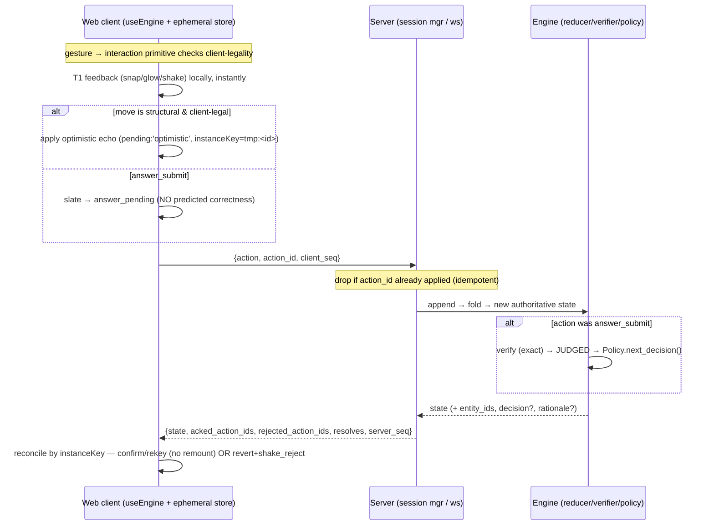

# Spec Clarifications — Fraction App (2026-05-31)

This document collects the expanded, build-ready spec sections produced during the multi-lens review + expansion pass. Each section closes a specific gap that one or more review lenses flagged as "silent" or "under-specified" in the approved design/plan docs. None of these expansions contradicts an APPROVED decision; each rides an existing seam (the engine event-log fold, the `Policy` decision union, the three-layer presentation/Skin contract, or the test-only `__GAME__` surface) and is verifiable in the wireframe Skin or headless engine before any art exists. The sections are reproduced verbatim from the expansion pass.

## Table of contents

1. [Engine wire/state schema reference (Action/Signal/Event/GameState/Decision)](#engine-wirestate-schema-reference-actionsignaleventgamestatedecision)
2. [RoomSpec / Beat / ScaffoldLevel data schema + R1 authored as data](#roomspec--beat--scaffoldlevel-data-schema--r1-authored-as-data)
3. [ScriptedPolicy curriculum table + error_signature vocabulary + per-attempt metadata contract](#scriptedpolicy-curriculum-table--error_signature-vocabulary--per-attempt-metadata-contract)
4. [Phase-1 goal-communication channel for non-readers (voice-first contradiction)](#phase-1-goal-communication-channel-for-non-readers-voice-first-contradiction)
5. [Headless test-driver contract: state snapshot, selector grammar, settle hook, dispatch + session seeding](#headless-test-driver-contract-state-snapshot-selector-grammar-settle-hook-dispatch--session-seeding)
6. [Client/server reconciliation, in-flight model, and WebSocket lifecycle](#clientserver-reconciliation-in-flight-model-and-websocket-lifecycle)
7. [Game-loop / timing model and responsiveness budget](#game-loop--timing-model-and-responsiveness-budget)
8. [T1 feedback transition parameters and per-outcome feedback grammar (incl. bare slate)](#t1-feedback-transition-parameters-and-per-outcome-feedback-grammar-incl-bare-slate)
9. [Animation architecture: scene/beat transitions, drag contract, mass re-layout, and stage scaling](#animation-architecture-scenebeat-transitions-drag-contract-mass-re-layout-and-stage-scaling)
10. [Accessibility & responsive scaling layer](#accessibility--responsive-scaling-layer-reduced-motion-colorblind-safe-link-text-sizecontrast-multi-resolution)
11. [Felt-experience layer: drill micro-flow, reward schedule, autonomy, relatedness, and frustration relief valve](#felt-experience-layer-drill-micro-flow-reward-schedule-autonomy-relatedness-and-frustration-relief-valve)
12. [Per-room degenerate-strategy analysis, harness personas, and the long-arc motivation pivot](#per-room-degenerate-strategy-analysis-harness-personas-and-the-long-arc-motivation-pivot)

---

## Engine wire/state schema reference (Action/Signal/Event/GameState/Decision)

_Expands: fraction-app-state-model.md §1.1, §5.1; plan-001 U2/KTD4; presentation-scene-architecture.md §2_

# Engine wire/state schema reference (`engine/SCHEMA.md`)

This is the U2 acceptance artifact named in plan-001 (`engine/events.py`, `engine/state.py`, `engine/policy/policy.py`). It collects the `Action` / `Signal` / `Event` / `GameState` / `Decision` shapes — which today exist only as illustrative prose in `fraction-app-state-model.md` §1.1 and §5.1, the primitive table in `presentation-scene-architecture.md` §3, and the per-room §4.3 verb lists — into **closed, Pydantic-level definitions** that are the single schema source (KTD4: Pydantic → JSON-schema → `types.gen.ts`). Every layer (reducer, codegen, presentation nodes §2, verifier U3, Phase-2 `measurement_reduce`) reads these exact shapes.

## 0. Conventions, base types, and the `instanceKey` rule

### 0.1 Wire envelope conventions

- **Discriminated unions.** `Action`, `Signal`, and `Decision` are tagged unions discriminated by a literal `type` field. `Event = Action | Signal` is discriminated by an outer `kind` field (`"action"` | `"signal"`) so the reducer can route before parsing the payload. Pydantic `Field(discriminator=...)`; this maps cleanly to `json-schema-to-typescript` `oneOf`.
- **Time.** `t: float` is engine-logical milliseconds since session start (monotonic, server-stamped on receipt). Never wall-clock; injected `now` for determinism (Phase-2 decay reuses this clock). Replaying the same event list must reproduce identical state (plan-001 U2 test: "folding twice is identical").
- **Actor.** `actor: Actor` where `Actor = Literal["human"] | str` and synthetic personas use `"synthetic:<persona_id>"` (e.g. `"synthetic:memorizer"`). Defaults to `"human"`. This is the only field the Phase-3 harness sets differently; the code path is otherwise identical (state-model §1.1, premise 1).
- **IDs.** `node_id`, `room_id`, `recipe_id`, `surface_form` are `str` enums (see §6). `scaffold` is `Literal["L0","L1","L2","L3","L4","L5","L6"]`.
- **Rationals are exact and serialized as a struct, never a float.** A rational is `Rational{ n: int, d: int }` with `d > 0`, **stored unreduced** (so `10/12` and `5/6` are distinguishable — over-slice scoring depends on it, R2 §4.6). Server math is `fractions.Fraction`; client is `fraction.js`; the wire form is `Rational`. The reducer never reduces a `Rational`; only the verifier compares values.

```python
class Rational(BaseModel):
    n: int                       # numerator (may exceed d for improper forms)
    d: int = Field(gt=0)         # denominator, strictly positive, NOT auto-reduced
```

### 0.2 The `instanceKey` rule (logical identity, emitted by the engine)

Every **manipulable** the engine surfaces carries a stable logical `instanceKey: str` so the web client can reconcile optimistic T1 ghosts against authoritative state **without remounting** (presentation-scene-architecture.md §2: "`instanceKey` — stable identity across frames"). Rules:

1. **The engine, not the client, owns `instanceKey`.** It is assigned on creation and is stable across every reduction that does not destroy the manipulable. A `place_block` that grows a stack does **not** change the stack's key; the new block gets its own key.
2. **Format:** `"<kind>:<problem_seq>:<ordinal>"`, e.g. `"stack:3:0"`, `"block:3:0:4"` (5th block of stack 0 in problem 3), `"bar:3:1"`. `problem_seq` is the monotonically increasing per-session problem counter (§3.2); it guarantees keys never collide across problems even after a reset.
3. **Optimistic reconciliation.** When the client applies a local T1 effect (drag-ghost a block onto a stack), it tags the ghost with the **predicted** `instanceKey` (`block:<seq>:<stackOrdinal>:<count>`). When the authoritative `GameState` returns, a node whose `instanceKey` matches the ghost is reconciled in place (Framer Motion `layoutId = instanceKey`); a non-match means the move was illegal and the ghost is dropped with `shake_reject` (§3, §6). The client never invents a key the engine wouldn't produce.
4. **Destruction is explicit.** `remove_block` / `merge_stacks` / `fuse_by_k` retire keys; retired keys are never reused within a session. A merged stack keeps the **destination** stack's key and retires the source's (so the surviving column animates, not remounts).
5. `instanceKey` is **logical**, not pixel-bearing. It lives on engine `Manipulable` records (§3.3) and is copied onto `PresentationNode.instanceKey` by the layer-2 selector unchanged.

---

## 1. The closed `Action` `type` union

Actions are semantic moves; **the reducer folds them into `GameState`** (state-model §1.1). The union is closed — rooms compose these, never invent new ones (presentation-scene-architecture.md §3). Eight game-move types plus `submit_answer` and three lifecycle/UI actions.

```python
class ActionBase(BaseModel):
    kind: Literal["action"] = "action"
    t: float
    actor: Actor = "human"
    modality: Modality = "drag"          # how the move was produced (§1.2)
    problem_seq: int                     # which problem this action belongs to
```

`Modality = Literal["drag","tap","type","voice","handwriting","system"]` (KTD8: handwriting/voice are additive modalities, not new code paths; `"system"` tags engine-injected actions like auto-`present_problem`).

| `type` | Payload fields (beyond `ActionBase`) | Reducer effect | Emitted by primitive (§3) | Rooms |
|--------|--------------------------------------|----------------|---------------------------|-------|
| `place_block` | `target_key: str` (stack/build-zone/arrangement `instanceKey`); `denominator: int` (piece size, `1` for whole-number pieces); `type_id: str = "default"` (R0a object kind) | append a `block` to the target manipulable; `+1` its count; spawn the block's `instanceKey`; tick `tally` | **place** | R0a, R0b, R1, kitchen |
| `remove_block` | `target_key: str`; `count: int = 1` | retire `count` blocks from the target (take-away / subtraction); `−count` | **remove** | R0b, R1, R2, kitchen |
| `remove_pieces` | `target_key: str`; `count: int` | semantic alias of `remove_block` for fraction pieces (subtraction stage); kept distinct for the event log's readability and per-room verbs | **remove** | R1, R2 |
| `merge_stacks` | `source_key: str`; `dest_key: str` | combine source into dest at the `merge_zone`; numerator/count adds; **legality-gated** (R1 same-size only; R2 rejected until sizes match) | **merge** | R0b, R1, R2 |
| `slice_bar` | `target_key: str`; `factor: int` (the ×N) | cut each piece of the bar into `factor` equal pieces: `n→n*factor, d→d*factor`; **value unchanged**; record ×N on top and bottom | **slice** | R2 |
| `fuse_by_k` | `target_key: str`; `k: int` | group every `k` pieces into one: `n→n/k, d→d/k`; **only legal if both divide evenly** else no-op + `shake_reject`; record ÷K | **fuse** | R3 |
| `group_wholes` | `target_key: str` (the overflow stack) | lock off one whole-unit (one `ruler` length) from the stack onto the `whole_unit_row`; increment `whole_count`; move remainder to `leftover_tray` | **group-wholes** | R4 |
| `select_common_denominator` | `denominator: int`; `multipliers: dict[str,int]` (per-addend `instanceKey → ×N`) | symbolic (faded-beat) form of slicing both bars to a common size | **pick** (`select_*`) | R2 |
| `select_factor` | `factor: int` | symbolic (faded-beat) form of choosing the shared factor to fuse by | **pick** (`select_*`) | R3 |
| `submit_answer` | `value: AnswerValue` (§5); `target_slot: AnswerSlot = "answer"` | enter the problem's answer; triggers **SUBMITTED → JUDGED** (verifier); the **only** action that causes a policy call (state-model §2) | **write** / **check** | all |
| `present_problem` | `node: NodeId`; `scaffold: Scaffold`; `surface_form: str`; `recipe_id: str \| None` | engine/Policy-injected (`modality="system"`); opens a problem (PRESENT); creates its manipulables + keys | — (engine) | all |
| `request_hint` | (none) | advance the hint ladder one rung (`hint_rung += 1`, capped at H4); records `hint_shown{rung}` | (HUD affordance) | all |

Notes:
- `select_multiplier` from the §3 table is folded into `select_common_denominator.multipliers` (one action carries both numbers; avoids an extra round-trip and matches the ×N-on-both-top-and-bottom invariant).
- **Legality is enforced in the reducer before any mutation** (presentation-scene-architecture.md §3). An illegal action (merge unlike sizes in R2 pre-slice; change a `denominator_locked` slot in R1; uneven `fuse_by_k`; out-of-order action e.g. `submit_answer` before `present_problem`) is a **no-op on `GameState` but is still appended to the log** (plan-001 U2 test: "out-of-order actions are no-ops and logged"). The reply carries a `reject_reason` (§6) so the client shows `shake_reject` (§6 feedback).
- `request_hint` and `present_problem` mutate `ProblemState` (hint rung / lifecycle) but not the manipulable counts.

---

## 2. The closed `Signal` `type` union

Signals are passive observations; **the reducer treats them as no-ops on `GameState`** but appends them to the log; only the model / Tier-2/3 brain read them (state-model §1.1; measurement §1.1). The signal can change pacing and support; it can never change game state, truth, or mastery.

```python
class SignalBase(BaseModel):
    kind: Literal["signal"] = "signal"
    t: float
    actor: Actor = "human"
    confidence: float = Field(ge=0.0, le=1.0, default=1.0)
    problem_seq: int | None = None        # signals may arrive between problems
```

| `type` | Payload fields | Source / meaning | Read by |
|--------|----------------|------------------|---------|
| `idle` | `duration_ms: float` | no action for a threshold window (OBSERVING stall) | Tier-2 (offer next hint rung), Tier-3 |
| `oscillation` | `cycles: int` (place→remove→place repeats within one attempt) | indecision behavior | Tier-2 ("take your time"), featurizer `self_corrections` |
| `too_fast_correct` | `latency_ms: float` | a correct submit below the plausible-compute floor (false-positive guard) | Tier-2 (queue `TransferProbe`), featurizer |
| `affect` | `state: AffectState` (`{engagement: high\|med\|low, valence: frustrated\|neutral\|delighted, attention: on_task\|drifting\|away, confidence: 0..1}`) | the smoothed on-device camera at ~1–2 Hz (measurement §6.1) | Tier-2/3 **only with behavioral corroboration**; never the gate |

Closed-union rule: these four are the entire Phase-1/2 signal space (state-model §6 Tier-2 row, plan-002 U8 Q5: "start with idle, oscillation, too-fast-correct"). `affect` is **designed-in now, fed Phase 3** (`affect_window` is a typed-empty stub until then). A signal whose `type` is unknown is logged and ignored — never an error, never a state change.

---

## 3. The `Event` union, `GameState`, `SessionState`, `ProblemState`

### 3.1 Event union

```python
Event = Annotated[Action | Signal, Field(discriminator="kind")]
```

The append-only log is `list[Event]`. `fold(events) -> GameState` reduces from the initial state; `reduce(state, event) -> GameState` is pure and returns a new state (immutable update). Signals pass through `reduce` unchanged on `GameState` (state-model §1.1).

### 3.2 GameState (the authoritative wire state)

`GameState` is what the server pushes down and the client renders. It stores **counts / sizes / slots / beat** — never pixel coordinates (plan-001 U2: "not pixel coordinates; those are render concerns"; presentation-scene-architecture.md §1 layer 1).

```python
class GameState(BaseModel):
    session: SessionState
    problem: ProblemState | None        # None only before the first present_problem
    manipulables: list[Manipulable]     # everything on the play space, with instanceKey (§3.3)
    rev: int                            # monotonically increasing state revision (client reconciliation)
```

### 3.3 Manipulable (the keyed on-screen logical thing)

```python
class Manipulable(BaseModel):
    instanceKey: str                    # stable logical identity (§0.2); copied to PresentationNode
    kind: Literal["block","stack","pile","bar","ruler","target_mark",
                  "whole_unit_row","leftover_tray","merge_zone",
                  "arrangement_frame","slate","slicer_tool","fuse_tool",
                  "factor_tray","denominator_picker","common_size_guide",
                  "mixed_number_slots","fraction_label","tally_readout"]
    # quantity (size-bearing kinds):
    count: int = 0                      # number of unit pieces (stack/pile/bar height)
    denominator: int = 1                # piece size; 1 = whole-number unit (R0a/R0b)
    type_id: str = "default"            # R0a object kind (squares vs triangles)
    # state flags owned by the engine (presentation §2: "state owned by engine, never skin"):
    flags: ManipulableFlags
    # structural links:
    parent_key: str | None = None       # e.g. a block's owning stack
    link: str | None = None             # block↔numeral grouping key (presentation §5.2)

class ManipulableFlags(BaseModel):
    at_target: bool = False             # stack height == target_mark
    over_target: bool = False           # overshoot (wobble, no lock)
    denominator_locked: bool = False    # R1 padlock
    ghost: bool = False                 # faded-scaffold / non-interactive backdrop
    removed: bool = False               # take-away tombstone (retained one frame for exit anim)
    merging: bool = False
    emphasis: bool = False              # teaching-target highlight; ≤1 per beat (presentation §5.4)
```

The layer-2 selector (plan-001 U6/U7) derives `PresentationNode.layout.{w,h}` from `count × unitHeight(denominator)`; the engine never emits extents (presentation §2 "size-bearing assets derive extent from props").

### 3.4 SessionState

```python
class SessionState(BaseModel):
    phase: Literal["KITCHEN","ATTEMPT","ROOM","PAUSED","ABANDONED","ESCALATED"]
    current_room: NodeId | None         # set while phase == ROOM
    pending_recipe: str | None          # the kitchen recipe that threw the wall (returned to on clear)
    problem_seq: int                    # monotonically increasing problem counter (drives instanceKey)
    progress: ProgressState             # quiet treat/progress cue (presentation §4 HUD)
    last_decision: Decision | None      # the most recent policy decision (forwarded in State msg)
    rationale: str | None               # one-line reason for last_decision (state-model §5.2 #4)

class ProgressState(BaseModel):
    treat_stage: Literal["forming","partial","complete"] = "forming"
    recipes_cleared: int = 0
```

`PAUSED` / `ABANDONED` / `ESCALATED` are reachable cross-cutting phases (state-model §2 "cross-cutting"); `ESCALATED` is Phase-3-only but present in the literal so the enum is closed.

### 3.5 ProblemState (one problem's lifecycle)

```python
class ProblemState(BaseModel):
    problem_seq: int
    node: NodeId                        # the skill being exercised (or KITCHEN_HUB)
    scaffold: Scaffold                  # L0..L6 (R0a has no L5/L6)
    surface_form: str                   # transfer-form id (§6); ≥2 distinct per node
    recipe_id: str | None               # set for kitchen attempts
    lifecycle: Literal["PRESENT","OBSERVING","HINTING","SUBMITTED","JUDGED","ABANDONED"]
    operation: Literal["add","subtract","convert","reduce","count","measure"]
    blank: Literal["answer","operand_a","operand_b","whole","fraction"]  # unknown position (room §4.5)
    target: AnswerValue | None          # the generator's known correct answer (server-only; NOT sent to client)
    hint_rung: Literal[0,1,2,3,4]       # H0..H4 (state-model §3.2)
    star_tier: Literal["full","reduced","none"] | None  # R2 over-slice scoring, set at JUDGED
    error_signature: ErrorSignature | None              # set at JUDGED on a wrong answer
    judged_correct: bool | None
    latency_ms: float | None            # present→submit, set at JUDGED
```

**Privacy/anti-cheat invariant:** `ProblemState.target` is engine-internal and **stripped from the wire `GameState`** (the client must not receive the answer). The `schemas.py` wire DTO (plan-001 U5) omits `target`. This is load-bearing for the verifier being authoritative (state-model §5.2 #2).

Lifecycle legality (plan-001 U2 test): cannot reach `JUDGED` without `SUBMITTED`; `submit_answer` before a `present_problem` is a no-op. The policy is consulted **only** at `JUDGED → policy call` (state-model §2, premise 5).

---

## 4. The closed `Decision` union (cross-checked to state-model §5.1)

`Policy.next_decision(state, ctx) -> Decision` is called **only at the JUDGED boundary** (plan-001 U4; state-model §5.1). Every variant carries `rationale: str` (state-model §5.2 #4, KTD5). **There is deliberately no `DeclareMastered`** — mastery is computed by the deterministic gate (§4.5), never chosen by a policy (state-model §5.1 "Note what is not in the enum").

```python
class DecisionBase(BaseModel):
    rationale: str                      # one-line child-visible reason; non-empty (plan-002 U7 test)
```

| `type` | Payload fields | Meaning | Phase |
|--------|----------------|---------|-------|
| `PresentProblem` | `node: NodeId`; `scaffold: Scaffold`; `surface_form: str`; `recipe_id: str \| None` | present the next problem at a chosen scaffold/form | 1 + 2 |
| `RouteToRoom` | `node: NodeId` | exile to a skill room (the binding upstream node) | 1 + 2 |
| `ReturnToKitchen` | `recipe: str` | drop back onto the exact stumping recipe (felt payoff / near-transfer) | 1 + 2 |
| `FadeScaffold` | `to: Scaffold` | step down support (harder) after a clean streak (state-model §3.1) | 2 (typed in 1, never emitted) |
| `RaiseScaffold` | `to: Scaffold` | restore support (easier) on errors/stall, **work preserved** (state-model §3.1) | 2 (typed in 1) |
| `TransferProbe` | `node: NodeId`; `surface_form: str` | force a distinct surface form when other dims are green | 2 (typed in 1) |
| `AdvanceBeat` | (none) | scripted progression step to the next beat (Phase-1 `ScriptedPolicy` only) | 1 |
| `RoomCleared` | `node: NodeId` | room exit; pairs with a following `ReturnToKitchen` | 1 + 2 |
| `EscalateToHuman` | `reason: Literal["stuck","disengaged"]`; `handoff_packet: HandoffPacket` | out-of-moves; pause adaptation, hand off (state-model §5.5) | 3 (typed, not built) |

**Cross-check to state-model §5.1.** The §5.1 enum is `{ PresentProblem{node,scaffold,surface_form}, RouteToRoom{node}, ReturnToKitchen{recipe}, FadeScaffold, RaiseScaffold, TransferProbe{node}, EscalateToHuman{reason,handoff_packet} }`. This schema matches it and adds two **flow-control** variants the plans require but §5.1's prose omitted: `AdvanceBeat` and `RoomCleared` (plan-001 U4 explicitly lists them as the Phase-1 subset; plan-002 KTD4 lists the live Phase-2 set "minus `EscalateToHuman`"). `FadeScaffold`/`RaiseScaffold` here carry an explicit `to: Scaffold` because the reducer and the client need the destination level, not just the verb — a faithful concretization of the bare §5.1 names. The **closed union is the type seam**: all variants exist in the Pydantic type from Phase 1 so the Phase-2 swap of `ScriptedPolicy → MasteryPolicy` changes no wire shape (plan-001 U4 test "the union includes the mastery-only variants (present, unused)").

```python
class HandoffPacket(BaseModel):         # Phase 3; typed now, populated later (state-model §5.5)
    binding_node: NodeId
    recent_attempts: list[AttemptSummary]
    scaffolds_tried: list[Scaffold]
    hints_tried: list[int]
    error_signatures: list[ErrorSignature]
    engagement_trajectory: list[str] | None
    suggested_reason: str
```

---

## 5. The structured answer-value representation `submit_answer` carries

`AnswerValue` is the **structured** answer the U3 verifier checks (not the U8 UI's keystrokes). It is a discriminated union by `kind` so the verifier dispatches per answer type, and so the Phase-2 featurizer can fingerprint a wrong `answer_value` against error signatures (measurement §4.7.4 step 2).

```python
AnswerValue = Annotated[
    WholeAnswer | FractionAnswer | MixedAnswer | PerTypeCountAnswer,
    Field(discriminator="kind"),
]

class WholeAnswer(BaseModel):           # R0a count, R0b add-whole, exact-whole R4
    kind: Literal["whole"] = "whole"
    value: int

class FractionAnswer(BaseModel):        # R1, R2, R3, kitchen — the core fraction sum
    kind: Literal["fraction"] = "fraction"
    value: Rational                     # UNREDUCED (10/12 ≠ 5/6 for star scoring)

class MixedAnswer(BaseModel):           # R4 improper→mixed
    kind: Literal["mixed"] = "mixed"
    whole: int
    fraction: Rational | None           # None == exact whole; an empty (None/0) leftover is REQUIRED for 14/7=2

class PerTypeCountAnswer(BaseModel):    # R0a mixed-scatter terminal: one count per object kind
    kind: Literal["per_type_count"] = "per_type_count"
    counts: dict[str, int]              # type_id -> count, e.g. {"square": 5, "triangle": 3}
```

### 5.1 Answer-shape selection (which `kind` per room/beat)

| Room / beat | `AnswerValue` kind | Verifier rule (U3) | Worked example |
|-------------|--------------------|--------------------|----------------|
| R0a count (single type) | `whole` | `value == placed_count(type)` | place 5 → `{kind:"whole", value:5}` ✓ |
| R0a mixed scatter | `per_type_count` | each `counts[type] == placed_count(type)`; scored **per type independently** | `{kind:"per_type_count", counts:{square:5, triangle:3}}` |
| R0b add-whole | `whole` | `value == a + b` (or the blank part) | `3+2` → `{kind:"whole", value:5}` |
| R1 same-denominator | `fraction` | `value` equals the exact sum, **denominator must match the locked one** | `2/7+3/7` → `{kind:"fraction", value:{n:5,d:7}}` ✓; `{n:5,d:14}` → wrong, `error_signature="add_denominators"` |
| R2 unlike-denominator | `fraction` | **any** valid common denominator correct; `star_tier=full` iff `d`==LCD, `reduced` iff a larger valid multiple, `none`/wrong otherwise (R2 §4.6) | `1/2+1/3` → `{n:5,d:6}` full ✓; `{n:10,d:12}` reduced ✓ (over-slice, **correct**); `{n:2,d:5}` wrong, `error_signature="add_across_unlike"` |
| R3 simplify | `fraction` | `value` equals the input **in lowest terms** (n,d coprime) | `6/8` → `{n:3,d:4}` ✓; `{n:3,d:4}` from `{n:6,d:8}` checked by value-equality **and** gcd==1 |
| R4 improper→mixed | `mixed` | `whole == top // bottom`; `fraction == (top % bottom)/bottom`; **exact whole requires `fraction is None`** (forced leftover → wrong, `error_signature="forced_leftover"`) | `9/7` → `{kind:"mixed", whole:1, fraction:{n:2,d:7}}` ✓; `14/7` → `{whole:2, fraction:null}` ✓; `{whole:2, fraction:{n:0,d:7}}` → wrong `forced_leftover` |
| Kitchen predict-the-sum | `fraction` or `whole` | matches the recipe's required total; name-before-stack (gate stacking until slot filled) | `3/4` target → `{kind:"fraction", value:{n:3,d:4}}` |

### 5.2 Verifier output (U3, set onto `ProblemState` at JUDGED)

```python
class Judgement(BaseModel):
    correct: bool
    star_tier: Literal["full","reduced","none"]
    error_signature: ErrorSignature | None     # only when correct is False (or over-slice → reduced)
```

`ErrorSignature = Literal["add_denominators", "add_across_unlike", "scaled_bottom_only", "forced_leftover", "different_top_bottom_divisor", "pooled_types", "unknown"]` — the named misconceptions from the room docs (R1/R2/R3/R4 §6 "shallow tells"; plan-001 U3). `unknown` is the fallback so the union is closed and the Phase-2 featurizer never crashes on a novel wrong answer (measurement §4.7.4 step 2; credit-assignment falls back to binding-node-only on `unknown`, plan-002 U5).

---

## 6. Shared enums (closed)

```python
NodeId = Literal["KITCHEN_HUB","COUNT","ADD_WHOLE","ADD_SAME_DEN",
                 "ADD_UNLIKE_DEN","SIMPLIFY","IMPROPER_TO_MIXED"]
Scaffold = Literal["L0","L1","L2","L3","L4","L5","L6"]   # R0a stops at L5 (mixed scatter); others reach L6 bare slate
Modality = Literal["drag","tap","type","voice","handwriting","system"]
RejectReason = Literal["unlike_sizes","denominator_locked","uneven_fuse",
                       "out_of_order","slot_not_filled","over_target","none"]
```

`surface_form` is a free `str` id per node (≥2 structurally distinct required for the transfer dimension, measurement §4.4), conventionally `"<node>:<form>"`, e.g. `"ADD_UNLIKE_DEN:divisor_pair"`, `"ADD_UNLIKE_DEN:sideways"`, `"IMPROPER_TO_MIXED:exact_whole"`, `"IMPROPER_TO_MIXED:reverse"`. The generators (U3) own the registry; transfer compares only that two forms differ.

---

## 7. Worked example: the assignment loop (`2/7 + 3/7` → stall → R1 → fade → transfer → return)

This is the state-model "Assignment" hand-trace, expressed in these schemas (abbreviated; `t`/`actor` elided). Demonstrates Action vs Signal, `instanceKey` stability, the answer shape, and the Decision boundary.

```jsonc
// Kitchen predict-the-sum wall recipe; problem_seq 7
{"kind":"action","type":"present_problem","modality":"system",
 "problem_seq":7,"node":"KITCHEN_HUB","scaffold":"L1","surface_form":"kitchen:predict",
 "recipe_id":"recipe_07_unlike"}                       // PRESENT
{"kind":"signal","type":"idle","problem_seq":7,"duration_ms":9000}   // no-op on GameState; Tier-2 reads it
{"kind":"action","type":"submit_answer","modality":"tap","problem_seq":7,
 "value":{"kind":"fraction","value":{"n":2,"d":5}}}    // SUBMITTED→JUDGED: wrong, error_signature="add_across_unlike"
// Policy at JUDGED boundary (Phase 2 MasteryPolicy):
//   Decision = RouteToRoom{node:"ADD_SAME_DEN", rationale:"unlike-base recipe; ADD_SAME_DEN is the upstream binding gap"}

// In R1, problem_seq 8, L0; two stacks of sevenths created with stable keys
{"kind":"action","type":"present_problem","modality":"system",
 "problem_seq":8,"node":"ADD_SAME_DEN","scaffold":"L0","surface_form":"ADD_SAME_DEN:forward"}
// manipulables: stack:8:0 (count 2,d 7), stack:8:1 (count 3,d 7), merge_zone:8:0, fraction_label:8:0[denominator_locked]
{"kind":"action","type":"merge_stacks","modality":"drag","problem_seq":8,
 "source_key":"stack:8:1","dest_key":"stack:8:0"}      // stack:8:0 now count 5, d 7; stack:8:1 retired
{"kind":"action","type":"submit_answer","modality":"tap","problem_seq":8,
 "value":{"kind":"fraction","value":{"n":5,"d":7}}}    // correct, star_tier "full", latency in band, hint_rung 0
//   Decision = AdvanceBeat{rationale:"..."} (Phase 1) OR, after a 3-clean streak, FadeScaffold{to:"L3", rationale:"3 clean in-band hint-free corrects; fading to numbers-only"}

// ... fade to L3/L4, then a transfer form ...
{"kind":"action","type":"present_problem","modality":"system",
 "problem_seq":12,"node":"ADD_SAME_DEN","scaffold":"L4","surface_form":"ADD_SAME_DEN:three_addends"}
//   (Decision = TransferProbe{node:"ADD_SAME_DEN", surface_form:"ADD_SAME_DEN:three_addends", rationale:"..."} in Phase 2)

// gate passes (P_known≥.95 ∧ independent ∧ transfer ∧ soft-fluency) → RoomCleared then:
//   Decision = ReturnToKitchen{recipe:"recipe_07_unlike", rationale:"ADD_SAME_DEN mastered; returning to the stumping recipe"}
```

---

## 8. Acceptance criteria (U2 artifact)

A developer can write `engine/events.py`, `engine/state.py`, and `engine/policy/policy.py` directly from this doc with no further invention. Specifically:

1. **Closed unions.** `Action.type` (12), `Signal.type` (4), `AnswerValue.kind` (4), `Decision.type` (9), `ErrorSignature` (7), `NodeId` (7), `Scaffold` (7) are each enumerated and closed; an unknown member in any of them is logged-and-ignored, never a crash (plan-001 U2 "out-of-order are no-ops and logged").
2. **Reducer contract.** Folding a fixed `list[Event]` is deterministic and idempotent on repeat (`fold(fold-input) == fold(fold-input)`); Signals leave `GameState` unchanged but appear in the log; illegal Actions are no-ops with a `RejectReason` in the reply (U2 tests).
3. **`instanceKey` stability.** Across a `place_block` / `merge_stacks` sequence, surviving manipulables keep their `instanceKey` (merge keeps the dest key); the client reconciles ghosts by key with no remount (presentation §2). A property test: for any action sequence, no `instanceKey` is ever reused after retirement within a session.
4. **Answer-shape coverage.** Every room's verifier case in plan-001 U3's scenario list (`5/6` full, `10/12` reduced, `2/5` wrong, `5/14` wrong, `14/7=2` empty-leftover, `2 0/7` forced-leftover, `9/7=1 2/7`, R0a per-type) round-trips through the matching `AnswerValue` kind.
5. **Decision parity.** The full §5.1 enum (plus `AdvanceBeat`/`RoomCleared`) is present as Pydantic types in Phase 1; swapping `ScriptedPolicy → MasteryPolicy` (Phase 2) changes no wire shape (plan-001 U4, plan-002 U7 swap test).
6. **Codegen.** `pydantic.json_schema()` over `Event`, `GameState`, `Decision` produces a JSON schema that `json-schema-to-typescript` turns into `types.gen.ts` with discriminated unions intact; a CI staleness check fails if hand-edited (KTD4, plan-001 U6).
7. **No leakage.** `GameState` contains no pixel coordinates and the wire DTO strips `ProblemState.target` (the answer); `engine/` imports nothing from `server`/`web` (KTD1 import-linter).

---

## RoomSpec / Beat / ScaffoldLevel data schema + R1 authored as data

_Expands: plan-001 U7 (content/room_spec.py); room_break_down/*.md §4.4; presentation-scene-architecture.md §2_

## RoomSpec / Beat / ScaffoldLevel data schema + R1 authored as data

> Expands `plan-001` U7 (`content/room_spec.py`), the per-room §4.4 progression tables (which are explicitly "abstracted, human-readable, not machine-readable"), and `presentation-scene-architecture.md` §2 (the presentation-node model the selectors consume). This is the **machine-readable** counterpart of the §4.4 tables: a declarative `RoomSpec` the Python engine reducer drives beats from, and the web selectors turn into `PresentationNode[]`.
>
> Consistency contract honored here (does not contradict APPROVED decisions; extends them):
> - The engine stores **counts / sizes / slots / beat / locked flags — no pixels** (state-model premise 1; plan-001 KTD9; scene-arch §1 layer 1). `RoomSpec` therefore declares *logical* present-object sets and *which* scene region / emphasis / link applies — never `x,y` pixels. Layout fractions are computed by the **web** selectors (scene-arch §2/§4), not stored here.
> - The active mechanic/verb maps to the **fixed interaction-primitive set** (scene-arch §3). Rooms compose primitives; they never invent input handling.
> - Scaffold ladder is L0–L6 with R0a's exception (no L5/L6) (state-model §3; scene-arch §4 space-trade; §4.4 tables).
> - Generators/verifier are the U3 asset and are *referenced by id* from beats, never re-implemented in content.

---

## 0. Beat-sequencing invariant (promoted from default → stated invariant)

> **INVARIANT B1 — Beats advance on `submit`, never on a timer.** A `RoomSpec` beat transition fires **only** at the problem-machine `JUDGED` boundary (state-model §2), i.e. as a consequence of an `answer_submit` → verify → `Decision`. No beat, and no within-beat visual phase (including the L5 ghost-backdrop → dissolve), advances on elapsed time. `ScaffoldLevel.dissolve_on` is therefore restricted to `"submit"` and the schema **forbids** any duration/timer field.

This promotes `plan-001` Open Q3 ("Whether ghost-backdrop dissolve is time-based or advance-on-submit — default advance-on-submit") from a default to an enforced invariant. It is **required** by **state-model §7 Stability Policy**, which states the interface "changes only on demonstrated state change, never on a timer or to show a component" (premise 5), that **T3 acts only at problem boundaries**, and that the system **refuses to** auto-change to "show a component." A timed dissolve would be exactly the forbidden "change on a timer to show a component."

Corollaries enforced by the schema + reducer:
- `RoomSpec.advance` is fixed to `"on_judged_correct"` (the only allowed value in Phase 1). There is no `"on_timer"` member of the enum, so a timer-driven spec is unrepresentable.
- The L5 ghost-backdrop is **two phases inside one beat** (`backdrop_visible` → `backdrop_dissolved`), and the dissolve transition is keyed to the **next** `answer_submit`, not a clock. Concretely: entering L5 renders the faded backdrop; the child submits; on `JUDGED(correct)` the reducer sets `ghost_backdrop_dissolved = true` and advances to L6. (See §6 R4-of-state for the exact reducer rule and §8 acceptance test AC-9.)
- T1 reflex feedback (snap/glow/shake) is the **only** time-based motion permitted, and it is client-side, reads only the current gesture, and never advances a beat (scene-arch §6; KTD3). A spring settling animation is not a beat transition.

---

## 1. Where this lives and who consumes it

```
content/room_spec.py     # the dataclasses/enums below + the authored ROOM_SPECS registry
content/rooms/r1_same_den.py   # R1_SPEC: RoomSpec  (the worked example, §7)
engine/reducer.py        # reduces answer_submit → advances RoomState.beat per the spec
engine/machines/problem.py  # JUDGED boundary that triggers AdvanceBeat
content/curriculum.py    # static order; ScriptedPolicy walks it (U4)
web/src/render/presentation/nodes.ts  # selector: GameState + RoomSpec → PresentationNode[]
```

- **Engine (Python, no pixels).** Holds `RoomSpec` as immutable data. The reducer reads `spec.beats[beat_index]` to know the active generator, scaffold level, locked-slot rules, and the present-object *set*; it advances `RoomState.beat_index` at `JUDGED(correct)` per §0.
- **ScriptedPolicy (U4).** On `JUDGED(correct)`, emits `AdvanceBeat` until the terminal beat, then `RoomCleared`. The spec is what makes `AdvanceBeat` meaningful without hardcoded flow (KTD7).
- **Web selectors (layer 2).** Map the spec's logical `present_objects` + the live `RoomState` to `PresentationNode[]` — assigning `region`, `affordance`, `link`, `emphasis`, and computing `layout` fractions from the §4 space-trade weights the beat declares. The **Skin** (layer 3) then renders; the spec carries **no art**.

`RoomSpec` is shipped to the client inside the `GameState` payload (or fetched once per room entry by `room_id`); KTD4 means the same Pydantic models are the wire DTOs, so `types.gen.ts` mirrors these shapes and client/engine cannot drift.

---

## 2. Enums (the controlled vocabularies)

All enums are closed; an unknown member is a load-time validation error (fail fast at spec-load, never at runtime mid-session).

```python
class SkillNodeId(str, Enum):
    COUNT = "COUNT"
    ADD_WHOLE = "ADD_WHOLE"
    ADD_SAME_DEN = "ADD_SAME_DEN"
    ADD_UNLIKE_DEN = "ADD_UNLIKE_DEN"
    SIMPLIFY = "SIMPLIFY"
    IMPROPER_TO_MIXED = "IMPROPER_TO_MIXED"

class ScaffoldTier(str, Enum):          # the fade axis (state-model §3; scene-arch §4)
    L0 = "L0"   # blocks lead
    L1 = "L1"   # blocks + write (binding beat)
    L2 = "L2"   # blocks fade (ghost outlines / predict-then-check)
    L3 = "L3"   # numbers lead, blocks only as a check  (scaffold-independent)
    L4 = "L4"   # numbers, novel surface form           (transfer / "new dress")
    L5 = "L5"   # bare + ghost backdrop (faded non-interactive objects behind the equation)
    L6 = "L6"   # bare slate (no manipulatives)
    # R0a exception: terminal MIXED_SCATTER replaces L5/L6 (see §2.1 terminal_kind)

class Primitive(str, Enum):             # the FIXED interaction set (scene-arch §3)
    PLACE = "place"                     # place_block
    REMOVE = "remove"                   # remove_block / remove_pieces
    MERGE = "merge"                     # merge_stacks
    SLICE = "slice"                     # slice_bar
    FUSE = "fuse"                       # fuse_by_k
    GROUP_WHOLES = "group_wholes"       # group_wholes
    PICK = "pick"                       # select_*
    WRITE = "write"                     # answer_submit{value, modality}
    CHECK = "check"                     # submit_answer / confirm

class RegionId(str, Enum):             # scene-region grammar (scene-arch §4)
    GOAL_CUE = "goal_cue"
    PLAY_SPACE = "play_space"
    SYMBOL_SURFACE = "symbol_surface"
    HUD = "hud"
    TUTOR_CORNER = "tutor_corner"

class FunctionalId(str, Enum):         # asset IDs from ASSET_CATALOG (subset used by specs)
    block = "block"; stack = "stack"; pile = "pile"; ruler = "ruler"
    target_mark = "target_mark"; whole_unit_row = "whole_unit_row"
    numeral_glyph = "numeral_glyph"; fraction_label = "fraction_label"
    operator_glyph = "operator_glyph"; tally_readout = "tally_readout"
    equation_frame = "equation_frame"
    slicer_tool = "slicer_tool"; fuse_tool = "fuse_tool"; factor_tray = "factor_tray"
    denominator_picker = "denominator_picker"; common_size_guide = "common_size_guide"
    leftover_tray = "leftover_tray"; mixed_number_slots = "mixed_number_slots"
    arrangement_frame = "arrangement_frame"; merge_zone = "merge_zone"; slate = "slate"
    check_button = "check_button"; hint_affordance = "hint_affordance"
    progress_indicator = "progress_indicator"

class Affordance(str, Enum):           # scene-arch §2 — affordance is LOGIC, not art
    STATIC = "static"; DRAGGABLE = "draggable"; DROP_TARGET = "drop_target"
    TAPPABLE = "tappable"; WRITABLE = "writable"; GHOST = "ghost"   # non-interactive faded

class Operation(str, Enum):
    ADD = "add"; SUBTRACT = "subtract"; NONE = "none"   # NONE for count/simplify/improper

class BlankPosition(str, Enum):        # §4.5 "operation × unknown position"
    ANSWER = "answer"; PART = "part"; SEQUENCE = "sequence"; PER_TYPE = "per_type"

class TerminalKind(str, Enum):
    BARE_SLATE = "bare_slate"          # every room except R0a (ends at L6)
    MIXED_SCATTER = "mixed_scatter"    # R0a only (ends at L5 = mixed scatter, no bare math)

class GeneratorId(str, Enum):          # references U3 engine/skills/generators.py
    same_den_add = "same_den_add"
    same_den_missing_part = "same_den_missing_part"
    same_den_sub = "same_den_sub"
    same_den_sub_missing_part = "same_den_sub_missing_part"
    # ... unlike_den_add, simplify_fuse, improper_to_mixed, count_*, add_whole_* etc.
```

### 2.1 `advance` and `dissolve_on` — the invariant encoded in the type

```python
class AdvancePolicy(str, Enum):
    ON_JUDGED_CORRECT = "on_judged_correct"   # the ONLY member (invariant B1)

class DissolveTrigger(str, Enum):
    ON_SUBMIT = "on_submit"                    # the ONLY member (invariant B1)
```

There is deliberately no `ON_TIMER`. The absence is the enforcement: a timed-advance spec cannot be expressed.

---

## 3. `ScaffoldLevel` — one rung of the fade ladder

A `ScaffoldLevel` is the **per-tier support profile** the active beat references. It declares *what supports exist at this rung* in logical terms.

```python
@dataclass(frozen=True)
class GhostBackdrop:
    """L5 only. The faded, non-interactive object layer behind the equation."""
    object_ids: tuple[FunctionalId, ...]   # which objects linger as a memory anchor
    interactive: bool = False              # MUST be False (validator-enforced)
    dissolve_on: DissolveTrigger = DissolveTrigger.ON_SUBMIT  # invariant B1

@dataclass(frozen=True)
class ScaffoldLevel:
    tier: ScaffoldTier
    blocks_visible: bool          # are manipulables on screen at all?
    blocks_interactive: bool      # can the child act on them? (False at L3 "blocks as a check")
    symbol_target: FunctionalId   # the ONE thing being filled this rung (complexity budget §4.1)
    # space-trade weights (scene-arch §4): logical %, web turns into region sizes. Sum ~1.0.
    play_space_weight: float      # e.g. 0.80 at L0, 0.30 at L3, 0.0 at L6
    symbol_weight: float          # complement; grows as blocks fade
    write_required: bool          # does this rung require a WRITE primitive to finish?
    surface_form: str | None = None   # L4 "new dress": "three_addends" | "sideways" | "in_sentence"
    ghost_backdrop: GhostBackdrop | None = None   # set IFF tier == L5
    bare_slate: bool = False      # True IFF tier == L6 (no manipulables; slate = 100%)
```

**Canonical L0–L6 profiles** (the default ladder; a room overrides only what differs). These mirror the scene-arch §4 space-trade row-for-row:

| tier | blocks_visible | blocks_interactive | symbol_weight | play_space_weight | write_required | special |
|------|----------------|--------------------|---------------|-------------------|----------------|---------|
| L0 | true | true | tiny (~0.10) | ~0.80 | false | tally only |
| L1 | true | true | ~0.25 | ~0.70 | **true** (binding write, numeral attached to stack) |
| L2 | true (ghost outlines) | true | ~0.40 | ~0.55 | true | predict-then-check |
| L3 | true (check only) | **false** | ~0.55 | ~0.30 | true | scaffold-independent |
| L4 | true (check only) | false | ~0.55 | ~0.30 | true | `surface_form` set |
| L5 | backdrop only | false (`ghost`) | ~0.85 | faded backdrop | true | `ghost_backdrop` set; dissolves on submit |
| L6 | **false** | false | 1.0 | 0.0 | true | `bare_slate=true` |

**Representation of the two hard cases (the doc gap this closes):**
- **L5 ghost-backdrop** = `ScaffoldLevel(tier=L5, blocks_visible=True, blocks_interactive=False, ghost_backdrop=GhostBackdrop(object_ids=(stack, ...)), play_space_weight≈faded)`. The web selector renders every `object_id` as a `block`/`stack` node in state `[ghost]` with `affordance=GHOST` (non-interactive), z-ordered **behind** the `equation_frame`. After the submit, `RoomState.ghost_backdrop_dissolved=True` flips those nodes off (§6).
- **L6 bare-slate** = `ScaffoldLevel(tier=L6, blocks_visible=False, bare_slate=True, symbol_weight=1.0)`. The selector emits **only** a `slate[blank]` node in `SYMBOL_SURFACE` filling the stage, plus `check_button` in HUD. No manipulable nodes at all.

**Validators (load-time):**
- `tier==L5` ⟺ `ghost_backdrop is not None` and `ghost_backdrop.interactive is False`.
- `tier==L6` ⟺ `bare_slate is True` and `blocks_visible is False`.
- `surface_form` may be set only for `tier==L4`.
- `0.0 ≤ play_space_weight, symbol_weight ≤ 1.0`.

---

## 4. `PresentObject` — how a beat encodes its present objects (no pixels)

Each beat lists the **logical** objects on screen. This is the bridge to scene-arch §2's `PresentationNode`: the engine declares *what functional thing, in what region, with what affordance, carrying what link/emphasis*; the web selector adds the live `props` (counts/denominators from `RoomState`) and the computed `layout`.

```python
@dataclass(frozen=True)
class PresentObject:
    functional_id: FunctionalId
    region: RegionId
    affordance: Affordance
    # logical role hints the selector uses to bind live state → props:
    role: str                      # e.g. "addend_a", "addend_b", "sum", "merge_gap", "ruler"
    link: str | None = None        # grouping key: a quantity and its numeral share this (§5.2)
    emphasis: bool = False         # the ONE teaching target this beat (at most one true per beat)
    initial_state: str | None = None  # an asset state from ASSET_CATALOG, e.g. "denominator_locked"
```

Notes:
- `link` realizes scene-arch §5.2 spatial contiguity: the `stack` for `addend_a` and the `fraction_label` naming it share `link="addend_a"`, so the selector co-locates them and the Skin shares a hue / draws a connector.
- `emphasis` realizes §5.4 signaling. **Validator: at most one `PresentObject.emphasis is True` per beat.**
- `affordance` is the *logical* interactivity; the §3 primitive that consumes it must be in the beat's `active_primitives` (else load error — a `DROP_TARGET` with no `PLACE`/`MERGE` primitive is dead).
- `props` (count, denominator, value, orientation) are **not** here — they come from live `RoomState` via the selector. The spec says "there is an addend-A stack of this denominator family"; the state says "it currently holds 2 pieces."

---

## 5. `Beat` — one rung of one stage, fully specified

```python
@dataclass(frozen=True)
class Beat:
    index: int                          # 0-based position within RoomSpec.beats
    scaffold: ScaffoldLevel             # which rung (carries L5/L6 representation)
    stage: int                          # §4.5 problem-progression stage (1..4 for add rooms)
    operation: Operation
    blank_position: BlankPosition
    generator_id: GeneratorId           # references U3 generator; produces problem + known answer
    verifier_id: str = "default"        # which verifier domain-rule set (U3); "default" per node
    present_objects: tuple[PresentObject, ...]
    active_primitives: tuple[Primitive, ...]   # the verbs legal THIS beat (subset of room's)
    locked_slots: tuple[str, ...] = ()  # fraction_label slots locked, e.g. ("denominator",)
    emphasis_target: str | None = None  # role of the emphasized object (mirrors PresentObject.emphasis)
    advance: AdvancePolicy = AdvancePolicy.ON_JUDGED_CORRECT   # invariant B1; only value
    goal_cue_key: str = ""              # i18n/voice key for the spoken goal (text never gates, §5.1)
```

**Complexity-budget validator (scene-arch §4.1), enforced per beat:**
> visible+active = manipulables-for-this-problem **+ ≤1 active room tool** (`slicer_tool`/`fuse_tool`/`denominator_picker`/`factor_tray`/`fuse`/`slice` etc.) **+ 1 symbol target** (`scaffold.symbol_target`) **+ check.**

Concretely the validator asserts: at most one of the "room-tool" functional IDs appears with an interactive (non-`ghost`/non-`static`) affordance in `present_objects`; exactly one `symbol_target`; `check_button` present (or implicit at WRITE beats). If a beat would exceed the budget it must be split into two beats — the schema makes the violation a load error, not a runtime surprise.

**Primitive↔affordance coherence validator:** every interactive `PresentObject.affordance` has a matching `Primitive` in `active_primitives` per the scene-arch §3 mapping (`DROP_TARGET`→`PLACE`|`MERGE`; `DRAGGABLE`→`REMOVE`|`SLICE`; `WRITABLE`→`WRITE`; `TAPPABLE`→`PICK`|`CHECK`).

---

## 6. `RoomSpec` and the slice of `RoomState` it drives

```python
@dataclass(frozen=True)
class RoomSpec:
    room_id: str                        # "R1"
    skill_node: SkillNodeId             # ADD_SAME_DEN
    title_key: str                      # voice/text key, e.g. "room.r1.title"
    denominator_family: str             # "odd_unfamiliar" → generator picks 5ths/7ths (state-model §3 "real addition")
    terminal_kind: TerminalKind         # BARE_SLATE (R0a → MIXED_SCATTER)
    beats: tuple[Beat, ...]             # ordered; index == position
    advance: AdvancePolicy = AdvancePolicy.ON_JUDGED_CORRECT
    # room-level invariants the reducer enforces every beat:
    persistent_locked_slots: tuple[str, ...] = ()   # R1: ("denominator",) — locked across ALL beats

ROOM_SPECS: dict[str, RoomSpec] = { "R1": R1_SPEC, ... }   # registry, keyed by room_id
```

**Room-spec validators:** `beats[i].index == i`; the last beat's `scaffold.tier` is `L6` when `terminal_kind==BARE_SLATE`, else `L5`+`MIXED_SCATTER` for R0a; stages are non-decreasing across beats; no `emphasis` after a `bare_slate` beat (the problem is the only thing on screen, scene-arch §10).

**The `RoomState` slice the reducer maintains** (engine, no pixels):

```python
@dataclass(frozen=True)
class RoomState:
    room_id: str
    beat_index: int                     # current beat; the cursor RoomSpec.beats[beat_index]
    ghost_backdrop_dissolved: bool = False   # L5 two-phase flag (§0)
    locked_slots: tuple[str, ...] = ()  # = spec.persistent_locked_slots ∪ beat.locked_slots
    # plus the live problem state (operands, placed counts, current answer) from the problem machine
```

**Reducer rules (engine/reducer.py), the behavior the schema implies:**

1. **Beat advance (invariant B1).** On `answer_submit` → verify → `JUDGED(correct)`:
   - If current beat is L5 and `ghost_backdrop_dissolved is False`: set `ghost_backdrop_dissolved=True`, **then** advance `beat_index += 1` (L5→L6). The dissolve and the advance are the *same* submit's effect; there is no intermediate timer tick. (This is the two-phase L5 collapsed into one judged transition — simplest correct realization of §0.)
   - Else if `beat_index < len(beats)-1`: `beat_index += 1`, reset `ghost_backdrop_dissolved=False`.
   - Else (terminal beat correct): the problem machine reaches `JUDGED`; ScriptedPolicy emits `RoomCleared` → `ReturnToKitchen`.
   - On `JUDGED(incorrect)`: **no beat change** (stay; re-present same beat). The fade only ever moves forward on a *correct* submit (state-model §3 "demonstrated state change").

2. **Locked-slot enforcement.** `locked_slots = spec.persistent_locked_slots ∪ beat.locked_slots`. Any action attempting to change a locked slot (R1: the denominator) is a **no-op on game state**, still appended to the log, and surfaces `feedback_burst[shake_reject]` client-side (scene-arch §3 legality; ASSET_CATALOG `fraction_label[denominator_locked]`). This is R1's signature rule, now data-driven.

3. **Selector input.** The web layer reads `(GameState.room, RoomSpec.beats[beat_index])` and emits `PresentationNode[]`: for each `PresentObject`, attach live `props` from `RoomState`, set `state` (e.g. `denominator_locked` if its slot ∈ `locked_slots`, `ghost` if the beat is L5 backdrop), compute `layout` from `scaffold.play_space_weight`/`symbol_weight`, carry `link`/`emphasis` through.

---

## 7. R1 fully authored as data (the worked example)

This is `content/rooms/r1_same_den.py`. It encodes the §4.4 R1 table (L0–L6) **crossed with** the §4.5 four-stage progression (add-answer → add-part → sub-answer → sub-part). To keep the budget readable, R1 runs the **full L0–L6 fade for stage 1**, then **compressed fades for stages 2–4** (the §4.5 note: "Subtraction reuses the same objects, so its fade can move faster"). The denominator is locked across **every** beat (`persistent_locked_slots=("denominator",)`).

> Beat indices below are the authoritative sequence ScriptedPolicy walks via `AdvanceBeat`. `7ths` is illustrative; the generator picks the unfamiliar denominator from `denominator_family="odd_unfamiliar"` per problem.

```python
# --- canonical ladder helpers (defined once in room_spec.py) ---
def L(tier, **over): ...   # returns a ScaffoldLevel with the §3 canonical defaults, overridden

STACK_A = PresentObject(FunctionalId.stack, RegionId.PLAY_SPACE, Affordance.DRAGGABLE,
                        role="addend_a", link="addend_a")
STACK_B = PresentObject(FunctionalId.stack, RegionId.PLAY_SPACE, Affordance.DRAGGABLE,
                        role="addend_b", link="addend_b")
MERGE   = PresentObject(FunctionalId.merge_zone, RegionId.PLAY_SPACE, Affordance.DROP_TARGET,
                        role="merge_gap")
RULER   = PresentObject(FunctionalId.ruler, RegionId.PLAY_SPACE, Affordance.STATIC, role="ruler")
FRAC_LOCKED = PresentObject(FunctionalId.fraction_label, RegionId.SYMBOL_SURFACE,
                        Affordance.WRITABLE, role="sum", link="addend_a",
                        emphasis=True, initial_state="denominator_locked")
SLATE   = PresentObject(FunctionalId.slate, RegionId.SYMBOL_SURFACE, Affordance.WRITABLE, role="answer")

R1_SPEC = RoomSpec(
  room_id="R1", skill_node=SkillNodeId.ADD_SAME_DEN, title_key="room.r1.title",
  denominator_family="odd_unfamiliar", terminal_kind=TerminalKind.BARE_SLATE,
  persistent_locked_slots=("denominator",),
  beats=(
    # ===== STAGE 1: addition, blank = answer — full L0→L6 fade =====
    Beat(index=0, scaffold=L(L0), stage=1, operation=ADD, blank_position=ANSWER,
         generator_id=same_den_add,
         present_objects=(STACK_A, STACK_B, MERGE, RULER,
             PresentObject(tally_readout, PLAY_SPACE, STATIC, role="running_fraction",
                           link="addend_a")),
         active_primitives=(MERGE_, CHECK),
         emphasis_target="merge_gap",  # the act of merging leads here
         goal_cue_key="r1.l0"),
    Beat(index=1, scaffold=L(L1, symbol_target=fraction_label), stage=1, operation=ADD,
         blank_position=ANSWER, generator_id=same_den_add,
         present_objects=(STACK_A, STACK_B, MERGE, RULER, FRAC_LOCKED),
         active_primitives=(MERGE_, WRITE, CHECK),
         locked_slots=("denominator",), emphasis_target="sum",   # the padlocked denominator
         goal_cue_key="r1.l1"),                                  # binding beat: numeral attached, hue-linked
    Beat(index=2, scaffold=L(L2, symbol_target=fraction_label), stage=1, operation=ADD,
         blank_position=ANSWER, generator_id=same_den_add,
         present_objects=(  # ghost outlines: blocks_visible but predict-then-check
             PresentObject(stack, PLAY_SPACE, DRAGGABLE, role="addend_a", link="addend_a",
                           initial_state="ghost"),
             PresentObject(stack, PLAY_SPACE, DRAGGABLE, role="addend_b", link="addend_b",
                           initial_state="ghost"),
             FRAC_LOCKED),
         active_primitives=(WRITE, CHECK),
         locked_slots=("denominator",), emphasis_target="sum", goal_cue_key="r1.l2"),
    Beat(index=3, scaffold=L(L3, symbol_target=equation_frame, blocks_interactive=False),
         stage=1, operation=ADD, blank_position=ANSWER, generator_id=same_den_add,
         present_objects=(
             PresentObject(equation_frame, SYMBOL_SURFACE, WRITABLE, role="equation",
                           initial_state="answer_blank"),),  # "2/7 + 3/7 = ?"
         active_primitives=(WRITE, CHECK), locked_slots=("denominator",),
         goal_cue_key="r1.l3"),
    Beat(index=4, scaffold=L(L4, symbol_target=equation_frame, surface_form="three_addends"),
         stage=1, operation=ADD, blank_position=ANSWER, generator_id=same_den_add,
         present_objects=(PresentObject(equation_frame, SYMBOL_SURFACE, WRITABLE,
                           role="equation", initial_state="answer_blank"),),
         active_primitives=(WRITE, CHECK), locked_slots=("denominator",),
         goal_cue_key="r1.l4"),  # new dress: 3 addends / sideways / in a sentence, odd sizes
    Beat(index=5, scaffold=L(L5, symbol_target=equation_frame,
                             ghost_backdrop=GhostBackdrop(object_ids=(stack, stack, ruler))),
         stage=1, operation=ADD, blank_position=ANSWER, generator_id=same_den_add,
         present_objects=(  # equation in front, faded non-interactive stacks behind
             PresentObject(equation_frame, SYMBOL_SURFACE, WRITABLE, role="equation",
                           initial_state="answer_blank"),
             PresentObject(stack, PLAY_SPACE, GHOST, role="anchor_a", initial_state="ghost"),
             PresentObject(stack, PLAY_SPACE, GHOST, role="anchor_b", initial_state="ghost")),
         active_primitives=(WRITE, CHECK), locked_slots=("denominator",),
         goal_cue_key="r1.l5"),  # write fraction with stylus; backdrop dissolves on submit (§0)
    Beat(index=6, scaffold=L(L6, symbol_target=slate, bare_slate=True, blocks_visible=False),
         stage=1, operation=ADD, blank_position=ANSWER, generator_id=same_den_add,
         present_objects=(SLATE,),  # bare slate: only the equation prompt + empty slate
         active_primitives=(WRITE, CHECK), locked_slots=("denominator",),
         goal_cue_key="r1.l6"),

    # ===== STAGE 2: addition, blank = a part (2/7 + ?/7 = 5/7) — compressed fade =====
    Beat(index=7, scaffold=L(L1, symbol_target=fraction_label), stage=2, operation=ADD,
         blank_position=PART, generator_id=same_den_missing_part,
         present_objects=(STACK_A, MERGE, RULER, FRAC_LOCKED,
             PresentObject(target_mark, PLAY_SPACE, STATIC, role="total_height")),  # add UP TO total
         active_primitives=(PLACE, WRITE, CHECK), locked_slots=("denominator",),
         emphasis_target="total_height", goal_cue_key="r1.s2.l1"),
    Beat(index=8, scaffold=L(L3, symbol_target=equation_frame, blocks_interactive=False),
         stage=2, operation=ADD, blank_position=PART, generator_id=same_den_missing_part,
         present_objects=(PresentObject(equation_frame, SYMBOL_SURFACE, WRITABLE,
                           role="equation", initial_state="operand_blank"),),
         active_primitives=(WRITE, CHECK), locked_slots=("denominator",), goal_cue_key="r1.s2.l3"),
    Beat(index=9, scaffold=L(L6, symbol_target=slate, bare_slate=True, blocks_visible=False),
         stage=2, operation=ADD, blank_position=PART, generator_id=same_den_missing_part,
         present_objects=(SLATE,), active_primitives=(WRITE, CHECK),
         locked_slots=("denominator",), goal_cue_key="r1.s2.l6"),

    # ===== STAGE 3: subtraction, blank = answer (5/7 − 2/7 = ?) — introduces REMOVE =====
    Beat(index=10, scaffold=L(L1, symbol_target=fraction_label), stage=3, operation=SUBTRACT,
         blank_position=ANSWER, generator_id=same_den_sub,
         present_objects=(  # ONE stack of 5/7; take 2/7 away
             PresentObject(stack, PLAY_SPACE, DRAGGABLE, role="minuend", link="minuend"),
             RULER, FRAC_LOCKED),
         active_primitives=(REMOVE, WRITE, CHECK), locked_slots=("denominator",),
         emphasis_target="minuend", goal_cue_key="r1.s3.l1"),  # new block move: remove_pieces
    Beat(index=11, scaffold=L(L3, symbol_target=equation_frame, blocks_interactive=False),
         stage=3, operation=SUBTRACT, blank_position=ANSWER, generator_id=same_den_sub,
         present_objects=(PresentObject(equation_frame, SYMBOL_SURFACE, WRITABLE,
                           role="equation", initial_state="answer_blank"),),
         active_primitives=(WRITE, CHECK), locked_slots=("denominator",), goal_cue_key="r1.s3.l3"),
    Beat(index=12, scaffold=L(L6, symbol_target=slate, bare_slate=True, blocks_visible=False),
         stage=3, operation=SUBTRACT, blank_position=ANSWER, generator_id=same_den_sub,
         present_objects=(SLATE,), active_primitives=(WRITE, CHECK),
         locked_slots=("denominator",), goal_cue_key="r1.s3.l6"),

    # ===== STAGE 4: subtraction, blank = a part (5/7 − ?/7 = 2/7) — compressed =====
    Beat(index=13, scaffold=L(L1, symbol_target=fraction_label), stage=4, operation=SUBTRACT,
         blank_position=PART, generator_id=same_den_sub_missing_part,
         present_objects=(
             PresentObject(stack, PLAY_SPACE, DRAGGABLE, role="minuend", link="minuend"),
             RULER, FRAC_LOCKED),
         active_primitives=(REMOVE, WRITE, CHECK), locked_slots=("denominator",),
         emphasis_target="minuend", goal_cue_key="r1.s4.l1"),
    Beat(index=14, scaffold=L(L6, symbol_target=slate, bare_slate=True, blocks_visible=False),
         stage=4, operation=SUBTRACT, blank_position=PART, generator_id=same_den_sub_missing_part,
         present_objects=(SLATE,), active_primitives=(WRITE, CHECK),
         locked_slots=("denominator",), goal_cue_key="r1.s4.l6"),
  ),
)
```

Reading of this data:
- **Beats 0–6** are the §4.4 R1 table verbatim (L0 merge → L1 binding write with padlocked denominator → L2 ghost outlines predict-then-check → L3 numbers lead, blocks as a check → L4 new dress "three_addends" → L5 ghost backdrop → L6 bare slate).
- **Beats 7–14** are the §4.5 stages 2–4, each running a *compressed* L1→L3→L6 fade (and stages 3–4 introduce the `REMOVE` primitive — the take-away block move — exactly as §4.5 specifies, denominator still locked).
- **`persistent_locked_slots=("denominator",)`** plus per-beat `locked_slots=("denominator",)` means R1's signature rule holds across **all 15 beats**; the reducer no-ops + `shake_reject`s any denominator change (§6 rule 2). This is the data realization of "a wrong move that changes the bottom is blocked or visibly bounced" (§4.2).
- **`emphasis`** is exactly one per beat: the merge gap at L0, the padlocked denominator at the binding/symbol beats, the total-height target for missing-part, the minuend stack for subtraction.

---

## 8. Acceptance criteria

A correct implementation of this schema + R1 spec must satisfy:

- **AC-1 (load-time integrity).** `room_spec.py` loads with all validators green: indices contiguous; ≤1 emphasis per beat; complexity budget per beat; L5⟺ghost_backdrop, L6⟺bare_slate; terminal beat tier matches `terminal_kind`; every interactive affordance has a matching primitive. A spec violating any is a hard load error, not a runtime fault.
- **AC-2 (no pixels in the engine).** `import content.room_spec` pulls in zero web/render symbols and contains no `x,y` pixel coordinates anywhere; all placement is region + weights (import-linter contract from U1 holds).
- **AC-3 (invariant B1 — no timers).** There is no enum member or field anywhere in the schema that schedules a beat or dissolve on elapsed time; `grep` for any duration/ms/timer field in `room_spec.py` returns nothing. The reducer advances `beat_index` **only** inside the `JUDGED(correct)` handler.
- **AC-4 (advance on correct only).** Feeding the reducer a `JUDGED(incorrect)` at beat *k* leaves `beat_index == k`; a `JUDGED(correct)` moves it to `k+1` (or fires `RoomCleared` at the terminal beat). Replaying the full correct sequence for R1 walks beat 0 → 14 → `RoomCleared` deterministically (state-model §2; ties to plan-001 U7 test "each room advances L0→L6 on scripted-correct answers").
- **AC-5 (L5 two-phase dissolve on submit).** At beat 5 (L5): before submit, the selector yields a node set containing the `equation_frame` plus two `stack[ghost]` `affordance=GHOST` nodes behind it (`ghost_backdrop_dissolved==False`). After the `answer_submit`→`JUDGED(correct)`, `ghost_backdrop_dissolved==True`, the next selector call (now at beat 6) yields **no** ghost-stack nodes — only `slate`. The dissolve happened as a consequence of the submit, never a clock (directly satisfies plan-001 U7 test "the ghost-backdrop beat renders a non-interactive faded object layer; the next beat removes it").
- **AC-6 (denominator locked across all beats).** For every R1 beat, `locked_slots ⊇ ("denominator",)`. An action mutating the denominator is a state no-op, is appended to the log, and the client shows `shake_reject` (plan-001 U7 test "R1 denominator slot locked across all beats; an attempt to change it is rejected").
- **AC-7 (complexity budget).** No R1 beat exposes two interactive room tools or two symbol targets; the selector-produced node set at each beat contains exactly one `symbol_target` and at most one active tool, plus check (scene-arch §4.1; plan-001 U7 test "every beat obeys the complexity budget").
- **AC-8 (selector consumes spec).** Given a fixed `RoomState` (beat_index=1, addend_a=2 pieces, addend_b=3 pieces, denominator from family), the selector emits a `stack` node for `addend_a` with `props.count==2`, a `fraction_label` node in state `denominator_locked` sharing `link=="addend_a"` with the stack (goal-communication §5.2), and `emphasis==True` on the sum label only.
- **AC-9 (generator/verifier reference, not reimplementation).** Each beat's `generator_id`/`verifier_id` resolve to U3 callables; `content/` contains no arithmetic, gcd/lcm, or answer-checking logic (KTD11 "build only the asset"; the verifier is canonical in U3).
- **AC-10 (R0a exception representable).** The same schema expresses R0a with `terminal_kind=MIXED_SCATTER` and a terminal beat at `tier=L5` whose scaffold has neither `ghost_backdrop` nor `bare_slate` (its L5 is the mixed-scatter terminal), and **no** L6 beat — proving the ladder enum + `terminal_kind` cleanly cover the no-bare-math room (room_break_down R0a §4.4).

---

## 9. Edge cases

- **Terminal beat correct.** At the last beat, a correct submit must **not** index past the array. The reducer guards `beat_index == len(beats)-1` and emits `RoomCleared` instead of incrementing (AC-4).
- **Re-entry mid-room (Phase 2 forward-compat).** `RoomState.beat_index` is part of the folded state; reconnect re-folds the log and restores the exact beat (plan-001 U8 reconnect test). Phase 2's `MasteryPolicy` may *seed* an entry `beat_index` from `max_scaffold_passed` (state-model §3.1) — the spec is indexable for this; Phase 1 always enters at index 0.
- **Locked-slot vs. write of a different slot.** At a binding beat the child writes the **numerator** while the **denominator** is locked. The reducer must permit the numerator write and reject only the locked denominator — `locked_slots` is slot-granular, not label-granular.
- **L4 surface_form with same generator.** L4 reuses `same_den_add` but `surface_form="three_addends"`; the generator's `transfer_forms` (state-model SkillNode) supply the structurally-distinct surface form. The verifier judges the same underlying sum (U3 `transfer_forms produce structurally distinct surface forms`), so transfer is genuine, not a new code path.
- **Empty/absent room tool.** R1 declares no `slicer_tool`/`fuse_tool`; the budget validator passes trivially (zero tools ≤ one). The schema does not *require* a tool — addition rooms use `MERGE`/`REMOVE` primitives directly.
- **Ghost backdrop object list vs. live state.** `GhostBackdrop.object_ids` is purely decorative-anchor (faded, non-interactive); its rendered counts may come from the *current* problem's operands or be generic anchors (`role="anchor_a"`). Because they're `affordance=GHOST`, no primitive targets them and no action can mutate them — they cannot leak into game state (state-model §1.1 "a signal/decoration can never change game state").
- **Two concurrent sessions, same spec.** `RoomSpec` is frozen/immutable and shared; per-session `RoomState` is independent. No cross-talk (plan-001 U5 concurrency test).

---

## 10. Traceability

| This schema element | Source it implements |
|---|---|
| `ScaffoldTier L0–L6` + canonical profiles | state-model §3 ladder; scene-arch §4 space-trade table; each room §4.4 |
| `GhostBackdrop` (L5) | room §4.4 "L5 bare + ghost backdrop"; scene-arch §4 row L5; template §4.4 row L5 |
| `bare_slate` (L6) | room §4.4 "L6 bare slate"; scene-arch §10 "Shared terminal — bare slate" |
| `terminal_kind=MIXED_SCATTER` | R0a §4.4 "(No bare-slate level)"; scene-arch §4 "(R0a counting has no L5/L6)" |
| `Primitive` enum | scene-arch §3 interaction-primitive table |
| `PresentObject.region/affordance/link/emphasis` | scene-arch §2 `PresentationNode`; §5 goal-communication |
| complexity-budget validator | scene-arch §4.1 |
| `locked_slots` / `persistent_locked_slots` | R1 §4.2 (denominator locked); ASSET_CATALOG `fraction_label[denominator_locked]` |
| `Operation`/`BlankPosition`/`stage` | room §4.5 "operation × unknown position"; README "four-stage flow" |
| `generator_id`/`verifier_id` references | plan-001 U3 (generators+verifier as the asset); KTD11 |
| **invariant B1 (advance on submit, no timer)** | **promotes plan-001 Open Q3 → invariant, citing state-model §7 Stability Policy + premise 5** |
| `advance=ON_JUDGED_CORRECT` only | state-model §2 "JUDGED → policy call"; plan-001 KTD7 |

---

## ScriptedPolicy curriculum table + error_signature vocabulary + per-attempt metadata contract

_Expands: plan-001 U3/U4 (content/curriculum.py), Open Q#1, Scope Boundaries; state-model Open Q#7; student-state-measurement.md §4.7.4; plan-002 U1_

## Scope & intent

This spec closes three under-specified content contracts that gate Phase-1 tests and Phase-2 by construction:

- **(a) `content/curriculum.py`** — the explicit ordered kitchen-recipe table ScriptedPolicy walks, each recipe tagged with `required_skill`, `walled_room`, and a per-room ordered beat list. This makes plan-001 U4's test *"a scripted wall recipe emits `RouteToRoom` for the right node"* runnable, and resolves plan-001 Open Q#1.
- **(b) the closed `error_signature` enum, per room** — mined from each room doc's §6 "shallow tells," with rooms that name no misconception explicitly marked `no signature`. This pins the stable vocabulary that plan-002 U1's featurizer and U5's credit-assignment implication map bind to, closing state-model Open Q#7 and preventing cross-phase drift.
- **(c) the per-attempt recorded-fields contract** — exactly which fields the `answer_submit` action and the `judged` event persist, and how `latency`, `scaffold_level`, and `hint_rung` are sourced/stamped — cross-referenced to measurement §4.7.4 so the Phase-1 log is a valid Phase-2 `Observation` input with no re-instrumentation.

These three tables are **content/schema reference**, not policy logic. They do not change any APPROVED decision: ScriptedPolicy still only emits the Phase-1 `Decision` subset (plan-001 KTD7/U4); `error_signature` stays a value the verifier *fingerprints* (plan-001 U3) and Phase-2 *reads*; the gate stays deterministic (measurement §4.5).

---

## (a) `content/curriculum.py` — the kitchen-recipe curriculum table

### A.1 Shape

The curriculum is an **ordered list of kitchen recipes**. ScriptedPolicy walks it head-to-tail. Each entry is a frozen Pydantic model:

```python
class Recipe(BaseModel):
    id: str                       # stable, e.g. "K3_predict_same_den"
    order: int                    # 0-based position in the walk
    prompt: str                   # mom's ask, e.g. "I need 2/7 cup plus 3/7 cup — how much total?"
    operands: tuple[Fraction, ...]  # exact rationals the recipe poses (engine uses fractions.Fraction)
    operation: Literal["count","add","subtract"]
    required_skill: SkillId | None  # the binding node this recipe needs; None for the no-arithmetic opener
    walls: bool                   # True if Phase-1 scripts a WALL_HIT here on first encounter
    walled_room: SkillId | None   # which room WALL_HIT routes to (== required_skill in Phase 1); None if walls is False
    beats: tuple[BeatId, ...]     # the ordered beat list to play IN THE ROUTED ROOM (empty if walls is False)
    return_recipe_id: str | None  # recipe id the child is dropped back onto after RoomCleared (felt payoff); == id for a self-return

class Beat(BaseModel):
    id: BeatId                    # e.g. "R1.L0", "R0a.L4"
    room: SkillId
    scaffold_level: int           # 0..6 (0..5 for R0a); IS the Observation.scaffold_level source
    is_terminal: bool             # last beat of the room (bare slate L6, or R0a mixed-scatter L5)
    surface_form: str             # stable surface_form tag (Phase-2 transfer dimension reads this)
```

`SkillId ∈ {COUNT, ADD_WHOLE, ADD_SAME_DEN, ADD_UNLIKE_DEN, SIMPLIFY, IMPROPER_TO_MIXED}` (the state-model §1 DAG node ids). `BeatId` is the `"<room>.L<n>"` string.

### A.2 Per-room ordered beat lists (the room's scaffold ladder, from each room doc §4.4)

These are the `beats` a recipe's `walled_room` plays. Drawn verbatim from each room's §4.4 progression table; ScriptedPolicy advances through them on each correct answer and emits `RoomCleared` after the `is_terminal` beat.

| Room (`SkillId`) | Ordered beats (`scaffold_level`, `surface_form`) | Terminal beat |
|---|---|---|
| **COUNT** (R0a) | `L0` blocks-lead (one type) · `L1` blocks+write · `L2` blocks-fade flash-then-dim · `L3` numbers-lead reverse-build · `L4` new-dress (row/scatter/ring + 2nd type) · `L5` **mixed-scatter** | `R0a.L5` (mixed scatter — **no bare slate**, per R0a §4.4 note) |
| **ADD_WHOLE** (R0b) | `L0`…`L4` (blocks-lead → new-dress) · `L5` bare+ghost-backdrop · `L6` bare slate | `R0b.L6` |
| **ADD_SAME_DEN** (R1) | `L0`…`L4` · `L5` bare+ghost-backdrop · `L6` bare slate | `R1.L6` |
| **ADD_UNLIKE_DEN** (R2) | `L0`…`L4` · `L5` bare+ghost-backdrop · `L6` bare slate | `R2.L6` |
| **SIMPLIFY** (R3) | `L0`…`L4` · `L5` bare+ghost-backdrop · `L6` bare slate | `R3.L6` |
| **IMPROPER_TO_MIXED** (R4) | `L0`…`L4` · `L5` bare+ghost-backdrop · `L6` bare slate | `R4.L6` |

`scaffold_level` for beat `Rx.Ln` is exactly `n`. This integer is the single source of `Observation.scaffold_level` (see §C). The "L3+ = numbers-lead / scaffold-independent" mapping that plan-002 U3 (independence dimension) relies on is therefore `scaffold_level >= 3`, consistent with measurement §4.3.

### A.3 The ordered recipe walk (Phase-1 scripted curriculum)

This is `CURRICULUM: tuple[Recipe, ...]`. The order encodes the philosophy doc's progression: a no-math opener for the cold-start baseline (measurement §4.1), then each room is walled in DAG order, each followed by the felt-payoff return onto the exact stumping recipe. Prerequisite rooms (R0a, R0b) come first so the deepest foundation is taught before the fraction layer (state-model §5.3 "deepest foundation first").

| `order` | `id` | `prompt` (operands, op) | `required_skill` | `walls` | `walled_room` → terminal beat | `return_recipe_id` |
|---|---|---|---|---|---|---|
| 0 | `K0_match_height` | "Stack to the ¾ mark" — eye-match, no arithmetic (cold-start probe) | `None` | False | — | — |
| 1 | `K1_count_pieces` | "How many pieces in this group?" (count) | `COUNT` | True | `COUNT` → `R0a.L5` | `K1_count_pieces` |
| 2 | `K2_add_whole` | "3 cups then 2 cups — how many cups?" (`3+2`, add) | `ADD_WHOLE` | True | `ADD_WHOLE` → `R0b.L6` | `K2_add_whole` |
| 3 | `K3_predict_same_den` | "2/7 cup plus 3/7 cup — total?" (`2/7+3/7`, add) | `ADD_SAME_DEN` | True | `ADD_SAME_DEN` → `R1.L6` | `K3_predict_same_den` |
| 4 | `K4_predict_unlike_den` | "1/2 cup plus 1/3 cup — total?" (`1/2+1/3`, add) | `ADD_UNLIKE_DEN` | True | `ADD_UNLIKE_DEN` → `R2.L6` | `K4_predict_unlike_den` |
| 5 | `K5_messy_answer` | "1/6 + 5/6 … that's 6/8 — tidy it" (`6/8` reduce) | `SIMPLIFY` | True | `SIMPLIFY` → `R3.L6` | `K5_messy_answer` |
| 6 | `K6_over_one_whole` | "That's 9/7 — I can't ask for nine-sevenths" (`9/7`→mixed) | `IMPROPER_TO_MIXED` | True | `IMPROPER_TO_MIXED` → `R4.L6` | `K6_over_one_whole` |
| 7 | `K7_bare_finale` | "1/2 + 1/3 on the slate" — all skills mastered, kitchen recedes | `ADD_UNLIKE_DEN` | False | — | — |

Notes:
- **`walled_room == required_skill` in Phase 1.** Phase 1 walls directly on the recipe's named skill; it does **not** route upstream (that is Phase-2 wall-detection, state-model §5.3 / plan-002 U6). The recipe table makes the upstream node *reachable* (R0a/R0b precede R1) but ScriptedPolicy itself routes one-to-one. This is the deliberate Phase-1 simplification; the seam (recipe carries `required_skill`) is what Phase-2 reads to route upstream.
- **The return is a self-return** (`return_recipe_id == id`): on `RoomCleared`, ScriptedPolicy emits `ReturnToKitchen{recipe=return_recipe_id}` onto the exact recipe that walled (state-model §2 room-exit branch 1; plan-001 U8), then advances `order` by 1.
- **`K0` collects the cold-start baseline** before any wall logic, exactly as measurement §4.1 requires ("the very first kitchen recipe is match-a-height … the first real arithmetic observation always lands after some baseline signal exists").
- **`K7`** is the terminal "bare math, kitchen behind → bare slate" finale (kitchen_hub §5 final phase). It does not wall; ScriptedPolicy emits `ReturnToKitchen`/`PresentProblem` and then the session ends.

### A.4 ScriptedPolicy behavior over this table (acceptance-relevant)

At each `JUDGED → policy call` boundary (state-model §2; plan-001 U4 "boundary-only"):

1. **In KITCHEN, on a walling recipe, first correct/first encounter** → emit `RouteToRoom{node=recipe.walled_room}`, then `PresentProblem{node, scaffold_level=beats[0].scaffold_level, surface_form=beats[0].surface_form}`. (This is the U4 test *"a scripted wall recipe emits `RouteToRoom` for the right node."*)
2. **In ROOM, on correct** → if current beat is not `is_terminal`, emit `AdvanceBeat` (→ `PresentProblem` for the next beat); if it **is** terminal, emit `RoomCleared`.
3. **On `RoomCleared`** → emit `ReturnToKitchen{recipe=recipe.return_recipe_id}`, advance `order`.
4. **In KITCHEN, on a non-walling recipe correct (`K0`, `K7`)** → advance `order` (`PresentProblem` next recipe, or session end after the last).
5. **On incorrect** → re-present the same beat (no advance). ScriptedPolicy does **not** adapt scaffold; it never emits `FadeScaffold`/`RaiseScaffold`/`TransferProbe` (those exist in the `Decision` union as Phase-2 type seam but ScriptedPolicy never returns them — plan-001 U4).

### A.5 Edge cases

- **Manual "next"** (a `submit_answer`/advance with no answer, e.g. the child taps through) advances exactly as a correct answer for beats that are demonstrative (`scaffold_level <= 1`), per plan-001 KTD7 ("beats advance on correct or manual 'next'"). The recorded `judged.correct` for a manual-next is `True` with `error_signature=None` and a flag `manual_advance=True` (so Phase-2 can discount it; it is not a graded observation).
- **R0a has no L6.** Its terminal is `R0a.L5`. Any code computing "terminal = L6" must special-case R0a to `L5` (the `is_terminal` flag is the safe source — never hardcode L6).
- **The table is the single source of truth for `order`.** No room hardcodes its own progression (plan-001 R11/KTD7); the recipe walk is centralized here so Phase-2's `MasteryPolicy` swap touches only the policy, not the table.

---

## (b) The closed `error_signature` enum, per room

### B.1 Contract

`error_signature` is a closed `StrEnum` produced by the verifier on a **wrong** answer (`correct=False`). It is `None` on a correct answer and on a `manual_advance`. The verifier fingerprints the submitted `answer_value` against the room's named misconceptions (plan-001 U3); an unrecognized wrong answer maps to the room's `*_diffuse` value (a clustered miss vs. a scattered miss — the `unknown` vs. `misconception` distinction of measurement §4.7.2). This closed set is the **stable vocabulary** plan-002 U1's featurizer and U5's credit-assignment implication map bind to.

```python
class ErrorSignature(StrEnum):
    # R0a COUNT
    COUNT_MISCOUNT          = "count_miscount"           # off-by-n on a neat group
    COUNT_POOLED_TYPES      = "count_pooled_types"        # summed two object types into one number (mixed scatter)
    # R0b ADD_WHOLE
    ADD_WHOLE_DIFFUSE       = "add_whole_diffuse"         # arithmetic slip, no signature pattern
    ADD_WHOLE_BLANK_POS     = "add_whole_blank_position"  # solves blank=answer but not blank=operand/take-away
    # R1 ADD_SAME_DEN
    ADD_DENOMINATORS        = "add_denominators"          # 2/7 + 3/7 -> 5/14 (the target misconception)
    SAME_DEN_BLANK_POS      = "same_den_blank_position"   # forward only; stalls when blank moves / take-away
    # R2 ADD_UNLIKE_DEN
    ADD_ACROSS_UNLIKE       = "add_across_unlike"         # 1/2 + 1/3 -> 2/5 (added without re-cutting)
    SCALED_BOTTOM_ONLY      = "scaled_bottom_only"        # scaled the denominator but not the numerator
    UNLIKE_BLANK_POS        = "unlike_blank_position"     # forward only; stalls on take-away / blank=operand
    # R3 SIMPLIFY
    DIVIDED_UNEVEN          = "divided_uneven"            # divided top and bottom by different numbers
    PARTIAL_REDUCE          = "partial_reduce"            # fused by 2 repeatedly, not the largest shared factor
    # R4 IMPROPER_TO_MIXED
    FORCED_LEFTOVER         = "forced_leftover"           # 14/7 -> "2 0/7" (leftover written at an exact whole)
    GUESSED_WHOLES          = "guessed_wholes"            # wrong whole-unit count (didn't divide)
    # cross-room fallback (every room): a wrong answer matching no named misconception
    DIFFUSE                 = "diffuse"
```

### B.2 Per-room mining table (traceability to each room doc §6)

Every signature below is mined directly from the cited room §6 "shallow tells" (or §4.6 for R2's over-slice tuning, §4.2 trap rule for R4). The fourth column is the worked trigger the verifier matches.

| Room | `error_signature` values | Source (room §6 shallow tell) | Verifier trigger (worked) |
|---|---|---|---|
| **R0a COUNT** | `count_miscount`, `count_pooled_types` | "only counts one familiar neat stack; falls apart when rearranged, **or pools two types into one number when intermixed**" | submitted count ≠ true per-type count (`miscount`); a single number submitted where two per-type counts were asked (`pooled_types`) |
| **R0b ADD_WHOLE** | `add_whole_diffuse`, `add_whole_blank_position` | "solves only when the blank is the answer and stalls when it moves to an operand; or handles addition but not the take-away direction" | wrong on a blank-in-operand or subtract stage while correct on forward (`blank_position`); any other wrong (`diffuse`) |
| **R1 ADD_SAME_DEN** | `add_denominators`, `same_den_blank_position`, `diffuse` | "adding/subtracting the bottoms too (2/7 + 3/7 → 5/14, **the target misconception**); solving only the forward direction and stalling when the blank moves; or addition but not take-away" | `a/d + b/d` submitted as `(a+b)/(2d)` → `add_denominators`; wrong on blank-operand/subtract while forward-correct → `same_den_blank_position`; else `diffuse` |
| **R2 ADD_UNLIKE_DEN** | `add_across_unlike`, `scaled_bottom_only`, `unlike_blank_position`, `diffuse` | "adding/subtracting across unlike pieces without re-cutting (1/2 + 1/3 → 2/5); **scaling only the bottom**; or addition but not the take-away direction" | `a/b + c/d` → `(a+c)/(b+d)` → `add_across_unlike`; denominator scaled but numerator not → `scaled_bottom_only`; blank-operand/subtract miss → `unlike_blank_position`; else `diffuse`. **Over-slice is NOT an error** (R2 §4.6): a value-correct larger common denominator is `correct=True` with a reduced `StarTier`, `error_signature=None` |
| **R3 SIMPLIFY** | `divided_uneven`, `partial_reduce`, `diffuse` | "dividing top and bottom by **different numbers**; or many small steps because they only **fuse by 2**" | submitted `p/q` where `top/p ≠ bottom/q` ratio broken → `divided_uneven`; a valid-but-not-lowest-terms result (e.g. `6/8 → 4/6`? no — reduced but not fully) where a larger shared factor existed → `partial_reduce`; else `diffuse` |
| **R4 IMPROPER_TO_MIXED** | `forced_leftover`, `guessed_wholes`, `diffuse` | "**always writing a leftover even at an exact whole**; or **guessing the whole-unit count instead of dividing**" | `14/7` answered `2 0/7` (non-empty leftover slot at exact whole) → `forced_leftover` (the R4 §4.2 trap rule); wrong whole count with correct-shaped leftover → `guessed_wholes`; else `diffuse` |

### B.3 Rooms with no misconception → `no signature`

The kitchen hub poses no graded misconception of its own (kitchen_hub §2: *"No wall of its own"* — it routes, it does not diagnose), so:

- **KITCHEN_HUB → `no signature`.** Kitchen recipes are walling triggers, not graded skill items; a wrong kitchen answer simply fires the scripted wall. No `error_signature` is emitted for a kitchen-recipe `judged` event (`error_signature=None`, and the `judged` carries `walled=True` instead).

Every graded room **does** name at least one misconception, so no graded room is `no signature`. The only `no signature` surface in the whole game is the kitchen hub. (This is asserted by a Phase-1 table test: every `SkillId` room has ≥1 non-`diffuse` signature; `KITCHEN_HUB` has none.)

### B.4 Phase-2 binding (why this must be closed now)

- **Featurizer (plan-002 U1):** reads `Observation.error_signature` as a categorical feature. A closed enum means the featurizer's one-hot/lookup space is fixed at Phase-1 build time — no silent new value can appear in Phase-2 and break the binding (the "cross-phase drift" risk this spec exists to kill).
- **Credit assignment (plan-002 U5):** the `error_signature → implicated-prereq` implication map keys off these exact values. The mapping (first-pass, validated later by the harness — state-model Open Q#6) is:

  | `error_signature` | implicated prereq (discounted update) |
  |---|---|
  | `add_across_unlike` (R2) | `ADD_SAME_DEN` (knew to combine, didn't re-cut) |
  | `scaled_bottom_only` (R2) | none (binding-node-only) |
  | `same_den_blank_position` (R1) | none |
  | `add_denominators` (R1) | none (a true misconception at the binding node) |
  | `guessed_wholes` (R4) | `COUNT` (count-shaped error beneath) |
  | `partial_reduce` (R3) | none |
  | `divided_uneven` (R3) | none |
  | `count_pooled_types` (R0a) | none |
  | `diffuse` / `*_diffuse` (any) | none — fall back to binding-node-only (measurement §4.7.4 step 3 conservative default) |

  This table is plan-002 U5's `implication_map`; Phase 1 only needs to *emit the signatures*, but the values are frozen here so the map is authorable now.

### B.5 Edge cases

- **Over-slice is never an `error_signature`** (R2 §4.6). It is `correct=True`, `StarTier` reduced. A test asserts `verify("1/2+1/3", "10/12").error_signature is None`.
- **Ambiguous wrong answers** (a wrong value matching two patterns) resolve by the room's table order top-to-bottom (the more specific named misconception wins over `*_blank_position` wins over `diffuse`).
- **The exact-whole trap is the only signature that depends on UI slot-state, not just the value:** `14/7` → `2` (empty leftover) is correct; `14/7` → `2 0/7` (leftover slot non-empty) is `forced_leftover`. The verifier therefore receives the structured mixed-number answer (whole slot + leftover slot), not a collapsed scalar (plan-001 U3 R4 case).

---

## (c) Per-attempt recorded-fields contract (`answer_submit` / `judged`)

### C.1 The two events and their persisted fields

One attempt produces a burst; the two load-bearing events for measurement are the `answer_submit` **Action** and the `judged` **Signal-adjacent record** (it is written by the engine at the JUDGED transition; it folds no game state but is appended to the log — measurement §1.1). The fields each persists:

```python
# ACTION — emitted by the client, reduced by the engine
class AnswerSubmit(Action):           # Action.type == "answer_submit"
    value: AnswerValue                # the submitted answer (scalar fraction OR structured mixed-number/per-type-count)
    modality: Literal["tap","type","write","speak"]  # KTD8: Phase-1 is tap|type; write/speak are Phase-3 seams
    client_send_ts: float             # client clock, ms — stamped when the child commits (for T1-vs-network analysis)
    # inherited Action fields: type, t (engine-receive ts), actor ("human" | "synthetic:persona")

# RECORD — written by the engine at PRESENT→…→JUDGED
class Judged(BaseModel):              # appended to the log; reducer no-op on game state
    correct: bool
    score: StarTier                   # FULL | REDUCED | NONE (R2 over-slice tiers; NONE on wrong) — plan-001 U3
    error_signature: ErrorSignature | None   # §(b); None if correct or manual_advance
    answer_value: AnswerValue         # echoed for the featurizer (measurement §4.7.4 step 2: "must include the actual answer")
    # --- the three Phase-2 metadata fields, stamped here so the log is a valid Observation input ---
    latency_ms: int                   # see C.2 — engine-authoritative present→submit duration
    scaffold_level: int               # see C.3 — the active beat's level, from the curriculum table §(a)
    hint_max_rung: int                # see C.4 — 0..4, highest hint shown this attempt (H0..H4)
    self_corrections: int             # place/remove oscillation count within the attempt (measurement §4.7.4)
    manual_advance: bool = False      # §A.5 — True for a tap-through demonstrative beat; not a graded observation
    walled: bool = False              # True only for a kitchen walling recipe; suppresses error_signature
    problem_present_ref: EventId      # the matching problem_present event (segmentation anchor, U1)
```

`AnswerValue` is a union: `FractionValue{num,den}` | `MixedValue{whole, leftover_num, leftover_den}` (R4, slot-aware so `forced_leftover` is detectable) | `CountValue{by_type: dict[str,int]}` (R0a per-type). The verifier dispatches on the active beat's room.

This `Judged` record is **field-for-field the Phase-2 `Observation`** (measurement §4.7.4 step 2): `{correct, answer_value, error_signature, latency, hint_max_rung, self_corrections, scaffold_level, affect_window}`. The only Phase-2-only field is `affect_window`, which plan-002 U1 explicitly stubs as always-empty in Phase 2. **No re-instrumentation is needed: the Phase-1 `judged` record IS the Observation minus the stubbed affect slice.**

### C.2 `latency` — exactly which clock, and why

Three timestamps exist in the round-trip (plan-001 KTD2/KTD3 sequence diagram). The contract pins the **authoritative** one and records the others for diagnostics:

| Timestamp | Source | Stored in | Used for |
|---|---|---|---|
| `present_ts` | engine clock, at `problem_present` | the `problem_present` event | start of the latency window |
| `client_send_ts` | **client** clock, when child commits | `AnswerSubmit.client_send_ts` | T1-feedback / network-jitter diagnostics only |
| `server_receive_ts` (`Action.t`) | **engine** clock, when the action is reduced | `AnswerSubmit.t` | end of the authoritative latency window |

**`latency_ms` = `server_receive_ts − present_ts`** — both on the **engine clock**, so it is monotonic, comparable across sessions, and immune to client clock skew. This is the value measurement §4.2 (fluency) and §4.7.4 (Observation) consume. Rationale: the engine is server-authoritative (plan-001 KTD2); the synthetic harness (Phase 3) drives the engine headlessly with no client clock at all, so a client-clock latency would not exist on the same code path — the engine-clock latency does. `client_send_ts` is retained only so a Phase-3 study could subtract network/render lag; it never feeds the model.

Edge cases:
- **Idle/hint time is included** in `latency_ms` (it is wall-time present→submit). The `too_fast_correct` floor (plan-002 U1) and fluency slope (plan-002 U3) are computed downstream; the raw latency is not pre-filtered.
- **`manual_advance` attempts** record `latency_ms` but are excluded from fluency (a tap-through is not a timed solve) — the `manual_advance` flag is the exclusion key.
- **Reconnect/replay** (plan-001 U5): because latency is `engine_ts − engine_ts` and both are in the log, re-folding the persisted log reproduces the identical `latency_ms` (deterministic replay, plan-001 R3).

### C.3 `scaffold_level` — sourced from the curriculum beat, not inferred

`scaffold_level` is stamped from **the active beat at PRESENT time**: the engine knows the current `BeatId` (it is driving the room's beat sequence, plan-001 U7), and `scaffold_level = Beat[beat_id].scaffold_level` from the curriculum table §(a.1). It is written into the `problem_present` event and copied onto the `judged` record so each Observation is self-contained.

- It is **never re-derived from UI state** (which manipulatives are visible) — that would couple measurement to rendering, violating plan-001 KTD1/KTD9. The beat's declared level is canonical.
- Kitchen recipes (`K0…K7`) have no room beat; their `scaffold_level` is recorded as the **special value `-1`** ("kitchen, not a graded scaffold rung"). Phase-2 independence/transfer dimensions (which require `scaffold_level >= 3`) therefore never count a kitchen attempt, which is correct — the kitchen is a wall trigger, not a graded rung. (Asserted by test: every `K*` judged record has `scaffold_level == -1`.)

### C.4 `hint_rung` / `hint_max_rung` — sourced from `hint_shown` events

The HUD's hint affordance steps H0→H4 with fixed scripted copy (plan-001 U8; state-model §3.2). Each time a rung is shown, the client emits a `hint_shown{rung}` action; the engine logs it. At JUDGED, **`hint_max_rung = max(rung over all hint_shown events since the matching problem_present)`**, defaulting to `0` (H0) when none were shown.

- The rung ladder is the state-model §3.2 fixed ladder: `H0` none · `H1` attentional · `H2` procedural · `H3` worked step · `H4` full solution. The integer 0..4 is stored.
- **Why max, not last:** the independence (§4.3) and transfer (§4.4) dimensions require `hint_rung == 0` for the *whole attempt*; a child who peeked at H2 then dismissed it has still seen support, so the **maximum** rung reached is the honest measure (measurement "guards 'succeed only while the UI does the reasoning'"). `hint_dependence` (plan-002 U3) = fraction of recent corrects with `hint_max_rung >= H2`.
- Phase 1 only *records* `hint_shown`; it does not adapt on it (no Tier-2 hint-offering until plan-002 U8). The field existing now is the seam.

### C.5 `self_corrections` — sourced from place/remove oscillation

Counted by the engine over the attempt window as the number of `remove_*` actions that reverse a just-placed piece (a place→remove→place oscillation contributes ≥1), per measurement §4.7.4 and plan-002 U1's test *"oscillation (place, remove, place) yields self_corrections ≥ 1."* Recorded on the `judged` record so the Observation is complete at the boundary.

### C.6 Worked example — one R1 attempt, end-to-end (the 2/7+3/7 trace from state-model "The Assignment")

Recipe `K3_predict_same_den` has walled to `ADD_SAME_DEN`; the child is on beat `R1.L3` (numbers-lead, `scaffold_level=3`), poses `2/7 + 3/7`, answers wrong with `5/14`:

```
log (engine-clock ts in ms):
  problem_present{ id: e41, beat: "R1.L3", scaffold_level: 3, present_ts: 10_000 }
  hint_shown{ rung: 1, t: 12_500 }                       # child peeked H1
  answer_submit{ value: {num:5,den:14}, modality: "type",
                 client_send_ts: <client>, t: 18_200 }   # engine-receive
  judged{
    correct: false,
    score: NONE,
    error_signature: "add_denominators",                 # 2/7+3/7 -> 5/14 fingerprint, §(b) R1
    answer_value: {num:5,den:14},
    latency_ms: 8_200,                                    # 18_200 - 10_000 (engine clock), §C.2
    scaffold_level: 3,                                    # from beat R1.L3, §C.3
    hint_max_rung: 1,                                     # max over hint_shown, §C.4
    self_corrections: 0,
    manual_advance: false,
    walled: false,
    problem_present_ref: e41
  }
```

Phase-2 consumes this verbatim as `Observation{correct=False, answer_value=5/14, error_signature="add_denominators", latency=8200, hint_max_rung=1, self_corrections=0, scaffold_level=3, affect_window=∅}` (plan-002 U1). The BKT update (plan-002 U2) treats it as an incorrect on `ADD_SAME_DEN`; credit assignment (U5) sees `add_denominators` → binding-node-only (no prereq implicated, §B.4); the misconception featurizer flags it as clustered, not diffuse. **No field is missing or re-derived — the Phase-1 log is a valid Phase-2 input by construction.**

---

## Acceptance criteria

**(a) curriculum table**
- [ ] `CURRICULUM` is an ordered `tuple[Recipe, ...]` of length 8 (`K0…K7`) with strictly increasing `order`.
- [ ] Each walling recipe's `walled_room` equals its `required_skill` and its `beats[-1].is_terminal is True`.
- [ ] plan-001 U4 test passes: presenting `K3_predict_same_den` and judging it emits `RouteToRoom{node=ADD_SAME_DEN}`, then beats advance `R1.L0…R1.L6`, then `RoomCleared`, then `ReturnToKitchen{recipe="K3_predict_same_den"}`.
- [ ] R0a's terminal is `R0a.L5` (no L6); a test asserts no `R0a.L6` beat exists.
- [ ] No room hardcodes progression; ScriptedPolicy reads only `CURRICULUM` (import-linter/grep guard).

**(b) error_signature enum**
- [ ] `ErrorSignature` is a closed `StrEnum`; the verifier emits only its members or `None`.
- [ ] Every graded room maps each of its §6 shallow tells to a named member; a table test enumerates room → {signatures} and asserts coverage against §B.2.
- [ ] `KITCHEN_HUB` is the only surface with `no signature` (kitchen `judged` records carry `error_signature is None` and `walled is True`).
- [ ] plan-001 U3 worked cases pass: `1/2+1/3→2/5` = `add_across_unlike`; `2/7+3/7→5/14` = `add_denominators`; `14/7→"2 0/7"` = `forced_leftover`; `1/2+1/3→10/12` = `correct, error_signature is None, score=REDUCED`.
- [ ] The plan-002 U5 `implication_map` is authorable from the frozen values (§B.4) with no missing keys.

**(c) per-attempt metadata**
- [ ] Every `judged` record carries `latency_ms, scaffold_level, hint_max_rung, self_corrections, error_signature, answer_value` and the field set equals the measurement §4.7.4 `Observation` minus `affect_window`.
- [ ] `latency_ms == Action.t(answer_submit) − present_ts`, both engine-clock; replaying the log reproduces identical `latency_ms` (plan-001 R3).
- [ ] `scaffold_level` equals the active beat's declared level (`-1` for kitchen recipes); it is never derived from UI/render state.
- [ ] `hint_max_rung == max(hint_shown.rung)` over the attempt, default 0.
- [ ] A Phase-1 full-playthrough log, fed to a stub `segment()` (plan-002 U1), yields exactly one `Observation` per graded attempt with all fields populated (the cross-phase validity test).

---

## Phase-1 goal-communication channel for non-readers (voice-first contradiction)

_Expands: presentation-scene-architecture.md §5.1, §4; asset-manifest.md §8; contradicted by plan-001 'Deferred to Follow-Up: Audio/spoken-tutor output'_

# Phase-1 goal-communication channel for non-readers (voice-first contradiction)

## 0. The contradiction, stated precisely

Three docs each commit to "voice-first, text never gates play," and one Phase-1 scope line removes the audio that would deliver it:

- `presentation-scene-architecture.md` §4: the **Goal cue** region is "**Spoken first**, with a visual cue; on-screen text minimal."
- `presentation-scene-architecture.md` §5.1: "**Voice-first, low-text goal** … a child who can't read must still know what to do. Text supports; it never gates."
- `asset-manifest.md` §8: "remember the goal is **voice-first (§5.1)**: these controls support play, they don't carry the teaching."
- `01_R0a_count.md` §3/§5 and `02_R0b_add_whole.md`: the first two rooms explicitly target children who cannot yet count or add **whole numbers** — i.e. pre/early readers by construction.
- `plan-001` **Deferred to Follow-Up Work:** "**Audio/spoken-tutor output**" — Phase 1 ships no spoken tutor.

So in Phase 1, the load-bearing channel (`tutor_guide` voice) is absent, on-screen text is mandated minimal and "never required to play," and the target users for R0a/R0b cannot read. **A pre-reader entering a fresh beat in Phase 1 has no channel telling them what to do.** The hint ladder H1–H4 has the same hole: `state-model §3.2` defines every rung as a **text quote** ("look at the bottom numbers — are they the same?"), with no non-reading form.

This spec resolves the contradiction with a concrete, dual-channel decision and the data shapes, scene-grammar slot, hint-rung forms, acceptance tests, and worked examples to build it in Phase 1.

---

## 1. Decision

**Adopt BOTH, layered, with a non-audio fallback as the floor:**

1. **(a) Pull minimal browser `SpeechSynthesis` TTS into Phase-1 scope** as the *primary* goal channel. This is explicitly pre-blessed by `plan-001` **KTD11** ("Buy … (later) voice via the browser Web Speech API") and the `Skin.sound?(event)` seam already exists (`presentation-scene-architecture.md` §7). It is ~40 lines of client code, zero new dependencies, zero server work, and **does not contradict** the "Deferred to Follow-Up: Audio/spoken-tutor output" line if we scope it as **client-side TTS of an already-existing goal-cue string**, not a "spoken-tutor" pipeline (no recorded VO, no audio asset production, no server audio). We re-scope the deferral line accordingly (§9).

2. **(b) Ship a deterministic, audio-independent non-audio goal channel as the floor** — a **ghost-hand pantomime** demonstration plus a **tappable "ask-again" affordance** — that fully carries goal communication **with audio off, muted, unsupported, or not-yet-permitted.** This is the channel the U7 acceptance test (§7) certifies. TTS is an enhancement on top; the game must be 100% playable by a non-reader with `SpeechSynthesis` disabled.

**Why both, not just (a):** browser TTS is unreliable for our exact users and contexts — autoplay/audio-gesture policies block first utterance until a user gesture; a tablet may be muted in a classroom; `SpeechSynthesis` voice lists load asynchronously and can be empty; a child cannot read an error toast saying "tap to enable sound." A voice-first design whose only non-text channel can silently fail has **not** satisfied "text never gates play." So the **pantomime is the contract** and TTS is the **preferred rendering of the same `GoalCue`**.

**Layer placement (honors KTD10 three-layer model):** the *content* of the goal (the cue, its pantomime script, its hint forms) is **engine/presentation state** (layers 1–2, deterministic, skin-agnostic, harness-drivable). The *rendering* (which voice, what the ghost hand looks like, the chime) is the **Skin** (layer 3). The wireframe Skin pantomimes with a plain arrow/hand glyph and speaks with the default system voice; the kitchen Skin restyles both. **A Skin may not remove the pantomime or make text load-bearing** — that is added to the Skin "must" list (§8).

---

## 2. The `GoalCue` data shape (engine/presentation, skin-agnostic)

The goal cue becomes a first-class presentation object emitted by layer 2 for **every beat** of every room and the kitchen — not free text. One per active beat.

```ts
// Emitted by web/src/render/presentation/nodes.ts alongside PresentationNode[].
// Pure function of GameState + RoomSpec. No pixels, no concrete art, no audio files.
type GoalCue = {
  cueId: string                 // stable id, e.g. 'r1.L0.merge', 'kitchen.predict_sum'
  beatKey: string               // the beat this cue belongs to (re-fires pantomime on change)

  // --- text layer (SUPPORT ONLY, never gating) ---
  text: string                  // short caption, e.g. "Merge the two stacks"
  speech: string                // the exact string handed to SpeechSynthesis (may differ
                                //   from text: spoken-natural, e.g. "two sevenths plus
                                //   three sevenths — put them together")

  // --- non-audio channel (THE CONTRACT / floor) ---
  pantomime: PantomimeScript    // the ghost-hand demo (§3). REQUIRED, non-empty.
  pointAt: TargetRef[]          // node(s) the cue points at (deixis), e.g. the merge_zone
  askVerb: AskVerb              // canonical action category → drives an icon (§4)

  // --- replay affordance ---
  replayable: true              // a persistent "ask-again" affordance re-runs voice+pantomime

  // --- emphasis tie-in (existing §5.4) ---
  emphasisRef?: TargetRef       // the one teaching-target node carrying `emphasis` this beat
}

type AskVerb =
  | 'count'         // R0a: "how many?"
  | 'combine'       // R0b/R1: "put together / how many altogether?"
  | 'measure_to'    // kitchen: "stack to the mark"
  | 'predict'       // kitchen predict-the-sum: "say the total first"
  | 'slice'         // R2
  | 'fuse'          // R3
  | 'group_wholes'  // R4
  | 'write_answer'  // bare beats: "write it"
  | 'pick'          // faded picker beats

type TargetRef =
  | { kind: 'node'; instanceKey: string }            // an existing PresentationNode
  | { kind: 'region'; region: RegionId }             // a whole region (rare)
  | { kind: 'slot'; slotId: string }                 // an answer/symbol slot
```

**Source of truth:** `cueId`, `text`, `speech`, `askVerb`, and the `pantomime` *template id* live in the Python `RoomSpec` per beat (`content/rooms/*.py`, built in U7). Layer 2 binds the template to **live `instanceKey`s** (the actual stack/zone on screen this frame) so the pantomime points at the real objects. This keeps cue content deterministic and harness-inspectable (a Phase-3 synthetic persona can read `askVerb`/`pantomime` to know the demonstrated path) while letting the Skin own the look.

**Invariant:** `pantomime` and `pointAt` are **never empty** for an interactive beat. A beat whose only action is "write the answer on the bare slate" still has a pantomime (a ghost hand miming a stylus stroke on the slate) and points at the slate. The bare-slate terminal beat is the *only* place where text alone might otherwise be assumed sufficient — it is not; it gets the write-pantomime.

---

## 3. `PantomimeScript` — the non-audio goal channel (the contract)

A pantomime is a short, **looping, deterministic, non-interactive** ghost-hand demonstration that shows the *gesture* the beat wants, performed on (a faint clone of) the real objects, ending in a reset so it can loop. It uses the **same interaction-primitive vocabulary** as §3 of the architecture doc, so "the demo shows exactly the move you make."

```ts
type PantomimeScript = {
  templateId: string            // e.g. 'pant.merge', 'pant.place_to_mark', 'pant.count_tap'
  steps: PantomimeStep[]        // played in order, then loops after `loopGapMs`
  loopGapMs: number             // pause before repeat (default 900)
  maxLoops: number | 'until_first_action'  // stop condition (§3.3)
}

type PantomimeStep =
  | { op: 'point';   at: TargetRef; holdMs: number }                  // ghost hand taps/points
  | { op: 'drag';    from: TargetRef; to: TargetRef; durMs: number }  // ghost hand drags a clone
  | { op: 'tap';     at: TargetRef; count: number; gapMs: number }    // N taps (counting)
  | { op: 'slice';   along: TargetRef; durMs: number }                // mime the slicer
  | { op: 'fuse';    group: TargetRef[]; durMs: number }              // mime fusing K pieces
  | { op: 'write';   at: TargetRef; glyphHint?: 'shape'|'none'; durMs: number } // mime a stylus stroke
  | { op: 'settle';  at: TargetRef; durMs: number }                   // glow the result, then reset
```

**Rendering rules (layer 2 → Skin):**

- The ghost hand drags a **ghost clone** of the real object (reuses the existing `block`/`stack` `ghost` state in `asset-manifest.md` §5), never the live, draggable object — so the child cannot confuse the demo with their turn, and the live object's state never changes.
- The pantomime is **non-interactive** (`affordance: 'static'`): it cannot emit an action. Per §3 of the architecture doc, "gestures never mutate state" — the pantomime is not a gesture; it is presentation.
- It respects the **§4.1 complexity budget**: the pantomime is the demo *of the same one action* the beat already exposes, so it adds no new on-screen element type beyond a ghost clone + the hand glyph.
- It honors **emphasis (§5.4):** if the beat has an `emphasisRef`, the pantomime's final `settle`/`point` lands on it (e.g. R1's padlocked denominator).

### 3.1 Template library (one per `askVerb`, parameterized by live nodes)

| templateId | askVerb | What the ghost hand does | Anchors to |
|---|---|---|---|
| `pant.count_tap` | count | taps each loose piece in turn (`tap count=N`), tally ticks on each | R0a pieces + `tally_readout` |
| `pant.combine_merge` | combine | drags ghost stack A → stack B across the `merge_zone`, they fuse, `settle` glow | R0b/R1 two stacks + merge gap (the `+`) |
| `pant.place_to_mark` | measure_to | drags a ghost block from the pile up the ruler, snaps at the `target_mark`, `settle` | kitchen pile → ruler/target_mark |
| `pant.predict_then` | predict | points at the answer slot, mimes a `write`, *then* points at the stacks | kitchen answer slot + stacks |
| `pant.slice_bar` | slice | drags the ghost slicer across a bar, bar splits, ×N appears | R2 bar + slicer |
| `pant.fuse_k` | fuse | circles K small ghost pieces, fuses them into one bigger piece | R3 messy bar + fuse target |
| `pant.group_wholes` | group_wholes | stacks ghost pieces against the ruler until one whole locks, `settle` on the whole | R4 stack + ruler + whole_unit_row |
| `pant.write_answer` | write_answer | mimes a stylus stroke on the slate (`write glyphHint:'none'`) | the `slate`/answer slot |
| `pant.pick_one` | pick | points across the picker options, taps one, `settle` | R2/R3 picker tray |

`glyphHint:'none'` is mandatory for `write_answer`: **the pantomime never mimes the actual answer digits** (that would give away the answer and corrupt the H-rung ladder, §5). It mimes *that you write here*, not *what*.

### 3.2 When the pantomime plays (trigger rules)

1. **On beat entry** (a new `beatKey`): play once immediately. This is the "start of each beat" gap the contradiction names.
2. **On the `ask-again` affordance** (§4): replay on demand, any number of times.
3. **On a T2-style idle** (Phase 1 client-local, no engine round-trip): if no legal action has been attempted for `IDLE_REPLAY_MS` (default 8000ms), auto-replay once. This is **UI-only and deterministic** (KTD3, T1-class) — it reads only "has the child acted since beat entry," never the model, and emits **no engine action**. (It does *not* advance the hint ladder; see §5.4.)
4. **Never during a child gesture:** if the child is mid-drag/tapping, suppress/cancel an in-flight pantomime to avoid two hands moving at once (§6 edge case E3).

### 3.3 Loop/stop policy

- Default `maxLoops: 'until_first_action'`: loop with `loopGapMs` gaps until the child's **first legal action of the beat**, then stop (they've understood). Cap absolute loops at 3 even if idle, then go quiet until `ask-again` or idle-replay re-triggers — never a perpetually animating screen (respects §5.5 "nothing persistent competes with the play space," and the state-model §7 stability rule: the pantomime must **not re-lay-out** live manipulables — it runs in a non-reflowing overlay).

---

## 4. Scene-grammar placement (amends architecture §4 Goal-cue region + §5.1)

The **Goal cue region** (top, ~9%) and the **play space** jointly host the goal channel. Concretely, the goal cue region now contains three sub-slots, in priority order, all **big touch targets** (≥60px, §9 of arch doc):

```
┌──────────────────────────────────────────────────────────────────┐
│ GOAL CUE  ~9%                                                      │
│  [askVerb ICON]   "Merge the two stacks"(caption, support)  [ ↻ ] │
│   ▲ verb pictograph   ▲ minimal text (decorative for readers)  ▲   │
│                                                      ask-again btn │
├──────────────────────────────────────────────────────────────────┤
│                    PLAY SPACE (~80%)                               │
│        ┌─ ghost-hand pantomime plays HERE, over the real          │
│        │  objects, pointing at the merge_zone (deixis) ───┐        │
│        │  👻✋ drags ghost-stackA → stackB                  │        │
│        └──────────────────────────────────────────────────┘        │
└──────────────────────────────────────────────────────────────────┘
```

**Goal-cue region sub-slots:**

1. **`askVerb` icon (left, always present, non-text):** a fixed pictograph per `AskVerb` (count = "1,2,3…" dots; combine = two shapes sliding into one; measure_to = block rising to a line; slice = scissors-on-bar; fuse = K→1; group_wholes = pieces filling a box; write_answer = a pencil; predict = a thought-bubble-then-pencil; pick = a finger over choices). This is the **persistent, glanceable, language-free statement of "what kind of move."** It is a real asset state on a new `goal_cue_icon` role (§8).
2. **caption text (center):** the `GoalCue.text`, **minimal and explicitly decorative** — readers get it, non-readers ignore it. Never the only channel.
3. **`ask-again` affordance (right, `↻`, always present):** a ≥60px tappable that re-runs **both** the TTS (`speech`) and the pantomime. Iconographic (a curved replay arrow / mom's mouth), no text. This is the child's "tell me what to do again" button, usable by a non-reader. Maps to a new interaction primitive **`ask`** (§4.1).

**Deixis (the pointing):** the pantomime runs **in the play space, on the real objects**, and `pointAt` draws a brief attention pulse at the target node(s). This satisfies §5.2 spatial-contiguity ("the demonstration happens where the action happens") and §5.4 signaling (it lands on the emphasis target).

### 4.1 New interaction primitive: `ask`

Add one row to the §3 interaction-primitives table:

| Primitive | Gesture | Targets | Emits action | Used by |
|---|---|---|---|---|
| **ask** | tap the `ask-again` affordance | `tappable` (goal-cue region) | `request_goal_replay{cueId}` (Signal) | all rooms, all beats |

`request_goal_replay` is a **Signal**, not an Action (`state-model §1.1` / measurement §1.1): it is logged (so Phase-2 can read "how often did this child re-ask the goal" as a comprehension/affect signal and the harness can drive it) but it is a **no-op on `GameState`** — re-asking the goal must never change game state, advance a beat, or count as a hint. The client may also handle it purely locally (re-trigger TTS + pantomime) without waiting for the round-trip, since it changes nothing authoritative.

---

## 5. Hint ladder H1–H4 without reading

The hint rungs (`state-model §3.2`, `asset-manifest §8` `hint_affordance` states `h1_attentional…h4_full_solution`) are currently **text quotes**. Each rung gets a defined **non-reading form**, escalating in *how much of the move it shows*, mirroring the pantomime vocabulary. The rung still records `hint_rung` exactly as the measurement model expects (the *form* changes, the *rung semantics* do not).

```ts
type HintRender = {
  rung: 0 | 1 | 2 | 3 | 4
  text: string                  // support caption (readers); never the only channel
  speech: string                // TTS string for this rung
  channel: HintNonReadingForm   // the non-reading delivery (THE contract)
}

type HintNonReadingForm =
  | { kind: 'spotlight'; at: TargetRef[] }                 // H1: dim all but the target(s)
  | { kind: 'pantomime'; script: PantomimeScript; reveals: 'procedure' } // H2: mime the next move, no values
  | { kind: 'pantomime'; script: PantomimeScript; reveals: 'one_step' }  // H3: do ONE concrete sub-step on the real objects
  | { kind: 'worked'; script: PantomimeScript; thenRequire: 'isomorph' } // H4: full demo, then a fresh isomorphic problem
```

| Rung | Reading form (existing) | Non-reading form (this spec) | Gives away |
|---|---|---|---|
| **H1 attentional** | "look at the bottom numbers — are they the same?" | **`spotlight`**: dim the whole play space except the relevant object(s) + a pulse on them (R1: the two denominators; R2: the two mismatched widths). No motion, no hand. Pairs with the existing **`emphasis`** treatment (§5.4). | nothing — just *where to look* |
| **H2 procedural** | "make the bottoms match first" | **`pantomime reveals:'procedure'`**: the ghost hand mimes the *category* of move (R2: a single ghost slice across one bar) but **not the value** (not which N). Same as the beat's intro pantomime but slowed and re-pointed. | the *kind of move*, not the numbers |
| **H3 worked step** | "one step done for them, child finishes" | **`pantomime reveals:'one_step'`**: actually perform **one concrete sub-step on the real objects** via a system-issued action (R2: slice the *first* bar to its correct N, leaving the child the second; R1: nothing to do — collapses to H2; R0b: merge-and-count the first two pieces). The child finishes. | one real step, with values |
| **H4 full solution** | "shown, then a fresh isomorphic item is required" | **`worked`**: the ghost hand performs the **entire** solution on the real objects end-to-end (including the final `write` with the *actual* answer glyph this time), then the engine presents a **fresh isomorphic problem** the child must do unaided (`thenRequire:'isomorph'`). | the whole answer, on this item only |

**Rules:**

- **Only H4 ever mimes real answer digits.** H1–H3 use `glyphHint:'none'` writes and value-free slices/merges, preserving the diagnostic meaning of the rungs (a child who solves at H2 still demonstrated more independence than one who needed H3).
- **H3/H4 "do a step" is a real engine action** issued by the policy with `actor: 'system'` (extends the existing `actor` field; defaults stay `human`), so the event log honestly records that the system, not the child, made that move — and `hint_rung` is set on the child's subsequent `answer_submit`. This keeps the measurement model's "successes must be at `hint_rung == 0`" gate (`state-model §3.2`, §4.3/§4.4) intact and audit-able.
- **Rungs are requested non-verbally.** The `hint_affordance` surface is itself iconographic (a "?" / mom-leaning-in glyph, ≥60px); tapping it escalates one rung. There is no reading required to *ask for* help, matching "text never gates."
- **TTS is additive on hints too:** each rung speaks its `speech`, but the `channel` form is the floor and must fully carry the rung with audio off.

---

## 6. TTS integration (channel (a)) — behavior, edge cases

Client-only, in the Skin's `sound?(event)` seam (`presentation-scene-architecture.md` §7). No server, no audio assets, no recorded VO.

```ts
// web/src/render/skin/voice.ts (used by both wireframe + kitchen Skins)
interface GoalVoice {
  speak(s: string, opts?: { interrupt?: boolean }): void  // SpeechSynthesisUtterance
  available(): boolean      // synth exists AND a voice is loaded AND not muted-by-policy
  cancel(): void
}
```

**Behaviors:**

- On beat entry and on `ask` / idle-replay, if `available()`, `speak(GoalCue.speech)`; **always** play the pantomime regardless of audio outcome.
- **Audio-gesture gating (E1):** browsers block the first utterance until a user gesture. First `speak()` may be silently dropped — that is fine, because the **pantomime carries the beat anyway**. The first `ask` tap (a user gesture) "unlocks" audio for the session; from then on TTS plays. We never show a "tap to enable sound" text prompt (a non-reader can't read it); the `ask-again` button's own iconography is the unlock path.
- **Empty voice list (E2):** `getVoices()` can return `[]` until the async `voiceschanged` event. `available()` returns false until a voice exists; pantomime covers the gap.
- **Muted / no-audio device (E2):** indistinguishable from "no voices" at the API level — treat as not-available, pantomime carries.
- **Mid-utterance beat change (E4):** `cancel()` then speak the new cue with `interrupt:true`; never let a stale cue keep talking after the beat advanced.
- **Long `speech` strings:** cap at one sentence; R-room cues are already short ("two sevenths plus three sevenths — put them together").

**Other edge cases:**

- **E3 — child acts during the demo:** suppress/cancel pantomime + voice on the child's first gesture of the beat (don't talk over them; don't show two hands).
- **E5 — `ask` spammed:** debounce `request_goal_replay` to 1/600ms; each restarts voice+pantomime from the top.
- **E6 — bare-slate terminal beat:** still emits a `GoalCue` with `pant.write_answer` pointing at the slate and a `write_answer` icon; a non-reader knows "write here" even though the screen is otherwise just the equation.
- **E7 — R0a mixed-scatter mastery beat:** the cue points per-type; `pant.count_tap` taps **only the target type** while the others sit dim (matches `01_R0a_count.md` §7 "dim every type but the one being counted"). One `GoalCue` per type-sub-question.
- **E8 — Skin omission:** if a Skin fails to provide a pantomime visual for a template, the wireframe fallback (arrow + outline hand) renders — the contract (§8) forbids a Skin from leaving it blank, and the U7 missing-art test (plan-001 U7) catches a gap.

---

## 7. Acceptance criteria

### U7 — the contract test (the one the deliverable requires)

> **U7-NONREADER-GOAL:** For **every beat of every room and the kitchen**, with `SpeechSynthesis` **disabled/unavailable** and the caption text **rendered as illegible blocks** (a "non-reader simulation" flag), a test harness (or a non-reading child in playtest) can identify the single correct next action from the non-audio channel alone.

Operationalized as automated assertions (Playwright + presentation unit tests, plan-001 U7 `tests/web/scene-regions.test.ts`):

1. **Cue completeness:** every beat emits a `GoalCue` with non-empty `pantomime.steps`, a resolved `pointAt` (every `TargetRef` resolves to an on-screen node/region/slot this frame), a defined `askVerb`, and `replayable === true`. *(No beat may ship without a non-reading goal channel.)*
2. **Pantomime → legal action match:** the action that the pantomime demonstrates (its terminal `op`) maps, via the §3 primitive table, to **a currently legal action** for that beat. (The demo never shows an illegal move.)
3. **Audio-off playability:** with TTS stubbed unavailable, a scripted "imitator" agent that **only replays the pantomime and performs its demonstrated primitive** completes every room L0→terminal. (If the pantomime is sufficient for a dumb imitator, it's sufficient for a non-reader.)
4. **No-text-gating:** with caption text blanked, assertion (3) still passes. With caption text present but TTS off, assertion (3) still passes. *(Text is never load-bearing.)*
5. **Answer never leaked pre-H4:** for H1–H3 hint renders, no pantomime `write` carries real answer glyphs (`glyphHint:'none'` enforced); only H4 may.
6. **`ask` is a no-op on state:** dispatching `request_goal_replay` N times leaves `GameState` byte-identical (fold determinism, plan-001 U2) while replaying voice+pantomime; the Signal is present in the log.
7. **Big targets:** `askVerb` icon, `ask-again`, and hint-affordance hit-targets are each ≥60px (arch §9).
8. **No reflow:** showing/looping the pantomime and the hint forms does not change the layout/position of any live manipulable (state-model §7 stability) — assert bounding boxes of live `block`/`stack` nodes are unchanged when a pantomime starts.

### Per-rung hint acceptance

9. Each rung H1–H4 has a defined `HintNonReadingForm` whose `kind` matches the table in §5; requesting a hint sets `hint_rung` on the next `answer_submit`; H3/H4 system steps are logged with `actor:'system'`.

---

## 8. Skin-contract amendments (architecture §7)

Add to **A Skin must:**

7. Provide a **pantomime visual** (ghost hand + ghost-clone motion) for every `PantomimeScript.templateId`, and a **distinct pictograph** for every `AskVerb`, and a render for every `HintNonReadingForm.kind`. (The wireframe Skin ships a plain arrow/outline-hand fallback so the game is playable before art.)
8. Keep the **goal channel audio-independent**: the pantomime + `askVerb` icon + `ask-again` affordance must fully communicate the beat with `sound?` returning nothing.

Add to **A Skin must NOT:**

- Make on-screen **text load-bearing** for goal communication (text is decorative/support per §5.1).
- Remove, shorten-to-empty, or replace the pantomime with a text-only cue.
- Mime the **actual answer value** in any pantomime below hint rung H4.

New asset roles for `asset-manifest.md` (extends §6/§8):

- **`goal_cue_icon`** (symbolic layer) — one pictograph per `AskVerb` (9 states: `count`, `combine`, `measure_to`, `predict`, `slice`, `fuse`, `group_wholes`, `write_answer`, `pick`). Communicate the *kind of move*, language-free.
- **`ghost_hand`** (manipulable-adjacent, presentation-only) — the demonstrating hand/cursor. States: `pointing`, `dragging`, `tapping`, `writing`, `idle_between_loops`. Non-interactive; reuses the `ghost` palette role.
- **`ask_again_affordance`** (feedback & control §8) — the iconographic replay/"tell me again" button. States: `idle`, `pressed`, `playing`.
- **`hint_affordance`** (existing §8) gains the non-reading `channel` per rung — no new role, but each of its `h1…h4` states now additionally drives a `HintNonReadingForm` (spotlight / pantomime / pantomime / worked).

---

## 9. Doc-reconciliation (resolve the contradiction explicitly)

- **`plan-001` "Deferred to Follow-Up Work":** change "Audio/spoken-tutor output" → "**Recorded/produced spoken-tutor VO, cloud TTS, and audio asset production**." **In scope for Phase 1:** client-side `SpeechSynthesis` TTS of the existing `GoalCue.speech`/hint `speech` strings (no audio assets, no server), gated behind `available()` and **never the sole channel**. This is consistent with KTD11 ("buy … browser Web Speech API") and adds the single sentence that the deferral previously over-broadly removed.
- **`presentation-scene-architecture.md` §4/§5.1:** "Spoken first, with a visual cue" is now precise: the **non-audio pantomime + `askVerb` icon is the floor**, TTS is the preferred-when-available top layer. §5.1's "a child who can't read must still know what to do" is now *testable* via U7-NONREADER-GOAL.
- **`asset-manifest.md` §8:** the "voice-first" note stands; add `goal_cue_icon`, `ghost_hand`, `ask_again_affordance`, and the per-rung non-reading hint channel as above.
- **U7 / U8 (plan-001):** U7 emits the `GoalCue` + pantomime per beat and renders the goal-cue region sub-slots; U8's "hint-affordance surface showing fixed (scripted) copy at rungs H1–H4" is upgraded from "copy" to the §5 `HintRender` (text + speech + non-reading channel), still scripted in Phase 1.

---

## 10. Worked examples

### Example A — R1, L0 (blocks lead), a non-reader, tablet muted

- Engine/RoomSpec emits `GoalCue{ cueId:'r1.L0.merge', text:"Put the stacks together", speech:"two sevenths plus three sevenths — put them together", askVerb:'combine', pantomime: pant.combine_merge(bound to stackA, stackB, merge_zone), pointAt:[merge_zone], emphasisRef: the padlocked denominator }`.
- Beat entry: `voice.speak(...)` is dropped (muted) — fine. The **ghost hand drags a faded clone of stack A across the merge gap into stack B; they fuse; a glow settles; the `+` in the gap pulses.** Loops with 900ms gaps.
- The `askVerb` icon shows "two-shapes-into-one"; the `↻` button sits top-right.
- The child imitates: drags the real stack A → stack B → `merge_stacks` action fires → pantomime stops (first action). **A non-reader knew exactly what to do with audio off.** ✔ U7.

### Example B — R2, L0, child stalls, escalates hints (audio off)

- Intro pantomime: ghost slicer drags across one bar, it splits, `×?` placeholder pulses (no specific N).
- Child idles 8s → idle-replay fires once. Still stuck → taps the `?` hint affordance:
  - **H1 (spotlight):** play space dims except the **two mismatched bar widths**, which pulse. (Where to look: they don't match.)
  - **H2 (pantomime, procedure):** ghost slicer mimes a slice across one bar — *the move*, not the N. (`glyphHint:'none'`, no value.)
  - **H3 (one_step):** the engine issues a real `slice_bar` on the **first** bar to its correct N (`actor:'system'`), the bar visibly becomes sixths; the second bar is left for the child. The child slices the second and merges.
  - If still stuck, **H4 (worked):** ghost hand slices both bars correctly, merges, and writes the real answer `5/6` on the slate; then the engine presents a **fresh isomorphic** `1/2 + 1/4` for the child to do unaided.
- Every rung communicated with zero reading; `hint_rung` recorded for Phase-2's gate. ✔ §5.

### Example C — R0b bare slate (L6), the hardest case for non-readers

- Screen is just `3 + 2 = ?` and an empty slate. `GoalCue{ askVerb:'write_answer', pantomime: pant.write_answer(at: slate, glyphHint:'none'), pointAt:[slate], text:"Write the answer" }`.
- Pantomime: ghost hand mimes a single stylus stroke on the slate (not the digit "5"). Icon = pencil. `↻` available.
- A non-reader understands "write your answer here" though nothing but symbols remain — the **one beat the original design most risked stranding them**, now covered. ✔ E6.

### Example D — R0a mixed scatter (mastery), two types intermixed

- For the "how many squares?" sub-question: `GoalCue{ askVerb:'count', pantomime: pant.count_tap(targets: square instances only), pointAt:[the squares], text:"How many squares?" }`. The pantomime taps only squares (triangles dim); the tally ticks per tap, then resets. Then a second `GoalCue` for triangles. A non-reader counts the right type without reading the word "squares." ✔ E7.

---

## 11. Phase-1 build delta (small, additive)

- **Python (`content/rooms/*.py`, U7):** add per-beat `GoalCue` template fields (`cueId`, `text`, `speech`, `askVerb`, `pantomimeTemplateId`, `pointAt` target descriptors, per-rung `HintRender`). Add `request_goal_replay` to the `Signal` union (no-op reducer). Extend `actor` usage to allow `'system'` on H3/H4 step actions (the field already exists, plan-001 U2).
- **TS (U6/U7):** `web/src/render/presentation/goalcue.ts` (binds templates to live `instanceKey`s); `web/src/render/skin/voice.ts` (TTS); `ghost_hand` + pantomime player in `web/src/render/manipulables/` (non-interactive overlay, no reflow); goal-cue region sub-slots + `ask-again` primitive in `regions.ts`/`interactions/`; per-rung non-reading hint render in `Hud.tsx`.
- **Tests:** the U7-NONREADER-GOAL suite (§7) added to `tests/web/scene-regions.test.ts` and the e2e imitator pass in `tests/e2e/`.
- **No server/transport change** beyond accepting the new Signal (already generic). No new runtime dependency (SpeechSynthesis + existing framer-motion ghost animation).

---

## Headless test-driver contract: state snapshot, selector grammar, settle hook, dispatch + session seeding

_Expands: develop-web-game SKILL.md (Text State Output, Time Stepping Hook, reference Playwright client); plan-001 U5/U6/U7/U8; presentation-scene-architecture.md §2/§3_

## 0. Purpose & why this exists

The dev/QA loop (Playwright-driven, per `develop-web-game`) and the Phase‑3 synthetic‑challenger harness both need to **observe** and **deterministically drive** the running web client. Today they can't:

- **No observable state.** The authoritative `GameState` lives in the Python engine behind a WebSocket; the page only holds the *last* `State` message inside a React/Zustand store. A Playwright script has no `window.*` handle to read it, and `render_game_to_text` (the skill's text-state primitive) has nothing to serialize. The reference client in the skill assumes a single `<canvas>`; this app is DOM/SVG with one element per presentation node.
- **No selector grammar.** Presentation nodes carry an `instanceKey` (architecture §2) — the natural test key — but nothing emits it into the DOM, and there are no named selectors for the check button, the slate, or per-primitive drop targets.
- **No settle signal.** Every semantic action is a WebSocket round‑trip; every visible change is a Framer‑Motion spring. A test that asserts after `dispatch` races both the async reply and the in‑flight animation.
- **No semantic dispatch seam.** Gestures only reach the engine through `@use-gesture` physics — flaky to drive from Playwright, and the harness (no browser at all in Phase 3) needs to emit the *same* `Action` without simulating a drag.
- **No session seeding.** Without an `init_session` seam, every test replays the whole curriculum from the kitchen opener to reach (say) R2 L5 — slow and brittle.

This contract specifies all five seams. It is **test‑only**: every surface here is gated behind `?test=1` (or the `__GAME__` object simply being absent in production) and adds **zero** game logic — it reads the same store React renders and writes through the same socket the UI uses.

> Relationship to the engine contract: the harness (Phase 3) drives the **Python engine** directly via `actor: "synthetic:persona"` over the socket; this doc covers the **browser** observability/control the dev loop and the visual‑regression side of the harness need. Both emit the identical `Action` shape (architecture §3). `__GAME__.dispatchAction` is the browser analogue of the harness's headless `Action` emit.

---

## 1. `window.__GAME__` — the state snapshot

### 1.1 Installation & lifecycle

- Created in `web/src/client/testHarness.ts`, imported by `main.tsx` **only when** `new URLSearchParams(location.search).has('test')` (i.e. `?test=1`). In production the import is tree‑shaken / the object is never assigned, so `window.__GAME__ === undefined`.
- It is **the same store instance** `useEngine` renders from — `testHarness.ts` subscribes to the `useSyncExternalStore` source (the socket‑fed engine store) and the ephemeral Zustand UI store, and recomputes a frozen snapshot on every store emission. It never holds a *copy* of game state that could drift; every getter reads through to the live store.
- A `window.__GAME__.ready` Promise resolves once the socket is `OPEN` **and** the first `State` message has been applied, so tests `await page.evaluate(() => window.__GAME__.ready)` before asserting.

### 1.2 Shape

```ts
interface GameHarness {
  ready: Promise<void>;                 // socket open + first State applied

  // ---- snapshot getters (live read-through to the store) ----
  renderToText(): string;               // §1.3 — the render_game_to_text primitive
  presentationNodes(): PresentationNodeSnapshot[];  // §1.4 — layer-2 nodes as rendered
  readonly gameState: GameState;        // last authoritative State.state (engine Pydantic shape, structurally cloned & frozen)
  readonly decision: Decision | null;   // last State.decision (ScriptedPolicy in P1; MasteryPolicy in P2)
  readonly rationale: string | null;    // last State.rationale (P1: scripted copy; P2: meaningful)
  readonly beat: BeatSnapshot;          // §1.5 — room / scaffold level / problem-machine phase
  readonly mastery?: Record<NodeId, MasteryEstimate>;  // present only once P2 ships; undefined in P1
  readonly lastError: HarnessError | null;             // §1.6 — last socket/protocol error

  // ---- control (§3, §4) ----
  awaitSettled(timeoutMs?: number): Promise<void>;     // §3
  dispatchAction(action: Action): void;                // §4.1
  injectSignal(signal: Signal): void;                  // §4.2
  initSession(req: InitSessionRequest): Promise<void>; // §5

  // ---- introspection ----
  readonly meta: {
    sessionId: string;
    skin: 'wireframe' | 'kitchen';
    testMode: boolean;                  // always true when __GAME__ exists
    motionDurationMs: number;           // 0 under ?test=1 (§3.3)
    seed: number | null;                // seed of the active session (from init_session or default)
    protocolVersion: string;            // matches the Pydantic schema hash used for types.gen.ts
  };
}
```

`GameState`, `Decision`, `Action`, `Signal`, `MasteryEstimate` are the generated TS types from the engine Pydantic schema (`types.gen.ts`, KTD4) — the snapshot is **not** a new schema, it forwards the wire DTOs verbatim. Snapshot objects are deep‑frozen so a test cannot mutate store state.

### 1.3 `renderToText()` — the `render_game_to_text` primitive

A deterministic, line‑oriented, human‑ and diff‑friendly serialization of the current scene. Used by the dev loop to read state without screenshots and by snapshot tests. **Stable ordering**: regions top→bottom in scene order (`goal_cue`, `play_space`, `symbol_surface`, `hud`, `corners`), nodes within a region sorted by `instanceKey`. No pixel coordinates — only logical layout and state. Exact format:

```
SESSION 7f3a · room=R1_ADD_SAME_DEN · beat=L1 · phase=OBSERVING · skin=wireframe
GOAL  "two sevenths plus three sevenths"   [tutor_guide:asking]
PLAY  stack#a   block×2  den=7  region=play_space  state=building   aff=draggable  link=hueA  emph=-
PLAY  stack#b   block×3  den=7  region=play_space  state=building   aff=draggable  link=hueB  emph=-
PLAY  merge_zone#mz       region=play_space  state=idle  aff=drop_target  emph=-
PLAY  ruler#r            region=play_space  state=full  aff=static
SYM   fraction_label#fl  "?/7"  region=symbol_surface  state=denominator_locked  aff=writable  link=hueA  emph=YES
HUD   check_button#chk   region=hud  state=idle  aff=tappable
HUD   progress#prog      region=hud  state=idle
DECISION  AdvanceBeat  rationale="correct at L0 → bind the numeral"
LASTERR   none
```

Rules:
- One line per presentation node, prefixed by a 3–4 char region tag.
- `count×N` for size‑bearing assets uses the engine count, never a rendered height.
- `emph=YES` appears on **at most one** node (architecture §5.4); the serializer asserts this invariant and prints `emph=MULTI(!)` if violated, so a test catches a goal‑communication regression by string match.
- `link=` groups are rendered as stable opaque hue ids (`hueA`, `hueB`, …) assigned by first appearance order, so the block↔numeral link (architecture §5.2) is visible and diffable.
- The header line carries `room`, `beat`, `phase` for one‑glance orientation; `mastery` is **not** in `renderToText()` (it's not on‑screen state) — read it via `__GAME__.mastery`.

### 1.4 `presentationNodes()` — structured layer‑2 snapshot

Returns the exact `PresentationNode[]` the active Skin is rendering (architecture §2), augmented with the resolved DOM testid so a test can cross from logical to DOM:

```ts
interface PresentationNodeSnapshot {
  instanceKey: string;       // == data-testid in the DOM (§2)
  fid: FunctionalId;         // 'block' | 'stack' | 'ruler' | 'fraction_label' | ...
  state: string;             // manifest state, e.g. 'denominator_locked'
  region: RegionId;          // 'goal_cue' | 'play_space' | 'symbol_surface' | 'hud' | 'corner'
  affordance: Affordance;    // 'static' | 'draggable' | 'drop_target' | 'tappable' | 'writable'
  link: string | null;
  emphasis: boolean;
  props: Record<string, unknown>;   // { count, denominator, value, orientation, ... } — engine-derived
  layout: { x:number; y:number; w?:number; h?:number; anchor?:string; z?:number };  // logical 0..1
}
```

This is the canonical machine‑readable view; `renderToText()` is its pretty‑print. Both are computed from the **same** `nodes.ts` selector output that the Skin renders, so they cannot diverge from what's on screen.

### 1.5 `beat` snapshot

```ts
interface BeatSnapshot {
  session: 'KITCHEN' | 'ROOM';
  room: NodeId | null;            // e.g. 'R1_ADD_SAME_DEN'; null in kitchen
  scaffold: 'L0'|'L1'|'L2'|'L3'|'L4'|'L5'|'L6';   // architecture §4 space-trade level
  beatLabel: string;              // 'blocks_lead' | 'bind_write' | 'blocks_fade' | 'numbers_lead' | 'new_dress' | 'bare_ghost_backdrop' | 'bare_slate' | 'mixed_scatter' (R0a terminal)
  phase: 'PRESENT'|'OBSERVING'|'HINTING'|'SUBMITTED'|'JUDGED';  // problem machine
  hintRung: 0|1|2|3|4;            // current H-rung (state-model §3.2)
  stage?: number;                 // R1 operation×unknown stage (1..4); room-specific, optional
}
```

`scaffold` and `phase` come straight from `gameState`; `beatLabel` is the human name for the scaffold level **for this room** (R0a has no L5/L6, its terminal is `mixed_scatter`).

### 1.6 `lastError` — `HarnessError`

```ts
interface HarnessError {
  kind: 'disconnect' | 'error_frame' | 'deserialize_failure' | 'dispatch_rejected';
  message: string;
  at: number;                 // client epoch ms
  raw?: string;               // the offending frame, truncated to 2KB, when kind != disconnect
  serverCode?: string;        // server-supplied error code for kind==='error_frame' (e.g. 'illegal_action')
}
```

Populated by the socket client's error hooks (§6.4). Cleared to `null` at the start of each `initSession` and each spec reset. A test asserts `expect(await getLastError()).toBeNull()` as a cheap protocol‑health gate every beat.

### 1.7 Worked example (read state in Playwright)

```ts
await page.goto('http://localhost:5173/?test=1');
await page.evaluate(() => window.__GAME__.ready);
const text = await page.evaluate(() => window.__GAME__.renderToText());
expect(text).toContain('room=R1_ADD_SAME_DEN · beat=L1');
expect(text).toContain('fraction_label#fl  "?/7"  region=symbol_surface  state=denominator_locked');
const den = await page.evaluate(() =>
  window.__GAME__.presentationNodes().find(n => n.fid==='fraction_label')!.props.denominator);
expect(den).toBe(7);
```

---

## 2. Selector grammar (DOM testids)

### 2.1 The per‑node attribute set

Every PresentationNode the Skin renders MUST emit these attributes on its root element (the wireframe Skin and every art Skin alike — it's a layer‑2/3 contract, asserted by `tests/web/skin.test.ts`):

| Attribute | Value | Source |
|-----------|-------|--------|
| `data-testid` | `instanceKey` (stable across frames) | architecture §2 |
| `data-fid` | functional id (`block`, `stack`, `fraction_label`, …) | §2 |
| `data-state` | manifest state (`denominator_locked`, `at_target`, `ghost`, …) | §2 |
| `data-affordance` | `static\|draggable\|drop_target\|tappable\|writable` | §2 |
| `data-region` | `goal_cue\|play_space\|symbol_surface\|hud\|corner` | §4 grammar |
| `data-link` | the `link` hue key, or absent | §5.2 |
| `data-emphasis` | `"true"` when emphasis, else absent | §5.4 |

`instanceKey` is the primary key. Convention for instanceKeys (so tests can target without first reading the snapshot): `<fid>:<role-or-index>` — e.g. `stack:addend-a`, `stack:addend-b`, `fraction_label:sum`, `merge_zone:main`, `block:addend-a#3` (the 3rd block of stack a). The engine assigns these; they are stable across re‑renders of the same logical thing (drives Framer‑Motion `layoutId` too).

### 2.2 Named (role) selectors

Beyond instanceKeys, these **fixed** testids exist exactly once per scene where applicable, so specs don't hard‑code instanceKeys for the universal furniture:

| Named testid | Maps to | Notes |
|--------------|---------|-------|
| `check` | `check_button` | the §3 *check* primitive target; always the submit affordance |
| `slate` | `slate` writing surface | the `writable` answer surface at bare beats |
| `answer-pad` | `SlatePad` root | the tap/type number‑fraction pad (KTD8) |
| `answer-input` | the focused entry field of the pad | accepts typed `1 2/7` grammar |
| `hint` | `hint_affordance` | present only when a hint is offered; `data-state=h1..h4` |
| `goal-cue` | the goal band text/visual | for asserting the spoken/visual goal copy |
| `progress` | `progress_indicator` | asserting it doesn't relayout (state-model §7) |
| `tutor-guide` | `tutor_guide` | corner agent; `data-state` = its reaction |

### 2.3 Per‑primitive drop‑target selectors

Each interaction primitive (architecture §3) hit‑tests `drop_target` nodes. Drop targets carry, in addition to the §2.1 set, a `data-drop` attribute naming the **primitive** they accept, so a test can find "the place that accepts a merge" without geometry:

| `data-drop` | Accepts primitive | Emitted action | Present in |
|-------------|-------------------|----------------|------------|
| `place` | place (drag block/pile → zone) | `place_block` | R0a, R0b, R1, kitchen build zone |
| `merge` | merge (drag stack → zone) | `merge_stacks` | R0b, R1, R2 (`merge_zone`) |
| `slice` | slice (slicer over bar) | `slice_bar` | R2 bar targets |
| `fuse` | fuse (fuse_tool / select K) | `fuse_by_k` | R3 bar |
| `group_wholes` | group‑wholes (stack vs ruler) | `group_wholes` | R4 build zone + ruler |
| `write` | write (slate/pad) | `answer_submit` | all (the `slate`/`answer-pad`) |

Selector helper convention in the e2e fixture:

```ts
const dropTarget = (primitive: string) => page.locator(`[data-drop="${primitive}"]`);
const node = (key: string) => page.locator(`[data-testid="${CSS.escape(key)}"]`);
await node('stack:addend-a').dragTo(dropTarget('merge'));
```

### 2.4 Edge cases & invariants (asserted by tests)

- A node with `affordance != 'drop_target'` MUST NOT carry `data-drop`.
- An illegal target rejects: dropping onto a `data-drop` whose legality fails (e.g. unlike‑size merge in R2 before slicing) emits **no** action; the node briefly gets `data-state` including `shake_reject` and the snapshot is unchanged (§4 legality is engine‑side; the testid contract just lets the spec target the attempt).
- `data-emphasis="true"` appears on **at most one** node per scene (matches §1.3 invariant).
- Ghost‑backdrop beat (L5): faded objects render with `data-state="ghost"` and `data-affordance="static"` — a test asserts they are present but non‑interactive, and that the next beat removes them.

---

## 3. `awaitSettled()` — the settle / quiescence hook

This is the `develop-web-game` "Time Stepping Hook" specialized for a WS‑round‑trip + spring‑animation client. It lets a test deterministically wait for the app to be **fully quiescent** instead of sleeping.

### 3.1 Definition of settled

`awaitSettled()` resolves when **all** hold simultaneously:

1. **No in‑flight action.** Every `Action` sent via the socket has received its corresponding `State` reply. The harness tracks an in‑flight counter: incremented on send, decremented on the matching reply. (Replies are correlated by a monotonically increasing `clientSeq` echoed in the `State` message — see §3.2.)
2. **No animation in flight.** No Framer‑Motion animation is running. The harness registers a tiny `MotionConfig`/`useAnimationFrame` watcher that counts active animations (`onAnimationStart`/`onAnimationComplete` tracked centrally). Count must be 0.
3. **No pending micro‑settle.** One `requestAnimationFrame` tick has elapsed since (1) and (2) became true, so a React commit that *starts* an animation in response to the State reply is observed before resolving (prevents a "settled" that immediately un‑settles).

If a `HarnessError` arrives while waiting, `awaitSettled` rejects with that error (so a disconnect mid‑wait fails the test loudly rather than hanging).

### 3.2 Reply correlation

The wire `State` message is extended (test‑mode only is unnecessary — it's harmless in prod) with an echo field:

```jsonc
// inbound State message
{ "type": "state", "clientSeq": 41, "state": {...}, "decision": {...}, "rationale": "...", "mastery": {...} }
```

The client stamps each outbound `Action` with `clientSeq` (monotonic per session). The server echoes it on the resulting `State`. The harness resolves the in‑flight promise for that `clientSeq`. Server‑pushed states with `clientSeq: null` (e.g. an unsolicited routing push) do not decrement the counter but do update the snapshot.

### 3.3 `?test=1` motion zeroing / instant T1

Under `?test=1` the harness sets `meta.motionDurationMs = 0` and:

- Wraps the app in `<MotionConfig transition={{ duration: 0 }} reducedMotion="always">` so every spring/tween completes synchronously on the next frame. `onAnimationComplete` still fires, so the animation‑count watcher still reaches 0 deterministically (just immediately).
- Makes **T1 reflex feedback instant**: the client‑side snap/glow/shake (KTD3, state‑model §6) read a `instantFeedback` flag and apply the end‑state without the spring. They remain *present* (a test can assert `feedback_burst` state appeared, e.g. via a transient `data-state` and a recorded `__GAME__`‑side `lastFeedback` ring buffer) but do not consume wall‑clock time.
- Disables any incidental timers. Per the stability policy (state‑model §7) the game has no auto‑advance timers anyway; the ghost‑backdrop dissolve is advance‑on‑submit (plan Open Q3), so there is no time‑based beat to flake on.

### 3.4 Timeout & failure

- Default `timeoutMs = 4000`. On timeout it rejects with `Error('awaitSettled timeout: inFlight=<n> animating=<m>')` listing what's still pending, so a hang is diagnosable.
- It never resolves "early" on a partial: if a second action is dispatched while waiting, the counter stays > 0 and the wait correctly extends.

### 3.5 Worked example

```ts
await page.evaluate(() => window.__GAME__.dispatchAction(
  { type:'merge_stacks', payload:{from:'stack:addend-b', into:'stack:addend-a'}, modality:'drag', actor:'human' }));
await page.evaluate(() => window.__GAME__.awaitSettled());
const text = await page.evaluate(() => window.__GAME__.renderToText());
expect(text).toContain('stack#addend-a   block×5  den=7');   // 2+3 merged, denominator held
```

---

## 4. Test‑only dispatch & signal injection

### 4.1 `dispatchAction(action)`

- Sends the given `Action` through **the real socket path** (`socket.ts`'s send), identical to what a gesture would emit — same `clientSeq` stamping, same in‑flight tracking, same server reduce. It is *not* a store mutation; it cannot bypass the engine. This is the seam the harness and Playwright use instead of simulating `@use-gesture` physics.
- The `Action` shape is the engine DTO:

```ts
type Action = {
  type: 'place_block'|'remove_block'|'remove_pieces'|'merge_stacks'|'slice_bar'
       |'fuse_by_k'|'group_wholes'|'select_denominator'|'select_factor'
       |'answer_submit'|'submit_answer';
  payload: Record<string, unknown>;     // primitive-specific; targets by instanceKey
  modality: 'drag'|'tap'|'type'|'voice'|'handwriting';
  t?: number;                            // explicit client timestamp (epoch ms); see §4.3
  actor?: 'human'|`synthetic:${string}`; // defaults 'human'; harness sets the persona
};
```

- **Payload targeting uses instanceKeys**, never coordinates. Examples:
  - `place_block`: `{ piece:'block:source#0', target:'stack:addend-a' }` (or `target:'build_zone'`)
  - `merge_stacks`: `{ from:'stack:addend-b', into:'stack:addend-a' }`
  - `slice_bar`: `{ bar:'stack:left', factor:2 }`
  - `answer_submit`: `{ value:'5/7', modality:'tap' }` (value grammar in §4.4)
- **Legality is server‑side.** A dispatched illegal action is reduced to a no‑op and the server replies with a `State` whose log shows the rejected attempt (and, for clearly malformed payloads, an `error_frame` setting `lastError.kind='dispatch_rejected'`). `dispatchAction` therefore lets tests drive **negative** cases too (e.g. assert an unlike‑merge produces no count change).
- Returns `void` synchronously (fire‑and‑forget); pair with `awaitSettled()` to observe the result.

### 4.2 `injectSignal(signal)`

- For Signals (affect/idle/oscillation/latency — state‑model §1.1). Sent through the **same socket** as a `Signal` message with `actor` and an explicit `t`. The reducer no‑ops it on game state (it only lands in the log / mastery fold), so in Phase 1 it changes nothing observable except `lastError` should stay null and the server log grows. It exists now so Phase‑2/3 affect‑driven behavior is testable on the identical path.

```ts
type Signal = {
  type: 'affect'|'idle'|'oscillation'|'latency';
  payload: Record<string, unknown>;   // e.g. {engagement:'low',valence:'frustrated',attention:'drifting',confidence:0.7}
  confidence?: number;
  t: number;                          // REQUIRED explicit timestamp (§4.3)
  actor?: 'human'|`synthetic:${string}`;
};
```

- `injectSignal` does **not** affect `awaitSettled`'s in‑flight counter (signals get no `State` reply in P1) — the harness sends them `clientSeq: null`.

### 4.3 Explicit timestamps (determinism)

- Both `dispatchAction` and `injectSignal` accept an explicit `t`. Under `?test=1` the client does **not** auto‑stamp `Date.now()` when `t` is provided; it forwards the given value. This makes latency‑dependent behavior (fluency in P2, idle/oscillation windows) **deterministic and replayable** — the harness controls the clock.
- When `t` is omitted in a human (manual QA) session, the client stamps `Date.now()` as normal.
- The server trusts the client `t` only in test sessions (those created via `init_session` with the test flag, §5); in a real session it stamps server‑side. This keeps the clock seam from being a production injection vector.

### 4.4 Answer value grammar (`answer_submit`)

The pad/slate emit `answer_submit{value, modality}`. `value` is a canonical string the verifier parses:

- Proper/improper fraction: `"5/7"`, `"9/7"`.
- Whole: `"2"`.
- Mixed number: `"1 2/7"` (whole, single space, fraction). An exact whole with a forced empty leftover is just `"2"`; `"2 0/7"` is a **distinct** value (the R4 forced‑leftover trap — verifier marks it wrong, `error_signature='forced_leftover'`).
- Count (R0a): a bare integer, or per‑type for mixed scatter: `{ "apple":3, "pear":2 }` encoded as `"apple:3,pear:2"`.

A test drives the bare‑slate beat by `dispatchAction({type:'answer_submit', payload:{value:'5/7', modality:'tap'}, actor:'human'})` rather than typing into the pad — both paths converge on the identical action.

### 4.5 Worked negative example

```ts
// R2 L0: two unlike bars; merging before slicing is illegal
const before = await page.evaluate(() => window.__GAME__.renderToText());
await page.evaluate(() => window.__GAME__.dispatchAction(
  { type:'merge_stacks', payload:{from:'stack:half', into:'stack:third'}, modality:'drag', actor:'human' }));
await page.evaluate(() => window.__GAME__.awaitSettled());
expect(await page.evaluate(() => window.__GAME__.renderToText())).toBe(before);   // no-op
expect(await page.evaluate(() => window.__GAME__.lastError)).toBeNull();          // illegal != error
```

---

## 5. Session seeding — `init_session`

### 5.1 The request

A test‑flagged WS message that resets the session to a fully‑constructed beat without replaying the curriculum.

```ts
interface InitSessionRequest {
  room: NodeId | 'KITCHEN';          // e.g. 'R2_ADD_UNLIKE_DEN'
  beat: BeatSnapshot['scaffold'] | 'mixed_scatter';   // L0..L6 (or R0a terminal)
  scaffold?: number;                 // optional explicit scaffold index if it differs from beat
  seed: number;                      // seeds the deterministic problem generator (state-model §1, U3)
  prefilledLog?: Event[];            // optional: replay these Actions/Signals first to reach a sub-state
  stage?: number;                    // room-specific stage (e.g. R1 op×unknown 1..4)
  policy?: 'scripted' | 'mastery';   // P1: 'scripted' only; P2 allows 'mastery'
  masterySeed?: Record<NodeId, Partial<MasteryEstimate>>;  // P2-only: seed the estimate map (e.g. to force skip-ahead)
}
```

### 5.2 Server behavior (behind the test flag)

- **Gated.** `init_session` is honored only when the WS connection was opened in test mode (a `?test=1`‑equivalent handshake header / query). In a normal session the server replies with an `error_frame{code:'init_session_forbidden'}` and ignores it. This keeps seeding out of production.
- **Deterministic construction.** The server creates a fresh engine instance, sets the session machine to `KITCHEN`/`ROOM{room}`, runs the room's `RoomSpec` to the requested `beat` scaffold level, and invokes the seeded `problem_generator(seed)` to produce the concrete problem. Because generators are pure & seeded (U3), the same request always yields byte‑identical state.
- **`prefilledLog` replay.** If provided, those events are appended & folded **after** construction, so a test can reach, e.g., "R1 L1 with 2 of 3 blocks already merged" by seeding L1 + a `prefilledLog` of two `place_block`s. The fold is the normal reducer — no special path — so seeded state is indistinguishable from organically reached state (this is what keeps the harness credible).
- **Reply.** Server sends a `State` message (with `clientSeq` echoing the init request's seq) reflecting the constructed state; `__GAME__.initSession` resolves after that `State` is applied **and** `awaitSettled()` completes.

### 5.3 Client API

```ts
await page.evaluate(() => window.__GAME__.initSession({
  room: 'R4_IMPROPER_TO_MIXED', beat: 'L6', seed: 4242
}));
await page.evaluate(() => window.__GAME__.ready);   // already resolved; harmless
expect(await page.evaluate(() => window.__GAME__.beat.beatLabel)).toBe('bare_slate');
```

### 5.4 Fixtures catalog

A checked‑in catalog (`tests/e2e/fixtures/sessions.ts`) provides **one named seed per room × key beat**, so specs reference a fixture rather than hand‑constructing requests. Minimum coverage (the "key beat" of each room = its lead beat L0, its binding beat L1, and its terminal):

| Fixture id | room | beat | seed | Notes |
|------------|------|------|------|-------|
| `kitchen.opener` | KITCHEN | L0 | 1001 | match‑a‑height ¾ cup |
| `kitchen.predict` | KITCHEN | L1 | 1002 | predict‑the‑sum; name‑before‑stack |
| `r0a.lead` | R0a_COUNT | L0 | 2001 | single‑type count |
| `r0a.terminal` | R0a_COUNT | mixed_scatter | 2002 | two+ types intermixed |
| `r0b.lead` | R0b_ADD_WHOLE | L0 | 2101 | two stacks + merge gap |
| `r0b.bare` | R0b_ADD_WHOLE | L6 | 2102 | bare slate |
| `r1.lead` | R1_ADD_SAME_DEN | L0 | 2201 | 2/7+3/7 merge |
| `r1.bind` | R1_ADD_SAME_DEN | L1 | 2202 | locked denominator binding |
| `r1.ghost` | R1_ADD_SAME_DEN | L5 | 2203 | ghost backdrop |
| `r1.bare` | R1_ADD_SAME_DEN | L6 | 2204 | bare slate |
| `r2.lead` | R2_ADD_UNLIKE_DEN | L0 | 2301 | 1/2+1/3 mismatched bars + slicer |
| `r2.budget` | R2_ADD_UNLIKE_DEN | L0 | 2302 | the §4.1 budget validation scene |
| `r2.bare` | R2_ADD_UNLIKE_DEN | L6 | 2303 | over‑slice star tiers reachable |
| `r3.lead` | R3_SIMPLIFY | L0 | 2401 | 6/8 messy bar + fuse |
| `r3.bare` | R3_SIMPLIFY | L6 | 2402 | |
| `r4.lead` | R4_IMPROPER_TO_MIXED | L0 | 2501 | 9/7 overflow + ruler |
| `r4.trap` | R4_IMPROPER_TO_MIXED | L6 | 2502 | 14/7 exact‑whole trap |

Each fixture is `{ id, request: InitSessionRequest, expect: { beatLabel, emphasisFid } }` so a spec can both seed and sanity‑assert the constructed scene in one helper.

### 5.5 Edge cases

- **R0a has no L5/L6**: requesting `beat:'L6'` for `R0a_COUNT` is rejected with `error_frame{code:'invalid_beat_for_room'}`; the catalog only offers `mixed_scatter`.
- **Mastery beats in P1**: `policy:'mastery'` / `masterySeed` are rejected with `error_frame{code:'mastery_unavailable_phase1'}` until Phase 2 ships; tests for those are skipped behind a capability check (`__GAME__.mastery !== undefined`).
- **Bad seed/room combos** (e.g. a stage that doesn't exist for the room) → `error_frame{code:'invalid_session_spec'}`; `initSession` rejects with the message.

---

## 6. The e2e operational contract

### 6.1 Test‑server lifecycle

- Playwright `webServer` config launches the FastAPI server + Vite dev (via `scripts/dev.py` in a test mode that forces in‑memory sessions and enables the `init_session` test flag). Health‑gate on the server `/health` route and the Vite port before the suite starts.
- The server runs with `--reload` off in CI (deterministic), in‑memory per‑session logs only (plan Open Q5), and a fixed RNG default seed so an unseeded session is still reproducible.
- Base URL always carries `?test=1` (a fixture sets `page.goto(BASE + '?test=1')` or the Playwright `baseURL` includes it).

### 6.2 Per‑spec session reset

- Each spec (or `test.beforeEach`) calls `__GAME__.initSession(fixture.request)` to land on a known beat — there is **no** cross‑test state leakage because each `init_session` constructs a fresh engine instance server‑side (§5.2). A spec never depends on a prior spec's progression.
- `lastError` is asserted null after reset; a non‑null value fails fast (the seeding itself errored).

### 6.3 Per‑beat capture (the dev/QA loop step)

For every beat a spec advances through, the harness fixture captures a triple, named by `room.beat.seq`:

1. **Text snapshot** — `await page.evaluate(() => window.__GAME__.renderToText())`, written to `test-results/<spec>/<room>.<beat>.<n>.txt`. This is the primary diffable artifact (per `develop-web-game`'s text‑first loop).
2. **Screenshot** — **full‑page** `await page.screenshot({ path, fullPage: true })`. **Not canvas coordinates** — this is a DOM/SVG app, so the screenshot captures the whole page and selectors target elements by `data-testid`; there is no `<canvas>` to read pixels from (correcting the reference client's single‑canvas assumption).
3. **Console errors** — a `page.on('console')` + `page.on('pageerror')` collector asserts **zero** `console.error` for the beat; any captured error fails the beat and is dumped alongside the snapshot.

A helper `captureBeat(page, label)` does all three and is called after each `awaitSettled()`.

### 6.4 Required socket‑client `console.error` emissions

The socket client (`socket.ts`) MUST `console.error` (and set `__GAME__.lastError`) on each of:

- **Disconnect** — the WS closes unexpectedly (not a clean session end): `console.error('[socket] disconnect', {code, reason})`; `lastError.kind='disconnect'`.
- **Error frame** — the server sends an `error_frame`: `console.error('[socket] error_frame', payload)`; `lastError.kind='error_frame'`, `serverCode` set.
- **Deserialize failure** — an inbound frame fails to parse against the generated schema: `console.error('[socket] deserialize_failure', {raw})`; `lastError.kind='deserialize_failure'`.

Because §6.3 fails any beat with a `console.error`, these three become **automatic e2e tripwires**: a dropped connection, a protocol violation, or client/engine schema drift (KTD4) surfaces as a failing test at the exact beat, with the offending frame in `lastError.raw`.

### 6.5 Worked end‑to‑end spec skeleton

```ts
test('R1 plays L0→bare and keeps the denominator locked', async ({ page }) => {
  await page.goto(BASE + '?test=1');
  await page.evaluate(() => window.__GAME__.ready);

  await page.evaluate(() => window.__GAME__.initSession(
    { room:'R1_ADD_SAME_DEN', beat:'L0', seed:2201 }));
  await captureBeat(page, 'R1.L0');

  // merge addend-b into addend-a → 5/7, denominator held
  await page.evaluate(() => window.__GAME__.dispatchAction(
    { type:'merge_stacks', payload:{from:'stack:addend-b', into:'stack:addend-a'},
      modality:'drag', actor:'human' }));
  await page.evaluate(() => window.__GAME__.awaitSettled());
  await captureBeat(page, 'R1.L0.merged');

  const txt = await page.evaluate(() => window.__GAME__.renderToText());
  expect(txt).toContain('stack#addend-a   block×5  den=7');
  expect(txt).toContain('state=denominator_locked');

  // jump to the bare slate and submit by hand
  await page.evaluate(() => window.__GAME__.initSession(
    { room:'R1_ADD_SAME_DEN', beat:'L6', seed:2204 }));
  await page.evaluate(() => window.__GAME__.dispatchAction(
    { type:'answer_submit', payload:{value:'5/7', modality:'tap'}, actor:'human' }));
  await page.evaluate(() => window.__GAME__.awaitSettled());
  await captureBeat(page, 'R1.L6.answered');

  expect(await page.evaluate(() => window.__GAME__.beat.phase)).toBe('JUDGED');
  expect(await page.evaluate(() => window.__GAME__.lastError)).toBeNull();
});
```

---

## 7. Acceptance criteria

A1. **Snapshot present & accurate.** With `?test=1`, `window.__GAME__` exists and `__GAME__.gameState` deep‑equals the last `State.state` the store rendered; without `?test=1`, `window.__GAME__ === undefined`.
A2. **No drift.** `presentationNodes()` and `renderToText()` are computed from the same `nodes.ts` output the active Skin renders — a test that walks the DOM by `data-testid` finds exactly the instanceKeys in `presentationNodes()` (1:1, no extras, no missing).
A3. **Every node carries the §2.1 attribute set** in both the wireframe and kitchen Skins (`skin.test.ts` asserts table‑driven over the asset catalog); `data-drop` appears on exactly the drop targets in §2.3 and nowhere else.
A4. **Settle is sound.** After any single `dispatchAction`, `awaitSettled()` resolves only once the matching `State` reply is applied **and** Motion animations are idle; under `?test=1` it resolves within one frame (durations zeroed) yet still observes `feedback_burst` state.
A5. **Dispatch goes through the engine.** `dispatchAction` produces the same resulting `gameState` as performing the equivalent gesture (a parity test drives one beat both ways and diffs the snapshot); an illegal action is a no‑op (snapshot unchanged) and does **not** set `lastError`, while a malformed action sets `lastError.kind='dispatch_rejected'`.
A6. **Explicit clock.** Two identical `dispatchAction` sequences with identical explicit `t` values produce byte‑identical event logs server‑side (replay determinism across the transport, R3).
A7. **Seeding is replay‑equivalent.** A beat reached via `init_session(seed)` is indistinguishable (snapshot + folded log shape) from the same beat reached by playing the curriculum; the same seed always reproduces it.
A8. **Fixtures cover the matrix.** Every room has at least lead/bind‑or‑equivalent/terminal fixtures; each fixture's `expect.beatLabel`/`emphasisFid` matches the constructed scene.
A9. **Operational tripwires fire.** Killing the WS mid‑spec produces a `console.error` and a non‑null `lastError.kind='disconnect'` that fails the current beat; feeding a frame that fails schema parse fails with `deserialize_failure` (guards KTD4 drift).
A10. **Full‑page screenshots, selector‑based.** No spec reads canvas pixels or uses geometry to locate elements; all element targeting is by `data-testid`/`data-drop`, and screenshots are `fullPage:true`.

## 8. Non‑goals / boundaries

- `__GAME__` adds **no game logic** and cannot certify mastery, mutate engine state directly, or bypass legality — it only reads the store and writes through the real socket (preserves server‑authoritativeness, KTD2, and the engine‑is‑the‑asset thesis).
- `mastery` and mastery‑seeded sessions are **Phase‑2 capabilities**; in Phase 1 `__GAME__.mastery` is `undefined` and mastery init requests are rejected (§5.5). Phase‑1 tests must feature‑detect, not assume.
- The Phase‑3 synthetic harness drives the **engine** headlessly (no browser) via the same `Action`/`Signal` shapes and `init_session`; this contract's browser surfaces (`__GAME__`, testids, screenshots) serve the dev loop and the visual‑regression side only. The shared, load‑bearing thing is that both emit the *identical* action schema and seed via the *identical* `init_session` path.

---

## Client/server reconciliation, in-flight model, and WebSocket lifecycle

_Expands: plan-001 'One action round-trip' diagram (U5/U6), KTD2/KTD9; presentation-scene-architecture.md §3 (shake_reject)_

## Reconciliation & Transport (plan-001, expansion of U6 / the "One action round-trip")

> Slots into `docs/plans/2026-05-31-001-feat-playable-game-shell-plan.md` as a new
> **U6 "Reconciliation & transport"** subsection, and refines the *One action round-trip*
> sequence diagram. It closes the gap the existing diagram glosses: it treats every gesture
> as if `Action → State` were synchronous. On localhost it nearly is (KTD2: sub-ms), but the
> real target is *a child on flaky tablet wifi*, where the action-sent→state-returned window
> is real, can reorder against T1 reflex feedback, and can break mid-attempt. This section
> defines exactly what the UI does in that window, how an optimistic T1 visual is reverted
> when the engine rejects, the stable-identity rule that lets authoritative snapshots diff
> against optimistic ghosts without re-mount, and the transport contract.

This section does **not** touch the engine. The engine stays the pure authoritative fold
(KTD1, KTD9). Everything here lives in `web/src/client/*` and `server/ws.py` — the seam is
preserved. It refines `socket.ts`, `useEngine.ts`, and adds a small reconciliation reducer.

---

### 1. The decision: optimistic-apply-then-reconcile, scoped to two tiers

We pick **optimistic-apply-then-reconcile**, **not** input-lock-until-ack — but optimism is
deliberately *narrow*. The split is exactly the existing T1/semantic boundary (KTD3,
presentation-scene-architecture §6):

| Tier | What it is | In the in-flight window | Authority |
|------|------------|--------------------------|-----------|
| **T1 reflex** (`feedback_burst`: `snap_place`, `glow_correct`, `shake_reject`) | client-side, deterministic, reads only the current gesture | runs **instantly, before send**; never waits for an ack | the Skin animates; never decides outcome (§6) |
| **Optimistic structural echo** | a *predicted* presentation-node delta for the move just sent (e.g. the block now sits in the stack), held in the ephemeral store | shown immediately as **pending**; replaced/confirmed/reverted on the authoritative snapshot | engine is sole truth; the echo is a guess |
| **Authoritative state** | the server `GameState` snapshot | arrives on ack; reconciled against pending echoes | the only game state (KTD9) |

**Why not input-lock-until-ack.** Locking input until the ack would make the game feel exactly
as laggy as the worst wifi packet — the opposite of the hyper-responsive brief, and it would
make the T1 reflex (which already fired locally) a lie ("I snapped it but now I can't touch
anything"). A child stacking 1/4 blocks to a target must be able to drop the next block while
the previous `place_block` is still in flight.

**Why optimism is narrow.** We only ever optimistically apply a move the **client already
knows is legal** by the same legality rules the interaction primitives enforce before emit
(presentation-scene-architecture §3: "legality is enforced before emit"). The client does not
optimistically judge answers, fade scaffolds, advance beats, route rooms, or compute mastery —
those are policy/verifier outputs (the `JUDGED → policy call` boundary, plan-001 U4) and have
**no** optimistic echo. So the optimistic surface is: `place_block`, `remove_block`/
`remove_pieces`, `merge_stacks`, `slice_bar`, `fuse_by_k`, `group_wholes`, `select_*`. The
moves with hidden server logic — `answer_submit` / `submit_answer` — are **send-and-wait at
the structural level** (the slate shows a local `answer_pending` state from the manifest, but
no predicted correctness).

#### The visible pending state

A presentation node produced from an unacked optimistic echo carries a transient flag the Skin
must honor:

```ts
// added to PresentationNode (presentation-scene-architecture §2), set only by the client
pending?: 'optimistic'   // predicted, not yet server-confirmed
```

Skin treatment of `pending:'optimistic'` (wireframe Skin ships it; art Skins must preserve it):
- The node renders **in its predicted final position/state** at **~85% opacity** (a hair light),
  so it reads as "placed, settling" — not as a ghost (`ghost` is reserved for faded scaffold,
  non-interactive; an optimistic block is fully real and interactive).
- It remains **draggable/interactive** (KTD3 feel) — the child can keep acting on it.
- This is a *look* change only; it changes no layout, extent, region, or affordance, so it
  obeys the Skin invariant (presentation-scene-architecture §1, §7).
- On confirm (see §3) the `pending` flag clears and the node animates to full opacity via the
  Skin's normal `motion(node, fromState, toState)` — there is **no remount, no jump**.

For `answer_submit`/`submit_answer` the pending state is the manifest's existing
`answer_pending` on the slate (asset-manifest §`slate`/§ check). The check button disables and
shows a quiet spinner until JUDGED returns. No predicted star/correct is shown.

---

### 2. Stable logical identity: `instanceKey` is engine-assigned

The reconciliation only works without visual jumps if the optimistic echo and the authoritative
snapshot agree on *which on-screen thing is which*. presentation-scene-architecture §2 already
names `instanceKey` ("stable identity across frames, for animation/diffing"). We make the
**source of that key explicit and authoritative**:

**Rule (engine-owned identity).** The engine assigns a stable `entity_id` to every logical
entity it creates — every stack, every loose pile, every sliced bar, every fused piece, the
slate's current answer-in-progress — at the moment the reducer creates it, and carries it
unchanged across folds. `GameState` ships these ids. Layer 2 sets
`PresentationNode.instanceKey = entity_id` verbatim. Identity is **logical and engine-owned**,
never derived from array index or DOM order.

```python
# engine/state.py — every structural entity carries a stable id
class StackState(BaseModel):
    entity_id: str          # e.g. "stk_3"  — assigned once at creation, never reused
    denominator: int
    count: int
    locked_denominator: bool
    # ... no pixels

# engine assigns ids deterministically from a per-session monotonic counter,
# so a replay of the same log reproduces identical ids (KTD3 / R3 determinism).
```

**Client-side predicted ids.** When the client optimistically creates a *new* entity (e.g. the
first `place_block` spawns a new stack), the server hasn't assigned an `entity_id` yet. The
client mints a **provisional key** `tmp:<actionId>` (the action's own client id, §4) and tags
the echo with it. The server's reply for that action carries the mapping
`{ resolves: { "tmp:<actionId>": "stk_7" } }` so the client can **rekey** the existing node to
the authoritative id *in place* — React keeps the same element (same `key`), so Framer Motion
layout animation continues; the block does not unmount and re-enter.

```ts
// State message gains a resolution map (see §5 schema)
state.resolves // { "tmp:a1f3": "stk_7" }  — provisional → authoritative entity_id
```

Diffing rule for `useEngine` when an authoritative snapshot arrives:
1. For each authoritative node, find the matching local node by `instanceKey`
   (after applying `resolves` rekeys). Same key ⇒ **reconcile props in place** (no remount).
2. Local pending node with **no** authoritative match and **no** pending action that could
   still produce it ⇒ the move was **rejected** ⇒ revert (§3).
3. Authoritative node with no local match ⇒ a real new entity (e.g. another tab, or a server
   side effect) ⇒ mount fresh.

This is the "continuous drag-ghost-vs-discrete-snapshot reconciliation matched by instanceKey"
the brief names: the **continuous drag ghost** (live during the drag, owned by
`@use-gesture/react` in the ephemeral Zustand store, KTD9) hands off to the **optimistic echo**
on drop (same `instanceKey`), which hands off to the **authoritative node** on ack (same
`instanceKey` after `resolves`). One identity, three phases, zero remounts.

---

### 3. Rejected-after-optimistic: how a T1 visual is reverted

The race the brief calls out: *T1 already glowed/snapped, but the engine rejected the move.*
This happens when client-side legality and engine legality disagree — which **should be rare**
(same rule set), but is possible on: stale client state (a snapshot in flight changed legality),
a denominator-locked violation the client missed, an out-of-order action the engine no-ops, or
a genuine client/engine rule drift (a bug we *want* to surface, not hide).

**The authoritative snapshot is the single source of the revert.** The client does **not** try
to guess rejection from a separate "reject" message in the common path. When the ack snapshot
arrives and a pending echo has no authoritative counterpart (§2 rule 2), reconciliation reverts:

Concrete revert sequence for a rejected `place_block`:
1. **T1 already happened** — the `snap_place` burst played on drop. That is fine and *honest*:
   it was reflex feedback on the gesture, not a claim of game truth (§6: "the skin animates
   outcomes, it never decides them").
2. On the ack snapshot, `useEngine` sees the optimistic block's `instanceKey` is absent from
   authoritative state. It transitions that node `pending:'optimistic' → rejected`.
3. The Skin renders the `rejected` micro-transition: the block **animates back** to the pile it
   came from (Framer Motion spring on the *same* element — `instanceKey` preserved, so it's a
   move, not an unmount) **and** the engine-authoritative rejection plays the
   `feedback_burst:'shake_reject'` state at the drop site (presentation-scene-architecture §3,
   asset-manifest §`feedback_burst`).
4. The node is then dropped (it was never in authoritative state). Net effect: the child sees
   the block try to land, shake, and slide home — a clear "no" that preserves their work
   everywhere else.

**Two distinct shakes, deliberately not merged.** The interaction primitive already shows
`shake_reject` *before emit* when the client itself judges the drop illegal (no action sent at
all — presentation-scene-architecture §3). The *post-optimistic* revert above is the rarer case
where the client thought it was legal, sent it, and the engine disagreed. Same visual
(`shake_reject`) so the child's experience is uniform ("that didn't work"), but they are logged
differently (§4: `client_rejected` vs `server_rejected`) because a `server_rejected` is a
**client/engine drift alarm** — it means the predicted-legal set diverged from the engine and is
a bug to fix, surfaced loudly in dev, counted in a metric, never silently swallowed.

**Why a snapshot, not a targeted reject frame, in the happy path.** Reverting from the full
authoritative snapshot is *self-correcting*: even if our diff logic has an edge-case bug, the
end state always equals the engine's truth (KTD9), because we render the snapshot, not our
guess. The engine *additionally* includes a `rejected_action_ids` list in the reply (§5) so the
client can fire the precise `shake_reject` at the right node and log the drift — but the
*structural* correctness comes from rendering the snapshot, so a missing/garbled
`rejected_action_ids` degrades to "the block just disappears back" rather than corruption.

---

### 4. Client-side action id, idempotency, and de-dup

Every `Action` the client emits carries a **client-minted id** so the channel is idempotent
under resend:

```ts
type ClientAction = Action & {
  action_id: string   // ULID/uuidv4, minted client-side at gesture time
  client_seq: number  // per-connection monotonic counter, starts at 1
}
```

- `action_id` is **stable across retransmissions**: if the client resends the same logical move
  (after a reconnect, §6), it reuses the original `action_id`. The server keeps a per-session
  **set of applied `action_id`s** (bounded LRU, last 256 per session is ample for a tablet) and
  **drops duplicates**, replying with the current snapshot (and `acked_action_ids` including the
  dup) rather than re-applying. This guarantees `place_block` can't double-apply on a flaky
  resend — critical because a duplicated `place_block` silently corrupts the count, which is the
  literal quantity being taught.
- `client_seq` lets the server **detect gaps/reordering** on a connection and lets the client
  match acks to sends. Per the transport contract (§5) a single WS connection delivers in order,
  so `client_seq` should arrive contiguous; a gap means a dropped frame → the server requests a
  resync (§6).
- The server's reply echoes `acked_action_ids: string[]` and `rejected_action_ids: string[]`
  for the actions folded into *this* snapshot, so the client can clear the matching pending
  echoes precisely (and not clear echoes for still-in-flight actions — important under §4's
  rapid-gesture case where several are outstanding at once).

`action_id` is recorded in the engine event log alongside the existing per-attempt burst
(measurement §1.1: `problem_present, block_place×N, …`). It is additive metadata on the
`Action` model (KTD4 — one Pydantic schema, mirrored to TS), so it costs no new code path and is
available to the Phase-3 synthetic harness (which can replay with deterministic ids).

#### Backpressure rule (child out-pacing acks)

A child mashing blocks can emit faster than acks return on bad wifi. The rule:

- **Optimistic echoes are unbounded by feel but bounded by safety.** The client keeps an
  **outstanding-actions queue** (sent, not yet acked). It applies each legal action's optimistic
  echo immediately (so feel never blocks), but caps the queue at **`MAX_INFLIGHT = 12`**.
- On reaching the cap, the **interaction primitives stop emitting *new structural actions*** and
  the next gesture gets a gentle `shake_reject`-style "wait a sec" (the same calm "not now" the
  child already understands), **without** locking the whole UI — T1 reflex and already-placed
  pieces stay live. This is a soft, local brake, not a modal.
- The cap exists because each unacked optimistic echo is a prediction that must be reconciled;
  letting it grow without bound risks a large, jarring reconciliation if the connection hiccups
  and the engine rejects a run of them. 12 is comfortably above any plausible burst of a child
  stacking (a problem rarely needs >9 pieces) and small enough to keep reconciliation cheap.
- `answer_submit` is **never** queued behind structural actions: the slate locks to
  `answer_pending` on submit and refuses a second submit until JUDGED returns — there is exactly
  one outstanding answer per problem by construction (the problem machine is in `SUBMITTED`).

---

### 5. The transport contract (explicit)

```
ASSUMED: per-connection, in-order, reliable delivery (one WebSocket = one ordered byte stream).
         We rely on WS/TCP ordering WITHIN a connection. We do NOT assume ordering ACROSS
         reconnects — a reconnect is a resync point (§6), not a seamless continuation.
```

**Message shapes** (Pydantic in `server/schemas.py`, mirrored to `types.gen.ts`, KTD4):

Client → server:
```ts
// the only inbound message types
{ kind: 'action', action: ClientAction }              // a semantic move (§4)
{ kind: 'resync', last_acked_seq: number }            // after reconnect (§6)
```

Server → client (the existing `State` message, extended — additive, back-compatible):
```ts
{ kind: 'state',
  state: GameState,                 // authoritative snapshot (entity_ids inside) — KTD9
  decision?: Decision,              // only on a JUDGED boundary (plan-001 U4)
  rationale?: string,               // §5.2 guardrail 4
  acked_action_ids: string[],       // actions folded into THIS snapshot
  rejected_action_ids: string[],    // actions the engine no-oped / refused
  resolves: Record<string,string>,  // "tmp:<actionId>" → authoritative entity_id (§2)
  server_seq: number                // monotonic per session, for snapshot ordering
}
{ kind: 'error', code: string, message: string, action_id?: string }  // malformed frame, etc.
```

**Ordering & application invariants:**
- The server applies actions in arrival order on the single connection, folds, and replies with
  a snapshot. `server_seq` is monotonic; the client ignores any snapshot with
  `server_seq ≤ lastAppliedServerSeq` (defends against a delayed duplicate after a resync).
- Each `state` message is a **full authoritative snapshot** for the session (not a delta), so a
  client that missed an intermediate snapshot still converges (snapshots are idempotent and
  last-writer-wins by `server_seq`). This keeps the client simple and self-correcting — the
  engine's job is the truth, the wire just ships the latest truth.
- A malformed/oversized frame → `{kind:'error'}` and the session state is **untouched**
  (plan-001 U5 already requires this) — never a partial apply.

#### Behavior on mid-attempt disconnect — **queue, then resync** (not lock, not offline)

When the socket drops mid-attempt (the common tablet-wifi case):

1. **Client enters `reconnecting`.** A thin, calm banner ("reconnecting…") appears in the HUD
   chrome region only (presentation-scene-architecture §4) — it does **not** re-lay-out the play
   space or touch the active manipulables (state-model §7 stability; the measuring stick and
   current blocks do not move). T1 reflex stays on. The child can keep dragging; gestures that
   would emit structural actions are **queued locally** (the outstanding-actions queue from §4,
   plus newly-formed ones, still capped at `MAX_INFLIGHT`). Optimistic echoes keep rendering, so
   the child keeps feeling responsive across a brief blip.
2. **Auto-reconnect** with exponential backoff (250ms → cap 4s, jitter). Session identity is the
   per-connection in-memory session for the demo (plan-001 Open Q5) keyed by a
   `session_token` the client stores in `sessionStorage` and presents on reconnect; the
   server's `session_manager` keeps the engine instance + log alive briefly (idle-evict after,
   say, 5 min) so reconnect rejoins the *same* log (R3: state = `fold(log)`).
3. **On reconnect, resync first.** The client sends `{kind:'resync', last_acked_seq}`. The
   server replies with a fresh full snapshot (current `server_seq`) and the set of
   `action_id`s it has applied. The client:
   - reconciles its rendered state to the snapshot (§2 diff: confirm/rekey/revert pending),
   - **resends only outstanding actions the server did not apply** (by `action_id` — idempotent,
     §4, so an at-most-once-applied guarantee holds even if some did land before the drop),
   - resumes normal flow.
4. **If reconnect fails past a deadline** (e.g. 30s) → enter an explicit **`offline`** state:
   pause the loop calmly (no new problems, no churn — mirrors the escalation "calm pause" stance,
   state-model §5.5/§7), keep the child's work on screen, and show "we'll pick up where you left
   off." Because state is a fold over the persisted log, resuming loses nothing. We **never**
   discard work and **never** silently fail an attempt due to transport.

**Explicitly chosen: queue-then-resync over the alternatives.**
- *Lock-on-disconnect* (freeze input) — rejected: punishes the child for the network and breaks
  the responsive feel mid-stack.
- *Full offline engine in the browser* (Pyodide) — rejected, consistent with KTD2's rejection of
  Pyodide; it would fork the authoritative log and reintroduce the exact reconciliation hazard at
  a far larger scale. The engine stays server-authoritative; the client only ever *predicts*.

---

### 6. Worked examples

**A. Rapid successive gestures (child stacks three 1/4 blocks fast on 200ms-RTT wifi).**
1. Drop block 1 → T1 `snap_place` + optimistic echo node `tmp:a1` (stack predicted count 1,
   `pending:'optimistic'`). `place_block{action_id:a1, client_seq:1}` sent. Outstanding=1.
2. Drop block 2 (before a1's ack) → echo updates predicted count 2, second echo keyed to the
   same predicted stack; `place_block{action_id:a2, client_seq:2}` sent. Outstanding=2.
3. Drop block 3 → predicted count 3; `…{a3, seq:3}`. Outstanding=3. Feel: instant throughout.
4. Ack for a1 arrives: snapshot has `stk_5` count 1, `resolves:{tmp:a1→stk_5}`,
   `acked:[a1]`. Client rekeys the echo to `stk_5` in place (no remount), clears a1's pending,
   keeps a2/a3 pending layered on `stk_5`. Outstanding=2.
5. Acks for a2, a3 arrive (in order, per §5): snapshot count 2 then 3. Each clears its pending;
   nodes settle to full opacity via Skin motion. Final rendered state == authoritative count 3.
   No jump occurred at any point. Acceptance: ✅ count never double-counts (idempotent a1..a3),
   never flickers, stays responsive.

**B. Rejected-after-optimistic (R1 denominator-locked; child tries to merge a 1/5 stack into a
sevenths stack — client *should* catch it, but assume a stale snapshot let it slip).**
1. Drag stack → merge_zone, drop. Client legality is (wrongly, due to stale state) pass → T1
   `snap_place`, optimistic echo merges the two stacks, `merge_stacks{action_id:m1, seq:7}` sent.
2. Engine reduces against current truth → illegal (denominator mismatch) → **no-op**, logged.
   Reply snapshot is unchanged (two stacks still separate), `rejected_action_ids:[m1]`.
3. Client diff: the optimistic merged-stack `instanceKey` is absent from authoritative state →
   revert. The dragged stack springs back to its origin (same element, `instanceKey` preserved →
   a move, not a remount); `feedback_burst:'shake_reject'` fires at the merge zone.
4. Client logs a `server_rejected` drift alarm (dev console + metric) because client-legal
   diverged from engine-legal — a bug to fix, not hidden. Acceptance: ✅ child sees a clean "no"
   with all other work intact; ✅ end state == engine truth; ✅ the drift is surfaced, not
   swallowed.

**C. Mid-attempt disconnect (child mid-stack in R4, wifi drops for 6s).**
1. Two `group_wholes` actions are outstanding when the socket dies. Client → `reconnecting`,
   calm HUD banner, play space untouched, child keeps dragging (echoes still render, queue caps
   at 12).
2. Backoff reconnect at ~1.5s succeeds; same `session_token` → same engine/log. Client sends
   `resync{last_acked_seq}`. Server snapshot shows one of the two `group_wholes` had landed
   before the drop (its `action_id` is in the applied set), the other had not.
3. Client reconciles to the snapshot (the landed whole is confirmed in place; the unlanded
   echo stays pending), then **resends only the un-applied** `group_wholes` by its original
   `action_id`. Server applies it once (idempotent), replies, echo confirms.
4. Banner clears. Net: zero lost work, zero double-applied wholes, no re-mount of the locked
   whole-unit row. Acceptance: ✅ reconnect rejoins the same fold; ✅ at-most-once apply across
   the reconnect; ✅ if reconnect had failed past 30s, the loop would pause `offline` with work
   preserved, never failing the attempt.

---

### 7. Acceptance criteria (add to U6 test scenarios; engine tests in `tests/web`, `tests/server`)

Transport / idempotency (server, `tests/server/test_ws_protocol.py`):
- Re-sending an identical `action_id` applies the move **exactly once**; the second reply carries
  the same snapshot and lists the id in `acked_action_ids` (no double-count of `place_block`).
- An action arriving with a stale predicted-legal assumption (engine illegal) is no-oped, listed
  in `rejected_action_ids`, and leaves session state byte-identical to before (plan-001 U5).
- `resync` after a simulated drop returns a full snapshot and the applied-`action_id` set;
  re-folding the persisted log reproduces the same state (R3 across the transport, plan-001 U5/U8).
- Two outstanding actions where exactly one landed pre-drop: after resync+resend, both are
  applied once and only once (example C).

Reconciliation / no-jump (web, `tests/web/reconcile.test.ts`):
- A pending optimistic node and its authoritative counterpart share one `instanceKey` after
  `resolves` rekey; the reconcile updates props **without** changing the React `key` (assert the
  element identity is stable — no remount).
- Rapid 3-gesture burst (example A): final rendered count equals authoritative count; no
  intermediate frame shows a count > the number of acked+pending actions; no remount events.
- Rejected-after-optimistic (example B): the optimistic node is removed and `shake_reject` is
  emitted at the correct node; a `server_rejected` drift event is logged exactly once.
- `pending:'optimistic'` nodes render at the reduced opacity but report `affordance` unchanged
  (still draggable) — Skin invariant preserved (presentation-scene-architecture §7).

Backpressure / lifecycle (web):
- Beyond `MAX_INFLIGHT` outstanding actions, the next gesture emits **no** new structural action
  and shows the soft "wait" feedback; already-placed pieces and T1 stay live (no global lock).
- On simulated disconnect, the play-space layout and active manipulables do **not** move; only
  the HUD-region `reconnecting` banner appears (state-model §7 stability).
- `answer_submit` cannot be issued twice for one problem (slate stays `answer_pending` until
  JUDGED) — exactly one outstanding answer by construction.

---

### 8. Refined "One action round-trip" diagram (replaces the U6/U5 sequence)



The only structural change vs. the original diagram is honesty about the window between
`C->>S` and `S-->>C`: the optimistic echo fills it, `instanceKey` survives it, and the
authoritative snapshot resolves it — confirm or revert — every time, with the engine remaining
the sole source of truth (KTD2, KTD9).

---

## Game-loop / timing model and responsiveness budget

_Expands: fraction-app-state-model.md §6 (T1/T2/T3 tiers); plan-001 KTD3/KTD5; presentation-scene-architecture.md §6; PROJECT CONTEXT (~100ms)_

# Game-loop / timing model and responsiveness budget

> The contract that turns the project's "~100ms / hyper-responsive" assertion into a
> **named loop decision**, an **allocated, measurable budget**, and a **deterministic time
> source** that the Phase-3 synthetic harness can drive. It extends `fraction-app-state-model.md`
> §6 (the T1/T2/T3 tiers), `presentation-scene-architecture.md` §6 (where rendering happens),
> and plan-001 KTD3/KTD5/U7/U8. It contradicts no APPROVED decision; it pins down what those
> docs left inferable.

This section answers four questions that no current doc states explicitly:

1. **What is the loop?** (discrete/event-driven; no fixed timestep; no server tick; the client
   render loop owns animation; animations never gate logic.)
2. **What are the latency budgets**, allocated and measured on a *named device* (not localhost),
   with a pending-indicator ceiling for the round-trip?
3. **What is the per-frame render budget**, and the explicit threshold that *triggers* moving a
   beat from DOM/SVG to the Canvas render boundary asserted in U7/U8?
4. **Where does Tier-2 get its clock**, such that idle/long-pause detection runs on the same
   deterministic, time-injected code path as the decay model — reintroducing *no* loop and
   breaking *no* Phase-3 determinism?

---

## 1. The loop decision (named, not inferred)

### 1.1 The engine is a discrete, event-driven state machine — no game loop, no tick

The Python engine has **no run loop, no fixed timestep, no server tick, and no scheduler**.
It is a pure transition function that only ever executes when an event arrives:

```
on_event(event):
    log.append(event)
    state = reduce(state, event)          # Actions fold; Signals no-op on game state
    if event is answer_submit:
        judgement = verify(problem, answer)     # JUDGED boundary
        decision  = policy.next_decision(state, ctx)
    return (state, decision?)              # pushed back over the WebSocket
```

Consequences, stated as invariants:

- **INV-LOOP-1 — No wall-clock read inside the engine.** The engine never calls
  `time.time()`, `datetime.now()`, `asyncio.sleep`, or any timer. Every time value it needs
  arrives **on an event** (`event.t`) or is **passed in** (`ctx.now`). This is the same
  discipline plan-002 already locked for decay ("Time is injected … no wall-clock calls inside
  the model", plan-002 U4) — generalized here to the *entire* engine and to Tier-2.
- **INV-LOOP-2 — The engine advances only on events.** "Nothing happens" produces no state
  change. Idle is not the absence of events; it is an explicit `idle` **Signal event**
  (state-model §1.1) injected by an external clock (§4), so that even *the passage of time* is
  represented as a discrete event the fold can replay.
- **INV-LOOP-3 — Determinism.** `fold(reduce, events)` is a pure function of the event list
  (plan-001 R3). Because all time is carried in the events, replaying a log on the synthetic
  harness reproduces byte-identical state and identical Tier-2/Tier-3 decisions. There is no
  "real time" hidden variable to desync.

This matches premise 5 in the state-model ("the interface changes only on demonstrated state
change, never on a timer") at the engine level: the engine literally has no timer.

### 1.2 The client render loop owns ALL animation timing — locally

Animation is a **pure client concern** and lives entirely in the browser's render loop
(`requestAnimationFrame`, driven by Framer Motion springs per plan-001 KTD5). The engine knows
counts/sizes/slots/beats (no pixels, no durations); the Skin's `motion(node, fromState, toState)`
(scene-architecture §7) owns how a state change animates.

- **INV-ANIM-1 — Animations never gate action emission.** A gesture emits its engine action the
  instant it is legal (scene-architecture §3 "legality is enforced before emit"), regardless of
  whether a prior animation is still playing. The slice tween for the previous cut does not block
  starting the next slice.
- **INV-ANIM-2 — Animations never gate state application.** When a new `GameState` arrives from
  the server, the client applies it immediately to the presentation-node tree. In-flight
  animations *retarget* toward the new state (Framer Motion `layout`/spring interruption); they
  do not queue or delay it. The logical state is always the freshest server state; animation is a
  visual catch-up that can lag without ever being authoritative.
- **INV-ANIM-3 — Animation duration is never on the engine's critical path.** No `Decision`, no
  verifier result, and no beat advance waits for an animation `onComplete`. (Plan-001 Open Q3
  already resolves the one tempting exception — the ghost-backdrop dissolve — as
  *advance-on-submit, not time-based*. This section generalizes that ruling: **no engine
  transition is ever scheduled by an animation callback.**)

The split, restated against scene-architecture §6:

| Concern | Owner | Timing source | Authoritative? |
|---|---|---|---|
| T1 reflex feedback (snap, glow, shake, count-tick) | Client | `requestAnimationFrame` / spring | No (cosmetic) |
| Semantic state change | Engine | the inbound event | **Yes** |
| State-change animation (block flies into stack, ×N appears, bar slices) | Client Skin `motion()` | `requestAnimationFrame` / spring | No (visualizes an already-applied state) |
| Idle / long-pause detection (Tier-2) | External clock → engine | injected `idle` Signal events (§4) | Drives nudges only; never game state |

---

## 2. The responsiveness budget (allocated and measured)

### 2.1 Reference device (the "~100ms" must be measured somewhere real)

The PROJECT CONTEXT "~100ms" figure is meaningless without a device. We name one and budget
against it; localhost-on-a-dev-laptop numbers are **explicitly not** the acceptance target.

- **Reference tablet (T-REF):** a **mid-tier 2021–2022 Android tablet** — concretely a
  **Samsung Galaxy Tab A8** (Unisoc Tiger T618, 60 Hz, Chrome). Rationale: a kid-at-a-tablet
  product (state-model §"Modalities Rejected") must feel instant on the hardware schools and
  families actually own, not on an iPad Pro. iPad Pro / desktop are *secondary* targets that
  must comfortably beat T-REF's budget.
- **Reference network (N-REF):** for any non-localhost measurement, **home Wi-Fi to a regional
  server, ~40ms RTT, ~15ms jitter.** Phase 1 runs localhost (plan-001 KTD2, sub-ms) so the
  round-trip budget below is a Phase-1-designed-for / Phase-3-measured number, but the *budget
  exists now* so the WebSocket protocol and the pending-indicator UX are built to it.

### 2.2 The budget table

`gesture→paint` = from the input event (`pointerdown`/`pointermove` that crosses the action
threshold) to the first frame that visibly reflects the response.

| ID | What | Target on T-REF | Hard ceiling on T-REF | Owner / tier | How it's met |
|---|---|---|---|---|---|
| **B1** | **T1 gesture→paint** (snap, glow at line, shake on reject, count-tick) | **≤50ms** | **≤100ms** | Client, T1, no round-trip | KTD3: T1 is local + deterministic; one spring kicked off in the same input frame. |
| **B2** | **Semantic-action local echo** (the dragged piece visibly "commits" / leaves the pile) | **≤50ms** | **≤100ms** | Client, optimistic local T1 | The piece follows the finger and snaps locally *before* the server confirms; B4 reconciles. |
| **B3** | **Round-trip soft ceiling** (action sent → authoritative `GameState` applied) on N-REF | **≤150ms** | **see B5** | Engine round-trip | Localhost in Phase 1 (<5ms); on N-REF, ~40ms net + engine reduce (<1ms) + serialize. |
| **B4** | **Reconciliation visible** (server state replaces optimistic echo, no visible "pop") | within B3 | ≤250ms | Client | If server agrees, the optimistic node is already correct; if it disagrees (illegal move), `shake_reject` + revert. |
| **B5** | **Pending-indicator trigger** — show a quiet "thinking" affordance if no authoritative reply | n/a | **fires at 250ms** | Client | A round-trip soft-ceiling guard (see §2.3). |
| **B6** | **Per-frame render budget** (heaviest beat, R2 multi-slice) | **16.7ms/frame @ 60fps** | **two consecutive frames >16.7ms (i.e. a dropped frame) under the worst R2 slice** = the Canvas-boundary trigger (§3) | Client render | DOM/SVG + Framer Motion; if violated, escalate to Canvas (KTD5). |
| **B7** | **Tier-2 nudge latency** ("seconds", state-model §6) | 1.5–4s after the qualifying idle/oscillation window | n/a (intentionally slow) | Engine over injected clock (§4) | Not a reflex; deliberately unhurried so it reads as patient, not nagging. |
| **B8** | **Tier-3 decision latency** (between problems) | ≤120ms (deterministic policy; plan-002 "one Python module", pure) | ≤300ms | Engine policy at JUDGED boundary | Pure function over `MasteryEstimate`; no I/O. (Generous because it is between problems, state-model §6.) |

Notes locking the table to the design:

- **B1 ≤50ms is the headline "hyper-responsive" number**, and it is achievable *because* it
  never crosses the wire (KTD3). The PROJECT CONTEXT "~100ms" becomes B1's **hard ceiling**, not
  its target — we aim 2× better and only the worst input frame is allowed to touch 100ms.
- **B2/B4 (optimistic local echo + reconcile)** is what lets B3's round-trip be invisible: the
  child never waits for the server to see their own block move. The server remains authoritative
  (KTD2/KTD9) — the optimistic echo is T1-class cosmetic state in the ephemeral Zustand store
  (KTD9), reverted on disagreement.
- **B7/B8 are intentionally in "seconds" / "between problems"** exactly as state-model §6's tier
  table asserts; they are *not* part of the reflex budget and must never be rushed into it.

### 2.3 The pending indicator (B5) — exact behavior

The round-trip soft ceiling exists so a slow/lost reply never looks like a frozen game.

- **State machine of one pending action:**
  `SENT → (reply ≤250ms) CONFIRMED` or `SENT → (250ms elapsed, no reply) PENDING_SHOWN → (reply) CONFIRMED` or `SENT → (timeout 5s) STALLED`.
- **At 250ms (B5):** show a **quiet, non-blocking** pending cue on the affected affordance only
  (e.g. a soft pulse on the check button / the just-placed piece), per scene-architecture §5.5
  "contextual chrome" — it must not re-lay-out the play space (state-model §7 stability) and must
  not block further gestures (B2 optimistic echo keeps the game playable).
- **At 5s (STALLED):** surface a calm "reconnecting…" banner in the HUD region; on reconnect, the
  client refolds from the server's persisted log (plan-001 U5/U8 reconnect-replay), so no state is
  lost (state-model PAUSED semantics).
- **The 250ms timer is a CLIENT concern only.** It uses the browser clock and drives *cosmetics*;
  it never enters the event log and never affects engine state or mastery. (Contrast with Tier-2
  idle, §4, which *does* enter the log as a Signal because it changes pacing.)

---

## 3. The Canvas render boundary — the explicit trigger condition

KTD5 names DOM/SVG + Framer Motion now and "Canvas/PixiJS as the upgrade behind the render
boundary (U6)" but gives **no trigger**. Here is the trigger, made testable.

### 3.1 The heaviest beat (the validation case)

The worst render load is **R2 multi-slice** (scene-architecture §4.1 already names R2 the
budget validation case; R2 doc §4.4). Concretely the stress beat is: **two unlike bars sliced
to a common size, animating per-piece slice splits plus the ×N indicators on both
numerator and denominator, simultaneously, on a 60Hz panel.** Over-slicing (1/2+1/3 to
twelfths, R2 doc §4.6) maximizes the live piece count — the bound we budget to is **≤24 animated
piece-nodes + 4 ×N indicator nodes in flight at once** (a 1/2 and a 1/3 bar each cut to
twelfths). Any beat exceeding that node count must be split into two beats (scene-architecture
§4.1 "if a beat needs more than the budget, split it").

### 3.2 The trigger (B6, asserted in U7/U8)

Add a **frame-timing assertion** to the U7 R2 test scenarios and the U8 e2e smoke:

```
RENDER_BUDGET_TRIGGER:
  Instrument the heaviest R2 slice beat with the browser Long Animation Frames API
  (or performance.now() deltas around the rAF callback) on T-REF (or a CPU-throttled
  proxy: Chrome DevTools 4× CPU throttle to emulate T-REF on a dev laptop).
  FAIL the DOM/SVG path — i.e. schedule the Canvas migration — iff, during the worst-case
  R2 multi-slice animation:
     • any single frame exceeds 16.7ms, AND
     • a second consecutive frame also exceeds 16.7ms (one dropped frame, not a lone hitch),
       i.e. observed fps dips below 55 for ≥2 consecutive frames,
     • measured at the p95 over 5 runs (a lone GC hitch does not trip it).
  PASS (stay on DOM/SVG) otherwise.
```

- The **threshold is two consecutive >16.7ms frames** (a real dropped frame), not a single
  outlier, so a stray GC pause does not force a rewrite.
- The **boundary is the Skin/manipulable render layer only** (scene-architecture §7,
  plan-001 U6/U7). Migrating R2 to a Canvas/PixiJS Skin changes layer 3 *only*; layers 1
  (engine state) and 2 (presentation nodes) are untouched — which is exactly why the boundary is
  cheap and why it can be triggered late. R3F/3D would swap in behind the same boundary (KTD5);
  not planned.
- **Acceptance:** the U7 `scene-regions`/`manipulables` suite includes
  `test_r2_multislice_frame_budget` (skipped/soft-asserted in CI on a fast runner, but recorded;
  hard-asserted on the throttled proxy). If it trips, the fix is "move R2's manipulables to the
  Canvas Skin," not "change game logic."

---

## 4. The Tier-2 time source (the deterministic clock owner)

This is the part the doc warns "risks reintroducing a loop while breaking Phase-3 determinism."
The resolution: **there is exactly one clock owner, it is external to the engine, and it speaks
to the engine only by injecting timestamped Signal events** — so the engine stays event-driven
(INV-LOOP-2) and the harness can drive the identical path with synthetic timestamps.

### 4.1 The logical injected clock

Mirror plan-002's decay model exactly: time is a value passed in, never read inside the engine.

```ts
// Client-side clock owner (the ONLY component allowed to read the wall clock for pacing)
interface Heartbeat {
  // emits a low-frequency tick used solely to detect idle/long-pause.
  // 2 Hz is enough for "seconds-latency" Tier-2 (state-model §6); it is NOT a game loop.
  intervalMs: 500
  onTick(now: Timestamp): void   // computes idle duration since last Action; may inject an idle Signal
}
```

```python
# Engine side — Signal injected by the client heartbeat (or the harness), carrying its own time
Signal(type="idle",
       payload={ "since_action_ms": int },   # how long since the last Action event
       t=now,                                 # the injected timestamp — the engine never invents it
       actor="human" | "synthetic:persona")
```

```python
# Tier-2 reads the log over an injected `now`; it has NO clock of its own.
def tier2_nudges(state, log, now: Timestamp, cfg) -> list[Nudge]:
    # pure function of (log, now). Same signature shape as decay's is_due(est, now) in plan-002 U4.
    ...
```

### 4.2 Who owns the clock, by environment

| Environment | Clock owner | How `now` reaches the engine | Determinism |
|---|---|---|---|
| **Browser (real child)** | Client `Heartbeat` @2 Hz | Heartbeat injects `idle` Signal events with `t = Date.now()` over the existing WebSocket | Real time, but every time value is **logged on an event**, so the session is still replayable. |
| **Synthetic harness (Phase 3)** | The persona/test driver | The driver emits `idle`/affect Signals with **fabricated `t`** straight into the same `on_event` path (no Heartbeat, no real clock) | Fully deterministic: time is whatever the persona script says. |
| **Decay / retention probes (plan-002 §4.6)** | Same injected `now` passed to the mastery fold | `is_due(est, now)` — already the established pattern | Already deterministic (plan-002 U4). |

The crucial property: **the engine cannot tell the difference** between a real heartbeat tick and
a synthetic one. Both are just `idle` Signal events with a `t`. This is the §1.1 actor-symmetry
thesis ("same code path for real and synthetic") applied to *time itself*.

### 4.3 Why this is not a loop and not a tick

- The 2 Hz heartbeat lives **in the client**, not the engine, and it emits **events**, not state
  mutations. Removing the heartbeat (as the harness does) does not stop the game — it just means
  no idle Signals fire, which is correct: a replay or a synthetic persona controls its own idle.
- The heartbeat is **not a fixed-timestep simulation step**: nothing is integrated, no physics,
  no per-tick state advance. It exists *only* to answer "has the child been idle long enough for a
  Tier-2 nudge?" Between ticks the engine is fully quiescent.
- Because idle is a logged Signal (no-op on game state, state-model §1.1), it **cannot corrupt
  mastery or game state** — it can only let Tier-2 *offer a hint rung* or *step up scaffold*
  (state-model §3.1 "a stall (Tier-2 detects idle/oscillation)"). This preserves the affect/idle
  firewall (measurement §4.7.3) and Phase-3 determinism simultaneously.

### 4.4 Idle / long-pause detection mechanism (exact)

```
On each Heartbeat tick at time `now`:
  since = now - t(last Action event in the current problem's burst)
  if since crosses a Tier-2 threshold not yet crossed for this problem:
      inject Signal(idle, {since_action_ms: since}, t=now)
Thresholds (defaults; tuned by harness, plan-002-style):
  IDLE_SOFT   = 4000ms   → eligible for "offer next hint rung" (state-model §3.2 / §6)
  IDLE_STALL  = 12000ms  → eligible for re-scaffold step-up (state-model §3.1) + gentle prompt
  ABANDON     = 90000ms  → ProblemState → ABANDONED (state-model §2; terminal, logged as a signal,
                           not a failure)
Each threshold fires AT MOST ONCE per problem (edge-triggered, not level), so a long idle does
not spam Signals — re-arm only after the next Action.
```

- Oscillation (place/remove churn, state-model §6) is detected the same way but from the **Action
  stream**, not the clock: a sliding window over the last K place/remove Actions; it needs no
  heartbeat at all (the Actions carry their own `t`).
- **Tier-2 acts only at a nudge boundary, never mid-gesture** (state-model §7): an `idle` Signal
  makes a nudge *eligible*; the actual nudge (hint offer / encouragement) is surfaced on the next
  render and is a *nudge only*, never a state restructure (state-model §6 "T2 only nudges").

---

## 5. Worked examples

### 5.1 A drag-place in R1 (the reflex path)

```
t=0ms     child's finger crosses the place threshold over the merge zone
t≤16ms    [B1] T1: piece snaps to grid + soft glow (one Framer spring, this rAF frame) — local
t≤16ms    [B2] optimistic: piece leaves the pile, stack height +1 (ephemeral Zustand)
t=0ms     place_block Action sent over WS (does NOT wait for the animation — INV-ANIM-1)
t≈3ms     (localhost Phase 1) server reduces, returns GameState{stack:+1}
t≤50ms    [B4] authoritative state applied; matches the optimistic echo → no visible pop
          (round-trip well under B5's 250ms → pending indicator never shows)
```

The child perceives an instant, physical placement; the round-trip is invisible.

### 5.2 An R2 multi-slice (the render-budget path)

```
Child drags the slicer across the 1/2 bar, choosing twelfths (over-slice, R2 §4.6).
- slice_bar Action emitted immediately (INV-ANIM-1); engine records the cut + ×N=6.
- Client animates: the bar's pieces split (up to 12 piece-nodes) + ×6 indicator fades in
  on top and bottom — a Skin motion(), 60fps target.
- B6 instrumentation samples frame deltas. If two consecutive frames exceed 16.7ms at p95
  over 5 runs on the throttled proxy → RENDER_BUDGET_TRIGGER fires → R2 manipulables are
  scheduled for the Canvas Skin. Engine/state/nodes unchanged (§3.2).
```

### 5.3 A long pause in R2 (the Tier-2 clock path), real vs. synthetic

```
REAL CHILD (browser):
  t=0     answer_submit-less: child stalls staring at two mismatched bars
  Heartbeat ticks at 500ms, 1000ms, … (client clock)
  t=4000  since-last-Action ≥ IDLE_SOFT → inject Signal(idle,{4000},t=4000ms,human)
          → Tier-2 becomes eligible to offer hint rung H1 (state-model §3.2)
          → next render shows the hint affordance (a nudge only; play space unchanged, §7)

SYNTHETIC (harness, Phase 3) — *distractible* persona reproducing the same path:
  The persona script emits Signal(idle,{4000},t=4000,synthetic:persona) directly —
  NO Heartbeat, NO real clock. The engine's on_event path is identical; Tier-2 makes the
  identical hint-eligible decision. The whole episode replays deterministically because
  the idle time is a value in the event, not a wall-clock read (INV-LOOP-1/3).
```

This is the load-bearing result: **idle behaves identically for a real child and a synthetic
persona**, so Phase-3 determinism survives Tier-2's existence.

---

## 6. Acceptance criteria

A1. **No engine wall-clock.** A static check (extend the U1 import-linter / a grep gate)
fails the build if `engine/` references `time.time`, `datetime.now`, `asyncio.sleep`, or any
real-clock API. All engine time comes from `event.t` / injected `now` (INV-LOOP-1).

A2. **No animation gates logic.** A web unit test asserts that emitting a gesture's Action does
not await any animation `onComplete`, and that applying a new server `GameState` while an
animation is mid-flight retargets rather than queues (INV-ANIM-1/2/3). The ghost-backdrop
dissolve is advance-on-submit (plan-001 Open Q3), not timer-driven.

A3. **B1 budget.** An instrumented harness measures T1 gesture→paint on the throttled proxy
(and, when hardware is available, T-REF): median ≤50ms, p95 ≤100ms for snap/glow/shake/count-tick.

A4. **B5 pending indicator.** With an injected artificial round-trip delay >250ms, the quiet
pending cue appears on the affected affordance only, does not re-lay-out the play space
(state-model §7), and does not block further gestures (B2 still works). At 5s the reconnect
banner shows; on reconnect, refolding the persisted log restores state (plan-001 U5/U8).

A5. **B6 render trigger.** `test_r2_multislice_frame_budget` exists in U7 and runs in the U8
e2e smoke. On the throttled T-REF proxy it asserts the §3.2 trigger and, if tripped, the only
required change is migrating R2's Skin to Canvas — layers 1–2 diffs are zero (a snapshot test on
presentation nodes proves they are unchanged across the Skin swap, reusing U7's
wireframe↔kitchen Skin-swap test).

A6. **Tier-2 determinism.** A pytest replays a fixed log containing injected `idle` Signals and
asserts identical Tier-2 eligibility on every run; a second test feeds the *same* logical timeline
once via a mocked client Heartbeat and once via a synthetic persona's fabricated timestamps and
asserts the engine produces an identical event log and identical nudge eligibility (the real-vs-
synthetic equivalence, §5.3).

A7. **Edge — clock skew / out-of-order Signals.** An `idle` Signal whose `t` is *earlier* than
the last logged event is clamped to monotonic (`max(t, last_t)`) before use and logged with the
clamp noted; it is still a no-op on game state (it can never corrupt the fold, measurement §1.1).

A8. **Edge — background/resume.** When the tab is backgrounded, `requestAnimationFrame` and the
2 Hz Heartbeat pause (browser behavior); on resume the client refolds from server state
(PAUSED → fold(log), state-model §2). No catch-up burst of idle Signals is synthesized for the
gap — the gap is a single resume event, so a child who walked away is not punished with a wall of
back-dated nudges (re-arm logic, §4.4).

---

## 7. What this section deliberately does NOT introduce

- **No server tick / no server-side timer loop.** The server is a thin adapter (plan-001 KTD2);
  it reduces inbound events and pushes state. It schedules nothing. (Retention probes are
  *due-checks evaluated on the next event* via injected `now`, plan-002 §4.6 — not a cron.)
- **No fixed-timestep simulation.** There is no physics integration step; "feel" is springs, not
  a simulated world.
- **No animation-driven state.** Reasserting INV-ANIM-3: the engine never learns the truth from
  an animation. The verifier decides correctness; the Skin only shows the `correct` state
  (scene-architecture §6).

---

## T1 feedback transition parameters and per-outcome feedback grammar (incl. bare slate)

_Expands: fraction-app-state-model.md §6; presentation-scene-architecture.md §6, §5.7; ASSET_CATALOG §F feedback_burst; asset-manifest.md §7/§8; motion lens_

## 0. Scope and where this lives

This expands **state-model §6 (Tier-1 reflex row)** and **presentation-scene-architecture §6 / §5.7 (honest, instant feedback)** from adjectives ("snap", "glow", "shake", "tick", "~100ms") into a **buildable Motion config** plus a **per-outcome feedback grammar**. It is the contract the wireframe Skin ships against and the art (Kitchen) Skin overrides via `Skin.motion(node, fromState, toState)` (architecture §7).

Three hard invariants carried down from approved docs, none relaxed here:

1. **T1 reads only the current gesture, never the model, never the verifier.** (state-model §6, T1 row; §7.) T1 effects fire from local hit-test geometry (is this drop legal? is the stack height ≥ target?), not from a server round-trip. The authoritative correct/incorrect judgment is a separate, engine-authoritative event (§6 "Semantic actions"); T1 is the ~100ms skin of feel underneath it.
2. **The Skin animates outcomes; it never decides them.** (architecture §6, third bullet.) Motion params are pure presentation. A bad Skin can change the *feel* of `over_target`; it cannot make an over-target stack lock.
3. **Errors never punish; feedback is non-color-distinct.** (architecture §5.7; manifest §1 rule 4 reserves a *gentle* alert role, not red-buzzer.) `at_target` and `over_target` (and correct/incorrect) must be distinguishable on a **non-color channel** — see §6 Skin-contract clause.

These T1 states bind to the existing assets, no new asset IDs: `feedback_burst[glow_correct|snap_place|shake_reject]` (ASSET_CATALOG §F), `stack[at_target|over_target]`, `target_mark[met|exceeded]`, `fuse_tool[fusing_ok|fusing_reject]`, `tally_readout[counting]`, `slate[ink_active|incorrect]`, `numeral_glyph[incorrect]`.

---

## 1. The Motion config schema (what a Skin returns)

`Skin.motion(node, fromState, toState)` returns a `Transition`. Concretely:

```ts
type Easing = 'linear' | 'easeOut' | 'easeInOut' | [number,number,number,number]; // cubic-bezier

type SpringSpec = {
  type: 'spring';
  stiffness: number;   // Framer Motion units
  damping: number;
  mass?: number;       // default 1
  restDelta?: number;  // default 0.5 (px) — when to consider settled
};

type TweenSpec = {
  type: 'tween';
  durationMs: number;
  ease: Easing;
};

type KeyframeSpec = {
  type: 'keyframes';
  prop: 'x' | 'y' | 'scale' | 'opacity' | 'glowAlpha' | 'rotate';
  values: number[];           // first value = current; engine clamps length
  durationMs: number;
  ease: Easing | Easing[];    // per-segment if array
  times?: number[];           // 0..1 offsets, len === values.length
};

type Transition =
  | SpringSpec
  | TweenSpec
  | { type: 'composite'; tracks: (SpringSpec|TweenSpec|KeyframeSpec)[] }; // run in parallel
```

**Budget rule (hard).** Every T1 transition's *perceptual onset* (first visible change) must begin **≤16ms (one frame)** after the gesture event, and its *primary read* (the part the child must register: the snap landing, the glow peak, the first shake excursion) must complete **≤120ms**. Longer decorative tails (spring settle, glow fade) may run to ~250ms but carry no information the child needs. This operationalizes the brief's "~100ms reflex": **information ≤120ms, polish may linger.** A Skin whose primary read exceeds 120ms violates the contract (acceptance test §7).

---

## 2. §6 Motion-spec table — wireframe defaults + art-Skin overrides

Concrete defaults the **wireframe Skin ships**; the **Kitchen (art) Skin** may override only within the column constraints. All distances are in **logical stage units** where `1 block-height = unitHeight(denominator)` (architecture §2 size rule); a Skin must express engagement in block-heights, not px, so it survives any denominator's piece size.

| # | Effect (state transition) | Wireframe default | Art-Skin override bounds | Primary read |
|---|---|---|---|---|
| **M1** | **snap_place** — `block[picked_up]→[snapped]`, `stack[building]` | `spring{ stiffness:600, damping:30, mass:1, restDelta:0.5 }`. Snap engages when the dragged block's anchor is within **0.5 block-height** of the slot center. | stiffness 450–750; damping 26–40 (must stay overdamped-ish, **≤1 visible overshoot**); engage distance 0.4–0.6 bh. | settles ≤120ms |
| **M2** | **glow_correct** — `stack[at_target]`, `target_mark[met]`, end-of-problem `correct` | `keyframes{ prop:'glowAlpha', values:[0,1,0.6], times:[0,0.4,1], durationMs:150, ease:'easeOut' }` + `keyframes{ prop:'scale', values:[1,1.04,1], durationMs:150 }`. | ramp 120–180ms; peak glowAlpha 0.8–1.0; scale pop ≤1.06; **fade tail ≤250ms total**. | peak ≤120ms |
| **M3** | **shake_reject** — illegal drop, `incorrect`, `fuse_tool[fusing_reject]`, `over_target` lock-refusal | `keyframes{ prop:'x', values:[0,-8,8,-6,6,0], times:[0,0.2,0.4,0.6,0.8,1], durationMs:250, ease:'easeInOut' }` (px at stage scale; ≈0.18 bh max excursion). **Gentle, not violent.** | 4–6 excursions; first excursion peak 6–10px; total 200–300ms; **no color flash to red.** | first excursion ≤120ms |
| **M4** | **count-tick** — `tally_readout[counting]` increment, each `place_block` | `composite`: number flips via `tween{ durationMs:90, ease:'easeOut' }` + `keyframes{ prop:'scale', values:[1,1.12,1], durationMs:90 }`. One tick per placed block; ticks queue, never overlap (≥60ms apart). | flip 70–120ms; scale pop ≤1.15; pitch of optional `sound` may rise with count. | ≤120ms |
| **M5** | **over_target wobble** — `stack[over_target]`, `target_mark[exceeded]` | `keyframes{ prop:'rotate', values:[0,-2,2,-1.5,1.5,0], durationMs:220 }` + `keyframes{ prop:'y', values:[0,+3,0], durationMs:220 }` (a soft sag-and-rock, distinct from M3's lateral shake). The overshoot block **does not snap**; it rests visibly above the mark. | wobble 180–260ms; rotate ≤±3°; **must differ from M3 on a non-color channel** (rock vs. lateral shake) — see §6. | first rock ≤120ms |
| **M6** | **merge pull** — `stack[merging]`, `merge_zone[merging]` | `spring{ stiffness:520, damping:34 }` drawing the two stacks together; tops re-stack with staggered M1 snaps (40ms stagger). | stiffness 400–650; damping 30–42; stagger 30–60ms. | settles ≤200ms (multi-block; exempt from 120ms single-read) |
| **M7** | **ghost dissolve** — any `[ghost]`/`ghost-backdrop→[hidden]` | `tween{ durationMs:300, ease:'easeInOut' }` opacity 0.35→0. Non-interactive throughout. | 250–400ms; never a hard cut (the §5 "gentle hand-off"). | decorative; no read deadline |
| **M8** | **check press** — `check_button[idle→pressed]` | `keyframes{ prop:'scale', values:[1,0.94,1], durationMs:90 }`. | 70–110ms; depress ≥0.92. | ≤120ms |

**Override mechanics.** The wireframe Skin returns these literals from `motion()`. The Kitchen Skin returns its own `Transition` per row but is rejected by the §7 acceptance harness if it (a) exceeds the primary-read deadline, (b) collapses two outcome rows to the same visible channel, or (c) introduces a red/punishing flash on M3/M5. Params live in one table per Skin (`web/src/render/skin/<skin>/motion.ts`), table-driven, so tuning is data not code (mirrors the asset registry pattern, plan U6).

**Reduced-motion.** If `prefers-reduced-motion`, every Skin must substitute: M1/M6 → `tween{120ms,easeOut}` (no overshoot); M2 → glow opacity only, no scale; M3/M5 → a single 1-cycle nudge (`x:[0,-5,0]` / `rotate:[0,-2,0]`, 150ms) **plus** the non-color static cue (§6) which carries the actual information so motion is never load-bearing. M4 → instant number change. This is an accessibility requirement, not optional polish.

---

## 3. The four outcomes and the gesture/semantic split

T1 distinguishes **two physical-legality outcomes** (decided locally from geometry, fire instantly) and mirrors **two judged outcomes** (decided by the engine verifier, fire on the `JUDGED` state message):

| Outcome | Decided by | Trigger | Fires |
|---|---|---|---|
| **at_target** | local geometry | stack height within ±0.15 bh of `target_mark` | instantly on place |
| **over_target** | local geometry | stack height > target + 0.15 bh | instantly on place |
| **correct** | engine verifier | `answer_submit` matches generator answer | on `JUDGED` message |
| **incorrect** | engine verifier | `answer_submit` mismatches | on `JUDGED` message |

`at_target`/`over_target` are *not* the same as `correct`/`incorrect`: a stack can sit at-target (geometry) while the predicted fraction the child also had to write is wrong (verifier). They compose — see worked example §8.3. The skin renders each independently.

---

## 4. Per-outcome feedback grammar (the buildable read)

For each outcome: the **T1 effect** (which Motion row), the **silent-friendly form** (the read with no audio — required because audio is deferred per the audio gap and voice may be absent), the **next affordance** (what the child can do *immediately*, before any T2/T3 logic), and **edge cases**.

### 4.1 `correct`
- **T1 effect:** M2 `glow_correct` on the answer surface (`stack[at_target]` + `target_mark[met]` when blocks present; `numeral_glyph[correct]` / `slate[correct]` on bare beats) and a `reward_payoff[forming→partial]` tick. `tutor_guide[delighted]` if present.
- **Silent-friendly form:** the glow + scale-pop (M2) and a static **check-mark / fill** on the answer slot. No sound required; M2's visual peak is the whole signal.
- **Next affordance:** the **check button advances** (or auto-advances to the next beat per plan U7 `AdvanceBeat`). The correct answer **stays rendered, locked-correct** until the next beat presents (architecture §7 stable-key-visual: nothing yanks).
- **Edge:** if `at_target` geometry was true but verifier says `correct` (the normal stacked case), glow the stack AND the numeral together (shared `link` hue) — this is the binding payoff ("the stack IS this number").

### 4.2 `incorrect` (non-punishing — the core deliverable)
- **T1 effect:** M3 `shake_reject` on the answer surface only (`numeral_glyph[incorrect]` / `slate[incorrect]`). **The child's work is preserved** (architecture §5.7, state-model §3.1 "preserving the learner's work"): blocks stay stacked, ink stays on the slate. Shake is gentle (≤10px first excursion, no red flash).
- **Silent-friendly form:** the shake (M3) + a static **dotted/hollow outline** on the answer slot (the "not yet" mark — manifest's *gentle alert* role, NOT a red X). The slot returns to `writable`/`blank_slot` editable state, with the child's prior entry still shown beneath as a faint strikethrough they can correct over. No buzzer, no voice needed.
- **Next affordance (the recovery path):** **the check button persists and stays live** — the child can immediately re-attempt. There is **no lockout, no forced wait.** The `hint_affordance` is **auto-offered after N failed attempts** on the same problem (default **N = 2**; this is the §3.1 step-up trigger `m=2`), rising one rung per subsequent miss (H1→H2→H3→H4, state-model §3.2). The first auto-offer is the *presence* of the hint affordance (it appears, calm, in the HUD); the child taps to open it — the offer never auto-expands a worked step into their face.
- **Edge:** rapid repeated identical wrong submits (the shortcut-seeker pattern) still each get the gentle M3; T1 does not escalate severity. Escalation of *help* is T2's job (offer the next hint rung), not T1's. T1's incorrect read is always the same calm shake regardless of attempt count.

### 4.3 `at_target`
- **T1 effect:** M1 snap into the final slot + M2 `glow_correct` on `stack[at_target]` and `target_mark[met]`. The last block **locks** (snapped, immovable until removed).
- **Silent-friendly form:** snap-lock + glow; the target mark visibly *fills/seats* (a static seated notch). No audio needed.
- **Next affordance:** the check button becomes the prominent action (the height matches; confirm). The stack is stable and will not auto-advance (architecture §7 — interface changes only on demonstrated state change; matching height is a geometry event, the child still confirms intent via check on predict-then-stack beats).
- **Edge:** floating-point/half-block landing exactly on the ±0.15 bh boundary resolves to `at_target` (inclusive), never `over_target`, so a perfect stack never reads as overshoot.

### 4.4 `over_target`
- **T1 effect:** M5 `over_target` wobble. The overshooting block **does NOT snap or lock**; it rests visibly above the mark and the `target_mark[exceeded]` shows. This is the kitchen-hub rule made concrete ("overshoot past the mark wobbles and doesn't lock", 00_kitchen_hub §5).
- **Silent-friendly form:** the rock-and-sag wobble (M5, distinct rotation channel from M3's lateral shake) + a static **over-line indicator** on the ruler (a faint marker showing how far past the mark the stack reached). No "too much" voice required.
- **Next affordance:** **remove** is the obvious next move — the top block(s) above the mark render as `block[picked_up]`-ready (slightly lifted, grabbable), inviting a `remove_block`. The check button is **not** disabled but is calmer (de-emphasized) since the height is wrong. After the child removes down to `at_target`, M2 fires normally.
- **Edge:** over_target is a *geometry* state, not a wrong *answer* — it never logs an `incorrect` and never counts toward the hint-after-N count (§4.2). A child who overshoots and self-corrects has done a clean self-correction (the `SELF_CORRECTING` loop, state-model §2 problem machine), which is *positive* evidence, not error.

---

## 5. §5.7 The bare slate (L5/L6) — explicit incorrect experience

On the L6 bare slate (and the L5 ghost-backdrop beat) there is **no manipulable to animate** and **(per the audio gap) possibly no voice**. The grammar above still must produce a complete, non-punishing read. This is the previously-undefined case; here is the exact spec.

**Surfaces present on L6:** `slate` (full stage), the equation in the goal band (`equation_frame`), `check_button`, and `hint_affordance` (hidden until offered). Nothing else (architecture §10 "Shared terminal — bare slate").

### 5.1 Bare-slate `incorrect`
- **T1 effect:** M3 `shake_reject` applied to the **slate's answer region** (`slate[incorrect]`) — the written/typed answer shakes gently in place. The ink/glyph is **not erased.**
- **Silent-friendly form (mandatory here):** because there is no block to re-stack and possibly no voice, the slate shows a static **"not yet" affordance**: the answer the child wrote remains visible, rendered in the *child-ink* role, with a **hollow dotted underline** beneath it (the gentle-alert static cue) and the slot re-enters `ink_active`/`writable` so they can **write over or clear-and-rewrite** immediately. No red, no X, no failure stamp.
- **Next affordance:** the **check button persists and stays live** (re-submit any time). The `hint_affordance` **auto-offers after N=2 misses** exactly as §4.2, and on the bare slate the hint is the *only* added support (there are no blocks to re-scaffold to inline) — so H3 (worked step) / H4 (full solution + fresh isomorphic item, state-model §3.2) become the meaningful recovery rungs here. A bare-slate child who keeps missing rides the hint ladder up; a bare-slate child who keeps missing at H4 is exactly the §5.5 escalation candidate (out of T1/T2 moves).
- **The bare-slate recovery affordance, stated plainly:** *write again.* The single, always-available recovery is that the slate never locks the child out — the answer region returns to writable after every miss, the prior attempt stays visible to correct over, and help climbs on its own after two tries. That is the whole non-punishing contract on a screen with nothing to manipulate.

### 5.2 Bare-slate `correct`
- M2 `glow_correct` on the slate's answer region (`slate[correct]`) + `reward_payoff` tick + advance. Silent-friendly: glow + static check fill. No `at_target`/`over_target` exist on the bare slate (no ruler/geometry), so only correct/incorrect apply.

### 5.3 R0a exception
R0a counting has no L5/L6 bare slate (architecture §4 note; objects never leave). Its terminal is the mixed-scatter beat, where the manipulable IS present, so the §4 (blocks-present) grammar applies throughout — there is no bare-slate case to spec for R0a.

---

## 6. Skin-contract clause: non-color channel separation (REQUIRED)

Added to the architecture §7 "A Skin **must**" list (point 6 already requires `over_target` differ from `at_target`; this makes it buildable and extends it to the error pair):

> **Every Skin MUST distinguish each of the four outcome pairs on at least one NON-COLOR channel.** Color may reinforce but may never be the sole carrier (color-blindness, the manifest's reserved gentle-alert hue, and the silent/reduced-motion paths all demand this). The required channel separations:
> - **at_target vs. over_target:** at_target = **snap-lock + glow + seated mark** (M1+M2); over_target = **wobble + no-lock + over-line + liftable top** (M5). Distinct on *motion shape* (settle vs. rock), *lock state* (locked vs. floating), and *static geometry* (seated notch vs. over-line). Three non-color channels.
> - **correct vs. incorrect:** correct = **glow + scale-pop + advance + check-fill** (M2); incorrect = **lateral shake + work-preserved + dotted-underline + check-persists** (M3). Distinct on *motion direction* (pop vs. shake), *progression* (advance vs. stay), and *static slot mark* (filled check vs. hollow dotted). 
> - **shake_reject (illegal drop / incorrect) vs. over_target wobble:** distinct motion axes — **M3 lateral x-translation** vs. **M5 rotation+y-sag**. A Skin may not implement both as the same shimmy.

A Skin that renders any pair identically except for hue **fails the §7 acceptance harness.** The wireframe Skin satisfies this with shape/lock/static-mark differences and zero reliance on hue, proving the contract is buildable before art exists.

---

## 7. Acceptance criteria

A Skin's motion layer passes when:

1. **Completeness:** `motion()` returns a non-undefined `Transition` for every row M1–M8 and every outcome state in §3 (table-driven test over ASSET_CATALOG §F + §C states; mirrors plan U6 "registry covers all IDs" and U7 "no missing-art gaps").
2. **Primary-read deadline:** for M1, M2, M3, M4, M5, M8 the computed primary-read time (snap settle / glow peak / first excursion) is **≤120ms**; CI computes it from the returned spec (spring settle-time estimate or keyframe `times[peak]×durationMs`). Multi-block M6 ≤200ms; M7 exempt.
3. **Purity:** T1 feedback functions take a gesture/geometry input and return a `Transition`; they **never call `dispatch`** and never read `GameState` (plan U6 test scenario, verbatim). A test that stubs `dispatch` asserts zero calls on any T1 path.
4. **Non-color separation (§6):** for each outcome pair the test asserts at least one differing non-color track (motion `prop`, lock flag, or static-mark id). Identical-except-hue pairs fail.
5. **Non-punishing:** no M3/M5 spec contains a fill/stroke transition to the reserved punish/red role; the child-work-preserve assertion holds (the engine state slice the skin renders still carries the prior blocks/ink after an incorrect — the skin cannot clear it because it doesn't own state, architecture §2).
6. **Recovery present:** after a simulated `incorrect`, the answer surface node re-enters a `writable`/editable state and `check_button` remains `idle` (live), not `disabled`; after the 2nd `incorrect` on one problem, `hint_affordance` leaves `[hidden]`.
7. **Reduced-motion:** with `prefers-reduced-motion`, every row returns its substitute (§2) and the static non-color cue (§6) is still present (so information survives motion removal).
8. **Bare-slate parity:** the L6 slate path produces a `correct`/`incorrect` read using only `slate` states (no block/ruler asset referenced) and still satisfies criteria 4–6.

---

## 8. Worked examples

### 8.1 Stacking 1/4 blocks to a 3/4 mark (kitchen opener, L0), child overshoots then fixes
1. Drag block 1 → within 0.5 bh of slot → **M1** snap (spring 600/30), `tally_readout` **M4** tick to 1/4. (~110ms.)
2. Blocks 2, 3 → M1 + M4 ticks → stack height reaches the 3/4 `target_mark` → **at_target**: **M1** seat + **M2** glow (peak ~96ms), `target_mark[met]`, mark seats. Check button brightens.
3. Child drags a 4th block → height now > target+0.15 bh → **over_target**: **M5** wobble (rock+sag, ~220ms), block does **not** lock, `target_mark[exceeded]`, over-line shows, top block renders liftable. No voice fires; the wobble + over-line is the whole read.
4. Child drags the 4th block off → `remove_block` → height back to 3/4 → **at_target** again, **M2** glow re-fires. Self-correction logged as a `SELF_CORRECTING` event (positive evidence), **no** `incorrect`, **no** hint-counter increment.

### 8.2 R1 predict-then-stack (L1), wrong predicted fraction
1. Child writes "5/14" for 2/7 + 3/7, taps check → engine verifier → `JUDGED: incorrect`.
2. **M3** shake on `fraction_label[incorrect]` (gentle, lateral, no red). Blocks stay stacked (work preserved). Numeral slot returns to `child_written`/editable with "5/14" shown faint, dotted underline beneath.
3. Check button stays live. Child re-writes "5/7", taps check → `correct` → **M2** glow on label + stack (shared sevenths hue), `reward_payoff` ticks, advance. (First miss did not auto-open a hint — N=2 not yet reached.)

### 8.3 Composed outcome — at_target geometry but incorrect answer
On a predict-then-stack beat the child stacks correctly to the mark (**at_target**, M1+M2 on the stack) but had also written the wrong total. The stack glows (geometry right); the **numeral** independently shakes **M3** (verifier wrong). Two surfaces, two independent T1 reads, no contradiction — proving outcomes compose per §3.

### 8.4 Bare slate (L6), two misses then hint
1. Equation `2/7 + 3/7 = ?` in goal band, empty `slate`, check + hidden hint.
2. Child writes "5/14", check → `incorrect` → **M3** shake on `slate[incorrect]`, ink preserved + dotted underline, slate returns writable. Check stays live. (Miss 1.)
3. Child writes "1/7", check → `incorrect` again (Miss 2 = N) → **M3** + **`hint_affordance` appears** in the HUD at `h1_attentional` ("look at the bottom numbers — are they the same?"), calm, not auto-expanded.
4. Child opens hint, reads it, writes "5/7", check → `correct` → **M2** glow on `slate[correct]`, advance. No punishment occurred at any step; the only recovery affordance — *write again, help arrives after two tries* — carried the whole bare-slate error experience with no manipulable and no voice.

---

## 9. Edge cases and rules summary

- **Boundary geometry:** ±0.15 bh tolerance band; the boundary resolves **inclusive to at_target** (§4.3 edge) so a perfect stack never reads as overshoot.
- **over_target ≠ incorrect:** geometry overshoot never logs an error event and never advances the hint-after-N counter (§4.4 edge).
- **Self-correction is positive:** remove-to-fix is a `SELF_CORRECTING` event (state-model §2), not a failure.
- **T1 never escalates:** the incorrect shake is identical on attempt 1 and attempt 5; *severity* never ramps. Help (hints) ramps — that is T2, not T1 (state-model §6 tier table).
- **T1 never reads the model:** all four reads come from local geometry (at/over) or the single `JUDGED` message (correct/incorrect); none read mastery, affect, or recent-window state.
- **Work is never destroyed by feedback:** the skin doesn't own state, so an incorrect read physically cannot clear blocks/ink (architecture §2) — the non-punishing guarantee is structural, not stylistic.
- **Audio-optional everywhere:** every outcome above has a complete silent-friendly form; voice/sound (`Skin.sound?`) is purely additive reinforcement and may be absent (the audio gap) without losing any required read.

---

## Animation architecture: scene/beat transitions, drag contract, mass re-layout, and stage scaling

_Expands: presentation-scene-architecture.md §3 (primitives), §4 (space-trade), §7, §10; plan-001 KTD5, U6/U7; room R2/R3/R4 §5; motion + phaser + game-development lenses_

# Animation Architecture — scene/beat transitions, drag contract, mass re-layout, stage scaling

> Expands `presentation-scene-architecture.md` §3 (interaction primitives), §4 / §4.1 (space-trade + complexity budget), §7 (Skin.motion seam), §10 (per-room scenes); plan-001 KTD5 (Vite + React + DOM/SVG + Framer Motion + `@use-gesture/react`) and units U6/U7; room R2/R3/R4 §5 ("Feel"), R0a §5 (mixed scatter), R4 §5 (overflow); the motion / phaser / game-development lenses.
>
> **Scope.** This is the motion contract that sits *inside* Layer 3 (the Skin) and the render layer of Layer 2. It does not touch engine state, the verifier, or the Policy. Per architecture §1 invariant and §6, **the Skin animates outcomes; it never decides them.** Every rule below is a render-layer rule; none may change which node exists, where it is laid out, what is interactive, or what state it is in.
>
> **Library division of labor (locked here, consistent with KTD5/KTD11):**
> - **Framer Motion (`motion`)** owns: `AnimatePresence` (mount/unmount), `layout`/`layoutId` (FLIP), spring/tween transforms (`animate`), and the `drag` *visual* (carrier transform + spring-back). It is the renderer of T1 reflex feedback states (`feedback_burst`).
> - **`@use-gesture/react`** owns: raw **pointer state** for every interaction primitive — pointer capture, drag start/move/end, multi-target hit-testing, and the gesture→`Action` emit. It is the source of truth for "what is the pointer doing and is this drop legal."
> - **The boundary:** `@use-gesture` decides *semantics* (which node, is this a legal drop, emit which Action); Framer Motion renders *the feel* (the carrier follows the pointer, snaps, springs back). They communicate through one shared ephemeral store (the Zustand drag store of KTD9), never through engine state.

---

## U6 — Animation foundation (the always-mounted region machinery)

### U6.1 Region = one always-mounted `AnimatePresence`, keyed by `instanceKey`

The scene is the four §4 regions plus corners: `goal_cue`, `play_space`, `symbol_surface`, `hud`, `tutor_corner`, `affect_corner`. Each region is **a permanently mounted host component** for its lifetime in a scene; nodes appear and disappear *inside* it.

```tsx
// web/src/render/scene/Region.tsx — one instance per RegionId, always mounted
function Region({ id, nodes }: { id: RegionId; nodes: PresentationNode[] }) {
  return (
    <div className="region" data-region={id} style={regionBox(id)}>
      {/* Layer A: live, interactive nodes (current beat) */}
      <AnimatePresence mode="sync" initial={false}>
        {nodes.map(n => (
          <NodeView key={n.instanceKey} node={n} />   // key = instanceKey, never array index
        ))}
      </AnimatePresence>
      {/* Layer B: exit/dissolve layer — non-interactive, see U6.2 */}
      <ExitLayer region={id} />
    </div>
  );
}
```

**Rules:**

1. **`key={instanceKey}`, never array index, never engine-`id`.** `instanceKey` is the stable identity from the `PresentationNode` model (architecture §2). A stack that survives a beat change keeps its `instanceKey` and is *never* unmounted/remounted — it animates in place. A node whose `instanceKey` disappears from the list triggers `exit`. A new `instanceKey` triggers `enter`.
2. **`mode="sync"`, not `"wait"`.** Beats overlap (the old slicer must dissolve *while* the new symbol grows); `"wait"` would serialize them and stall the felt-instant goal.
3. **`initial={false}` on first scene paint** so the kitchen doesn't fly its furniture in on cold load; explicit `initial` only on nodes that should animate-in mid-session.
4. **The region host never unmounts during KITCHEN↔ROOM swap** — only its children change `instanceKey`. See U6.3.

#### `instanceKey` derivation (the rule that makes exit fire correctly)

`instanceKey` is computed in `web/src/render/presentation/nodes.ts` (Layer 2) and must be:
- **Stable across beats for surviving nodes:** a stack present in L0 and L1 → same key (`stack:<engineStackId>`).
- **Distinct across beat-identity changes:** the ghost-backdrop bars in R2 L5 are a *different functional thing* than the live bars in L0, so they get a `ghost:` prefix → `ghost:bar:lhs`. This guarantees the live bar *exits* and the ghost bar *enters* (the dissolve), rather than one morphing into the other.
- **Region-scoped:** keys are unique within a region; the same engine entity rendered in two regions (rare — only the binding label) uses `link`-suffixed keys.

```
instanceKey grammar:
  <funcId>:<engineRef>[:<variant>]
  e.g.  stack:s1            block:s1#3          bar:lhs
        ghost:bar:lhs       label:s1            slate:main
        slicer:active       wholeunit:row#2     scatterpiece:sq#14
```

### U6.2 Exit / dissolve on a non-interactive layer

When a node leaves the beat it must dissolve, not pop. AnimatePresence keeps an exiting node mounted until its `exit` transition resolves — **but that node must not remain interactive during its fade** (the child must not be able to grab a dissolving bar). We enforce this with the `ExitLayer` and an exit contract on `NodeView`:

```tsx
const EXIT: Record<string, Variant> = {
  default:        { opacity: 0, transition: { duration: 0.18, ease: 'easeOut' } },
  ghost_dissolve: { opacity: 0, transition: { duration: 0.4,  ease: 'easeInOut' } }, // L5→L6 backdrop
  consumed:       { opacity: 0, scale: 0.92, transition: { duration: 0.15 } },       // merged/removed piece
};

function NodeView({ node }) {
  return (
    <motion.div
      data-key={node.instanceKey}
      initial={false}
      animate={node.state}                 // state-driven variant (Skin.motion supplies values)
      exit={exitVariantFor(node)}          // EXIT[...] per funcId/state
      style={{ pointerEvents: node.affordance === 'static' ? 'none' : undefined }}
      onAnimationStart={markExiting}        // flips pointerEvents:none for the exit duration
    >
      {skin.render(node)}
    </motion.div>
  );
}
```

**Rule:** the instant a node enters `exit`, its `pointer-events` becomes `none` and `@use-gesture` drops it from hit-testing (the gesture layer reads the same "exiting" flag in the drag store). A dissolving node is visual-only. This is the concrete meaning of architecture §6 "`ghost` looks non-interactive."

**Ghost-backdrop special case (R2/R3/R4 L5 → L6, plan Open-Question #3 resolved as advance-on-submit):** the backdrop is its own set of `ghost:`-keyed nodes living on a dedicated **backdrop sub-layer** (z below the equation, `pointer-events: none` for its whole life). On the L5→L6 transition the backdrop nodes leave the list → AnimatePresence runs `ghost_dissolve` (0.4s). The equation/`slate` nodes survive (same `instanceKey`) and do **not** re-mount; only the backdrop fades. No timer drives this — it fires when the `answer_submit` for L5 lands and the new `GameState` produces the L6 node list.

#### Acceptance test — "exit fires" (U6, `tests/web/animation-presence.test.ts`)

```
GIVEN a Region rendered with nodes [A, B] (A.instanceKey='bar:lhs', B='bar:rhs')
WHEN re-rendered with nodes [B] only (A removed by a beat change)
THEN A's motion element remains in the DOM for >=1 frame with [data-exiting='true']
 AND A's pointer-events computed style === 'none' during that interval
 AND after EXIT.default.duration A is unmounted (queryByDataKey('bar:lhs') === null)
 AND B was never unmounted (same DOM node identity before and after).
```

A second case asserts the ghost dissolve: feeding L5→L6 node lists, the `ghost:`-keyed nodes run the 0.4s `ghost_dissolve` while the `slate:main` node keeps DOM identity.

### U6.3 KITCHEN ↔ ROOM scene swap (which container stays mounted, animate vs cut)

Per §4 "regions are the same in every scene." The swap is **not** a route change that unmounts the stage; it is a **content swap inside permanently-mounted regions** plus a backdrop crossfade.

- **Always mounted across the swap:** the four region hosts + corners (the `Scene` shell). They never unmount KITCHEN→ROOM→KITCHEN. This is what lets the `tutor_corner` and `hud` check button stay put while the play space re-populates.
- **What animates:** (a) the `scene` backdrop (`Skin.scene(region, state)`) crossfades 0.25s; (b) `play_space` and `symbol_surface` children change `instanceKey` wholesale → old kitchen nodes `exit` (0.18s) as room nodes `enter` (overlapping, `mode="sync"`).
- **What cuts (no animation):** the goal-cue *text* swaps instantly (a hard cut under the spoken line — voice-first per §5.1; animating goal text would fight the audio).
- **The space-trade resize (§4) is NOT a presence change.** `play_space` width going ~80%→~55%→~30% across L0→L6 is a **layout animation of the region box itself** (a single `layout` element per region — see U7.3), spring `{ stiffness: 210, damping: 26 }`. The children inside re-flow via their own per-node `x/y` transforms, *not* via `layout` (see U7.2). This keeps the most-frequent resize off the FLIP path for dozens of children.

**Region-resize ownership rule:** at most **the two trading regions** (`play_space`, `symbol_surface`) carry `layout` on their region box per beat transition. That is 2 layout elements for the most pedagogically central motion in the app — well inside the U7.3 budget.

---

## U7 — Per-primitive drag contract, mass re-layout, stage scaling, per-room node structure, budget

### U7.1 The drag contract (per §3 primitive)

One shared ephemeral **drag store** (Zustand, KTD9) is the bridge between the two libs:

```ts
type DragSession = {
  primitive: 'place'|'remove'|'merge'|'slice'|'fuse'|'group-wholes'; // §3
  carrierKey: string;          // instanceKey of the thing visually following the pointer
  originKey: string;           // instanceKey of the source (for spring-back)
  mode: 'ghost'|'original';    // does the original stay put, or does the real node move?
  pointer: { x: number; y: number };   // in LOGICAL stage coords (post-unscale, see U7.4)
  hoverTarget: string | null;  // instanceKey of the drop_target currently under the pointer
  accept: boolean;             // is hoverTarget a LEGAL drop for this carrier? (T1 affordance read)
} | null;
```

**Pointer ownership:** `@use-gesture/react`'s `useDrag` is bound on each `draggable` node. On every move it (1) writes `pointer` (unscaled to logical coords), (2) hit-tests `drop_target` nodes, (3) sets `hoverTarget` + `accept` by calling the **same legality predicate the engine uses** — but only as a *read* for T1 affordance glow; the authoritative legality re-check happens engine-side on emit (architecture §3 "legality enforced before emit", §6 "skin never decides outcomes"). Framer Motion renders the carrier by reading `pointer` and the `accept` flag; it never touches pointer events.

**Drop hit-test:** axis-aligned bounding-box overlap of the carrier's *center* against each visible `drop_target`'s logical box, nearest-center wins on overlap of two. Boxes come from the node `layout` (logical), so hit-testing is resolution- and scale-independent.

**Snap-to-slot:** on accepted drop, the carrier animates from its drop position to the target slot's logical anchor with `spring { stiffness: 520, damping: 30 }` (~120ms settle — the §6 "snap" T1 state), *then* the `Action` round-trips and the authoritative node list replaces the carrier. The snap is local/optimistic visual only; if the engine rejects (rare race), the returning state simply omits the node and it vanishes — no contradiction because the snap was never state.

**Illegal-drop return (spring-back then shake):** on release over a non-accepting target (or empty space), play the `shake_reject` T1 state: spring the carrier back to `originKey`'s slot `spring { stiffness: 600, damping: 22 }` then a 2-cycle x-shake `keyframes [0,-6,6,-4,0] over 0.18s`. **No Action is emitted** (architecture §3: "no action, `shake_reject` feedback"). Example: R2 merge of unlike-width bars before slicing.

**original-vs-ghost, per primitive:**

| Primitive | mode | original during drag | carrier | on accept | on reject |
|-----------|------|----------------------|---------|-----------|-----------|
| **place** (R0a/R0b/R1/kitchen) | `ghost` | source `pile` stays full | a single ghost `block` | snaps into stack slot; emit `place_block` | spring-back to pile, fade ghost |
| **remove** (R0b/R1/R2/kitchen) | `original` | the piece leaves the stack and follows pointer | the real piece node | drops to tray/open; emit `remove_block`/`remove_pieces` | spring back onto stack, shake |
| **merge** (R0b/R1/R2) | `original` | the dragged *stack* moves bodily | the whole stack | snaps adjacent to target stack; emit `merge_stacks` | spring-back + shake (the unlike-size lock) |
| **slice** (R2) | `original` | the `slicer_tool` follows the drag across the bar | the slicer | on full traverse, emit `slice_bar`; bar re-subdivides (U7.2) | partial drag < threshold → slicer springs to dock |
| **fuse** (R3) | `ghost` | selected K pieces highlight in place | a selection lasso/`fuse_tool` | even group → emit `fuse_by_k`, pieces clump (U7.2) | uneven K → pieces bounce back (shake), no emit |
| **group-wholes** (R4) | `original` | pieces stack against the ruler | the top segment | segment reaches whole-mark → emit `group_wholes`; locks & slides to row | below mark → settle in place, no emit |

`pick`, `write`, `check` are taps, not drags — no carrier; they emit on tap with a press-scale T1 (`scale 0.96` on `pointerdown`, spring back).

**Cross-container note (slice/merge span regions):** because the carrier is rendered in a single top-of-stage **drag overlay** (one always-mounted `motion.div` at z-max, logical coords), a piece dragged from a `pile` docked at the play-space edge into a stack does not fight any region's `overflow` clip. The overlay is the *only* node that renders outside its home region, and it is non-layout (transform-only), so it never participates in FLIP. On drop it is removed and the authoritative node re-appears in its real region.

#### Acceptance tests (U7, `tests/web/drag-contract.test.ts`)

```
- place: drag ghost block over the stack drop_target → exactly one place_block emitted; over empty space → zero actions, ghost spring-back asserted (no emit).
- merge illegal (R2 unlike bars): drop lhs bar onto rhs bar → zero merge_stacks, shake_reject state entered (assert data-feedback='shake'), no state mutation.
- hit-test: with two adjacent drop_targets, carrier center 1px inside target A → hoverTarget==='A'.
- accept flag is a READ only: forcing accept=false then dropping still re-checks engine-side (spy asserts the emit path calls the engine predicate, not the store flag).
```

### U7.2 Mass re-layout = transform springs on pre-positioned nodes; reserve `layout` for ≤1–2/beat

This is the core hazard. The juicy moments — **R2 bars snapping to equal width, R3 K-piece fuse with height held, R0b/R1 two-stack merge, R4 whole locking off and sliding** — each move many sub-elements. Framer Motion `layout` (FLIP) measures every participating element pre/post and animates the delta; with 30–50 sub-pieces this measures the whole subtree every commit and is the documented jank source. So:

> **RULE (mass re-layout):** When more than 2 elements move in a beat, Layer 2 emits **both the from- and to-positions as logical `layout.x/y/w/h`**, and the render layer animates the difference with **transform-only springs (`x`, `y`, `scale`)** on pre-positioned absolute nodes. Framer Motion `layout`/`layoutId` is **reserved for at most 1–2 elements per beat** (typically the single binding label flying to its quantity, or the region box resize of U6.3).

Mechanics: every manipulable sub-node is absolutely positioned at its *final* logical slot (`left/top` from `layout`), and motion animates `x/y/scale` **offsets** from a remembered previous slot toward 0. Because `left/top` are the real layout and `x/y/scale` are GPU transforms, nothing reflows; the browser composites. This is the cheap path Framer Motion springs are good at, and it is explicitly **not** the `layout` prop.

```tsx
// A re-laid-out sub-piece: pre-positioned, animates the transform delta only.
<motion.div
  style={{ position: 'absolute', left: slot.x, top: slot.y, width: slot.w, height: slot.h }}
  initial={false}
  animate={{ x: 0, y: 0, scale: 1 }}          // settle to its real slot
  // the "from" is injected by keying delta off the previous slot in a layoutEffect,
  // never by toggling the `layout` prop.
  transition={MASS_RELAYOUT_SPRING}            // { type:'spring', stiffness: 300, damping: 30 }
/>
```

**Per-beat worked examples:**

- **R2 "bars snap to equal width" (§5 Feel).** Slicing 1/2 + 1/3 → sixths: the LHS bar goes from 1 piece to 3, RHS from 1 to 2. Layer 2 recomputes each sub-piece's `w` so both bars reach the `common_size_guide` width. Render: each existing piece animates `scaleX` to its new width and `x` to its new offset; *new* sub-pieces enter with `scaleX: 0→1` from the cut line. The two **bar containers** keep `instanceKey` and width-animate via a single `x/w` transform spring each — **zero `layout` props.** The `×N` label is the **1 allowed `layoutId`** element, flying from the bar to the top+bottom of the fraction.
- **R3 K-piece fuse, height held (§5 Feel + §5.4 emphasis "height holds").** 6/8→3/4 fusing by 2: 6 small pieces → 3 big. The **height guide is a `static` line that never animates** (the invariant made literal). Each fused group: the two source pieces animate `y` together (clump) and `scaleY` is held at 1 across the group while a single bigger piece scales in. The bar's total height (`stack.layout.h`) is **identical pre/post** so the bar container does not animate at all. The `÷K` is the 1 `layoutId` flyer.
- **R0b / R1 two-stack merge.** Two stacks → one. The dragged stack is the drag carrier (transform follow, U7.1); on accept its pieces **re-key into the target stack's `instanceKey` space** and animate `y` to stack on top of the existing column (`spring stiffness 420`). The merged stack container keeps the target's `instanceKey`. No `layout`.
- **R4 whole locks off and slides to the row (§5 Feel "satisfying snap").** When `group_wholes` lands, the bottom 7 pieces (one whole) get re-keyed under the `whole_unit_row` region's child set, and animate `x/y` from their stack position to the row slot (`spring stiffness 380, damping 26`), while the overflow pieces above animate `y` down to re-base at the ruler zero. The `whole_unit_row` is the **1 allowed `layoutId`** target so a locked whole "lands" into a measured slot. The ruler and whole-mark are `static`.

#### First Canvas-boundary candidate (flag for KTD5 upgrade path)

> **Flag:** the **R2 full-bar fuse / re-slice at high N** (e.g. the new-dress L4 pair `1/4 + 3/8` over-sliced toward twelfths, or `33/99`-flavored R3 stacks) is the **first place to cross the Canvas/PixiJS boundary** documented in KTD5 if DOM transform springs jank. The boundary is already drawn behind the render layer; a single manipulable (the subdivided bar) can become a Canvas-rendered `Skin` Visual without any Layer-1/Layer-2 change, because the bar is one `PresentationNode` whose internal subdivision is a render concern (see U7.5). Do **not** pre-optimize; DOM transforms hold for the curriculum's piece counts (≤~50, U7.6). Treat this as the named escape hatch.

#### Acceptance test (U7, `tests/web/mass-relayout.test.ts`)

```
- Render R2 slice transition: assert NO motion child in the play_space has the `layout` prop set
  (scan for [data-layout-anim]); assert exactly <=1 element carries a layoutId in the beat.
- R3 fuse: assert the height-guide node never receives an animate target on y/scaleY (height holds).
- Budget assertion shares the cap with U7.6.
```

### U7.3 Stage scaling — fixed 1280×800 logical root + CSS scale-to-fit/letterbox

Per §4 / asset-manifest §"1280×800": the logical stage is fixed; all node `layout` is in logical px (or 0..1 region fractions resolved to logical px). The viewport fit is **one CSS transform on the stage root**, never per-node math.

```tsx
// web/src/render/scene/StageRoot.tsx
const LOGICAL = { w: 1280, h: 800 };
function StageRoot({ children }) {
  const scale = Math.min(vw / LOGICAL.w, vh / LOGICAL.h);   // letterbox: preserve 16:10
  return (
    <div className="letterbox" style={{ width: vw, height: vh, display: 'grid', placeItems: 'center' }}>
      <div
        className="stage"
        style={{
          width: LOGICAL.w, height: LOGICAL.h,
          transform: `scale(${scale})`,
          transformOrigin: 'center center',
        }}
      >
        {children}   {/* every Region + the drag overlay live here, all in logical coords */}
      </div>
    </div>
  );
}
```

> **THE SCALE-BOUNDARY RULE (the Motion bug guard):** **No Framer Motion `layout`/`layoutId` animation may cross the `scale()` boundary.** Framer Motion measures `getBoundingClientRect()` for FLIP; inside a CSS-`scale`d ancestor those rects are in *scaled* pixels while motion's transform math assumes unscaled, producing drift/overshoot at any scale ≠ 1.0. Therefore:
> 1. Every `layout`/`layoutId` element lives **strictly inside** the `.stage` (one scale, applied once at the root) and animates relative to logical-coordinate siblings — so all FLIP math is internally consistent at logical scale; the single outer `scale()` then uniformly scales the *result*.
> 2. **Nothing** with `layout`/`layoutId` may be portaled to `document.body` or any node outside `.stage` (no React portals for tooltips/hints that carry layout animation — those use transform-only).
> 3. The **drag overlay** (U7.1) lives inside `.stage` too, so `@use-gesture` pointer coords are unscaled exactly once (divide client delta by `scale`) and match logical node boxes.
> 4. `transformOrigin: center center` + integer-ish letterbox; the letterbox bars are inert.

**Pointer unscale:** `useDrag` receives client-space deltas; the drag store converts via `logical = (client - stageOriginClient) / scale`. One conversion, at the gesture boundary.

#### Non-1.0-scale regression test (U7, `tests/web/stage-scale.test.ts`)

```
GIVEN the stage forced to scale=0.625 (e.g. 800x500 viewport) and scale=1.4 (oversized)
WHEN the R2 ×N label runs its layoutId flight from bar to fraction
THEN its end position (logical center) lands within 1px of the target node's logical anchor
     at BOTH scales (assert via getBoundingClientRect()/scale → logical, not raw client px)
 AND no layout/layoutId motion element has an ancestor carrying a transform:scale other than
     the single .stage root (DOM scan: exactly one scaled ancestor between element and body).
A drag case: at scale=0.625, drop a place-block ghost on a stack slot whose logical box is known;
assert hoverTarget resolves correctly (proves the unscale is applied once and correctly).
```

### U7.4 Per-room decision: keyed sub-nodes under `LayoutGroup` vs single subdivided node

This dictates the Motion DOM structure. The choice per room is driven by: do individual sub-pieces need **independent identity across a beat** (so they must be keyed children for AnimatePresence/FLIP to track them), or is the subdivision a *visual* property of one node (cheaper, one element)?

| Room / manipulable | Structure | Why | Animated unit |
|--------------------|-----------|-----|---------------|
| **R0a** unit pieces / scatter | **Keyed sub-nodes**, NO `LayoutGroup` | each piece has identity (placed, counted, scattered, dimmed independently); but they **never FLIP as a group** — they're transform-positioned. Avoid `LayoutGroup` to keep the 50-piece scatter off shared-layout measurement. | per-piece `x/y/opacity` |
| **R0b / R1** stacks | **Keyed sub-nodes (pieces) under a `LayoutGroup` per merge** | merge needs pieces from stack B to land into stack A's column with shared FLIP context **only at the merge beat**; `LayoutGroup` is mounted *for that transition only*, then removed. ≤ ~12 pieces, within the layout budget. | piece `y` into column |
| **R2** bars | **Single subdivided node per bar** (subdivision = a `props.cuts` integer); sub-pieces are SVG `<rect>`s drawn by the Skin, **not** React-keyed motion nodes | the bar is one `PresentationNode` (architecture §2 "size-bearing asset, extent derived from props"); slicing changes `props.cuts`, not the node count. Width-snap animates the **bar container** transform + the Skin re-draws internal cut lines (cheap, transform-free internal). Reserves the bar as the Canvas-boundary candidate (U7.2). | bar container `x/scaleX`; cut lines redrawn |
| **R3** fusing bar | **Single subdivided node**, same as R2 | fuse changes `props.cuts` (8→4→…); height held means the container never animates; the Skin animates internal clump via SVG, or (if jank) crosses to Canvas. Keeping it one node keeps the height-holds invariant trivially true. | internal clump (Skin); container static |
| **R4** overflow stack + wholes | **Hybrid:** the overflow stack is **keyed sub-nodes** (each piece must individually lift to the whole-unit row); the **`whole_unit_row` uses one `layoutId` slot per locked whole** | locking a whole is the 1-element FLIP per beat (a whole "lands" in a measured row slot); the overflow pieces are transform-positioned keyed nodes. ≤ ~15 pieces typical. | pieces `x/y`; one whole `layoutId` land |
| **kitchen** ruler + pile | **Keyed sub-nodes** (pile pieces), no LayoutGroup | identical to R0b place-to-stack; pure transform positioning. | piece `y` to mark |

**General rule derived:** *bars* (R2, R3 — pieces are a subdivision of a measured length) → **single subdivided node**, subdivision is a `prop`, internal cuts are a Skin draw concern, container is the only motion element. *Loose/stackable pieces* (R0a, R0b, R1, R4, kitchen — pieces have individual identity and get placed/removed/scattered) → **keyed sub-nodes**, `LayoutGroup` only transiently and only where a merge needs shared FLIP, otherwise transform-positioned.

This keeps `layout`/FLIP usage to: ≤1 transient `LayoutGroup` (R0b/R1/R4 merge/lock), + ≤1 `layoutId` flyer (the ×N/÷K/whole label), + the 2 region-box resizes (U6.3) — never the 30–50 piece subtrees.

#### Acceptance test (U7, `tests/web/node-structure.test.ts`)

```
- R2: the play_space contains exactly 2 bar motion containers (lhs/rhs) regardless of cut count
  (slicing 1/2 to sixths does NOT create 3 keyed React nodes — props.cuts changed; assert child
  motion-node count stable while an internal data-cuts attr went 1→3).
- R0a scatter of 40 pieces: 40 keyed motion nodes, zero are wrapped in a LayoutGroup.
- R4 lock: exactly one element gains a layoutId during the group_wholes transition.
```

### U7.5 The subdivision-as-prop contract (why single-node bars are legal)

A bar's internal cuts are a **render property of one node**, consistent with architecture §2 ("size-bearing assets derive extent from props"). The Skin receives `props.cuts` (and `props.fusedRuns` for R3) and draws the divisions; Layer 2 owns `w/h` (the math), the Skin owns where the cut lines fall *visually*. This is precisely what lets the same R2 bar become a Canvas Visual later (U7.2 flag) with no Layer-2 change: the contract the Skin satisfies is "render N divisions across this measured box," DOM or Canvas.

### U7.6 Per-beat animated-node cap (asserted in U7), feeds §4.1 budget

§4.1 caps *visible/active* elements (manipulables + ≤1 tool + 1 symbol target + check). This section adds the **motion** budget that lives beside it:

> **ANIMATED-NODE CAP:** at any single beat transition, **≤ 50 simultaneously-animating motion nodes**, of which **≤ 2 carry `layout`/`layoutId`** and **≤ 1 transient `LayoutGroup`** may be mounted. Everything else animates transform-only (`x/y/scale/opacity`). If a beat would exceed 50 animating nodes, either (a) the excess are `static` (no animate target) or (b) the beat is split (mirrors §4.1's "if a beat needs more than the budget, split it").

The 50 cap is sized to the two worst cases:

- **R0a mixed-scatter (R0a §5 / L5).** Two–three object types scattered and intermixed — the most loose pieces on screen at once. Cap the scatter at ~40 pieces (well within count-recognition pedagogy; nobody counts 80 by glance). The **flash-then-dim** (R0a §4.2) animates opacity on all ~40 at once — this is a transform/opacity-only beat, **zero `layout`**, so 40 nodes is cheap.
- **R4 overflow (R4 §5).** A tall improper stack (e.g. 9/7, or new-dress big tops like 23/7) → ~23 pieces + the leftover + row slots ≈ under 40. The lock-and-slide animates ≤ ~15 pieces (one whole's worth + the re-basing overflow) with exactly 1 `layoutId`.

**`willChange` guidance (the worst-case GPU hint):**

- Apply `will-change: transform, opacity` **only** to nodes that *are about to animate this beat*, and **remove it when the spring settles** (`onAnimationComplete` clears it). Never leave `will-change` on statically-resting nodes — a screen of 40 permanently-promoted layers exhausts GPU memory and *causes* the jank it was meant to prevent.
- **R0a scatter:** during flash-then-dim, set `will-change: opacity` on the scatter set for the dim duration only, then clear. The resting scatter has no `will-change`.
- **R4 overflow:** set `will-change: transform` on the ≤15 moving pieces at `group_wholes` start, clear on settle. The locked wholes already in the row and the static ruler get none.
- **Mass re-layout (R2/R3):** the ≤2 animating bar containers get `will-change: transform` for the slice/fuse spring, cleared on settle.
- Rule of thumb: **count of `will-change` nodes ≈ count of currently-springing nodes**, and that count obeys the 50-cap.

#### Acceptance test — the budget assertion (U7, `tests/web/animation-budget.test.ts`)

```
For each room, drive every beat transition (using the engine's scripted beat sequence) and at the
first animation frame of each transition assert:
  - animatingNodeCount(region tree) <= 50
  - count(nodes with layout || layoutId) <= 2
  - count(mounted LayoutGroup) <= 1
  - count(nodes with computed will-change !== 'auto') === animatingNodeCount (no stale promotions)
Worst-case fixtures: R0a 40-piece mixed scatter flash-then-dim; R4 23/7 overflow lock.
The test fails the build (CI) if any beat exceeds the cap — this is the §4.1 budget made executable
on the motion layer.
```

---

## Cross-cutting invariants (restating the seam for the motion layer)

1. **Motion lives in the Skin (`Skin.motion(node, from, to)`, architecture §7) and the render layer only.** Swapping `wireframe`→`kitchen` Skin may change *every* spring/dissolve value; it may not change `instanceKey`, region, layout, affordance, or state. The wireframe Skin ships simple tweens (architecture §7 "simple tween motion"); the kitchen Skin supplies the juicy springs above. The animation *structure* (which element is keyed, which carries `layout`, the budget) is owned by Layer 2 / the render layer and is **Skin-invariant** — a bad Skin cannot blow the budget because the cap is asserted on structure, not on Skin values.
2. **T1 reflex states (`feedback_burst`: snap/glow/shake/count-tick) are client-only, read only the current gesture (KTD3, architecture §6)**, and are exactly the spring/keyframe values above. They never await the engine round-trip.
3. **Advance-on-submit, no timers (plan Open-Question #3).** Every beat/scene transition above fires from a new authoritative `GameState` (which produces a new node list with changed `instanceKey`s), not from a `setTimeout`. The only durations in this spec are *transition* durations (how long a dissolve takes once triggered), never *scheduling* delays.
4. **One scale, one overlay, one source of pointer truth.** The single `.stage` `scale()`, the single drag overlay inside it, and `@use-gesture` as the sole pointer owner are the three structural rules that keep Framer Motion's layout math correct and the libs from fighting.

## Summary of the six deliverables

1. **U6.1–U6.2:** one always-mounted `AnimatePresence` per region, keyed by `instanceKey`, `mode="sync"`; exit/dissolve flips `pointer-events:none` on a non-interactive layer; ghost-backdrop dissolves on its own `ghost:`-keyed sub-layer; **exit-fires test** specified. U6.3: KITCHEN↔ROOM swap keeps region hosts mounted, crossfades backdrop, cuts goal text, and runs the space-trade as ≤2 region-box `layout` animations.
2. **U7.1:** per-primitive drag contract — `@use-gesture` owns pointer/hit-test/emit, Framer Motion renders carrier/snap/spring-back; mode (ghost vs original), snap-to-slot spring, illegal-drop spring-back-then-shake with **no emit**, single in-stage drag overlay; tests specified.
3. **U7.2:** mass re-layout uses transform-only `x/y/scale` springs on pre-positioned nodes; `layout`/`layoutId` reserved for ≤1–2 elements/beat; **R2 full-bar fuse flagged as first Canvas/PixiJS boundary candidate**; worked examples for R2 width-snap, R3 height-held fuse, R0b/R1 merge, R4 lock-and-slide.
4. **U7.3:** fixed 1280×800 logical root + single CSS `scale()` letterbox; **scale-boundary rule** (no `layout`/`layoutId` crosses the scale); pointer unscaled once at the gesture boundary; **non-1.0-scale regression test** at 0.625 and 1.4.
5. **U7.4–U7.5:** per-room keyed-sub-nodes-vs-single-subdivided-node decision (bars = single subdivided node with `props.cuts`; loose pieces = keyed sub-nodes, transient `LayoutGroup` only at merge/lock); subdivision-as-prop contract that legalizes single-node bars and the Canvas escape hatch.
6. **U7.6:** per-beat cap of **≤50 animating nodes / ≤2 layout / ≤1 LayoutGroup**, asserted in CI; `willChange` applied only to currently-springing nodes and cleared on settle, with explicit guidance for the R0a 40-piece scatter flash-then-dim and the R4 overflow lock worst cases.

---

## Accessibility & responsive scaling layer (reduced-motion, colorblind-safe link, text-size/contrast, multi-resolution)

_Expands: presentation-scene-architecture.md §5.2/§6/§9; asset-manifest.md §1 (laws 3-5), §2; game-ui + motion + phaser lenses_

## Accessibility & Responsive Scaling Layer

> **Scope.** This section adds an accessibility + scaling contract to **layers 2 and 3** of
> the presentation architecture (`presentation-scene-architecture.md` §1). It does **not**
> touch layer 1 (the Python engine), which has no pixels. Everything here is implemented in
> the web client's presentation layer (U6 `nodes.ts`, U6 `skin.ts`) and consumed by every
> Skin (wireframe first, kitchen second). It extends — never contradicts — the APPROVED
> three-layer separation, the Skin "must/must-not" lists (§7), the goal-communication rules
> (§5), the responsiveness layering (§6), and the size/color/emphasis laws of the asset
> manifest (§1 laws 3–5).
>
> **Audience constraint that drives all of this.** R0a/R0b target pre/early readers (3–6 yo);
> the whole product is used by young children, ~8% of boys have a red-green color vision
> deficiency, and an animation-heavy design is a vestibular and photosensitivity risk. The
> design currently teaches the block↔numeral link partly through *shared denominator hue
> alone* (manifest §1 law 4) with no redundant non-color encoding, has no reduced-motion
> path, no enforced contrast/outline on the goal cue, and is specified at a single
> 1280×800 reference. This section closes all four gaps with testable rules.

---

### A. Where this lives (the seam, restated)

Four new structures, all in layer 2/3:

```ts
// Layer-2/3 accessibility config — one object, read by the Skin and by nodes.ts.
// Sourced from OS media queries + a per-profile settings store; never from engine state.
type AccessibilityConfig = {
  reducedMotion: 'user' | 'on' | 'off';   // 'user' = follow prefers-reduced-motion (default)
  colorVisionMode: 'standard' | 'deuteranopia' | 'protanopia' | 'high_contrast';
  textScale: 0.85 | 1.0 | 1.25 | 1.5 | 2.0;  // discrete steps (see §D)
  uiScale: 0.85 | 1.0 | 1.15 | 1.30;          // global zoom of the whole stage (see §E)
};

type MotionConfig = { reduced: boolean };   // resolved from reducedMotion + the media query
```

- `AccessibilityConfig` is created in `web/src/client/accessibility.ts` and exposed via a tiny
  read-only store (sibling to `useEngine`, NOT in engine state — it is a render concern,
  consistent with KTD9). It is passed into `Skin.motion(...)`, `Skin.render(...)`,
  `Skin.palette(...)`, and the `regions.ts` scale solver.
- `reducedMotion` resolves to a single boolean `MotionConfig.reduced`:
  `'on' → true`, `'off' → false`, `'user' → window.matchMedia('(prefers-reduced-motion: reduce)').matches`.
  The media query is **live-subscribed**; flipping the OS setting mid-session updates motion
  with no reload.
- **Defaults** (fresh profile, no OS hints): `reducedMotion:'user'`, `colorVisionMode:'standard'`,
  `textScale:1.0`, `uiScale:1.0`.
- These four are the **only** accessibility inputs. There is intentionally no per-effect or
  per-asset override — a single config keeps the Skin contract small and testable.

This adds two clauses to the Skin **must** list (§7) and one to the asset-manifest §1 laws,
specified in §C and §D below.

---

### B. Reduced-motion contract (extends §6 + §9 "juicy feedback")

**Law: no required information is ever conveyed by motion alone, and when
`MotionConfig.reduced` is true every T1 reflex and every state-transition animation plays its
defined degraded form.** Required info = anything in §5's goal-communication set (which beat,
which target, correct/incorrect/at-target/over-target, what's draggable, the running count).

`Skin.motion(node, fromState, toState, motionConfig)` MUST return a transition that satisfies:

1. **No slide-from-offscreen for required info.** A node that carries required info
   (goal cue text, the symbol target being filled, the `target_mark`, a `feedback_burst`,
   the `tutor_guide` reaction glyph) must be present at its final position within ≤1 frame in
   reduced mode — it may cross-fade in place (opacity 0→1) but must not translate in from
   outside the stage or its region. Decorative-only nodes (background ornament, `reward_payoff`
   flourish) may still slide, but only within their region.
2. **Duration cap.** In **both** modes, any animation that gates the next action completes in
   **≤300 ms**. In reduced mode the cap is **≤150 ms** and motion is amplitude-limited
   (translation ≤4 px, scale delta ≤0.03, rotation 0°). No looping/idle animation in reduced
   mode (idle bob, ambient sparkle, pulsing hint glow → static).
3. **No vestibular triggers in reduced mode.** Zero parallax, zero camera shake, zero large
   rotation, zero scale "punch" >1.03, zero spring overshoot/bounce. Springs become a single
   ≤150 ms ease.

**Per-effect degraded forms** (this is the normative table; the wireframe Skin and the kitchen
Skin must both honor it; the wireframe Skin's `motion()` is the reference implementation):

| Effect (full) | Functional ID · state | Full form | **Reduced form (required)** |
|---|---|---|---|
| **shake_reject** | `feedback_burst[shake_reject]`; illegal merge/drop | horizontal shake ±8px, 250ms | **color flash**: node border/fill flashes the `incorrect` role twice (120ms on/off), 0 translation; plus the §C redundant non-color glyph on the rejected target |
| **dissolve → bare slate** | ghost-backdrop beat → `scene.bare_slate` | opacity+blur dissolve, 600ms | **instant cut**: backdrop opacity 1→0 in ≤120ms, no blur; slate appears at full opacity same frame |
| **snap_place** | `feedback_burst[snap_place]`; block lands | spring snap w/ overshoot 1.08, 220ms | **instant settle**: block at slot position same frame; single 100ms ease, no overshoot |
| **glow_correct** | `feedback_burst[glow_correct]`; `at_target`, `correct` | expanding glow + scale-punch 1.06, 280ms | **static affirm**: a steady ring/fill in the `correct` role appears (no scale, no expansion), 120ms fade-in, holds |
| **over_target wobble** | `stack[over_target]`, `target_mark[exceeded]` | wobble rotation ±5°, 300ms | **static over-mark**: a downward chevron + "−" glyph at the overshoot, `incorrect` role tint, 0 rotation (color+icon, never motion alone) |
| **merge fuse** | `stack[merging]`, `merge_zone[merging]` | two stacks slide together + squash, 300ms | **cross-cut**: source stacks fade out (≤120ms) as the merged stack fades in at the merge position; no squash |
| **slice ×N** | `slicer_tool[slicing]`, bar re-segment | animated cut sweep, 350ms | **instant re-segment**: bar redraws with N sub-segments and the ×N label same frame; 100ms fade on the new gridlines |
| **fuse ÷K** | `fuse_tool[fusing_ok]` | K pieces converge into one, 300ms | **instant fuse**: pieces redraw as one bigger piece + ÷K label same frame; 100ms fade |
| **count tick** | `tally_readout[counting]` | number rolls/ticks per placed piece, 150ms each | **instant tick**: number updates same frame; a single 80ms scale 1.0→1.04→1.0 is allowed (≤1.04, within cap) or omitted |
| **whole locks (R4)** | `whole_unit_row[spawned_next]` | new whole slides in, 300ms | **instant spawn**: new whole appears at its position (≤120ms fade), no slide |
| **tutor reaction** | `tutor_guide[delighted]` etc. | bounce + expression swap | **expression swap only**: state art swaps in ≤120ms fade; no bounce |
| **hint reveal** | `hint_affordance[h1..h4]` | panel grows + pulsing "look here" | **static reveal**: panel at full size ≤120ms fade; the "look here" nudge is a **static** outline + arrow glyph, never a pulse |
| **progress advance** | `progress_indicator[advanced]` | fill animates, treat forms | **instant fill**: the indicator jumps to its new value ≤120ms; `reward_payoff` swaps `forming→partial→complete` art with no flourish |

**Edge cases**
- **Stability invariant (state-model §7) is preserved in both modes:** showing the hint/progress
  must not re-lay-out active manipulables in either mode (reduced mode does not change layout,
  only motion).
- **Reduced + correct answer:** the child must still get an unmistakable "correct" read — the
  static affirm ring (`glow_correct` reduced form) plus the `tutor_guide[delighted]` art swap
  plus the §C correctness glyph. Three redundant channels, none motion-dependent.
- **Mid-animation OS flip:** if `prefers-reduced-motion` flips to `reduce` while a full
  animation is in flight, the in-flight tween is cancelled and the node jumps to the toState
  immediately (≤1 frame). No partial-state freeze.

**Acceptance criteria (reduced-motion)**
- AC-R1: With `MotionConfig.reduced=true`, no node returned by `Skin.motion` has a transition
  whose `duration > 150` or whose translation start point is outside the node's region. (Unit
  test over every functional ID + state pair the wireframe Skin handles — same table that
  guards manifest completeness in U7.)
- AC-R2: Every full effect in the table has a defined reduced form; a Skin that omits one fails
  the §7 "Visual for every functional ID + state" completeness test extended to
  `(id, state, motionConfig)`.
- AC-R3: In reduced mode, removing all color from a frame still leaves correct/incorrect/
  at-target/over-target distinguishable (because the §C glyphs are present) — verified by the
  §C grayscale snapshot test.
- AC-R4: `prefers-reduced-motion: reduce` set in the OS ⇒ a playthrough of every room reaches
  every terminal beat with zero translations >4px and zero rotations (Playwright with the media
  feature emulated).

---

### C. Redundant (non-color) encoding of the block↔numeral link + colorblind-safe palette

This is the highest-stakes gap. Manifest §1 law 4 currently makes hue the *primary* carrier of
"this stack IS this number" and §5.2's connector line/per-denominator pattern are described as
optional. **Both are promoted to required**, and a colorblind-safe palette + contrast floor are
added to the Skin **must** list and to asset-manifest §1.

#### C.1 The link is encoded on THREE redundant channels (color is never alone)

For any `link`-grouped pair (a `stack`/`bar` and the `fraction_label`/`numeral_glyph` that names
it), the Skin MUST render **all three**:

1. **Shared hue** — the per-denominator family hue from `Skin.palette(denominator)` (unchanged
   from §1 law 4), now drawn from the §C.2 colorblind-safe set.
2. **Shared per-denominator pattern/texture** — a denominator-keyed fill pattern applied to both
   the pieces and the numeral's backing chip. Promoted from optional → **required**. The pattern
   is a function of the denominator, deterministic and distinct at a glance even in grayscale:

   ```ts
   // Skin.pattern(denominator) -> a pattern id from a fixed, grayscale-distinct set.
   // The set must be distinguishable WITHOUT color (this is the redundancy guarantee).
   type DenominatorPattern =
     | 'solid'        // d=1 (whole)
     | 'h_stripe'     // halves
     | 'diagonal'     // thirds
     | 'grid'         // quarters
     | 'dots'         // fifths
     | 'cross_hatch'  // sixths
     | 'chevron'      // sevenths
     | 'v_stripe'     // eighths
     | 'ring'         // ninths
     | 'dense_dots';  // tenths+ (and a documented fallback for d>10)
   ```
   The mapping denominator→pattern is fixed and shared by every Skin (so the wireframe Skin and
   the kitchen Skin teach the same non-color cue). The pattern scales with the block so a small
   1/7 piece still shows a legible chevron at the §E minimum block size.

3. **Connector + co-location** — the §5.2 connector line/attachment is promoted from
   "draws a connector (§5.2)" to a **required** binding-beat element: during L0–L2 the numeral
   renders touching or connected to its quantity by a visible 1.5–3px (logical) connector in the
   shared hue, with the numeral on a backing chip carrying the same pattern. "Attached" must be
   literal, not inferred.

> **Rule added to Skin must-list (§7, new item 7):** *Encode every `link` group on all three
> channels — shared hue, shared denominator pattern, and a visible connector/attachment during
> binding beats. A Skin may not rely on hue alone; it may not drop the pattern or the connector.*
>
> **Rule added to asset-manifest §1 (new law 4a):** *Color is a redundant cue, never the sole
> cue. Every place §1 law 4 uses hue to carry meaning (denominator family, ghost, correct,
> incorrect, child-ink), a second non-color channel carries the same meaning: a denominator
> pattern for piece families, a dashed faded outline for `ghost`, a check/`✓` glyph for correct,
> an alert/`!` glyph + downward chevron for incorrect/over, an underline style for child ink.*

#### C.2 Colorblind-safe palette (deuteranopia/protanopia) + contrast floor

`Skin.palette(denominator)` MUST return hues from a set that is **mutually distinguishable under
deuteranopia and protanopia simulation**, and the chosen set is the *reference palette* every
Skin maps its theme onto.

- **Distinguishability target:** any two denominator hues that can appear on screen together must
  differ by **ΔE (CIEDE2000) ≥ 20 after a deuteranopia simulation and after a protanopia
  simulation** (machado-2009 model at severity 1.0). Because R2 is the only room that shows two
  denominator families simultaneously (the two unlike bars, and the LCD), the binding constraint
  is: **the two operand denominators + the common (LCD) denominator in any generated R2 problem
  must be a mutually-≥20-ΔE triple** under both simulations. The wireframe reference set below
  is pre-verified to satisfy this for all R2 generator outputs (denominators 2–10).
- **Reference (wireframe) hue set** — chosen from a colorblind-safe ramp (blue/orange/teal/
  magenta/yellow axis, avoiding pure red-vs-green adjacency). Exact hex is a Skin choice, but the
  wireframe Skin ships this verified set and it is the contract floor:

  | denominator | role hue (wireframe) | pattern |
  |---|---|---|
  | 2 | blue `#1f6fd6` | h_stripe |
  | 3 | orange `#e07b00` | diagonal |
  | 4 | teal `#0a9396` | grid |
  | 5 | magenta `#b5179e` | dots |
  | 6 | gold `#caa300` | cross_hatch |
  | 7 | indigo `#5a4fcf` | chevron |
  | 8 | vermilion `#d1495b` | v_stripe |
  | 9 | green-cyan `#2a9d8f` | ring |
  | 10 | violet `#7b2cbf` | dense_dots |

  (Reds and greens that co-occur are never the *only* discriminator because every family also
  carries a distinct pattern — C.1 channel 2 — so even a complete achromat reads them.)
- **Semantic roles** keep dedicated, colorblind-safe + glyph-backed treatments:
  `correct` = green-cyan **+ ✓ glyph**; `incorrect` = vermilion **+ ! glyph / downward chevron**;
  `ghost` = neutral gray faded **+ dashed outline**; `child_ink` = near-black + a distinct
  underline. None of these four relies on red-vs-green discrimination, and each pairs color with a
  glyph (so it survives `colorVisionMode:'high_contrast'`, which desaturates to a 2-color +
  glyph scheme).
- **Contrast floor (added to §1 + Skin must-list):**
  - Goal-cue text, HUD text, numerals/fraction labels, and the `target_mark` label: contrast
    ratio **≥ 4.5:1** against their immediate background (WCAG AA for normal text), measured at
    the rendered size; if the asset sits on a busy backdrop, the §D outline/halo guarantees this.
  - Piece **outlines**: every `block`/`stack` segment has a **≥1.5:1** outline against the
    adjacent piece and against the backdrop so segment boundaries (= the count) are visible
    without relying on fill-color difference. This makes "count the pieces" robust for low-vision
    and colorblind users even when two adjacent families are similar.
  - `colorVisionMode:'high_contrast'` forces backdrops to a flat low-chroma surface, raises all
    text contrast to **≥ 7:1**, and renders families by **pattern + a 2-hue (dark/light) split**
    rather than the full hue ramp.

> **Rule added to asset-manifest §1 (new law 4b — colorblind-safe + contrast):** *The
> per-denominator palette must be mutually distinguishable under deuteranopia and protanopia
> (ΔE2000 ≥ 20 for any co-occurring families); semantic roles (correct/incorrect/ghost/ink)
> must not depend on red-vs-green discrimination and must each pair color with a glyph; all
> goal/HUD/numeral text meets ≥4.5:1 and piece outlines meet ≥1.5:1.*

#### C.3 Acceptance criteria (link + palette)

- AC-C1 (grayscale snapshot): Render every room's L0 and L1 binding beat through the wireframe
  Skin, then desaturate to grayscale. The block↔numeral link must remain readable — assert (a)
  each family's pattern is distinct from co-occurring families, (b) the connector is present, (c)
  the numeral chip's pattern matches its stack. Automated via a pixel/feature test on the
  rendered SVG/DOM.
- AC-C2 (CVD simulation): For every R2 generator output, run the (operand₁, operand₂, LCD)
  denominator hues through deuteranopia and protanopia simulation; assert pairwise ΔE2000 ≥ 20.
  This is a pure table test over the generator's seed space (no rendering needed) and lives
  beside `test_generators.py`'s web counterpart.
- AC-C3 (contrast): For every text node in the goal cue, HUD, and numerals at `textScale:1.0`
  and `0.85`, computed contrast ≥ 4.5:1; for piece outlines, ≥ 1.5:1. Computed from the Skin's
  declared colors (unit test), not screenshots.
- AC-C4 (channel-drop test): A Skin that returns a constant hue for all denominators still
  passes a playthrough *because* pattern + connector carry the link — verified by forcing
  `palette()` to a single color in test and asserting AC-C1 still holds. (Proves color is
  genuinely redundant, not load-bearing.)

---

### D. Text-size scale + enforced outline/shadow/contrast on goal-cue & HUD text

The goal cue (§4 top band) and HUD (§4 bottom band) carry the read-aloud-supporting text and the
check action. Today there is no size scale and no enforced legibility treatment. This adds both.

#### D.1 Text-size scale

```ts
// textScale multiplies the logical type sizes the Skin requests. Discrete steps only.
const TEXT_SCALE_STEPS = [0.85, 1.0, 1.25, 1.5, 2.0] as const;
```

- **What scales:** goal-cue text, HUD labels, numerals/`fraction_label`/`equation_frame`/
  `mixed_number_slots`, `target_mark` label, `tally_readout`. **What does NOT scale with
  textScale:** the manipulables themselves (their size is owned by layer 2 from props — manifest
  §1 law 3; a stack height is math, not type) and the `uiScale` (§E) is the lever for overall
  size. textScale is *only* glyph legibility.
- **Reflow, never overflow:** when textScale grows, text containers in the goal/HUD bands grow
  downward/wrap; they must not overlap the play space's required region or clip. If a goal-cue
  string cannot fit at the chosen scale within the §4 ~9% band at `uiScale:1.0`, the band is
  permitted to grow to ≤15% and the play space yields the difference (the play-space-dominance
  invariant is "dominant", i.e. still ≥ symbol surface at that beat — not a fixed 80%). Numerals
  attached to a quantity (§5.2) grow in place and keep their connector attached.
- **Minimum rendered glyph size** (interacts with §E small-tablet floor): goal-cue/HUD/numeral
  text must render at **≥ 22 logical px at textScale 1.0**, and after the §E small-tablet scale
  solve must never fall **below 16 device-px**. If `uiScale × deviceScale × 22 < 16`, the text
  band auto-bumps that text's effective scale up to hit 16 device-px (legibility floor wins over
  uniform scaling).
- **Persistence:** textScale lives in the profile settings store; it is a session/profile setting,
  not per-beat.

#### D.2 Enforced legibility treatment (outline/shadow/contrast)

Every goal-cue and HUD text node, and every numeral that sits over a non-flat surface (i.e.
attached to a quantity over the play space or over a scene backdrop), MUST carry a
**legibility treatment** so it reads against any Skin's backdrop:

```ts
type TextLegibility = {
  outline: { widthPx: number; color: 'auto_contrast' };  // ≥2px logical, picks black/white for max contrast
  shadow?: { dy: number; blur: number; alpha: number };  // optional soft drop for depth
  minContrastRatio: 4.5;                                  // enforced against local background
  haloIfBusyBackground: true;                             // solid/blurred backing chip when over textured art
};
```

- The outline is **required** on goal-cue + HUD text (the wireframe Skin draws a 2px logical
  outline + a backing chip; the kitchen Skin may restyle but must keep ≥4.5:1 effective contrast
  and a visible outline or halo). This is added to the Skin **must** list.
- `auto_contrast` chooses white-on-dark / dark-on-light per the local background luminance so the
  same text node is legible over a light or dark Skin without per-Skin hand-tuning.
- Numerals attached to quantities get a **backing chip** in the family's pattern (C.1 channel 2)
  so the chip simultaneously satisfies the link-pattern requirement and the text-contrast floor.

> **Rule added to Skin must-list (§7, new item 8):** *Render goal-cue and HUD text (and numerals
> over non-flat surfaces) with the §D legibility treatment: ≥2px auto-contrast outline (or halo
> chip), ≥4.5:1 contrast, honoring `textScale` with reflow-not-clip and the 16 device-px floor.*

#### D.3 Acceptance criteria (text)

- AC-D1: At each `TEXT_SCALE_STEPS` value, goal-cue and HUD text reflow without clipping or
  overlapping the play space's active manipulables (layout test at each step × each room L0).
- AC-D2: Every goal-cue/HUD/numeral node has a non-null `TextLegibility` with `outline.widthPx ≥
  2` and computed contrast ≥ 4.5:1 over its declared background (unit test over the Skin output).
- AC-D3: On the smallest supported tablet (§E) at the smallest textScale, no rendered goal/HUD/
  numeral glyph is < 16 device-px (the auto-bump fires; assert measured glyph box ≥ 16px).
- AC-D4: textScale never changes manipulable size — a `stack`'s rendered height is identical
  across all textScale steps (guards manifest §1 law 3).

---

### E. Scaling contract (multi-resolution: 4:3, 16:9, small tablet, UI-scale)

The stage is the APPROVED logical 1280×800 (16:10) reference (§4, manifest §2). This defines how
it maps to non-16:10 viewports and to small tablets, plus a UI-scale option.

#### E.1 Fit model: scale-to-fit with letterbox (never crop required content)

```ts
// regions.ts scale solver. Pure function of viewport + uiScale.
type StageFit = {
  scale: number;          // deviceScale = min(vw / (1280*uiScale), vh / (800*uiScale))
  offsetX: number;        // letterbox margins, centered
  offsetY: number;
  safeArea: Rect;         // the 1280×800 logical rect, where ALL required content lives
  bleedArea: Rect;        // the larger drawn rect; only backdrops/ornament may extend here
};
```

- **Aspect handling:**
  - **16:10 viewport** → exact fit, no letterbox.
  - **4:3 (e.g. iPad 1024×768, 2048×1536)** → taller than 16:10 relative to width; scale by
    width, **letterbox top+bottom**. The 1280×800 `safeArea` is fully visible and centered;
    letterbox bars are filled by the scene backdrop's **bleedArea** (the backdrop is authored to
    bleed beyond 800px logical height — manifest §2 already calls backdrops "full-bleed").
  - **16:9 (e.g. 1280×720, 2560×1440)** → wider than 16:10; scale by height, **pillarbox
    left+right**, filled by backdrop bleed.
  - **Decision: letterbox/pillarbox, never crop required content.** Cropping is allowed *only*
    for the decorative `bleedArea` (backdrop ornament). No manipulable, no goal cue, no HUD
    control, no numeral may live outside `safeArea`. (This is the safe choice for a child game:
    the check button and the play space must always be fully on-screen.)
- **Why fit-not-reflow:** the §4 region grammar is fractions-of-the-stage by design, so a uniform
  scale preserves every layout invariant (play-space dominance, space-trade, complexity budget)
  across resolutions for free. We do **not** reflow regions per aspect; we letterbox. This keeps
  layers 1–2 untouched and is the minimal, testable contract.

#### E.2 UI-scale option

- `uiScale ∈ {0.85, 1.0, 1.15, 1.30}` multiplies the *logical stage size* before the fit solve
  (so `scale = min(vw/(1280·uiScale), vh/(800·uiScale))`). uiScale > 1 zooms everything in
  (bigger touch targets, fewer letterbox bars on small screens are unaffected because it scales
  the logical reference, not the viewport); uiScale < 1 fits more breathing room on small tablets.
- uiScale interacts with the §D text floor: after the solve, if a primary touch target or text
  falls below its minimum (§E.3), the floor wins and that element auto-bumps (the rest of the
  stage does not move — only the floored element's effective size is raised). uiScale is a
  comfort lever, the floors are hard guarantees.

#### E.3 Minimum on-screen sizes (smallest supported tablet)

- **Smallest supported tablet:** a 1024×768 (4:3) tablet (the iPad-class floor); also validated
  at 1280×720 (16:9) and a small 960×600 window. The scale solve at 1024×768, uiScale 1.0:
  `scale = min(1024/1280, 768/800) = min(0.80, 0.96) = 0.80`. So the logical→device factor floor
  is **0.80**.
- **Primary manipulable floor:** the primary manipulable (a `block`/piece the child drags) and
  every primary button (`check_button`, source `pile` grab targets) must render **≥ 44 device-px**
  in the smallest dimension, with a **target of ≥ 60 logical px** (carried over from §9's "aim
  ≥60px for small hands"). Worked: a §9 60-logical-px block at scale 0.80 = **48 device-px ≥ 44** ✓.
  The hit-test region (not just the art) must meet 44 device-px even if the art is visually
  smaller — small fraction pieces (a 1/10 block is *intended* to look tiny per manifest §1 law 3)
  get an **invisible expanded touch target** padded to 44 device-px so the *count* stays
  visually honest (small = bigger denominator) while remaining grabbable. The expanded touch
  target may not overlap a neighbor's; if neighbors are <44px apart at the current scale, the
  beat must reduce piece count or the system raises uiScale until they separate (asserted in
  test).
- **Goal/HUD text floor:** ≥ 16 device-px (the §D.2 floor), with the auto-bump described in §D.1.
- **Ruler legibility:** the `ruler` and its `target_mark` must keep ≥ 2 device-px between
  adjacent marks at the smallest tablet so the measuring truth (manifest §1 law 3) stays
  readable; if a high-denominator ruler would violate this, the beat shortens the ruler to one
  whole at the active denominator (it never needs more marks than the problem uses).

#### E.4 Edge cases

- **Extreme/odd aspect (e.g. 21:9 ultrawide window, or a phone in landscape 2400×1080):** still
  letterbox/pillarbox to the 1280×800 safeArea; the safeArea is centered and the bleed fills the
  rest. Below the 960×600 minimum-window threshold, show a gentle "rotate / make the window
  bigger" card rather than rendering an unplayably small stage (no required content under 44
  device-px is allowed to ship).
- **Device-pixel-ratio (retina):** the solve is in CSS/logical px; DPR is handled by SVG/DOM
  crispness automatically (no asset re-pick needed for the wireframe Skin; the kitchen Skin
  supplies @2x art behind the same functional IDs).
- **Orientation:** the game is landscape-only (manifest §2); portrait shows the rotate card.
- **Mid-session resize/rotate:** re-run the pure scale solve and re-letterbox with no engine
  round-trip and no layout reflow (regions are fractions of safeArea, so only `scale/offset`
  change). Drag-in-flight is preserved (pointer math uses the new scale).

#### E.5 Acceptance criteria (scaling)

- AC-E1 (three aspects): At 1024×768 (4:3), 1280×720 (16:9), and 1280×800 (16:10), every node in
  `safeArea` is fully on-screen (no node's bounding box crosses outside the visible stage), and
  letterbox/pillarbox bars appear exactly where E.1 predicts. (Playwright, three viewport sizes,
  assert bounding boxes ⊂ visible area.)
- AC-E2 (manipulable floor): On the smallest tablet at uiScale 1.0, every primary manipulable and
  primary button has a hit-test box ≥ 44 device-px and the §9 target of ≥ 60 logical px is met
  pre-scale; tiny high-denominator pieces have an expanded ≥44px touch target while their *art*
  stays at the math-honest small size (assert art size < touch size for 1/8+ pieces).
- AC-E3 (text floor): On the smallest tablet at the smallest textScale, all goal/HUD/numeral text
  ≥ 16 device-px (the auto-bump fires where needed).
- AC-E4 (uiScale): At each uiScale step the stage re-solves and stays fully within the viewport
  with correct centering; the §E.3 floors still hold (or auto-bump fires).
- AC-E5 (no-reflow invariant): Across all aspects and uiScale steps, every region's *fraction* of
  safeArea is unchanged and the §4 play-space dominance + space-trade + §4.1 complexity budget
  hold identically (only scale/offset differ) — guards that scaling never touches layers 1–2.
- AC-E6 (resize): Resizing/rotating mid-beat preserves the active beat's logical state and an
  in-flight drag (no dropped piece, no re-fetch).

---

### F. Worked examples

1. **R2, deuteranopic child, reduced motion, 4:3 iPad (1024×768), textScale 1.25.**
   Problem `1/2 + 1/3` → LCD sixths. Solve: scale 0.80, letterbox 0px top/bottom (768 ≥ 800·0.80=640,
   so actually pillar-free; the 4:3 letterbox math: width-bound scale 0.80 → logical 800 height →
   640 device-px used of 768, 64px letterbox top+bottom, backdrop bleeds into it). The two bars:
   the half is blue+`h_stripe`, the third is orange+`diagonal`; under deuteranopia sim the
   blue/orange pair is ΔE 24 (AC-C2 ✓) and even fully desaturated the stripe-vs-diagonal patterns
   distinguish them (AC-C1 ✓). Child drags the `slicer_tool` (44+ device-px target ✓); reduced
   mode re-segments the bar instantly with a 100ms fade on the new sixths gridlines and shows
   `×3`/`×2` chips (no sweep animation). The merged sixths bar and its `5/6` label share the gold
   `cross_hatch` family + connector. Goal-cue text "one half plus one third" renders at 22·1.25 =
   27.5 logical px → 22 device-px (≥16 ✓) with a 2px auto-contrast outline.

2. **R1, full motion, 16:9 monitor (2560×1440), default settings.** Scale by height:
   `min(2560/1280, 1440/800) = min(2.0, 1.8) = 1.8`; pillarbox left/right of `(2560 − 1280·1.8)/2 =
   (2560−2304)/2 = 128px` each side, filled by backdrop bleed. Merge plays the full fuse animation
   (≤300ms). The locked-denominator `fraction_label[denominator_locked]` shows the padlock glyph
   (signaling, §5.4) plus the sevenths `chevron` pattern on both the stack and the running fraction
   — so the "this is locked / same family" reads via icon+pattern, not color alone.

3. **R0a, pre-reader, high_contrast mode, small 960×600 window, uiScale 1.15.** Effective logical
   reference 1280·1.15 × 800·1.15; solve `min(960/1472, 600/920) = min(0.652, 0.652) ≈ 0.65`. Count
   pieces: `count_type_a/b/c` are distinguished by silhouette + pattern + the 2-hue high-contrast
   split (not the full ramp), so an achromat counts each type out of the scatter (manifest §9
   requirement preserved without color). `tally_readout` updates instantly (reduced/high-contrast
   path). Voice-first goal still leads (§5.1); on-screen text is supportive only, at ≥16 device-px.

---

### G. Summary of additions to existing APPROVED docs (extend, do not contradict)

- **Skin must-list (`presentation-scene-architecture.md` §7)** gains: item 7 (three-channel
  `link` encoding) and item 8 (text legibility treatment + textScale), plus the reduced-motion
  table (§B) becomes the normative `Skin.motion` contract.
- **`Skin` interface (§7)** gains `pattern(denominator)` and threads `AccessibilityConfig`/
  `MotionConfig` through `render`, `motion`, `palette`, and the `regions.ts` scale solver.
- **asset-manifest §1** gains law **4a** (color is redundant, never sole) and law **4b**
  (colorblind-safe palette + contrast floor); §2 gains the §E scaling/letterbox contract and the
  small-tablet minimum sizes.
- **U6/U7 (Phase-1 plan)** gain the accessibility config store (`accessibility.ts`), the
  pattern/palette/contrast tests (AC-C*), the reduced-motion table tests (AC-R*), the text floors
  (AC-D*), and the three-aspect + small-tablet Playwright checks (AC-E*). None of this touches the
  engine, the transport, or any APPROVED layer-1/2 invariant — it is entirely layer-2/3 render
  policy, verifiable in the wireframe Skin before any art exists.

---

## Felt-experience layer: drill micro-flow, reward schedule, autonomy, relatedness, and frustration relief valve

_Expands: app_philosophy.md (motivation/anti-intrinsic-interest/highest-goals); fraction-app-state-model.md §3.1, §5; 00_kitchen_hub.md §4.1; ASSET_CATALOG §B; student-state-measurement.md §6.1; game-design-theory lens_

# §3.A Felt-Experience Layer

> **Status:** new design section, parallel to `fraction-app-state-model.md` §3.1. It does **not**
> contradict any APPROVED decision; it fills the silent interior of the macro loop. Every behavior
> here is **deterministic and Phase 1–2 buildable** unless explicitly tagged `[affect-enhanced, Phase 3]`.
> It rides the existing seams: new state lives in the event-log fold, new pacing decisions are
> `Decision`s the `Policy` already emits, new rewards are render-only `feedback_burst`/`reward_payoff`
> states (no engine-truth, no points), and every tunable is a flag in the Phase-2 central `params.py`
> (Plan 2 KTD7) so the Phase-3 synthetic harness can sweep it.
>
> **Why this section exists (philosophy alignment).** `app_philosophy.md` rejects "intrinsic interest":
> value is objective; what changes is *accessibility*. The felt-experience layer is the accessibility
> machinery — it lowers the cost of staying on-task long enough for the objective payoff (mastery,
> then the meta-skill of self-directed learning) to land. It is **subservient to the gate**: it may
> change *how it feels* to get to mastery; it may never change *what mastery is* (§4.5) or fake it.
> The macro loop already encodes Self-Determination Theory's **competence** axis (the felt wall →
> felt payoff). This section adds the missing two SDT axes — **autonomy** (§3.A.3) and **relatedness**
> (§3.A.4) — plus the intra-room felt experience (§3.A.1), the reward cadence (§3.A.2), and a
> non-affect safety net (§3.A.5) so Phases 1–2 are not naked at the riskiest moment.

---

## §3.A.0 The four felt-experience signals (new fold state)

The layer reads five derived quantities, all pure folds over the existing Phase-1 event log
(no new event types; they reuse `judged{correct, latency}`, `hint_shown{rung}`, `idle`,
`place_block`/`remove_block`). They live in a `FeltState` block attached to the per-node
behavior buffer (Plan 2 KTD1), never inside `MasteryEstimate`:

```python
FeltState(node_id) = {
  consec_correct:        int        # run of correct attempts at the CURRENT scaffold level
  consec_miss:           int        # run of incorrect attempts (resets on any correct)
  problems_this_level:   int        # attempts since entering the current scaffold level
  problems_this_node:    int        # attempts since entering the room (for budget §3.A.1)
  bored_score:           float 0..1 # disengaged-but-correct estimator (§3.A.1)
  last_surface_form:     str        # to enforce interleave/variety (§3.A.1)
  last_blank_position:   str        # 'answer' | 'operand'  (alternation, §3.A.1)
  reward_ledger:         RewardLedger  # what's been granted, for cadence (§3.A.2)
}
```

`bored_score` is the one non-trivial estimator. In Phases 1–2 (no camera) it is **behavior-only**:

```
bored_score = clamp(
    0.45 * fast_correct_streak_term        # ≥3 correct with latency < 0.6 * age_band(skill)
  + 0.35 * low_self_correction_term        # near-zero place/remove oscillation (effortless)
  + 0.20 * monotone_term,                  # same surface_form & blank_position repeated ≥3×
  [0,1])
```

`[affect-enhanced, Phase 3]` adds a fourth weighted term from `AffectState` (measurement §6.1):
`engagement:low + attention:drifting`, but **only as corroboration** — affect can raise
`bored_score` toward a threshold it never crosses alone, exactly the §6.1 corroboration rule.
This keeps the §4.5 affect firewall intact: `bored_score` informs *pacing*, never the gate.

---

## §3.A.1 Drill micro-flow model (the longest, currently-silent segment)

The room drill is the loop's longest stretch. Today it only says "stay until the gate." This
specifies what happens *between* problems so the drill feels like deliberate practice, not a grind.

### §3.A.1.a Per-level problem budget

Each scaffold level Lk has a **soft target** and a **hard cap** on attempts before the policy is
*required* to move (fade, re-scaffold, transfer-probe, or relief-valve), so a child never stalls
silently at one level. These are flags (`params.py`):

| Level | Soft target (attempts) | Hard cap | On hitting the cap (deterministic) |
|-------|------------------------|----------|------------------------------------|
| L0 (full blocks) | 3 | 6 | if not faded → re-scaffold is impossible (floor); fire relief valve §3.A.5 or escalate-precursor |
| L1 (name-then-stack) | 3 | 6 | force a `FadeScaffold` decision *or* `RaiseScaffold` to L0 by the §3.1 rules |
| L2 (ghost blocks) | 2 | 5 | same |
| L3 (numbers only) | 2 | 5 | once §4.3 independence met, `TransferProbe` becomes mandatory next |
| L4 (transfer form) | 2 | 4 | on 2 distinct-form hint-free corrects → gate evaluates; else stay/relief |

**`target_problems_per_mastery`** is the headline harness-flaggable tunable (Plan 2 KTD7):
default **`16`** total attempts from L0 entry to gated mastery for a median learner (sum of soft
targets across L0–L4 plus expected transfer probes). The harness (§8) sweeps it; the *anxious* and
*distractible* personas are the upper-bound probes (grind too long → disengage), the *memorizer*
the lower-bound probe (too few problems → false-positive mastery).

**Acceptance:** for any node, `problems_this_level ≤ hard_cap[level]` is an invariant the policy
must satisfy; a unit test replays a stuck stream and asserts a move is emitted at the cap, never a
seventh same-level problem.

### §3.A.1.b Intra-level variety rules (anti-pattern-match, deterministic)

Within a level the generator (Plan 1 U3, deterministic, seeded) MUST vary three axes so a child
cannot pattern-match a fixed surface (this is the felt-experience version of the §4.4 transfer
guard, applied *inside* the level, not just at the exit):

1. **Vary surface numbers.** Consecutive problems at the same level may not reuse the same
   numerator/denominator multiset. R1 example: never `2/7 + 3/7` then `2/7 + 3/7`; rotate the
   bases (5ths, 7ths, 9ths — the philosophy doc's deliberately-unfamiliar bases) and the parts.
2. **Alternate blank-position.** Toggle `last_blank_position` between `answer` (`2/7 + 3/7 = ?`)
   and `operand` (`2/7 + ? = 5/7`, the kitchen §4.5 "how much more" form). At least 1 in 3
   problems per level is the reverse (operand) form once the forward form has 1 correct.
3. **Interleave forward/reverse.** Mix the room's forward skill with its inverse framing (R0b add
   ↔ "what's left", R4 improper→mixed ↔ mixed→improper read-back) so practice is *interleaved*,
   not *blocked* — the game-design-theory / desirable-difficulty result that interleaved practice
   beats blocked practice on retention and transfer.

**Edge case:** a generator that cannot satisfy a variety constraint (small problem space, e.g.
R0a counting at low N) relaxes axis 1 first, then 2, never 3; it logs `variety_relaxed{axis}` as a
Signal so the harness can see where the space is too small.

**Acceptance:** replaying any room's L0→L4 stream, no two consecutive same-level problems share
all three of {number multiset, blank position, direction}; the reverse form appears ≥1×/level.

### §3.A.1.c The "bored-but-not-yet-fluent" detector and its response

This is the missing detector distinct from *mastered*. A child can be **correct, fast, and
disengaged without having passed the gate** (no transfer yet, or pattern-matching a level). Today
the system only knows `mastered` vs `not`; it cannot see "this is too easy *for them right now* but
they haven't proven it." `bored_score` (§3.A.0) fills that gap.

**Trigger (deterministic, boundary-only):** at a `JUDGED` boundary, if
`bored_score ≥ θ_bored (default 0.6)` AND the last 3 attempts were correct AND the node is **not**
yet gated, the policy MUST choose one of two responses (never "present another identical problem"):

- **(A) Difficulty bump** — emit `FadeScaffold` one level *early*, ahead of the normal streak
  rule, **iff** the §3.1 fade preconditions (hint-free, latency in band) hold. This is the legal
  "bored-and-fluent fades faster" move the state-model already sanctions (§3.1 "Why the LLM is
  allowed to deviate"), here made deterministic and non-affect.
- **(B) Early transfer probe** — emit `TransferProbe{node, surface_form ≠ last_surface_form}`.
  Preferred when the child is at L3 (numbers-lead) and independence (§4.3) is already met but
  transfer (§4.4) is not: the boredom *is* the signal they're ready to be challenged on a new form.

**Which:** at L0–L2 prefer (A) (there is still scaffold to strip); at L3+ prefer (B) (the harder
thing left is generalization). Tie → (B), because a passed transfer probe also advances the gate.

**Guardrails (the firewall holds):** the bump/probe is still bounded by `legal_moves` (§5.2), still
verified (§5.2), and **cannot** skip the gate — a bored child who fades fast still must produce the
§4.4 transfer evidence before MASTERED. Boredom buys *pacing*, never *certification*. The decision
carries the rationale `"looked ready and unchallenged — moved you up"` (§5.2 guardrail 4), satisfying
the "why did it change" orientation requirement.

**Worked example (R1, ADD_SAME_DEN):**
```
L1, attempt 7:  3/9 + 4/9 → 7/9   correct, latency 0.4·age_band, hint H0, 0 oscillation
L1, attempt 8:  1/5 + 2/5 → 3/5   correct, latency 0.4·age_band, H0
L1, attempt 9:  2/7 + 3/7 → 5/7   correct, latency 0.35·age_band, H0
  → bored_score = 0.45·1 + 0.35·1 + 0.20·0(varied) = 0.80 ≥ 0.6, last-3 correct, node NOT gated
  → response (A): FadeScaffold L1→L2, rationale "fast and easy — fewer blocks now"
```
Contrast — **not** bored (productive effort, no bump):
```
L1, attempt 4:  4/9 + 4/9 → 8/9   correct, latency 1.1·age_band, 2 place/remove oscillations
  → fast_correct_streak_term=0, low_self_correction_term=0 → bored_score ≈ 0.0 → present next L1 problem
```

**Acceptance:** (i) a fast-effortless-correct stream at an ungated node yields a fade-or-probe
within 1 boundary of crossing `θ_bored`, never a same-level repeat; (ii) a slow/oscillating correct
stream never triggers the detector; (iii) the detector never sets or advances `P_known`/the gate
(assert no `MasteryEstimate` mutation in the bored path).

---

## §3.A.2 The no-points reward schedule (explicit cadence, by loop tier)

The macro loop has four nested tiers; today only two reward *assets* exist (`feedback_burst`,
`reward_payoff`) plus mom's reaction, with **no specified cadence** — under-rewarding the
per-problem loop and over-relying on mom. This maps **each tier to a reward event**. Critically,
per the presentation doc §9 "intrinsic integration" rule and the philosophy doc's anti-extrinsic
stance, **there is no points/score/coin system** — every reward is *diegetic progress toward the
cooking goal or honest competence feedback*, never an abstract currency competing with the math.

### §3.A.2.a The tier→reward map

| Loop tier | Frequency | Reward event (asset + state) | Schedule type | Truth source |
|-----------|-----------|------------------------------|---------------|--------------|
| **T0 per-correct** (one problem judged right) | every correct | `feedback_burst[glow_correct]` (T1, client-side, ms) + `tutor_guide[encouraging]` (sampled, see §3.A.2.b) | **fixed (continuous)** — every correct gets the glow | verifier |
| **T1 per-scaffold-fade** (a level stripped) | each `FadeScaffold` | `progress_indicator[advanced]` tick + `tutor_guide[delighted]` (brief) + one-line "fewer blocks now" | **milestone (fixed-event)** | policy decision |
| **T2 per-room-clear** (gate passed, room exited) | each MASTERED node | `reward_payoff` advances `[forming]→[partial]→[complete]` by the recipe; `tutor_guide[delighted]` full reaction; relatedness milestone fires (§3.A.4) | **milestone** | §4.5 gate |
| **T3 per-kitchen-return** (the felt payoff on the stumping recipe) | each ReturnToKitchen win | the **dish completes a step** (`reward_payoff` visibly nearer done) + mom's strongest reaction + the "you couldn't do this before" framing | **milestone** | session machine (§2 ReturnToKitchen) |

**Key design law — treat advancement is milestone-driven, not ratio-driven.** The `reward_payoff`
(the dish) advances on **mastery milestones** (T2/T3), never on a fixed number of correct answers.
This is deliberate and load-bearing: a fixed-ratio treat ("every 5 corrects → treat") would reward
*volume* and invite grinding/gaming, directly violating the philosophy doc's "no checklist of
problems" pacing and "mastery is speed-and-directness, not eventually-correct." The dish is a
**progress meter on the objective goal**, so it can only move when objective progress (a gated
skill, a cleared recipe) actually happens.

The per-correct tier (T0) is the only **fixed/continuous** schedule — and it is intentionally the
*cheapest, non-advancing* reward (a glow + a sampled word), precisely because continuous rewards
habituate. The *advancing* rewards (the meter, the dish, mom's warmth) are all milestone-gated.

### §3.A.2.b Anti-habituation rules (so the reward doesn't go stale)

- **Mom's verbal approval is sampled, not every-correct.** `tutor_guide[encouraging]` fires on a
  **variable cadence** to avoid a robotic "good job" after every answer: by default the first
  correct after entering a level, then ~1-in-3 corrects (deterministic counter, not RNG, so it's
  replayable), and always on a *first-ever* correct of a new surface form. Frequency is a flag
  (`mom_praise_every_n`, default 3). The continuous T0 *glow* still fires every time (it's reflex
  feel, not praise).
- **Escalating warmth, not escalating frequency.** Mom gets *warmer* at higher tiers (`neutral` →
  `encouraging` → `delighted`), reserving `[delighted]` for fades/clears/returns, so the strong
  reaction stays meaningful (it's the §3.A.4 relatedness arc's currency).
- **The dish is the only persistent progress symbol.** Per presentation §4 HUD, one quiet
  `reward_payoff`/`progress_indicator` cue persists; nothing else competes with the play space.

**Worked example (one full R1 loop, reward beats):**
```
kitchen wall (predict-the-sum fails)         → mom[gentle_concern] "that one's tricky — let's practice"
R1 L0 correct #1                             → glow + mom[encouraging] (first-of-level)
R1 L0 correct #2,3 (varied)                  → glow only (sampled out)
FadeScaffold L0→L1                           → progress tick + mom[delighted-brief] "fewer blocks now"   [T1]
... L1, L2, L3 (independence), L4 (transfer) → glows + sampled praise + fade ticks
gate passes → RoomCleared                    → reward_payoff [forming]→[partial] + mom[delighted]        [T2]
ReturnToKitchen on the exact stumping recipe → child wins it → dish step completes + mom strongest react +
                                               "you couldn't do this a minute ago"                       [T3]
```

**Acceptance:** (i) the `reward_payoff` state advances **only** on T2/T3 milestone events (assert it
never advances on a bare T0 correct); (ii) mom's `[encouraging]` fires on a deterministic sampled
cadence (replay-stable), `[delighted]` only on T1/T2/T3; (iii) no reward path writes engine truth or
mastery; (iv) the harness can set `mom_praise_every_n` and the per-level budgets without code change.

---

## §3.A.3 Bounded-autonomy stance (a deliberate state-model decision)

**The tension, stated honestly.** The locked design says "exactly one legal action per beat"
(presentation §5.6) and "the brain owns routing" (§5). Read naively that designs *out* SDT-autonomy,
even though SDT is the stated motivation model. This section makes the resolution an **explicit
recorded decision**, not an accident: **autonomy is granted at the choice points where it does not
fight the pedagogy, and withheld at the points where free choice would let a child route around the
exact gap the diagnosis found.**

### §3.A.3.a Where autonomy IS granted (and why it's safe)

| Autonomy affordance | Where it lives | Why it can't break the pedagogy |
|---------------------|----------------|---------------------------------|
| **Choose among unlocked next recipes** | kitchen hub, when ≥2 recipes need only already-mastered skills | every offered recipe is gate-legal; the child picks *order*, the curriculum picks *content*. (Maps to §2 step "advances the curriculum in the kitchen itself.") |
| **Choose among unlocked rooms for revisit** | when more than one node is unmastered-but-not-binding (no pending wall) | only non-binding/optional nodes are offered; the binding wall (§5.3) is still forced — you can't dodge the diagnosis |
| **Replay a cleared recipe for treats** | any MASTERED recipe, from the kitchen | replay re-affirms competence and feeds the **decay probe** (§4.6) for free; it cannot *un*-master or skip anything |
| **Child-chosen skin** | settings, any time | a Skin (presentation §7) changes only art; it cannot touch state, layout, affordance, or mastery — autonomy with **zero** pedagogical surface area |

**The principle (philosophy-aligned).** The philosophy doc's endgame is the *meta-skill of
self-directed learning* ("the teacher can step back and let conviction motivate the student"). Bounded
autonomy is the on-ramp: the child practices *choosing* on choices that are all good (gate-legal),
which trains the very judgment the philosophy doc wants to hand off — without yet trusting them to
skip the gap the diagnosis proved. As mastery accrues and more of the graph is gate-legal, the choice
set *widens by itself*; autonomy scales with demonstrated competence. That is the design making the
"step back when ready" arc mechanical.

### §3.A.3.b Where autonomy is WITHHELD (and the override)

- **The binding wall is non-negotiable.** When §5.3 finds a binding skill, routing to it is forced;
  the child may not pick a different room. (Withholding here *is* the motivation engine — the felt
  wall only works if you can't walk around it.)
- **One action per beat stays.** Within a problem, the single-clear-action rule (presentation §5.6)
  is a *cognitive-load* decision, not an autonomy denial; it is preserved.
- **Override valve:** a child who repeatedly tries to leave a forced room (an `abandon`/`leave`
  signal ≥ `N_leave`, default 3) does not get locked in — that is the §5.5 *disengaged* escalation
  precursor (and, Phase 1–2, the §3.A.5 relief valve), not a cage. Autonomy denied at the wall is
  bounded by the escape hatch of calling a human.

### §3.A.3.c Engine shape (so it's buildable on the existing seam)

Autonomy adds **no new authority** — it adds *legal options to an existing decision point*:

```
Decision += OfferChoice{ kind: 'recipe'|'room'|'replay', options: [legal_id...], rationale }
            # client renders options; child's pick is an Action(select_choice{id})
            # the Policy only ever offers gate-legal options (legal_moves §5.2 filters them)
```

`OfferChoice` is emitted **only** at a session boundary (never mid-problem), the options are
**only** what `legal_moves` deems legal, and the child's selection is a normal `Action` folded by the
reducer. In Phase 1 `ScriptedPolicy` may emit a fixed `OfferChoice` (e.g. "pick your next recipe")
to build the UI; in Phase 2 `MasteryPolicy` populates options from mastery. **Counter-metric:** track
*choice-availability rate* (fraction of session boundaries offering ≥2 options) so we can prove
autonomy is actually present, not just designed.

**Acceptance:** (i) every `OfferChoice` option is gate-legal (no option routes around a binding wall);
(ii) a binding wall never co-exists with an `OfferChoice` for a different room; (iii) skin change
provably never alters state/affordance (already asserted in Plan 1 U7 skin-swap test — reused here).

---

## §3.A.4 Relatedness arc for mom (bonding, not five flat sprites)

Today "mom" is `tutor_guide` with five reaction states (ASSET_CATALOG §B:
`neutral/asking/encouraging/delighted/gentle_concern`) and **no arc** — no bond that builds, and
nothing carrying relatedness once the cooking wrapper deliberately fades (philosophy §39: the wrapper
"fades as the child gains enough context"). This specifies the arc and the hand-off.

### §3.A.4.a The relationship model (a fold, milestone-tied)

A single derived `BondLevel` (0–4), a pure fold over mastery milestones — **not** time, **not**
problem-count (same anti-grind law as the treat, §3.A.2):

```
BondLevel = number of distinct nodes ever MASTERED  (capped at 4: R0a/R0b count as the onboarding band)
   0  onboarding         (no node mastered yet)
   1  first skill proven
   2  two skills
   3  the unlike-denominator wall cleared (the hard one — philosophy's "best transfer moment")
   4  full curriculum / simplify + mixed cleared
```

`BondLevel` **gates which reaction copy/warmth mom uses**, mapped onto the *existing* five sprite
states (no new assets required) — warmth escalates by *which lines and how personal*, not by new art:

| BondLevel | Onboarding bond beat | `[encouraging]` register | `[delighted]` register | `[gentle_concern]` register |
|-----------|---------------------|--------------------------|------------------------|-----------------------------|
| 0 | "Want to help me cook? I need a hand in the kitchen." (names the goal, philosophy §17) | warm-generic "nice try" | "you did it!" | "that's a tricky one — let's go practice it together" |
| 1 | — | uses progress: "you're getting the hang of this" | "look at that — you just learned something new" | "we'll get it — you got the last one" |
| 2 | — | "you and me, we make a good team" | "I knew you could" | calmer, more trusting |
| 3 | — | references the journey: "remember when this stumped you?" | "the hard one! I'm proud of you" | rare; mostly trust now |
| 4 | hand-off beat (§3.A.4.c) | "you barely need me now" | "you can cook anything" | — |

**Acceptance:** `BondLevel` advances **only** on a node first reaching MASTERED (assert it never
moves on a bare correct or on time); mom's register is a pure function of `BondLevel` (replay-stable);
no new sprite asset is introduced (reuses the five §B states).

### §3.A.4.b The onboarding bond (BondLevel 0, first 60 seconds)

The very first kitchen beat (Match-a-Height, also the cold-start probe, §2/§4.1) doubles as the
bond-establish beat: mom *asks for help by name of the goal* ("help me cook"), reacts with
`[delighted]` on the first stack-to-the-mark win (a guaranteed early win — match-a-height needs no
math), and the dish visibly *starts forming*. This front-loads relatedness + an early competence win
*before* any wall, so the first frustration lands inside an already-warm relationship — the
philosophy doc's "build the goal off something already within reach" applied to the *social* frame,
not just the cooking frame.

### §3.A.4.c What carries relatedness once the cooking wrapper fades (the hand-off)

The wrapper fading is **intended** (philosophy §28, §39): blocks → numbers → bare slate, kitchen
backdrop dissolves. Relatedness must not evaporate with it. Three carriers, in order of takeover:

1. **Mom narrates the fade as growth, not abandonment.** At each scaffold-strip and at the
   bare-slate transition, mom's line frames the loss of support as *her trusting the child more*
   ("you don't even need the blocks now"). The fade *is* the relationship deepening, so removing the
   wrapper reads as earned independence, not loss of a friend. (BondLevel-3/4 registers above.)
2. **The competence-payoff loop becomes self-relating.** Once mom recedes, the felt payoff (§2 T3)
   shifts from "mom is proud" to "*I* did the thing I couldn't do" — the philosophy doc's exact
   target, "proving to themselves *and* mom" collapsing to proving to **themselves**. The
   `reward_payoff`/`progress_indicator` and the "you couldn't do this before" rationale carry this
   without a character on screen.
3. **The mastery map / skill structure becomes the relational object.** The optional `skill_map`
   (presentation §5.8) — the visible mental graph — is what the child relates *to* at the end: their
   own growing structure. This is the philosophy doc's "the structure has moved out of the game and
   into the student's head," made a thing they can see and feel ownership of.

**Design rule:** mom never simply *disappears* between one beat and the next. Her on-screen presence
fades on the **same schedule as the manipulables** (presentation §4 space-trade), and her *final*
beat is an explicit, warm hand-off line at BondLevel 4 ("you can cook anything now"), so the wrapper's
exit is a scene, not a silence.

**Acceptance:** (i) mom's screen-presence opacity/role tracks the manipulable space-trade, not a
separate timer; (ii) a bare-slate transition always carries a relatedness line at the current
BondLevel register; (iii) the final node mastered fires the hand-off beat exactly once.

---

## §3.A.5 The non-affect confidence-rebuild relief valve (works in Phases 1–2)

**The gap, stated.** The induced-frustration wall is the philosophy doc's engine *and* its biggest
risk ("expose the weakness, not wear the child down"). Today the only mid-drill responses are
binary: re-scaffold (§3.1 step-up) or escalate-to-human (§5.5) — and the affect-driven distinction
between *productive struggle* and *shutdown* (§6.1) is **gated to Phase 3**. So in Phases 1–2 there
is **no safety net** at the riskiest moment. This is the band-aid for that, and it deliberately uses
**no affect** — only correctness counts — so it ships in Phase 2 (it's a `Policy` rule over the
existing log).

### §3.A.5.a The mechanism

```
Trigger (deterministic, boundary-only):
   consec_miss ≥ N_relief                       # default N_relief = 3
   AND re-scaffold already at floor OR just applied   # smaller support has been tried
   AND node not yet escalated (§5.5 not fired)

Response:  the policy MUST emit, as the next problem, a GUARANTEED-WINNABLE problem:
   PresentProblem{ node, scaffold = current_or_one_easier, surface_form = recently-passed,
                   difficulty = min_in_node,            # e.g. trivial like-base in R1, smallest N in R0a
                   relief = true }                      # tags it for metrics + reward framing
```

A guaranteed-winnable problem is one the child has **demonstrably already solved** at this or an
easier level (drawn from their own log) — concretely: the easiest in-node form, at the easiest
scaffold tried, with full supports. The point is a *real* win the child earns (not a gimme they see
through), to **rebuild the competence signal** before the next genuine attempt. On the win, T0 reward
fires plus a `[encouraging]` line at the current BondLevel register ("there you go — you've got
this"), then the policy resumes the normal ladder at the level the child was struggling at.

### §3.A.5.b Why this is safe and philosophy-aligned

- **It is not affect.** It reads only `consec_miss` from `judged` events — buildable in Phase 2, no
  camera. When affect lands (Phase 3) it *refines* the trigger (a `frustrated+miss` corroboration can
  fire it one miss earlier), but the valve already exists without it. The affect upgrade is purely
  additive — exactly the §6.1 "affect must beat behavior-only or it gets cut" framing applied to a
  baseline that already works.
- **It does not lower the bar.** The relief problem is **not** counted toward independence/transfer
  (it's flagged `relief=true`, and §4.3/§4.4 already require L3+/hint-free/distinct-form evidence the
  relief problem can't supply). It cannot inflate `P_known` toward the gate beyond a normal correct,
  and a run of relief wins never gates a node (assert in tests). It buys *morale*, never *mastery* —
  the same firewall as boredom (§3.A.1.c) and affect (§4.5), from the other side.
- **It is the mid-band the design was missing.** It sits *between* "push harder" and "call a human":
  re-scaffold + relief win → retry, and only if *that* still fails over `N_stuck` (§5.5) does
  escalation fire. So the response is now graduated: nudge → re-scaffold → relief valve →
  escalate-to-human, not a cliff.

**Worked example (R2, the hard wall):**
```
L0  1/2 + 1/3 → 2/5   wrong (add_across_unlike)   consec_miss=1   → RaiseScaffold (already L0 floor) / hint H2
L0  1/2 + 1/3 → 5/5   wrong                        consec_miss=2   → hint H3 (worked step)
L0  1/2 + 1/4 → 3/5   wrong                        consec_miss=3   → RELIEF VALVE fires
RELIEF  1/4 + 1/4 → 2/4 (like-base, full blocks, a form already passed)  correct → win + mom "there you go"
        (relief=true, does NOT count toward independence/transfer)
resume L0  1/2 + 1/3 …  child re-engages with competence restored
   ... if misses continue past N_stuck=6 with no P_known gain → §5.5 escalate-to-human
```

**Acceptance:** (i) 3 consecutive misses at/after the scaffold floor fire exactly one relief problem,
not a normal next problem; (ii) the relief problem is one the child's own log shows previously passed
(or the node's minimum difficulty) and is tagged `relief=true`; (iii) a relief win never advances
independence/transfer and never alone gates the node; (iv) the relief valve fires *before* escalation
(§5.5), giving the graduated nudge→re-scaffold→relief→escalate ladder; (v) buildable with zero affect
input (Phase 2).

---

## §3.A.6 Engagement counter-metrics (alongside the existing learning metrics)

The state-model §Success list is almost entirely *learning* counter-metrics (false-positive mastery,
UI churn, orientation, dependence, escalation calibration). The felt-experience layer needs its own
**engagement** counter-metrics, tracked beside them, all derivable from the existing log (Phases 1–2)
and exercised by the synthetic personas (§8). These guard against the failure mode where the math is
learned but the experience is grim.

| Metric | Definition | Healthy direction | Alarm | Probe persona (§8) |
|--------|------------|-------------------|-------|--------------------|
| **session-length-to-boredom** | wall-clock (or attempt count) from session start until `bored_score ≥ θ_bored` sustained, or an `abandon` signal | **longer** is better (engaged longer) | drops below a floor → the loop bores too fast | *distractible* |
| **voluntary-return rate** | fraction of sessions where the child *returns* in a later session (or replays voluntarily, §3.A.3) | **higher** | falling → the felt experience isn't pulling them back | *distractible*, *anxious* |
| **drill-grind length** | max `problems_this_level` reached before a fade/probe/relief move | **bounded** (near the soft target) | exceeding the hard cap (§3.A.1.a) → grinding, the philosophy doc's "checklist" failure | *immovably-stuck*, *anxious* |
| **relief-valve fire rate** | relief problems per session (§3.A.5) | **low-but-nonzero** | spiking → walls are too steep (over-frustration); zero across hard rooms → valve never helps (dead code) | *anxious* |
| **reward-staleness proxy** | corrects-per-mom-`[delighted]` and treat-advances-per-session | within a band | too high → rewards feel withheld; too low → habituation | all |
| **choice-availability rate** | fraction of session boundaries offering ≥2 legal options (§3.A.3) | **>0** and rising with mastery | flat at 0 → autonomy designed-out in practice | *confident-guesser* (does it dodge walls?) |

**Crucial pairing rule (anti-gaming, philosophy-aligned).** Every engagement metric is reported
**paired with a learning metric**, never alone — because optimizing engagement in isolation is
exactly the "improve the benchmark vs improve learning" trap the brief and state-model §8 warn about.
Specifically: `voluntary-return rate` is read **only** alongside `false-positive-mastery rate`
(a kid who returns because the game is candy-easy is a failure, not a win), and
`session-length-to-boredom` alongside `time-to-defended-mastery`. The harness regression check (§8
overfit guard) must show an engagement gain that does **not** regress any learning metric on held-out
personas before any felt-experience tunable change is accepted.

**Acceptance:** (i) all six metrics compute as pure folds over the Phase-1/2 log (no new event types,
no camera); (ii) each is wired to at least one named persona as its probe; (iii) the harness rejects a
felt-experience parameter change (e.g. lowering `target_problems_per_mastery`) if it improves an
engagement metric while regressing false-positive-mastery on a held-out persona.

---

## §3.A.7 Build placement (consistent with the phase plans)

Nothing here adds a milestone; it slots into the existing plan units:

- **Phase 1 (shell):** `OfferChoice` decision type + child-chosen skin (§3.A.3) are buildable now as
  `ScriptedPolicy` outputs and a settings toggle; the reward-asset *states* (`feedback_burst`,
  `reward_payoff`, mom's five `tutor_guide` states) and their tier-mapping wiring (§3.A.2) are render
  states the shell already lists (Plan 1 U7/U8, ASSET_CATALOG §B). The onboarding bond beat (§3.A.4.b)
  is the existing Match-a-Height opener with mom's BondLevel-0 copy.
- **Phase 2 (mastery):** `FeltState` (§3.A.0), the bored detector (§3.A.1.c), the milestone-gated
  treat/`BondLevel` advancement (§3.A.2/§3.A.4), and the relief valve (§3.A.5) are `Policy`/fold logic
  over the log — they live beside `MasteryPolicy` (Plan 2 U7) and the measurement fold (U1–U4), and
  every tunable (`target_problems_per_mastery`, `θ_bored`, `N_relief`, `mom_praise_every_n`, per-level
  budgets) goes in the central `params.py` (Plan 2 KTD7).
- **Phase 3 (deferred enhancements, additive):** the `[affect-enhanced]` corroboration terms in
  `bored_score` and the relief trigger, and the engagement counter-metrics' calibration against the
  full persona population, land with the camera + harness — never as prerequisites for the Phase-1/2
  behaviors, which all work affect-free.

This keeps the felt-experience layer on the same discipline as the rest of the design: **it rides the
seam, it never touches truth or the gate, and every knob is harness-tunable.**

---

## Per-room degenerate-strategy analysis, harness personas, and the long-arc motivation pivot

_Expands: 04_R2 §4.6; 03_R1 §6; 05_R3, 06_R4; student-state-measurement.md (false-positive guards); app_philosophy.md ('highest goals' / wrapper fades); presentation §5.8 (skill_map optional)_

## Purpose and scope

This spec fleshes out three under-specified seams that all share one root: the design currently has exactly **one** room (R2 §4.6 over-slicing) where a dominant low-effort strategy is named and handled *at the mechanics level*, with a *brute-forcer* persona named to calibrate it. Every other room leans on the late-firing mastery gate alone, and the philosophy's most ambitious promise — motivation migrating from the cooking wrapper to intrinsic competence — has no beat, mechanic, or content to carry it once the wrapper fades.

It delivers two artifacts plus a Phase-1 framing note:

1. **Artifact A** — a per-room **degenerate-play table** generalizing the R2 §4.6 pattern (name the dominant low-effort strategy per room; decide mechanics-discourage vs. gate-catches), plus a matching **brute-forcer harness persona per room** (not just R2).
2. **Artifact B** — a concrete spec for the **long-arc motivation pivot** as explicit beats: a late-game `skill_map` retrospective (promoted from optional to *the named late-game motivator*), a **non-cooking transfer beat** proving the power generalizes, and tying the final bare-slate beats to a **visible mastery achievement**.
3. **Phase-1 note** — the fully-scripted progression is an engineering scaffold, not a flow/fun playtest target; defines an optional manual **skip-this-room** affordance.

It does **not** contradict any APPROVED decision. It *extends*: the affect firewall (measurement §4.5/§4.7.3 — affect never gates), the deterministic gate (`P_known ≥ 0.95 AND independent AND transfer AND fluency`), the over-slice ruling (correct, fewer stars, optional nudge, never wrong/forced), the `MasteryEstimate` interface, and the wireframe-Skin-first stance. New mechanics here are all expressible as existing primitives, scores, and gate dimensions.

---

# Artifact A — Per-room degenerate-strategy analysis + harness personas

## A.1 The R2 §4.6 pattern, generalized into a reusable rule

R2 §4.6 establishes a four-part template that every room should answer explicitly:

1. **Name the dominant low-effort strategy** — the single shortcut a lazy-but-not-stuck child reaches for that produces *correct-looking output* with the *least cognitive work*.
2. **Classify it** into exactly one of three handling tiers (defined below).
3. **Decide the response** — score, nudge, mechanics-block, or gate-only — using the firewall rule that the strategy must never be marked *wrong* if it produces a mathematically correct, legal-move artifact.
4. **Bind a brute-forcer persona** that generatively *is* that strategy, so the harness can red-team and calibrate the handling.

### A.1.1 The three handling tiers

A degenerate strategy is handled at exactly one tier. The tier is a design decision, recorded per room, and is the load-bearing column of the table in A.2.

| Tier | Name | When chosen | What enforces it | Maps to |
|------|------|-------------|------------------|---------|
| **T-MECH** | Mechanics discourage it | The strategy is *legal and value-correct* but clumsy (R2 over-slice). We never block it (it IS correct), but **fluency + star pressure** make it cost something *in-room, immediately*. | Star/score reducer + optional soft nudge + the fluency dimension of the gate. | measurement §4.2 (fluency), §4.5 (gate); presentation §5.8 (stars on result) |
| **T-BLOCK** | Mechanics make it illegal | The strategy would produce a *wrong or undefined* artifact (R1 "add the bottoms"), so the room's signature rule physically refuses it (bounce/lock). The misconception literally cannot be enacted. | The room's signature locked rule (padlock, even-fuse-only, mismatch-can't-merge). The illegal move never reaches `judged{correct}`. | each room §4.2; measurement misconception guard |
| **T-GATE** | Gate alone catches it | The strategy passes through the room *looking* mastered but is shallow (memorize one format, guess-the-whole, eye-stack). No clean in-room mechanic distinguishes it, so the **transfer / scaffold-independence / fluency** dimensions catch it at the exit, late. | measurement §4.3 (independence), §4.4 (transfer), §4.6 (retention probe). | measurement false-positive guards |

**Design preference order, when a room could be handled multiple ways:** `T-BLOCK` > `T-MECH` > `T-GATE`. Catching a shortcut *at the mechanics, in the moment* is always better than catching it *at the gate, late*, because the philosophy's "expose the weakness, don't wear the child down" only works if the weakness is felt at the point of action. **T-GATE is the fallback, not the default** — the bug this spec fixes is that four rooms currently sit on T-GATE by omission rather than by decision.

A room may carry **more than one** degenerate strategy at different tiers (the table allows multiple rows per room). The *dominant* one (the one a typical lazy child reaches for first) is marked `dominant: true`.

### A.1.2 The firewall (inherited from R2 §4.6, applied everywhere)

Three invariants that every tier must respect, lifted verbatim in spirit from §4.6 and the measurement affect-firewall:

- **Never mark a value-correct, legal artifact "wrong" or "partial."** The exact verifier is authoritative on *value*; strategy quality is a *fluency/mastery* signal, not an *accuracy* signal (measurement §4.1 vs §4.2). A clumsy-but-correct answer is `judged{correct}` with reduced stars — never `judged{incorrect}`.
- **Never force a retry or demand a skill the next room teaches.** R2's rule: nudge "re-solve with bigger cuts," never "reduce the answer" (that's R3). The general form: a nudge may invite the *more fluent version of this room's own skill*; it may never require a downstream skill.
- **The gate is the only certifier.** A degenerate strategy that survives in-room mechanics is caught by the deterministic gate, which the LLM brain cannot overrule (measurement §4.5). Stars/nudges change *pacing and feel*; only `MASTERED` changes *progression*.

## A.2 The per-room degenerate-play table

Schema for each row (this is the data shape a designer/engineer fills in, one YAML record per `(room, strategy)`):

```yaml
DegenerateStrategy:
  room: KITCHEN_HUB | COUNT | ADD_WHOLE | ADD_SAME_DEN | ADD_UNLIKE_DEN | SIMPLIFY | IMPROPER_TO_MIXED
  id: string                      # stable slug, e.g. "r1_add_bottoms"
  dominant: bool                  # the first shortcut a lazy child reaches for
  name: string                    # human label of the strategy
  produces: correct | wrong | sometimes-correct   # what the artifact's VALUE is
  tier: T-MECH | T-BLOCK | T-GATE
  mechanic: string                # the in-room rule that enforces tier (or "none — gate only")
  scoring: string                 # star/fluency consequence (T-MECH), or n/a
  nudge: string|null              # optional in-room nudge copy intent; null if none
  gate_dimension: [accuracy|fluency|independence|transfer|retention]  # which gate dims catch the residue
  error_signature: string|null    # the clustered wrong answer, for the misconception featurizer (measurement §4.7.4)
  persona: string                 # the brute-forcer persona id that exercises this row (A.3)
```

### A.2.1 The table (one dominant row per room + notable secondaries)

| Room | Strategy (dominant\*) | produces | **Tier** | Enforcing mechanic | Scoring / consequence | Gate dimension that catches residue | Error signature |
|------|----------------------|----------|----------|--------------------|------------------------|--------------------------------------|-----------------|
| **KITCHEN_HUB** | **eye-stack to the mark\*** — in Predict-the-Sum, ignore the "name it first" demand and just stack blocks to the target line by eye | wrong (no predicted value) | **T-BLOCK** | "answer slot must be filled before stacking is allowed" (hub §4.2). Eye-stacking the *prediction* is physically gated. | n/a (move blocked) | accuracy (no value submitted → no progress); the wall fires and routes | none (no answer emitted) |
| KITCHEN_HUB (secondary) | overshoot-and-settle — stack past the mark then nudge down | wrong | T-BLOCK | "overshoot past the mark wobbles and doesn't lock" (hub §4.2) | n/a | accuracy | overshoot value |
| **COUNT** | **subitize-only / count-one-neat-stack\*** — name counts only for small familiar neat stacks; fall apart on scatter / mixed types | sometimes-correct | **T-GATE** (+ partial T-MECH via flash-then-dim) | flash-then-dim pushes recognition; mixed-scatter mastery beat *requires* per-type counts. No single move is illegal. | speed reps; the mixed-scatter beat is mandatory to reach L5 | **transfer** (scatter/ring/mixed = distinct surface_forms, §4.4); **independence** | "pools two types into one number" |
| **ADD_WHOLE** | **rebuild-and-recount\*** — don't predict; merge the stacks and count the merged total every time | correct | **T-MECH** | "prediction before the merge is allowed" in fade beats; rebuild path slows latency | reduced stars in predict beats; rebuild is allowed early, **fluency** penalized late | **fluency** (median latency over the merge, §4.2); transfer (missing-part form) | "stalls when blank moves off the answer slot" |
| **ADD_SAME_DEN (R1)** | **add the bottoms too\*** (2/7 + 3/7 → 5/14) | wrong | **T-BLOCK** | **denominator padlock** (R1 §4.2): a move that changes the bottom is "blocked or visibly bounced" | n/a (move bounces) | accuracy + misconception state (§4.7.2) | **5/14** ("added denominators") — the canonical signature |
| ADD_SAME_DEN (secondary) | forward-only — solve `2/7+3/7=?` but stall on `2/7+?/7=5/7` and subtraction | correct-but-narrow | **T-GATE** | none — all four stages must be cleared | n/a | **transfer** (missing-part + take-away are distinct surface_forms) | "handles addition but not take-away" |
| **ADD_UNLIKE_DEN (R2)** | **over-slice to product-of-denominators\*** (1/2+1/3 → twelfths → 10/12) | correct | **T-MECH** | §4.6 ruling: legal, value-correct, merge succeeds | **reduced stars** + optional "fewer, bigger cuts?" nudge; never wrong, never forced retry | **fluency** (reaching LCD directly is the fluency mark; §6, §4.6) | "always uses product of denominators" |
| ADD_UNLIKE_DEN (secondary) | add across unlike pieces without re-cutting (1/2+1/3 → 2/5) | wrong | **T-BLOCK** | "mismatched bars cannot merge" (R2 §4.2) — the merge is locked until sizes match | n/a (merge locked) | accuracy + misconception | **2/5** ("added across unlike sizes") |
| **SIMPLIFY (R3)** | **fuse-by-2-repeatedly\*** — only ever try the smallest factor, reach lowest terms in many small steps | correct | **T-MECH** | even-fuse-only is legal; the **fewest-pieces meter rewards one move via the largest factor** (R3 §4.2) | **reduced stars / meter penalty** for multi-step; soft "could one bigger fuse finish it?" | **fluency** (one-move reduction is the fluency mark, R3 §6); transfer (big uglies) | "many small steps; only fuses by 2" |
| SIMPLIFY (secondary) | divide top and bottom by *different* numbers | wrong | **T-BLOCK** | "a fuse-by-K only succeeds if it comes out even; uneven groupings bounce" — and ÷K hits **both** | n/a (bounce) | accuracy + misconception | "top÷a, bottom÷b, a≠b" |
| **IMPROPER_TO_MIXED (R4)** | **guess-the-whole\*** — guess the whole-unit count instead of grouping/dividing; always write *some* leftover | sometimes-correct | **T-GATE** (+ T-BLOCK on the exact-whole trap) | grouping against the ruler is offered but not forced in symbolic beats; the **exact-whole trap (14/7) forbids a forced leftover** (R4 §4.2) | guess slips show as accuracy noise; the trap **blocks** a forced leftover | **transfer** (exact-whole trap + reverse mixed→improper are distinct surface_forms, §4.4); accuracy | "always writes a leftover even at an exact whole" |

\* `dominant: true`

### A.2.2 Reading the table — the corrected default per room

The omission this spec fixes, stated as the per-room resolution:

- **Kitchen eye-stacking → T-BLOCK** (was implicitly relying on the gate). The hub's existing "fill the answer slot before stacking" rule *already* blocks it; we are *naming* that this is the degenerate-strategy guard, not just a UI ordering choice.
- **R1 "add the bottoms" → T-BLOCK** (was relying on the gate to catch 5/14 late). The padlock *already* exists; we name it as the mechanics-level block, and we register **5/14 as the canonical `error_signature`** so the misconception featurizer (measurement §4.7.4) can fingerprint it the moment the upgrade lands.
- **R3 fuse-by-2 → T-MECH** (was gate-only). We make the **fewest-pieces meter the in-room star/fluency penalty**, exactly mirroring R2's over-slice scoring — small multi-step fuses are *correct but cost stars and fluency*, with an optional "one bigger fuse?" nudge. This is the structural twin of R2 §4.6 and the reason R3's wall ("messy answers get penalized") feels continuous.
- **R4 guess-the-whole → T-GATE, deliberately** (no clean in-room block exists for a *correct guess*), but with the **exact-whole trap as a T-BLOCK secondary** (the trap is precisely the mechanic that makes a habitual leftover-writer fail in-room) and **transfer** (the reverse direction + trap) as the gate residue.
- **R0a subitize-only → T-GATE, deliberately**, because counting has no bare-slate and no "wrong move" — the *mixed-scatter mastery beat* is the in-curriculum probe and the transfer dimension is the certifier.

This gives every room an **explicit, recorded** tier decision rather than silent reliance on the gate.

## A.3 Brute-forcer harness personas (one per room)

### A.3.1 What a brute-forcer persona is

Extends the §8 persona seam. The existing `shortcut-seeker` ("submits without stacking") and `memorizer` ("reaches P_known but fails transfer") are *global* personas. A **brute-forcer** is a **room-specific** persona whose policy is the literal enactment of that room's dominant degenerate strategy from A.2 — the generative model of a child who has found the cheapest correct-ish path through *this specific room*. R2 already names one ("a brute-forcer who always uses the product of the denominators", §4.6 tuning note); this generalizes it to all rooms.

Per measurement §4.7.5, each brute-forcer is a **generative model of a Chain-B strategy** (`guessing` / `pattern-matching`), so running it produces labeled synthetic data that both **red-teams** the handling tier and **calibrates** the gate dimension that is supposed to catch the residue.

### A.3.2 Persona policy schema

```yaml
BruteForcerPersona:
  id: string                       # e.g. "bf_r2_product_denominators"
  room: <skill_node>
  targets_strategy: <DegenerateStrategy.id>   # the A.2 row it enacts
  chain_b: guessing | pattern-matching        # measurement §4.7.2 mapping
  policy:                          # how it chooses each action
    move_rule: string              # the deterministic shortcut it always applies
    on_blocked: retry-same | abandon | escalate-hint   # what it does when a T-BLOCK move bounces
    latency_profile: fast | slow-grind         # fast=guess; slow-grind=clumsy-but-correct
    affect: <AffectState seed>     # synthetic affect emitted (delighted/neutral/frustrated)
  expected_outcome:                # the ASSERTION the harness checks (overfit guard, §8)
    in_room: blocked | correct-reduced-stars | correct-full
    gate: MUST_NOT_PASS | MAY_PASS_IF_ALSO_FLUENT
    catching_dimension: [<gate dims>]   # which dimension MUST be the one that holds the gate closed
    must_not_be_judged: wrong            # firewall assertion: legal+value-correct ⇒ never "incorrect"
```

### A.3.3 The seven brute-forcers

| Persona id | Room | Enacts | `chain_b` | `on_blocked` | **Expected in-room** | **Expected gate** | Catching dimension (MUST hold the gate) |
|------------|------|--------|-----------|--------------|----------------------|-------------------|------------------------------------------|
| `bf_hub_eyestack` | KITCHEN_HUB | eye-stack instead of predict | guessing | retry-same → abandon | **blocked** (slot empty → can't stack) | MUST_NOT_PASS | accuracy (no value) → fires the wall correctly |
| `bf_count_subitize` | COUNT | name only small neat stacks; pool mixed types | pattern-matching | n/a | sometimes correct, fails mixed-scatter | MUST_NOT_PASS | **transfer** (scatter/mixed surface_forms) |
| `bf_addwhole_rebuild` | ADD_WHOLE | always merge+recount, never predict | guessing(slow) | n/a | correct, **reduced stars** in predict beats | MAY_PASS_IF_ALSO_FLUENT | **fluency** (latency over rebuild) |
| `bf_r1_add_bottoms` | ADD_SAME_DEN | 2/7+3/7→5/14 | pattern-matching | retry-same (bounces) | **blocked** (padlock bounce) | MUST_NOT_PASS | accuracy + **misconception** (5/14 signature) |
| `bf_r2_product_denoms` | ADD_UNLIKE_DEN | over-slice to product, e.g. 10/12 | pattern-matching(slow-grind) | n/a | correct, **reduced stars**, optional nudge | MAY_PASS_IF_ALSO_FLUENT | **fluency** (LCD-directness) |
| `bf_r3_fuse_by_2` | SIMPLIFY | only fuse-by-2, many steps | pattern-matching(slow-grind) | n/a | correct, **meter/star penalty**, optional nudge | MAY_PASS_IF_ALSO_FLUENT | **fluency** (one-move reduction) |
| `bf_r4_guess_whole` | IMPROPER_TO_MIXED | guess whole count; always write a leftover | guessing | n/a | sometimes correct; **fails exact-whole trap** | MUST_NOT_PASS | **transfer** (trap + reverse) + accuracy |

### A.3.4 Persona acceptance criteria (the harness assertions)

For each brute-forcer, a harness run (the §8 loop) MUST establish:

1. **Firewall holds.** No legal, value-correct artifact is ever `judged{incorrect}`. (`bf_r2_product_denoms`, `bf_r3_fuse_by_2`, `bf_addwhole_rebuild` are correct-with-reduced-stars; assert zero `incorrect` judgments on their value-correct submissions.)
2. **T-BLOCK personas are physically stopped.** `bf_hub_eyestack` and `bf_r1_add_bottoms` never reach a `judged` event for the illegal move — the action is rejected/bounced before judgment. Assert the bounce event appears and no progression results.
3. **The named dimension is the one that holds the gate.** For each `MUST_NOT_PASS` / `MAY_PASS_IF_ALSO_FLUENT` persona, the gate stays closed and the *specific* `catching_dimension` is the failing predicate — not some other dimension passing by luck. (E.g. `bf_r2_product_denoms` must be blocked **by fluency**, with `P_known`, independence, and transfer all green; this is the precise §6 claim "answering correctly but not fluently.")
4. **No false block of the fluent path.** A control persona that uses the LCD / largest-factor / direct-divide path (the "normal" persona, §8 `normal-but-slow` analogue) MUST clear the gate — proving the star/fluency penalty does not also punish correct fluent play.
5. **Overfit guard (§8).** Tuning the star cost / nudge threshold for one brute-forcer must not regress another persona's outcome on the held-out set.

### A.3.5 Tuning knobs surfaced to the harness (generalizing R2 §4.6's note)

Each `T-MECH` room exposes the same two knobs R2 named, now uniform:

```yaml
TMECH_tuning:
  star_cost: int            # stars the clumsy-but-correct path forfeits (R2 over-slice, R3 multi-fuse, R0b rebuild)
  nudge_policy: always | gated_by_readiness   # does the "fewer/bigger" nudge auto-appear or wait for a ready-looking child
  fluency_weight: float     # how strongly the clumsy path drags median_latency toward the fluency-fail side
```
Start gentle (R2 §4.6: "Start gentle; let the personas calibrate it"); the brute-forcer personas calibrate `star_cost` and `fluency_weight` until the `catching_dimension` reliably holds the gate without false-blocking the fluent control.

---

# Artifact B — The long-arc motivation pivot (wrapper-fades → intrinsic competence)

## B.1 The problem being solved

The philosophy doc's most ambitious claim (app_philosophy.md §"Where the Motivation Comes From", §"Focusing On The Highest Goals"): the cooking wrapper is "a mildly helpful jump pad that fades as the child gains enough context to see, more abstractly, why mastering fractions is a truly great prize that ultimately supersedes... cooking." Every room's final two beats (L5 ghost-backdrop, L6 bare slate) deliberately **dissolve the wrapper** to leave bare arithmetic on an empty slate. Today **nothing fills the vacuum** — the highest-skill child reaches the most demanding content (bare, transfer, fast) exactly when the only motivator (mom's approval, the forming treat) has been removed by design. This is the classic "boring at the end" failure for the strongest segment, and the `skill_map` that would carry the new motivator is marked **optional** (presentation §5.8, manifest §10).

**Resolution:** promote `skill_map` from optional polish to **the named late-game motivator**, and specify the pivot as three concrete beats that replace the receding cooking reward with **visible, intrinsic competence**: (B.3) the skill-map retrospective, (B.4) a non-cooking transfer beat, (B.5) the bare-slate beats tied to a mastery achievement. This is consistent with — and is the missing implementation of — the §"Motivation" claim that "the new skill is cashed out immediately as visible progress on the goal."

## B.2 The motivation-source curve (the design intent, made explicit)

A single continuous handoff, not a cliff. Each room/return shifts the dominant reward source one notch:

| Stage | Dominant motivator | Wrapper presence | Mechanic carrying it |
|-------|--------------------|------------------|----------------------|
| Early (Match-a-Height, R1 L0–L3) | mom's approval + forming treat | full kitchen | `reward_payoff`, `progress_indicator` (treat) |
| Mid (R2–R4 L0–L4) | the felt wall→return payoff ("I can now do the recipe that beat me") | kitchen recedes per return | the return-to-kitchen beat (each room §8) |
| **Late (any room L5)** | **competence made visible** — the skill_map lights up | wrapper dissolving on screen | **`skill_map` retrospective (B.3)** |
| **Late+ (transfer beat)** | **the power generalizes beyond cooking** | non-cooking surface | **non-cooking transfer beat (B.4)** |
| **Terminal (L6 bare slate)** | **"look what I can now do" — a named mastery achievement** | wrapper gone | **mastery achievement on the slate (B.5)** |

This curve is the deterministic policy's responsibility in Phase 2 (the `MasteryPolicy` already drives fade/return); B.3–B.5 are content the policy triggers at the relevant boundaries.

## B.3 Beat 1 — The `skill_map` retrospective ("look what you can now do")

### B.3.1 Promotion

`skill_map` is **no longer optional**. Its status changes:
- presentation §5.8: from "optional `skill_map`... makes the goal *structure* visible" → **"the `skill_map` is the late-game motivator that replaces the fading cooking reward; required from the first room's L5 onward."**
- manifest §10 / asset catalog: `skill_map` moves from the "Optional" priority tier into the **core feedback/control tier** for the late-game build (it remains drawable in the wireframe Skin: a node-link diagram of boxes and lines, no art required).

### B.3.2 Data shape

The skill_map is a pure read-only fold over `{ node_id → MasteryEstimate }` (measurement §4.5) plus the prerequisite DAG (state-model §1). No new state; it is a *projection*, exactly like BKT is a read-only fold.

```ts
SkillMapNode = {
  node_id: 'COUNT'|'ADD_WHOLE'|'ADD_SAME_DEN'|'ADD_UNLIKE_DEN'|'SIMPLIFY'|'IMPROPER_TO_MIXED'
  state: 'node_locked' | 'node_active' | 'node_mastered' | 'wall_revealed'   // existing §5.8 states
  capability_line: string   // child-facing "what you can now do", from each room's §1 "What the child can do after"
  newly_mastered: boolean   // true exactly on the L5 retrospective that crossed the gate for this node
}
SkillMap = {
  nodes: SkillMapNode[]
  edges: [from_node, to_node][]      // prereq DAG
  goal_node: 'ADD_ANY_FRACTION'      // the central node: "add any two fractions"
  fraction_of_goal_lit: 0..1         // mastered core skills / total core skills — the long arc made numeric
}
```

`capability_line` is pulled directly from existing room copy (each room §1 "What the child can do after"), e.g. COUNT → "name how many without recounting", R2 → "turn unlike fractions into like ones, then add", R4 → "write an over-one answer as wholes plus a remainder". The map's center is the **abstract goal the philosophy names** ("add any two fractions" — the supersedes-cooking prize), with the kitchen demoted to *one* lit branch rather than the center.

### B.3.3 The beat (when and how it fires)

- **Trigger:** at each room's **L5 (penultimate, ghost-backdrop) entry**, *after* the node crosses the deterministic gate (`is_mastered(est) == true`). This is the exact moment the wrapper visibly starts dissolving (the backdrop "then dissolves"). The skill_map retrospective fills that dissolve.
- **Behavior:** the just-mastered node animates `node_active → node_mastered` with `newly_mastered: true`; its `capability_line` is spoken by the `tutor_guide` (voice-first, presentation §5 req 1) and shown; `fraction_of_goal_lit` ticks up; the path from this node toward the `goal_node` lights.
- **Framing:** the retrospective is explicitly **retrospective** — "look what you can now do that you couldn't before" (the brief's mastery-evidence requirement, measurement §4) — not a checklist of remaining work. It cashes out the just-finished room as a visible, structural gain.
- **Affect:** purely a reward beat; emits no actions; affect camera may register delight but per the firewall **cannot gate** anything (measurement §4.5).

### B.3.4 Acceptance criteria

- The map renders correctly in the **wireframe Skin** (boxes + lines + system font), proving it is not art-dependent.
- A node shows `node_mastered` **iff** its `MasteryEstimate` passes the deterministic gate — never set by the LLM, never by affect (firewall).
- On a **retention-probe demotion** (measurement §4.6), the node reverts `node_mastered → node_active` and `fraction_of_goal_lit` drops — the map is honest about regressions, not monotonic.
- `fraction_of_goal_lit` equals (mastered core skills)/(total core skills); R0a/R0b count toward it only if attempted (skip-ahead leaves them, per A.4, as *credited-by-prior* not *un-lit*).

## B.4 Beat 2 — The non-cooking transfer beat ("this power isn't just for cooking")

### B.4.1 Intent

The philosophy claims competence must come to **supersede** cooking. A skill that only ever appears inside recipes has not visibly generalized. This beat proves generalization by presenting the *same* fraction-addition skill in a **non-cooking surface** — which doubles as a genuine **transfer probe** (measurement §4.4: "embedded in a new recipe, a different shape of problem"), so it is pedagogically load-bearing, not decoration.

### B.4.2 Where it sits

Inserted as a variant of each core room's **L4 "new dress" beat** (the existing transfer slot) and, decisively, in the **late-game cross-room capstone** after R4. It reuses the existing transfer machinery — it is a `surface_form` that happens to be non-culinary.

### B.4.3 Content (concrete, wireframe-renderable)

Non-cooking surfaces that keep the exact arithmetic but drop the kitchen frame (each is "structurally distinct" per §4.4):

- **Distance / building:** "two boards, 1/2 m and 1/3 m, laid end to end — how long?" (R2 unlike-add, transfer).
- **Time:** "you practiced 3/4 hour, then 5/6 hour — total?" (R2 + R4 improper→mixed: 1 and 7/12 hr).
- **Money / sharing:** "tidy 6/8 of the prize" (R3 simplify, no recipe).
- **A bare abstract claim:** the L6 surface itself — `1/2 + 1/3 = ?` with **no context at all** — is the ultimate non-cooking surface; the beat narrates that the symbols now stand on their own.

These are *content reskins of existing problem types*, not new mechanics. The `tutor_guide` (no longer "mom" specifically — the guide is wrapper-agnostic per presentation §4) narrates "you learned this to cook, but watch — it works *here* too."

### B.4.4 Gate integration

A correct, hint-free, in-band answer on a non-cooking surface **counts as a distinct `surface_form` toward the transfer dimension** (measurement §4.4). This is the rigorous version of "the power generalizes": the system *measures* generalization rather than asserting it. The `memorizer` persona (§8) — pattern-matching on the cooking format — **fails** this beat by construction, which is the same failure that keeps the gate closed; thus the motivation beat and the false-positive guard are the *same beat*, exactly as the philosophy says motivation and diagnosis are one push.

### B.4.5 Acceptance criteria

- The non-cooking surface is verified by the **same exact verifier** as the cooking version (value-identical problem, different dressing).
- A child/persona who passes only cooking surfaces does **not** get `transfer_passed` from non-cooking exposure alone; passing requires ≥2 structurally distinct surfaces (one may be non-cooking) per §4.4.
- The beat renders with **no kitchen assets** (proving wrapper-independence) in the wireframe Skin.

## B.5 Beat 3 — Bare-slate beats tied to a visible mastery achievement

### B.5.1 Intent

L6 (bare slate, every room) is where "every manipulative has left the screen" and the child writes by hand with the stylus. This is the emptiest, highest-demand moment with zero extrinsic reward. The pivot: **the empty slate is the reward** — reframed as a *named, visible mastery achievement* ("you can now do this with nothing but your head"), the philosophy's "the structure has moved out of the game and into the student's head."

### B.5.2 The achievement object

A read-only projection (like the skill_map — no new authoritative state):

```ts
MasteryAchievement = {
  node_id: <skill_node> | 'ADD_ANY_FRACTION'   // per-room, plus the grand capstone
  earned_at_scaffold: 'L6_bare_slate'
  evidence: {                       // pulled from MasteryEstimate — the achievement IS the gate, surfaced
    p_known: number                 // ≥ 0.95
    transfer_passed: true
    scaffold_independent: true       // passed at L3+ hint-free
    fluency_ok: boolean              // soft pre-calibration / hard after
  }
  citation: string                  // child-facing: "you added 1/2 + 1/3 on a blank slate, by yourself"
}
```

The achievement is **the mastery gate made visible to the child** — it cannot be earned by any path the gate doesn't certify (firewall: LLM/affect cannot grant it). This is the load-bearing tie demanded by the deliverable: the bare-slate beat is *celebrated by* a mastery achievement that is literally the §4.5 gate surfaced.

### B.5.3 The grand capstone (`ADD_ANY_FRACTION`)

After R4's terminal slate, when **all six core nodes are `node_mastered`** and the skill_map's `fraction_of_goal_lit == 1.0`, the central goal node `ADD_ANY_FRACTION` lights. The final beat:
1. The slate shows a *fresh* arbitrary unlike-denominator sum requiring the full pipeline (match sizes → add → simplify → improper→mixed), e.g. `3/4 + 5/6 = ?` → `1 and 7/12`.
2. The child solves it bare, by hand, **using every room's skill at once**, with no scaffold and no wrapper.
3. On success the capstone `MasteryAchievement{ node_id: 'ADD_ANY_FRACTION' }` is granted and the skill_map fully lights to the center.
4. Copy/voice (philosophy's exact claim): "you started cooking with mom — now you can add *any* two fractions, anywhere, on a blank page. That's the real prize." The cooking wrapper is explicitly named as the jump-pad that has now been superseded.

### B.5.4 Acceptance criteria

- A `MasteryAchievement` exists **iff** the corresponding `is_mastered` predicate is true on its node — assert no achievement can be granted while the gate is closed (firewall test).
- The capstone requires **all six core nodes mastered** AND a fresh full-pipeline problem solved at L6 hint-free — it is not a participation trophy for reaching the end.
- A retention-probe demotion (§4.6) on any core node **revokes** the capstone and re-locks `ADD_ANY_FRACTION` until re-earned — honest, non-monotonic.
- The whole sequence (skill_map → non-cooking transfer → bare-slate achievement → capstone) renders and is winnable in the **wireframe Skin**, proving the late-game motivator does not depend on the cooking art.

## B.6 How B.3–B.5 plug into the existing architecture (no contradictions)

- **No new authoritative state.** Skill_map, `MasteryAchievement`, and `fraction_of_goal_lit` are all read-only folds over `{node_id → MasteryEstimate}` + the prereq DAG — the same discipline as BKT-as-a-fold and the engine's event-log core.
- **The deterministic gate is the only certifier.** Every lit node / achievement is the §4.5 gate surfaced; the LLM brain and affect cannot grant them (firewall preserved).
- **Driven by `MasteryPolicy`.** Phase 2's policy already owns fade/return at boundaries; B.3 fires at the L5 boundary, B.4 at the L4/capstone transfer slot, B.5 at L6 — all existing boundaries.
- **Presentation layering unchanged.** These are presentation nodes (`skill_map`, `progress_indicator`, `reward_payoff`) rendered by the Skin; the wireframe Skin renders them as boxes/lines/text.

---

# Phase-1 framing note: scripted progression is a scaffold, not a fun target

## C.1 The note (to be added to the Phase-1 plan's framing)

Phase 1 ships **all rooms with the full L0–L6 fade**, but progression is a **static `ScriptedPolicy`** (the plan's `engine/policy/scripted.py`), not the mastery-driven `MasteryPolicy`. Make explicit, as a plan-level caveat:

> **The fully-scripted Phase-1 progression is an engineering scaffold for the engine spine, decoupling, and replayable event log — it is NOT a flow/fun/pacing playtest target.** Conclusions about whether the *game* is fun, whether the wall→return rhythm lands, or whether the late-game motivation pivot works **must not** be drawn from the scripted shell. Those are Phase-2 (mastery-adaptive flow) questions, because the scripted shell deliberately forces a fixed path regardless of what the child already knows. Judging Phase-1 fun is a category error: the script makes a child who owns COUNT/ADD_WHOLE march through them anyway, which the real product (skip-ahead via cold-start prereq propagation, measurement §4.1) would never do.

This is consistent with the plan's own "decoupled engine spine built now; mastery flow deferred" stance and the cold-start **skip-ahead** mechanic already specified in measurement §4.1 (a strong prereq raises a node's prior so it can be skipped).

## C.2 Optional manual "skip-this-room" affordance

To keep the scripted shell from forcing a child through skills they own (the exact harm the note warns about), add an **optional, manual, behind-a-flag** skip affordance.

### C.2.1 Data shape

```ts
SkipAffordance = {
  enabled: boolean              // dev/playtest flag; OFF by default in any graded run
  scope: 'R0a' | 'R0b' | <any room in scripted mode>
  surfaced_when: 'always' | 'after_one_correct'   // playtest knob
}
SkipRoomAction = {              // a real Action event (§1.1), logged, reducer-handled
  type: 'SKIP_ROOM'
  payload: { node_id, reason: 'manual_skip' }
  modality: 'tap'
  actor: 'human' | 'synthetic:persona'
}
```

### C.2.2 Behavior and constraints

- **Default OFF.** In Phase-1 demo and any harness/graded run, skip is disabled — the scripted full path is the *engineering* artifact and must stay deterministic/replayable.
- **When ON (playtest/dev only):** a quiet affordance (e.g. a "skip — I can already do this" control) appears per `surfaced_when`; tapping it emits a logged `SKIP_ROOM` action that advances past the room to the next kitchen return.
- **Targeted at R0a/R0b first** ("so a child isn't forced through COUNT/ADD_WHOLE they own") but mechanically applies to any scripted room.
- **It is a manual stand-in for Phase-2 skip-ahead, not a replacement.** In Phase 2 the `MasteryPolicy` skips rooms *automatically* via cold-start prereq propagation; the manual affordance is the Phase-1 placeholder so playtesters aren't bored, and is **removed or gated off** once mastery-driven skip-ahead lands.
- **Logged, never silent.** `SKIP_ROOM` is a first-class action in the event log so a skipped room is visible in replay and the harness can model a "skipper" (it maps to the existing `shortcut-seeker`/`distractible` family). A skip does **not** grant mastery — it advances the *script*, not the gate; the skipped node's `MasteryEstimate` stays at its cold-start prior (so in Phase 2 it would still be probed/transfer-tested).

### C.2.3 Acceptance criteria

- With `enabled:false`, no skip control renders and the scripted path is byte-identical replayable (Phase-1 determinism preserved).
- With `enabled:true`, a `SKIP_ROOM` action appears in the event log and advances the session to the correct kitchen return for that node.
- A skip **never** sets `node_mastered` / grants a `MasteryAchievement` — assert the skipped node's gate remains un-passed (skip ≠ mastery), keeping the B-artifact achievements honest.

---

# Cross-cutting acceptance criteria (the whole expansion)

1. **Every room has an explicit tier decision** (A.2): no room silently relies on the gate by omission. T-GATE rooms (COUNT, R4-guess) are T-GATE *by recorded decision*, with the catching dimension named.
2. **Every room has a bound brute-forcer persona** (A.3) whose harness run asserts the firewall (value-correct ⇒ never "wrong"), the correct in-room outcome, and that the *named* gate dimension is the one holding the gate closed.
3. **`skill_map` is promoted** from optional (presentation §5.8 / manifest §10) to the **named late-game motivator**, rendered as a read-only fold over `MasteryEstimate`, honest under demotion.
4. **The non-cooking transfer beat is both motivation and a §4.4 transfer probe** — the same beat that proves generalization is the one that fails the memorizer.
5. **The bare-slate achievement IS the mastery gate surfaced** — no achievement without `is_mastered`, no LLM/affect grant path (firewall intact); the `ADD_ANY_FRACTION` capstone requires all six nodes mastered + a fresh full-pipeline bare solve.
6. **Phase-1 scripted progression is framed as a scaffold, not a fun target**, with an OFF-by-default, logged, mastery-neutral `SKIP_ROOM` affordance.
7. **Nothing contradicts an APPROVED decision** — the over-slice ruling, the affect firewall, the deterministic gate, the `MasteryEstimate` interface, and wireframe-Skin-first are all preserved and extended.

## Worked example — the strongest child through R2's tail (ties all three artifacts)

1. A fluent child reaches **R2 L5**. They solved `1/2 + 1/3` by going straight to sixths (LCD) — the `bf_r2_product_denoms` brute-forcer would have over-sliced to twelfths and earned reduced stars (**A.2 T-MECH**, fluency catches the residue). This child is fast: `P_known ≥ 0.95`, independent, transfer-passed, fluency OK → **gate passes**.
2. The L5 ghost-backdrop dissolves; the **skill_map retrospective (B.3)** fires: `ADD_UNLIKE_DEN` animates to `node_mastered`, `capability_line` "turn unlike fractions into like ones, then add" is spoken, `fraction_of_goal_lit` ticks up, the path toward `ADD_ANY_FRACTION` lights.
3. The L4 "new dress" slot includes a **non-cooking transfer surface (B.4)**: "two boards, 1/2 m and 1/3 m end to end — how long?" — same verifier, no kitchen, counts as a distinct `surface_form` toward §4.4 transfer. The `memorizer` persona fails here; this child passes.
4. At **R2 L6** the slate is bare; the child writes `5/6` by hand; a **`MasteryAchievement{ADD_UNLIKE_DEN, L6_bare_slate}` (B.5)** is granted — the §4.5 gate surfaced as "you added 1/2 + 1/3 on a blank slate, by yourself."
5. After R3 and R4 the same way, all six nodes lit, the **`ADD_ANY_FRACTION` capstone** presents a fresh `3/4 + 5/6 = ?` → `1 and 7/12`, solved bare; the skill_map fully lights to center; "now you can add *any* two fractions, anywhere — that's the real prize." The cooking wrapper has fully, deliberately receded, and the motivator that replaced it is the child's own visible competence.


