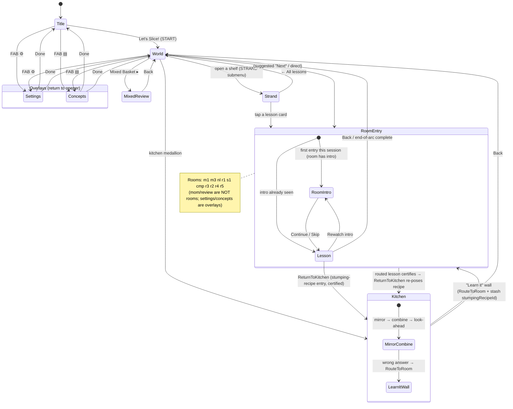

# UI wireframes

The per-screen layouts for every route, preceded by the cross-screen **NAV GRAPH**
(synthesis-owned). Per-screen layouts are slice-owned (shell-nav chrome screens,
lessons-rooms room/hub screens, ui-surfaces overlays); the GRAPH connecting them is
authored here. All screens render in the **1280×800** stage coordinate space
(constitution §6). See `diagrams/key-flows.mmd` for the room↔kitchen handoff sequence.

---

## NAV GRAPH (synthesis-owned)

Routing is hand-rolled hash routing (`#/<route>`) in `Shell.jsx`; there is no router
library. The route set is `title('') · world · mom · review · settings · concepts · {10
room ids}`; an unrecognized route falls through to `world`. `settings` and `concepts`
are **overlays** that return to the route they were opened from (`prevRouteRef`). A room
shows its `RoomIntro` on first session entry (the `seenIntros` set), then the lesson.



The wall→room→return handoff is the load-bearing cycle: the kitchen stashes a
`stumpingRecipeId` in sessionStorage before routing to a room; on room entry `Shell`
reads + clears it; once the routed lesson certifies mastery, the engine returns
`ReturnToKitchen` and the kitchen re-poses the exact recipe that stumped the child.

---

# Chrome screens (shell-nav)

Legend: ASCII boxes show structure; `Wireloom` blocks give the layout tree (node :
description, indentation = nesting).

## TitleScreen (`route ''/title`) — `TitleScreen.jsx`

```
┌───────────────────────────── 1280×800 (cream paper, engraved frame, 4 corners) ──┐
│ ½ (giant ghosted motif, behind)                                                   │
│  ● Moscow Puzzles · No. 1                                                          │
│  Babushka’s                                                                        │
│  FRACTIONS  (red, huge)                          [character cluster bottom-right:  │
│  Бабушкины доли · Babushkiny Doli                 Cook · Grandpa · Mom(front) ·    │
│  Slice the dough and add up the shares.           Cat · Kid — woodcut figures]     │
│  [½ strip] + [⅓ strip] = ( ? )   ← hero equation                                   │
│  ┌──────────────────────────────┐                                                 │
│  │  Let’s Slice!                 │  (START → world)                               │
│  └──────────────────────────────┘                                                 │
└────────────────────────────────────────────────────────────────────────────────-┘
   FAB bar (shared, bottom): [▤ Concepts] [⚙ Settings]
```

```Wireloom
titlescreen [scene, data-vox-speaker=cook]
  paper-fill / foxing / frame / Corners(tl,tr,bl,br)
  ghost-half : giant ½ motif behind everything
  title-block (left)
    kicker / h1.ru-title "Babushka’s" / h1.ru-title(red) "Fractions" [data-vox=titleWelcome]
    subtitle-row / gloss / strip-eq : FStrip(1/2)+FStrip(1/3)=? / button.start → world
  figures (bottom-right) : Cook, Grandpa, Kid, Cat, Mom(front)
```
Cook greets via `say("titleWelcome")` on mount; retried once on first gesture.

## WorldMap — TOP level (`route world`) — `WorldMap.jsx`

```
┌───────────────────────────── 1280×800 (paper) ───────────────────────────────────┐
│                    Babushka's Fractions      [🧺 Mixed Basket ▸] → review          │
│     ┌──shelf "found"──┐                       ┌──shelf "build"──┐                  │
│     │ №1–2  [Next?]   │        recipe          │ №3–6  [Next?]  │                  │
│     │ x/2 mastered ▸  │  ╲     trails    ╱     │ x/4 mastered ▸ │                  │
│     └─────────────────┘   ╲   (SVG)    ╱       └────────────────┘                 │
│                        ┌── kitchen node (CENTER 640,420) → mom ──┐                 │
│                        │ Babushka's Kitchen  ▸ Cook with Babushka │                │
│                        └──────────────────────────────────────────┘               │
│                          ┌──shelf "combine" (640,648)──┐                           │
│                          │ №7–10   Combining & Renaming │                          │
│                          └──────────────────────────────┘                         │
└────────────────────────────────────────────────────────────────────────────────-┘
   FAB bar (shared): [▤ Concepts] [⚙ Settings]
```

```Wireloom
world (top level)
  world-head : tag "Lesson Map", h1, button.mixbasket-btn → onOpen("review")
  svg.wedges : trailPath(CENTER → each strand.pos) + centre dot
  button.kitchen-node → onOpen("mom")
  STRANDS.map → button.shelf [--suggested if hasSuggested, --done if allMastered]
    shelf-head : №range + "Next"? + "Done"? / shelf-title / shelf-blurb
    shelf-foot : "{mastered}/{total} mastered" · "Open shelf ▸"
```

## WorldMap — SUBMENU level (one strand open)

```
┌───────────────────────────── 1280×800 ───────────────────────────────────────────┐
│ [← All lessons]      Shelf · Lessons 3–6      Building Fractions                    │
│   ┌────────┐  ┌────────┐  ┌────────┐  ┌────────┐   ← centred row, chain trail under │
│   │№3 [tag]│  │№4 [tag]│  │№5 [tag]│  │№6 [tag]│     (250px cards, GAP 42, Y=438)   │
│   │ title  │  │concept │  │verb:ex │  │  …     │                                    │
│   └────────┘  └────────┘  └────────┘  └────────┘                                    │
└────────────────────────────────────────────────────────────────────────────────-┘
```
Card tag = status ("Mastered"/"In progress"/"Cook again") OR "Ready"/"Coming soon" (by
`built`); a `Next` tag marks the suggested room. Click → `onOpen(room.id)`.

## EmptyRoom (unbuilt room fallback) — `EmptyRoom.jsx`
```
№{no} · Lesson {no} · {room title}
"This room isn't built yet. Head back to Babushka's kitchen…"
[← Back to the kitchen map]
```

## RoomIntro (first room entry) — `RoomIntro.jsx`

```
┌───────────────────────────── 1280×800 ──────────────────────────┬─ transcript ───┐
│  ┌── iframe (room.intro HTML, silent animated video) ─────────┐ │ Transcript [⚙]  │
│  │                  (the intro "video")                       │ │ ▸ Start of video │
│  └────────────────────────────────────────────────────────────┘ │ • cue line … ◀on │
│  intro-bar:  [←] [⏸/▶]  Lesson N · Title — intro      [Skip ▸]   │ Narrated by Cook │
│  …on completion → intro-endcard:                                └────────────────-┘
│      [↺ Watch again]   [Continue to the lesson →]
└──────────────────────────────────────────────────────────────────────────────────┘
```
Narration is gated to the iframe playhead (`localStorage[STAGE_PERSIST_KEY:t]`);
clicking a transcript line seeks; completion is a pause-aware timer.

## SettingsScreen (`route settings`) — `SettingsScreen.jsx`

```
┌───────────────────────────── 1280×800 (paper, frame, corners) ────────────────────┐
│  ● Babushka’s Fractions                                          [‹ Done]          │
│  Settings · Настройки                                                              │
│  1  Sound ──────────────                                                           │
│     🔊 Voice lines   [████████░░░░] knob  80%   (Spoken hints and praise)          │
│     🎵 Music         [█████░░░░░░░] knob  55%   (Background music)                  │
│  2  How you answer ──────────────                                                  │
│     ┌─ ✎ Stylus  [✓ Selected] ─┐   ┌─ ⌨ Typing  ( ◯ ) ─┐                          │
│     └───────────────────────────┘   └──────────────────┘                          │
└────────────────────────────────────────────────────────────────────────────────-┘
```
Sliders write `voiceVol`/`musicVol` (0=Off, keyboard ±5); cards toggle `inputMode`. All
persist to `bf_settings_v1`, apply live. "Done" returns to the opening route.
`SettingsButton.jsx` is a single `.ctrl-btn` gear that sets `location.hash = "#/settings"`.

## ConceptMap (`route concepts`) — `ConceptMap.jsx`

```
┌───────────────────────────── 1280×800 (paper, frame, corners) ────────────────────┐
│  ● Babushka’s Fractions                       [● Live engine data] [‹ Done]        │
│  Concept Mastery Map                                                               │
│  legend: ■ Mastered(85%+)  ■ Partial(50%+)  ■ Weak(15%+)  □ Not started            │
│  ┌─ TOP NAV (tabs) ─ (◌42) Multiplication  (◌70) Fractions as #  …  ─────────────┐  │
│  ┌─ DETAIL (selected concept) ─────────────────────────────────────────────────┐  │
│  │ (◌ring) {Concept}   {blurb}                                                  │  │
│  │  ▾ (◌ring) Node  NODE_ID  example  {n} cards                                 │  │
│  │       Builds on: [prereq]   aligned to 4.NF.B.3a                              │  │
│  │       ┌card┐ (chip Visual/…/Transfer, Lk, formId, bar)                       │  │
│  └──────────────────────────────────────────────────────────────────────────────┘ │
└────────────────────────────────────────────────────────────────────────────────-┘
```
Mastery rolls up card → node → concept; banding strong/partial/weak/empty. Header chip
reflects `isLiveMastery()`.

## Shared chrome — FAB bar + global mounts (`Shell.jsx`)
Shown ONLY on `title`/`world`: `.fab-bar [ ▤ Concepts ] [ ⚙ Settings ]`. Always mounted
(no visible chrome here): `BackgroundMusic` (UI-less), `TapToRead`, `EngineSurfaces`.

---

# Per-screen room/hub wireframes (lessons-rooms)

> Shared chrome reference: `LessonShell` provides the outer frame; the same skeleton
> wraps every lesson body. Per-room wireframes below show only what differs.

## Shared lesson chrome skeleton (`LessonShell` + `LessonBoard`)

```
+--------------------------------------------------------------------------+
| [№no]  Lesson {no} · {tag}                     [←][▷ rewatch][⚙][⟲]      |  topbar
|        {Big Title}                                                        |
+--------------------------------------------------------------------------+
| ( Manipulate | Bind | Fade | Workbench | Numbers | Applied | … | ★ )      |  StageTabs
+--------------------------------------------------------------------------+
| the question:   2/7  +  3/7  =  [ ? / solved ]                           |  QuestionBand
+--------------------------------------------------------------------------+
| [🔊 Read aloud]  Goal copy in Babushka's-kitchen language …              |  LessonGoal
+--------------------------------------------------------------------------+
| LessonBoard (variant="split"):                                           |
|  +------------------------+  +-------------------------------+            |
|  | STAGE (play space)     |  | RAIL (HintRail: signature)    |            |
|  +------------------------+  +-------------------------------+            |
|  | ANSWER (eq + Check)    |  | TUTOR (Cook + ribbon)         |            |
|  +------------------------+  +-------------------------------+            |
+--------------------------------------------------------------------------+
```

```wireloom
Shell.LessonShell
  topbar[ numMark, tag, title, controls{back?, rewatchIntro?, settings, reset?} ]
  StageTabs{ stages[], current, onSelect }
  band?: QuestionBand{ lead, expr, answer }
  goal: LessonGoal{ speaker, text }
  body: LessonBoard
    variant=split: { stage, rail, answer:AnswerBar, tutor:TutorRibbon }
    variant=wide:  { content:WordProblem(FitStage axis=y), tutor:TutorRibbon(narrow) }
```

## R1 · Same Denominators (`AppR1`)
Stage 1 (Manipulate):
```
+-- STAGE (.r1-s1-canvas) -------------------------+   +-- RAIL ------------+
|  [🔒 bottom stays /7]                            |   | KEEP THE BOTTOM    |
|   [stack A: 2/7]   <drag→merge→>   [stack B:3/7] |   | both stacks → 7ths |
|   ───────── ruler 0  1/7 … 1 ──────────          |   | [ +  /7 (locked) ] |
|   (after merge: one uniform stack = ?/7  [↺])    |   | add the tops/keep 7|
+--------------------------------------------------+   +--------------------+
| ANSWER: 2/7 + 3/7 = [top][/7 locked]   [Check]   |   | TUTOR: Cook "…"    |
+--------------------------------------------------+   +--------------------+
```
Stage 4 Workbench: rail-less `BlockSandbox` (bin + ruler + diagram) + a `.hud`. Stage
6/7 Applied/Words: `LessonBoard variant="wide"` (WordProblem in FitStage + ExpressionSlate
setup gate → answer Slate; stage 7 suppresses the QuestionBand).

## s1 · Taking Away (`AppSubtract`)
Stage 2 (Take Away): a draggable `UnitRow` over a "used" tray; bottom `/8` LOCKED.
(Stage 1 Decompose: solid stack + "Break apart ✂". Stage 3 Numbers: bare `7/8 − 3/8`.
Stage 4 Words: wide.)

## nl · On the Number Line (`AppNumberLine`)
`FitStage > .nl-canvas`: a 0─●──1 draggable point; ANSWER toggles Place (drag) / Write
(Slate n/d). Stage 3 Numbers: a 0→2 line, drag 5/3 PAST 1.

## cmp · Compare & Check (`AppCompare`)
Choice-button answer card (`ChoiceAnswer`), no Slate: two stacked NumberLines + item
dots; ANSWER `[ < ][ = ][ > ]`. (Stage 2 Benchmark: ½ tick called out, choices {0,½,1};
Stage 3 Reason: 1/2+2/3 on two lines, choices {less/about/more than 1}.)

## m1 · Equal Groups (`AppM1`) — full 7-stage arc
Stage 1: `PlateGroup` (drag the same 4 onto every plate; extra taps spill back) + a count
box. (2 Bind 4+4+4; 3 Fade collapse-to-3×4; 4 Workbench number mode; 5 Numbers bare 3×4;
6/7 wide; sw blank slate.)

## m3 · Times Facts (`AppM3`) — 7-stage arc
Stage 1 `SkipJar` (drag scoop; tally 8,16,24…); Stage 3 `SkipLine` (fill blanks). (5
Numbers cycles fact → ×1 → ×0 micro-prompts with progress dots; 6/7 wide.)

## r4 · Simplify (`AppR4`)
Stage 1/2 `GroupBar` + drag ÷K chips (portaled ghost): `8/12 = [?/2⁄3]`, filled-cell run
whose right EDGE never moves. (3 Fade drag ÷ factor chip onto `8/12 = ?/?`; 4 Numbers bare
8/12; 5 Applied/6 Words split story card; sw full-width blank slate.)

## r5 · Mixed Numbers (`AppR5`)
Stage 1/2 (portaled ghost): an overflow column dragged into a whole-unit FRAME (locks at
DEN) + a leftover tray on a 0→2 ruler; ANSWER `9/7 = [w wholes] and [n/7]`. (3 Fade ghost
+ "how many wholes?" picks; 4 Numbers bare 9/7, 14/7 exact-whole trap; W/A/sw/5 use the
legacy `.play/.hud` layout.)

## r2 · Cross-Multiply / r3 · Scale One (`LessonUnlikeDen`, config-driven)
ONE component; beat tabs carry the L0→L7 ladder. L0 (Manipulate): `Plank A`/`Plank B`
strips + a `Knife` to slice on a 0→2 ruler; ANSWER is the two-stage gate — write BOTTOM
first, then NUMERATOR unlocks. (L2 Bind DenominatorPicker; L4 Fade generated transfer
pairs; r2 only: cross-multiply crossing-arrows on L5/L6; LA Applied ExpressionSlate setup;
L7 Words wide.)

## mom · Babushka's Kitchen (`MomsRoom`)
Words-only; bespoke fixed-zone layout (`.mr-s`), NOT LessonShell. No QuestionBand:
```
+--------------------------------------------------------------------------+
| [★] Babushka's Kitchen · Story Problems     ● ● ◐ ○ ○ (pips) [←][⚙][⟲]   |  topbar
+--------------------------------------------------------------------------+
| [🔊 Read aloud]  «prose recipe story — the question»                     |  goal
+--------------------------------------------------------------------------+
|  STAGE: [skill tag] · prop SVG · ScratchCanvas | RAIL: Cook · Skill · n/5 |
|  ANSWER: Write your answer · [Slate]           | TUTOR: Kid/Grandpa/Cat   |
|         [▸ Learn it: <skill>]? [Check]         |       banter             |
+--------------------------------------------------------------------------+
```
On a wrong answer the engine may show the "▸ Learn it: <skill>" wall routing to the
most-upstream unmastered room. Done state: finale art + "Play again".

## review · Mixed Basket (`MixedReview`)
Standalone, minimal chrome; two phases per trial:
```
+--------------------------------------------------------------------------+
| [←]  Mixed Basket   — solved {n} so far.                                  |
|  «generated problem prompt»                                              |
| phase=identify:  Which recipe is this?  [ Same Den ][ Scale One ][ … ]   |
| phase=solve:  renderInput(shape): fraction→[Slate n/d]  integer→[Slate v]|
|                relation→[ < ][ > ]   mixed→[w] and [n/d]                 |
|  ribbon: status (Yes — now solve it / Correct! / Not quite…)            |
+--------------------------------------------------------------------------+
```
Empty state when <2 introduced recipes: "Cook a few more recipes first…".

---

# Engine-surface overlays (ui-surfaces)

> These surfaces live in **viewport** coordinates, NOT inside the scaled 1280×800
> `#stage`, so they are `position: fixed` (banner/toast/inspector) or absolute-inset
> (probe), palette-matched to `tokens.css`.

## RationaleBanner — bottom-center "why did this change?" bar
```
                  ┌──────────────────────────────────────┐
                  │▌ <one-line rationale text>        × │   .rationale-banner
                  └──────────────────────────────────────┘   bottom:200px
   [answer inputs]            [ Check ]                       [ cook ]
```
`position:fixed; left:50%; bottom:200px; transform:translateX(-50%); z-index:40`;
`max-width: min(460px, 46vw)`. Lifted to bottom:200px so it clears the ~190px answer-bar
band (denominator input left, Check center, cook right). Red left accent, paper bg, rises
in via `rationale-rise` 240ms; `×` dismiss.

## Tier-2 nudge toast — pill, stacked just above the banner
```
   ┌············ engine-nudge (dashed pill) ··········┐
   : <italic nudge text>                          ×  :  bottom:258px
   └··················································┘
```
`position:fixed; left:50%; bottom:258px; z-index:39` (~58px above the banner so the two
STACK). Dashed muted border, pill radius, italic serif. Transient (auto-dismiss 5s).

## MasteryInspector — bottom-left toggle + pop-up panel (DEV/observer)
```
 ┌─ .mastery-inspector__panel (min(560px,94vw), max-height 70vh, scrolls) ─┐
 │  Mastery Inspector                                                       │
 │  Node          P(known)  Gate                Status      Hint dep        │
 │  Same Den (r1)  93.0%   ✓Acc ✓Ind ✗Xfr ✓Flu  in-progress  40%           │
 │  … 5 rows, topo order; mastered=green, needs-review=red                  │
 │  COUNTER-METRICS:  UI churn 2 · Dependence 38.0% · False-pos 0.0%        │
 │  DECISION LOG:  [FadeScaffold] 3 clean answers… @123  (newest first)     │
 └────────────────────────────────────────────────────────────────────────┘
 [ Mastery Inspector ]   ← .mastery-inspector__toggle, fixed left:14px bottom:14px
```
Toggle `position:fixed; left:14px; bottom:14px; z-index:41`. Panel pops above the toggle
(`bottom:38px`), scrolls internally. Gate badges: green `✓` / red `✗`.

## AffectProbe — centered modal overlay (rare T3 pause)
```
 ┌──────────── .affect-probe (absolute inset:0, dimmed scrim) ────────────┐
 │            ┌──────── .affect-probe__card ────────┐                     │
 │            │  Ну что, solnyshko — was that        │                     │
 │            │  tricky, or easy-peasy?              │                     │
 │            │   ┌────────┐      ┌────────┐         │                     │
 │            │   │🙂 Easy- │      │😖 Tricky│         │                     │
 │            │   │  peasy  │      │        │         │                     │
 │            │   └────────┘      └────────┘         │                     │
 │            │            Not now                   │                     │
 │            └─────────────────────────────────────┘                     │
 └────────────────────────────────────────────────────────────────────────┘
```
`position:absolute; inset:0` over its parent, dimmed scrim, `z-index:40`; centered paper
card. Two faces: `min 140×140px` tap targets, reader-safe label under an `aria-hidden`
emoji (easy=green, tricky=red). Underlined "Not now" skip.
