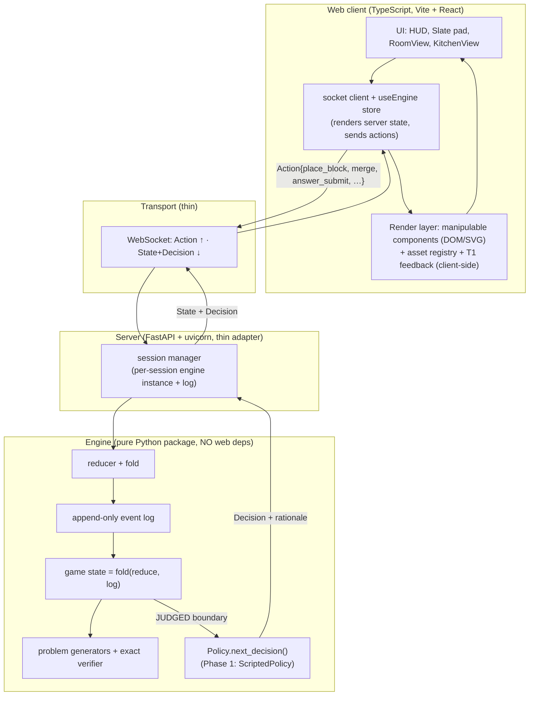
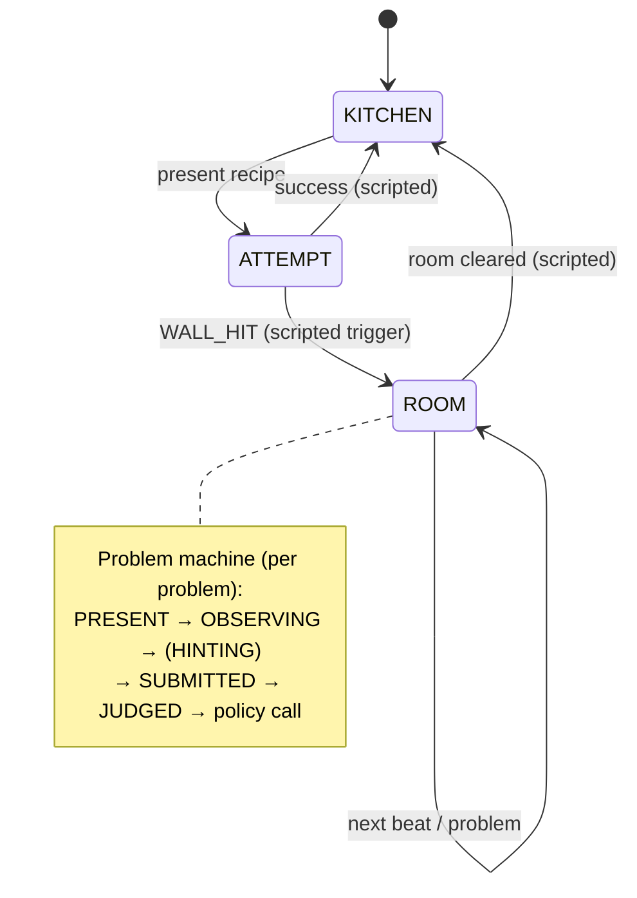
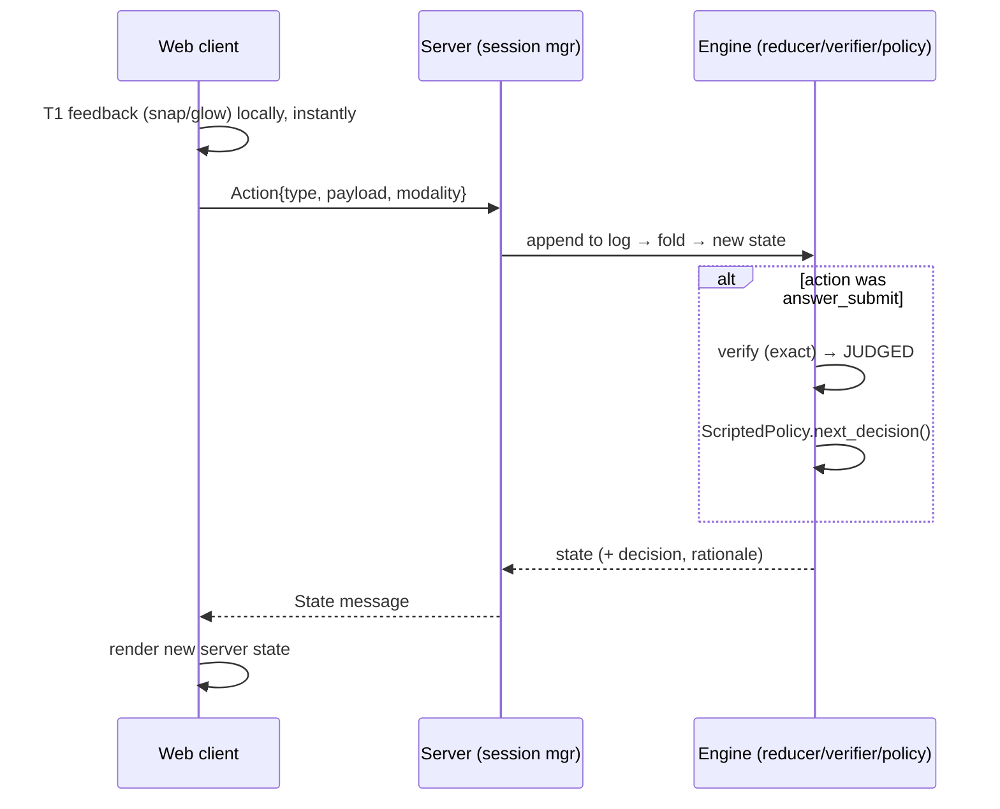

# feat: Playable Game Shell — Python Engine Spine + Web UI (Scripted Progression)

## Summary

Phase 1 of three. Build a **playable, end-to-end** version of the fraction-adding game:
every room and beat from `docs/room_break_down/` runnable in the browser (block→number
fade, manipulatives, slate), but with **scripted progression**. The player clicks through a
fixed curriculum order; nothing measures mastery and nothing routes adaptively yet.

Two confirmed decisions shape everything:

1. **Python engine + web UI.** A **pure Python package** owns the
   `action → reducer → state → event-log` engine, the skill graph, the problem generators,
   and the exact verifier. A **thin transport** (FastAPI + WebSocket) makes the engine
   server-authoritative. A **TypeScript web front-end** (Vite + React, 2D DOM/SVG) renders
   state and emits actions. The same Python engine the browser drives is the one the Phase-3
   synthetic harness will drive headlessly.
2. **Build the decoupled engine spine now.** Phase 2 (mastery + adaptive flow) then bolts on
   by adding a read-only fold over the existing event log and swapping one `Policy`
   implementation — no rewrite. This is the locked design's "the engine is the asset;
   everything else hangs off the seam" thesis (origin:
   `docs/design/fraction-app-state-model.md`).

**Out of scope** (deferred — see Scope Boundaries): mastery estimation, adaptive routing
(Phase 2); the LLM brain, affect/attention camera, voice + handwriting *recognition*, and
the synthetic-challenger harness (Phase 3). The seams for all of them are designed in here;
none are implemented.

---

## Problem Frame

We have a fully-specified design (architecture, mastery model, room-by-room game
breakdowns) and zero code (a near-empty `pyproject.toml`). The risk in a greenfield demo is
building a UI whose state tangles into React (or into the transport), so that adding the
real adaptive brain later forces a rewrite — the failure the design doc warns about ("if the
seam leaks … both the responsive UI and the harness become rebuilds").

Phase 1 de-risks that by making the **Python engine** the first asset: a pure, headless,
replayable core. The browser only renders engine state and emits actions; the engine is the
single source of truth and lives server-side, which is also exactly what lets the Phase-3
synthetic harness drive it with no browser. Every move is already an `Action` on an
append-only event log, every answer is already checked by the **exact verifier** Phase 2
reuses, and progression already flows through a `Policy` interface whose Phase-1
implementation is a static script and whose Phase-2 implementation reads mastery.

**What "done" looks like:** a child can start in the kitchen, hit a (scripted) wall, get
sent to a room, play its beats from blocks-lead through the bare slate, and return — for
every room (R0a count, R0b add-whole, R1, R2, R3, R4) — with responsive feel (drag, snap,
glow, shake). The server-side event log for a full playthrough is inspectable and the engine
is unit-tested by replaying scripted event sequences in pure Python.

---

## Origin & Requirements Traceability

These plans treat the existing design docs as the requirements source.

| Req | Source | How Phase 1 honors it |
|-----|--------|------------------------|
| R1 — single `action→reducer→state→event-log` core, decoupled from input & rendering | state-model §"core thesis", premise 1 | U2 pure Python engine (no web deps); server (U5) + web (U6–U7) only dispatch/render |
| R2 — two event classes: Actions (fold to state) vs Signals (no-op on state) | state-model §1.1; measurement §1.1 | U2 `Event` union; reducer no-ops Signals |
| R3 — state is a pure fold over the log; replayable & inspectable | state-model §"core thesis" | U2 `fold(reduce, events)`; pytest replay |
| R4 — exact deterministic verifier on every answer | state-model §5.2 guardrail 2 | U3 verifier; reused unchanged in Phase 2 |
| R5 — session machine (KITCHEN↔ROOM) + problem machine lifecycle | state-model §2 | U2 machines; U8 wires them |
| R6 — scaffold ladder per room incl. ghost-backdrop + bare slate | room_break_down §4.4/§5 (rewritten) | U7 beat sequencing |
| R7 — every room's objects/mechanics/verbs as specified | room_break_down/*.md §4 | U7 |
| R8 — R0a special terminal (no bare math; mixed scatter) | docs/room_break_down/01_R0a_count.md | U7 |
| R9 — R2 over-slice star tiers; R4 whole-units/ruler (no liquid) | R2 §4.6; R4 (rewritten) | U3 verifier/scoring, U7 |
| R10 — theme-swappable assets by functional ID | docs/room_break_down/ASSET_CATALOG.md | U6 asset registry |
| R11 — `Policy` seam so Phase 2 swaps in mastery-driven routing | state-model §5.1/§5.4 | U4 protocol + ScriptedPolicy |
| R12 — blocks always in the open, never obscured (no bin/cup) | ASSET_CATALOG §C design law | U7 (open stacks; no container widgets) |

---

## Key Technical Decisions

**KTD1 — The engine is a pure Python package with zero web dependencies.** `engine/` imports
no FastAPI, no web/transport code. It is the asset: headless, replayable, and (Phase 3)
drivable by the synthetic harness on the identical code path. Enforced by an import-linter
contract (`engine` may not import `server`/`web`).

**KTD2 — Server-authoritative engine over a thin WebSocket transport (FastAPI + uvicorn).**
The browser sends semantic `Action` messages; the server reduces them into the
authoritative state + event log and pushes back the new state (and the Phase-1 scripted
`Decision`). Localhost latency is sub-millisecond, so a round-trip per semantic action is
fine. *Alternative considered:* REST-per-action (simpler but chattier and no server-push for
routing) — rejected; WebSocket fits the bidirectional action/decision flow. *Alternative
considered:* run the engine in-browser via Pyodide — rejected (heavy, and it weakens the
clean server-side log the harness wants).

**KTD3 — T1 reflex feedback is client-side; only semantic actions cross the wire.** The
design's Tier-1 (ms-latency snap/glow/shake) is UI-only and deterministic, so it runs in the
browser with no round-trip (state-model §6). Semantic moves (`place_block`, `merge_stacks`,
`answer_submit`, …) go to the engine. This keeps the game feeling instant while the engine
stays authoritative.

**KTD4 — Pydantic models are the single schema source; TypeScript types mirror them.** The
`Event`/`Action`/`Signal`/`GameState`/`Decision` shapes are Pydantic models in `engine/`;
the wire protocol reuses them. TS types are generated from the Pydantic schema (e.g.
`pydantic` JSON schema → `json-schema-to-typescript`, run in CI) so the client and engine
cannot silently drift.

**KTD5 — TypeScript web UI: Vite + React + DOM/SVG + Framer Motion + `@use-gesture/react`
(2D).** At this scale (tens of blocks per screen) DOM/SVG is responsive, accessible,
inspectable, and gives strong "juice" via Framer Motion springs. *Alternative considered:*
Canvas/PixiJS (better for hundreds of sprites) — documented as the upgrade behind the render
boundary (U6). *(3D / React Three Fiber is not planned; if desired later it swaps in behind
the same render boundary.)*

**KTD6 — The verifier is built in Phase 1 and is canonical.** Even without mastery, the
engine must judge correct/incorrect to advance. That same pure verifier (and the generators)
is what Phase 2's measurement and Phase 3's harness depend on, so it is built carefully and
exhaustively tested now (pytest).

**KTD7 — Progression is a `Policy`, not hardcoded flow.** `next_decision(state) → Decision`
is a Python `Protocol`. Phase 1 ships `ScriptedPolicy` (static curriculum order; beats
advance on correct or manual "next"). Phase 2 ships `MasteryPolicy` reading
`MasteryEstimate`. The server and machines never know which is installed.

**KTD8 — Handwriting input is stubbed as tap/type now.** The `slate` and beats that *say*
"write with stylus" are built, but the Phase-1 answer modality is a number/fraction pad +
keyboard. The `answer_submit` action carries a `modality` field so handwriting (Phase 3) is
an additive modality, not a new code path (state-model §10).

**KTD9 — Authoritative state in the engine; React holds only ephemeral UI state.** The
client renders the last server `GameState` (via a small store fed by the socket); a tiny
Zustand store is allowed **only** for ephemeral UI (drag ghost, hover, modal). No game state
in React.

**KTD10 — Three-layer presentation: engine state → presentation nodes → swappable Skin.**
Rendering is split so a design layer drops in later without touching logic. The engine owns
logical state (no pixels); the web client turns state + `RoomSpec` into skin-agnostic
**presentation nodes** (region, logical layout, affordance, block↔numeral `link`,
`emphasis`); a **Skin** renders art/typography/color/motion per functional ID + state. A
**wireframe Skin** (boxes, lines, system font, sized by props) ships first so the game is
fully playable and testable before any art exists; the Kitchen art Skin is the second,
drop-in Skin. The asset registry IS the Skin lookup. Full contract:
`docs/design/presentation-scene-architecture.md`; complete asset/art list:
`docs/design/asset-manifest.md`.

**KTD11 — Build vs buy: buy proven components, build only the asset.** Don't reinvent what
exists. **Buy:** exact rational math (Python `fractions`, `fraction.js`), drag/gesture
(`@use-gesture/react`), animation (`framer-motion`), Pydantic→TS schema codegen, server
(FastAPI/uvicorn), and (later) voice via the browser Web Speech API. **Build only** what is
the asset and has no good off-the-shelf fit: the engine spine, the verifier's domain logic,
the room content, and (Phase 2) the mastery gate/policy. Phase-3 modalities use off-the-shelf
ML, not custom (see Scope Boundaries).

---

## High-Level Technical Design

### Layered architecture (the seam)



The dashed contract: **ENGINE imports nothing from `server`/`web`.** Phase 2 adds a
`MasteryEstimate = fold(measurement_reduce, log)` consumer beside `State` and swaps
`ScriptedPolicy → MasteryPolicy`. Nothing in WEB/TRANSPORT/SERVER changes.

### Session & problem state machines (from state-model §2)



In Phase 1 the `WALL_HIT` and `success` transitions are fired by `ScriptedPolicy` from a
static curriculum table; in Phase 2 by wall detection over mastery estimates. The state
shapes are identical, which is what makes the swap free.

### One action round-trip (Phase 1)



---

## Output Structure

```
engine/                      # pure Python package — NO web deps
  __init__.py
  events.py                  # Event = Action | Signal (pydantic models)
  log.py                     # append-only event log
  reducer.py                 # reduce(state, event) -> state; fold()
  state.py                   # GameState, SessionState, ProblemState
  machines/
    session.py               # KITCHEN↔ROOM transitions
    problem.py               # PRESENT→…→JUDGED lifecycle
  skills/
    graph.py                 # SkillNode DAG (COUNT…IMPROPER_TO_MIXED)
    generators.py            # per-node deterministic problem generators
    verifier.py              # exact verifier + scoring (R2 stars, R4 trap)
  policy/
    policy.py                # Policy Protocol + Decision union
    scripted.py              # ScriptedPolicy (Phase 1)
content/
  rooms/                     # kitchen.py r0a_count.py r0b_add_whole.py
                             #   r1_same_den.py r2_unlike_den.py r3_simplify.py r4_improper_mixed.py
  room_spec.py               # RoomSpec (objects, mechanics, beats, ladder)
  curriculum.py              # static order used by ScriptedPolicy
server/
  app.py                     # FastAPI app + uvicorn entry
  ws.py                      # websocket handler: Action ↑ / State+Decision ↓
  session_manager.py         # per-session engine instance + log
  schemas.py                 # wire DTOs (reuse engine pydantic models)
web/
  src/
    client/
      socket.ts              # ws client; send action / recv state
      types.gen.ts           # TS types generated from pydantic JSON schema (CI)
      useEngine.ts           # store fed by socket; renders state, dispatch()
    render/
      assets/registry.ts     # functional ID → art descriptor (theme-bound)
      assets/theme.kitchen.ts
      manipulables/          # Block, Stack, Pile, Ruler, TargetMark, WholeUnitRow,
                             #   Slicer, FuseTool, FactorTray, LeftoverTray,
                             #   MixedNumberSlots, MergeZone, ArrangementFrame, Slate (DOM/SVG)
      feedback/              # T1 reflex: snap/glow/shake (client-side)
    ui/
      App.tsx Hud.tsx SlatePad.tsx RoomView.tsx KitchenView.tsx
    main.tsx
  index.html vite.config.ts vitest.config.ts playwright.config.ts
  package.json tsconfig.json
tests/
  engine/                    # pytest: reducer, replay, verifier, generators, machines, policy
  server/                    # pytest: ws protocol, session manager
  web/                       # vitest: gesture→action, selectors
  e2e/                       # playwright: full-curriculum smoke
pyproject.toml               # deps: fastapi, uvicorn[standard], pydantic; dev: pytest, ruff, mypy, import-linter
scripts/dev.py               # run server + web dev together
```

The tree is a scope declaration, not a constraint; per-unit **Files** lists are
authoritative.

---

## Implementation Units

### U1. Repo scaffold, tooling, and the dev runner

**Goal:** A running two-part project — Python package + FastAPI app skeleton, and a Vite +
React + TS web app — with test runners, lint/type tooling, the import boundary, and a single
dev command.

**Requirements:** R1 (foundation).

**Dependencies:** none.

**Files:** `pyproject.toml`, `engine/__init__.py`, `server/app.py`, `scripts/dev.py`,
`web/package.json`, `web/tsconfig.json`, `web/vite.config.ts`, `web/index.html`,
`web/src/main.tsx`, `web/src/ui/App.tsx`, `.importlinter` (or `pyproject` contract),
`web/.eslintrc.cjs`.

**Approach:** `pyproject.toml` adds `fastapi`, `uvicorn[standard]`, `pydantic`; dev deps
`pytest`, `ruff`, `mypy`, `import-linter`. `server/app.py` is a FastAPI app with a health
route only. Web app from the Vite React-TS template + `framer-motion`,
`@use-gesture/react`, `zustand`, `fraction.js` (exact client-side rational math).
`strict: true`, `noUncheckedIndexedAccess`. Import-linter
contract: `engine` is forbidden from importing `server` or any web code. `scripts/dev.py`
launches uvicorn + `vite dev` together. No game logic yet.

**Patterns to follow:** standard FastAPI app layout; Vite React-TS conventions.

**Test scenarios:**
- `pytest` runs (zero tests pass) and `uvicorn` health route returns 200 (smoke).
- `npm run dev` serves the empty web shell; `npm run build` succeeds.
- Import-linter fails the build if `engine/` imports anything from `server/` or `web/`
  (guards KTD1/R1).

**Verification:** `python scripts/dev.py` brings up server + web; health check green; lint,
type, and import-contract checks pass.

---

### U2. Engine core — events, log, reducer, fold, state machines

**Goal:** The pure, headless `action → reducer → state → event-log` core (Python) with the
session and problem machines.

**Requirements:** R1, R2, R3, R5.

**Dependencies:** U1.

**Files:** `engine/events.py`, `engine/log.py`, `engine/reducer.py`, `engine/state.py`,
`engine/machines/session.py`, `engine/machines/problem.py`,
`tests/engine/test_reducer.py`, `tests/engine/test_replay.py`,
`tests/engine/test_machines.py`.

**Approach:** Pydantic models: `Action{type, payload, modality, t, actor}` and
`Signal{type, payload, confidence, t, actor}`; `Event = Action | Signal` (measurement
§1.1). `reduce(state, event)` folds **Actions** into `GameState`; **Signals** are no-ops on
game state but still appended to the log. `fold(events)` reduces the list from the initial
state. Session machine handles KITCHEN↔ROOM; problem machine handles
PRESENT→OBSERVING→(HINTING)→SUBMITTED→JUDGED. `actor` defaults to `human` (Phase 3 harness
passes `synthetic:persona`). State stores counts/sizes/slots/beat — not pixel coordinates
(those are render concerns in the web layer).

**Patterns to follow:** state-model §1.1 event taxonomy and §2 machine diagrams; immutable
state updates (return new state, don't mutate) so the fold is pure.

**Test scenarios:**
- Replay determinism: folding a fixed event list yields an equal state every run; folding
  twice is identical.
- `place_block` increments the active stack count; `remove_block` decrements.
- A `Signal` (e.g. `idle`) leaves `GameState` unchanged but is present in the log (R2).
- Problem machine: cannot reach `JUDGED` without `SUBMITTED`; out-of-order actions are
  no-ops and logged.
- Session machine: `WALL_HIT` → KITCHEN→ROOM; `room_cleared` → ROOM→KITCHEN; illegal
  transitions are no-ops.

**Verification:** `engine` imports nothing web; replay/machine tests green.

---

### U3. Skill graph, problem generators, and the exact verifier (+ scoring)

**Goal:** Deterministic, parameterized problem generators per skill node and the exact
verifier — including R2's over-slice star tiers and R4's exact-whole trap.

**Requirements:** R4, R9; foundation for Phase 2 (measurement) and Phase 3 (harness).

**Dependencies:** U1.

**Files:** `engine/skills/graph.py`, `engine/skills/generators.py`,
`engine/skills/verifier.py`, `tests/engine/test_verifier.py`,
`tests/engine/test_generators.py`.

**Approach:** `graph.py` encodes the DAG (COUNT → ADD_WHOLE → ADD_SAME_DEN →
ADD_UNLIKE_DEN → {SIMPLIFY, IMPROPER_TO_MIXED}) with each node's `transfer_forms` and a
`problem_generator` (state-model §1). Generators are seeded and pure. Exact rational
arithmetic uses Python's stdlib `fractions.Fraction` (server) and `fraction.js` (client) —
never hand-rolled gcd/lcm/reduce; the verifier builds only the **domain logic** on top (LCD
+ star tiers for R2, mixed-number + exact-whole trap for R4, error-signature fingerprinting).
`verify(problem, answer) -> Judgement{correct, score: StarTier, error_signature|None}`:
- **R2 over-slice (R2 §4.6):** any valid common denominator → `correct=True`; star tier =
  full when it equals the LCD, reduced when a larger valid multiple; `correct=False` only
  for a non-common size or arithmetic slip. (Computed/recorded now; UI uses it; Phase 2
  reads star tier as a fluency/directness signal, not accuracy.)
- **R4 (rewritten):** mixed-number answers validated against whole-units + leftover;
  exact-whole (14/7 = 2) requires an **empty** leftover — a forced leftover is
  `correct=False`.
- **error_signature:** on a wrong answer, fingerprint against the named misconceptions from
  the room docs (`add_denominators` for 2/7+3/7→5/14; `add_across_unlike` for 1/2+1/3→2/5;
  `scaled_bottom_only`; `forced_leftover`). Phase 2 consumes it; Phase 1 records it.

**Patterns to follow:** per-room §4.5/§4.6 problem progressions and §6 "shallow tells"
(those tells are the error signatures).

**Test scenarios:**
- `1/2 + 1/3` → `5/6` → correct, full stars.
- `1/2 + 1/3` → `10/12` → correct, reduced stars (over-slice), not wrong.
- `1/2 + 1/3` → `2/5` → wrong, `error_signature = add_across_unlike`.
- `2/7 + 3/7` → `5/14` → wrong, `error_signature = add_denominators`.
- `14/7` → `2` (empty leftover) → correct; `2 0/7` (forced leftover) → wrong,
  `error_signature = forced_leftover`.
- `9/7` → `1 2/7` → correct.
- R0a count: answer matching the placed-piece count of a given type → correct; mixed scatter
  scored per-type independently.
- Generators deterministic given a seed; `transfer_forms` produce structurally distinct
  surface forms.

**Verification:** Verifier table tests cover every room's correct/over-slice/wrong cases;
generators reproducible by seed.

---

### U4. Policy protocol + ScriptedPolicy + curriculum

**Goal:** The `next_decision` seam, with a Phase-1 implementation that walks a static
curriculum and advances beats on correct (or manual "next").

**Requirements:** R5, R11.

**Dependencies:** U2, U3.

**Files:** `engine/policy/policy.py`, `engine/policy/scripted.py`, `content/curriculum.py`,
`tests/engine/test_scripted_policy.py`.

**Approach:** `Policy` is a `Protocol` with `next_decision(state, ctx) -> Decision`, where
`Decision` is a union of `PresentProblem{node, scaffold, surface_form}`, `RouteToRoom{node}`,
`ReturnToKitchen{recipe}`, `AdvanceBeat`, `RoomCleared` — a Phase-1 subset of the
state-model §5.1 enum (mastery-only variants like `FadeScaffold`/`TransferProbe` exist in
the type but ScriptedPolicy never emits them). `curriculum.py` is the static order. The
policy is consulted **only** at the `JUDGED → policy call` boundary (state-model §2), never
mid-attempt — establishing the Phase-2 contract now.

**Patterns to follow:** state-model §5.1 (`Decision`), §5.4 (deterministic-policy shape
Phase 2 fills in), premise 5 (boundary-only calls).

**Test scenarios:**
- From the kitchen opener, a correct answer advances to the next scripted recipe.
- A scripted wall recipe emits `RouteToRoom{node}` for the right node.
- Inside a room, correct answers emit `AdvanceBeat` until the bare slate, then `RoomCleared`
  → `ReturnToKitchen`.
- `next_decision` is pure given `(state, ctx)` and only invoked at a JUDGED boundary (spy in
  an integration test).
- The `Decision` union includes the mastery-only variants (present, unused) — type seam for
  Phase 2.

**Verification:** A scripted run drives KITCHEN→ROOM→KITCHEN for one room purely via
ScriptedPolicy decisions.

---

### U5. Server + WebSocket transport + session manager

**Goal:** Make the engine server-authoritative: a FastAPI WebSocket that accepts `Action`
messages, reduces them via a per-session engine instance, and pushes back state + the
scripted decision.

**Requirements:** R1 (decoupling across the wire), R5.

**Dependencies:** U2, U4.

**Files:** `server/app.py`, `server/ws.py`, `server/session_manager.py`,
`server/schemas.py`, `tests/server/test_ws_protocol.py`,
`tests/server/test_session_manager.py`.

**Approach:** `session_manager` holds, per connection/session, an engine instance (its event
log + current state). `ws.py`: on an inbound `Action` message, append → fold → if it was an
`answer_submit`, verify (JUDGED) and call `Policy.next_decision`; reply with a `State`
message `{state, decision?, rationale?}`. `schemas.py` reuses the engine Pydantic models for
the wire (KTD4); a CI step exports their JSON schema for the web `types.gen.ts`. The server
is a **thin adapter** — no game logic lives here (it delegates entirely to `engine`).

**Patterns to follow:** FastAPI WebSocket route conventions; state-model premise 1 (engine
decoupled from transport).

**Test scenarios:**
- Sending an `Action` over the socket returns a `State` message reflecting the reduced state.
- An `answer_submit` returns a `State` whose `decision` is the ScriptedPolicy output.
- Two concurrent sessions keep independent logs/state (no cross-talk).
- A malformed message is rejected with an error frame and does not corrupt session state.
- Reconnect/replay: re-folding a session's persisted log reproduces its current state (R3
  across the transport).

**Verification:** A scripted sequence of `Action` messages drives a session through a room
and back via the socket; logs stay per-session.

---

### U6. Web client foundation — socket, generated types, store, asset registry, T1 feedback

**Goal:** The TypeScript client plumbing: a socket client, engine-mirrored types, a store
that renders server state and dispatches actions, the themeable asset registry, and the
client-side T1 reflex primitives.

**Requirements:** R1, R3, R10; state-model §6 Tier-1.

**Dependencies:** U5.

**Files:** `web/src/client/socket.ts`, `web/src/client/types.gen.ts` (CI-generated),
`web/src/client/useEngine.ts`, `web/src/render/presentation/nodes.ts` (state → presentation
nodes), `web/src/render/skin/skin.ts` (Skin interface), `web/src/render/skin/wireframe.ts`,
`web/src/render/skin/kitchen.ts` (stub), `web/src/render/feedback/*`,
`tests/web/useEngine.test.ts`, `tests/web/skin.test.ts`, `tests/web/presentation.test.ts`.

**Approach:** `socket.ts` opens the WS, sends `Action`s, receives `State` messages.
`useEngine` exposes the latest server `GameState` (via `useSyncExternalStore`) and a
`dispatch(action)` that sends over the socket; ephemeral UI state (drag ghost) lives in a
tiny Zustand store, never game state (KTD9). `types.gen.ts` is generated from the engine's
Pydantic JSON schema (CI), so client/engine cannot drift (KTD4). Presentation layer
(KTD10): `nodes.ts` turns `GameState` + `RoomSpec` into skin-agnostic `PresentationNode[]`
(region, logical layout, affordance, `link`, `emphasis`) per
`docs/design/presentation-scene-architecture.md` §2. `skin.ts` defines the `Skin` interface;
`wireframe.ts` is the first Skin (boxes/lines/system font, sized by node props) so the game
is fully playable before art exists; `kitchen.ts` is the art Skin stub filled from
`docs/design/asset-manifest.md`. The Skin renders one Visual per functional ID + state and
may not change layout, affordance, or state (architecture doc §7). T1 feedback primitives
(snap spring, glow, shake) are client-side and deterministic (KTD3).

**Patterns to follow:** ASSET_CATALOG theming contract; `useSyncExternalStore` source
pattern; state-model §6 (T1 deterministic, reads only the current action).

**Test scenarios:**
- `useEngine` re-renders when a `State` message arrives; `dispatch` sends a well-formed
  `Action` over the socket (mocked WS).
- Registry returns a defined descriptor for every functional ID in ASSET_CATALOG §C–E
  (table-driven); asserts on an unknown ID.
- A type-drift guard: a CI check fails if `types.gen.ts` is stale vs. the engine schema.
- T1 feedback functions are pure UI (given an input, produce a transition) and do not call
  `dispatch`.

**Verification:** With the server running, the client connects, renders an initial state,
and round-trips one action; registry covers all IDs.

---

### U7. Manipulable components + room beat rendering (the block→number fade)

**Goal:** Render every room's objects/mechanics/verbs and play its beats L0→L6 (incl. the
ghost-backdrop penultimate beat and bare slate), with R0a's special no-bare-math terminal —
backed by Python room specs.

**Requirements:** R6, R7, R8, R9, R12.

**Dependencies:** U3, U6; engine room content.

**Files:** `content/room_spec.py`, `content/rooms/*.py`,
`web/src/render/manipulables/*`, `web/src/render/scene/regions.ts` (scene-region grammar),
`web/src/render/interactions/*` (the interaction primitives), `web/src/ui/RoomView.tsx`,
`tests/engine/test_room_beats.py`, `tests/web/manipulables.test.ts`,
`tests/web/scene-regions.test.ts`.

**Approach:** `RoomSpec` (Python) declares objects present per level, the active
mechanic/verb, the generator, and the scaffold ladder (L0 blocks-lead … L4 new-dress … L5
bare+ghost-backdrop … L6 bare slate); the engine drives beats, the client renders them.
Manipulable components render `PresentationNode`s (KTD10) through the active Skin; they are
pure functions of a state slice and never mutate state. Layout follows the **scene-region
grammar** (`docs/design/presentation-scene-architecture.md` §4): prompt/goal band, build
zone + ruler, symbol line, HUD. Gestures go through the fixed **interaction primitives**
(architecture doc §3 — place/remove/merge/slice/fuse/group-wholes/pick/write/check), each
emitting one engine action over the socket. **Goal communication** (architecture doc §5) is
required: the binding beat renders the numeral adjacent to its quantity sharing the same
`link` hue, and the room's teaching target carries `emphasis`. Blocks always render in the
open (no bin/container — R12). The ghost-backdrop beat renders the room's objects as a faded,
non-interactive layer behind the equation, then dissolves into the bare slate. Room
specifics:
- **R0a count:** no bare-math levels; terminal = mixed scatter (two+ object types, scattered
  & intermixed, counted per type).
- **R1:** denominator-locked padlock; merge adds tops only.
- **R2:** slicer + common-size guide; over-slice allowed (U3 scoring); ghost-backdrop uses
  bars.
- **R3:** fuse tool + factor tray; height-holds guide.
- **R4:** stacks measured against the ruler; whole-unit row locks at each whole; leftover
  tray; mixed-number slots; exact-whole trap. No cups/pouring.

**Patterns to follow:** each room file's §4.4 progression table and §5 game flow (as
rewritten this session); ASSET_CATALOG asset states.

**Test scenarios:**
- (engine) Each room advances L0→L6 on scripted-correct answers; R0a advances L0→L5 (mixed
  scatter) with no bare-slate level.
- (engine) R1 denominator slot locked across all beats; an attempt to change it is rejected.
- (engine) R4 exact-whole trap forbids a forced leftover; R2 records over-slice star tiers.
- (web) A drag-drop gesture emits exactly one `place_block` action (mocked dispatch).
- (web) Illegal merge (unlike sizes in R2 before slicing) emits no action and shows the
  `shake` feedback (no mutation).
- (web) The ghost-backdrop beat renders a non-interactive faded object layer; the next beat
  removes it.
- (web) Switching Skin (wireframe ↔ kitchen) rebinds all manipulable art with no logic,
  layout, affordance, or state change.
- (web) Presentation nodes place each asset in the correct scene region; the L1 binding beat
  renders the numeral adjacent to its stack with a matching `link` hue (goal communication).
- (web) The wireframe Skin renders every functional ID + state a room presents — no
  missing-art gaps (guards manifest completeness).
- (web) Every beat obeys the complexity budget (manipulables + ≤1 active tool + 1 symbol
  target + check); other tools/pickers/trays are absent, and the play space is the dominant
  region with the symbol surface sized per the L0→L6 space-trade (architecture doc §4, §4.1).

**Verification:** Each room is playable beat-to-beat from a fresh session (server + client).

---

### U8. Kitchen hub, full session flow, slate/HUD, and e2e smoke

**Goal:** The kitchen hub games, the scripted wall→room→return loop, the slate + answer pad
and HUD, and a Playwright smoke through the full curriculum.

**Requirements:** R5, R6, R7; KTD8; state-model §3.2 (hint ladder shell), §7 stability.

**Dependencies:** U4, U7.

**Files:** `content/rooms/kitchen.py`, `web/src/ui/KitchenView.tsx`, `web/src/ui/SlatePad.tsx`,
`web/src/ui/Hud.tsx`, `web/src/render/manipulables/Slate.tsx`,
`engine/machines/session.py` (wire-up), `tests/engine/test_session_flow.py`,
`tests/e2e/full_playthrough.spec.ts`.

**Approach:** Kitchen games per the hub doc: Match-a-Height (stack blocks to a labeled ruler
mark — pure eye-match) and Predict-the-Sum (answer slot filled before stacking).
ScriptedPolicy fires `WALL_HIT` on the designed recipe and routes; on `RoomCleared` the child
returns onto the exact stumping recipe (felt payoff) and the treat/progress advances.
`SlatePad` is the answer pad emitting `answer_submit{value, modality:"tap"|"type"}`, with a
stubbed `recognize()` boundary for Phase-3 handwriting. HUD: check button, a hint-affordance
surface showing fixed (scripted) copy at rungs H1–H4 (UI ladder only), and a progress
indicator that does not re-layout the active manipulatives when shown (state-model §7).
Playwright drives a full curriculum pass against the running server + client.

**Patterns to follow:** `docs/room_break_down/00_kitchen_hub.md` §4–§5 incl. the "bare math,
kitchen behind" beat; state-model §3.2/§7.

**Test scenarios:**
- (engine) Predict-the-Sum blocks stacking until the answer slot is filled (name-before-stack).
- (engine) A scripted wall routes to the right room and, on clear, returns to the same recipe
  and now passes; treat/progress advances exactly once per cleared recipe.
- (web) Tap and keyboard entry both produce `answer_submit` with the correct `modality`;
  malformed entry is blocked before submit.
- (web) Hint affordance steps H1→H4 with fixed copy and never re-lays-out active
  manipulatives (stability).
- (e2e) A full scripted playthrough completes; every room reaches its terminal beat (bare
  slate, or mixed scatter for R0a); the server event log is non-empty and replayable.
- (e2e) Reconnecting mid-room and re-folding the persisted log restores the same state
  (proves R3 end-to-end across the transport).

**Verification:** `playwright test` passes the full-playthrough smoke; manual play of every
room feels responsive (T1 snap/glow/shake present).

---

## Scope Boundaries

### In scope (Phase 1)
The pure Python engine spine, the verifier + generators, ScriptedPolicy, the FastAPI/WebSocket
server + session manager, the TypeScript web client (socket, generated types, store, themeable
DOM/SVG render layer with T1 feedback), the slate/HUD with tap/type answers, all six rooms +
kitchen, and a full playable scripted curriculum with a replayable server-side event log.

### Deferred to Phase 2 (next plan)
Mastery estimation (BKT + the four dimensions + gate), the observation/featurizer pipeline,
wall detection over estimates, scaffold-fade and routing driven by mastery (`MasteryPolicy`),
Tier-2 nudges, and the mastery inspector. Phase 1 leaves the exact seams: the event log, the
verifier, `error_signature`, the `Policy` protocol, and `answer_submit` metadata (latency,
scaffold level, hint rung) recorded per attempt.

### Deferred to Phase 3 / Outside these two plans
LLM Tier-3 brain (the `Policy` seam already accepts it), affect/attention camera (the `Signal`
class + `affect_window` already exist), voice + handwriting *recognition* (the `modality`
field already exists), the synthetic-challenger harness (the headless Python engine + `actor`
field already support it), and human escalation. Designed-for, not built.

### Deferred to Follow-Up Work (plan-local)
Audio/spoken-tutor output, multiple themes beyond the kitchen, final art polish, persistence
beyond per-session in-memory logs (a saved-profile store), and auth/multi-user concerns.

---

## Risks & Mitigations

- **Seam leakage (highest).** Game state creeping into React or the transport would force a
  Phase-2 rewrite. *Mitigation:* the U1 import-linter contract (engine cannot import
  server/web), KTD1/KTD9, and game state as `fold(log)` only.
- **Client/engine schema drift.** Hand-kept TS types could diverge from Pydantic.
  *Mitigation:* `types.gen.ts` generated from the engine schema in CI with a staleness check
  (KTD4, U6).
- **Round-trip latency hurting feel.** *Mitigation:* T1 feedback is client-side (KTD3);
  semantic actions hit a localhost server (sub-ms); only Phase-3 remote hosting would
  revisit this.
- **Verifier drift.** A loose Phase-1 verifier poisons Phase-2 measurement. *Mitigation:* U3
  table-tested against every room's correct/over-slice/wrong cases now (KTD6).
- **Scope creep into adaptivity.** *Mitigation:* ScriptedPolicy is the only Phase-1 policy;
  mastery is explicitly Phase 2.

---

## Open Questions (resolve at execution or in Phase 2)

1. Exact curriculum ordering table for ScriptedPolicy — derive from the room READMEs at build
   time; not architecturally blocking.
2. Fraction/mixed-number input grammar for the pad (how the child enters `1 2/7`) — a UI
   detail for U8.
3. Whether ghost-backdrop dissolve is time-based or advance-on-submit — default
   advance-on-submit (no timers, per the stability policy).
4. TS-type generation tool choice (pydantic JSON schema → `json-schema-to-typescript` vs.
   alternatives) — pick during U6; the contract (generated, CI-checked) matters more than the
   tool.
5. Session identity/persistence for reconnect — in-memory per-connection is fine for the
   demo; a keyed store is follow-up work.
