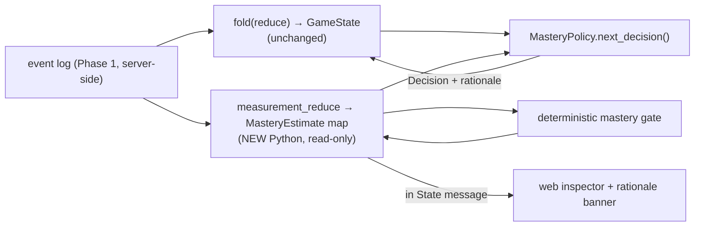
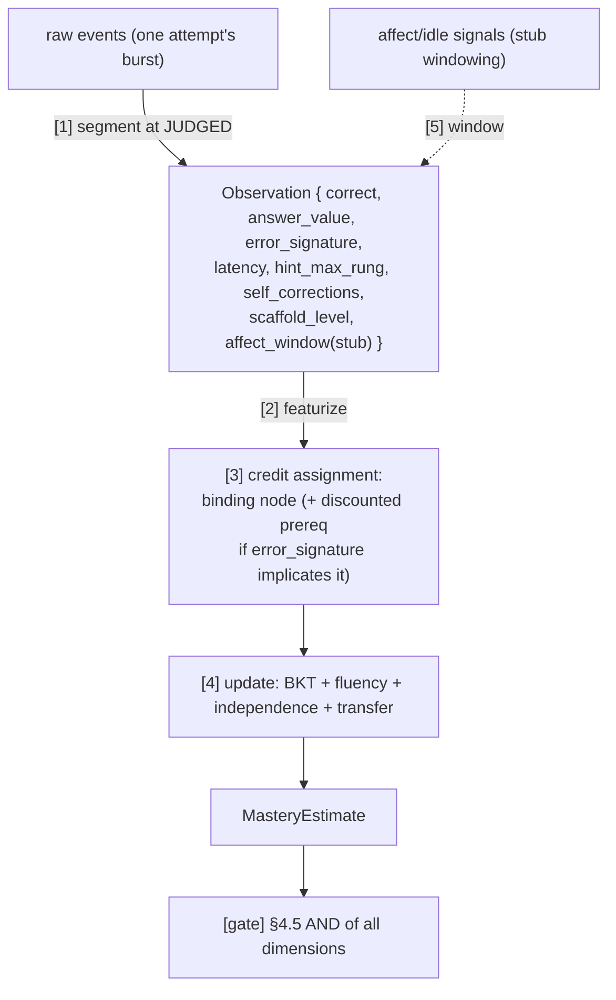
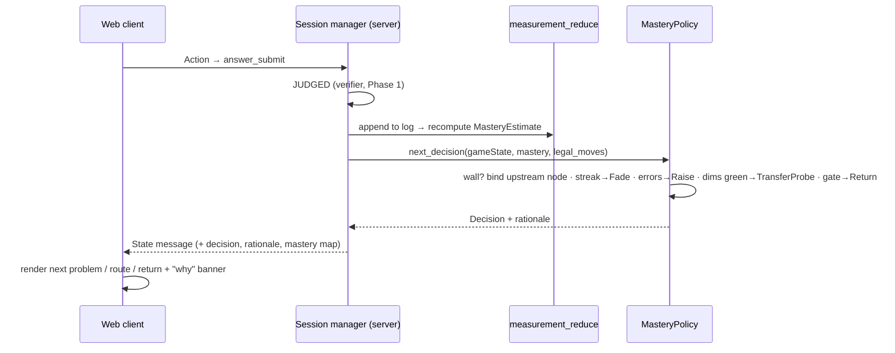

# feat: Mastery Estimation + Adaptive Game-State Flow

## Summary

Phase 2 of three. Turn the Phase-1 event log into a measured, per-skill estimate of what the
player knows, and use it to **drive the game's flow** — which room they're sent to, when
scaffolds fade, when they return to the kitchen — replacing Phase 1's `ScriptedPolicy` with a
mastery-driven `MasteryPolicy`.

This is additive by construction (Phase 1, KTD7): a new read-only **Python** fold over the
existing server-side event log produces a `MasteryEstimate` per node; a new `Policy`
implementation reads it; the deterministic **mastery gate** decides what is *learned*. The
engine call site, the server transport, the web render layer, the rooms, and the verifier are
untouched. Phase 2 is almost entirely Python (measurement + decision logic); the only web
additions are a rationale banner and a debug inspector, fed by extending the existing `State`
message.

The brain here is the **deterministic** policy from state-model §5.4 — **permanently**. The
LLM Tier-3 brain that earlier drafts deferred to Phase 3 is **cut from the product** (too
much scope, decided 2026-05-31). Two pieces from that line of thinking stay because they are
good determinism regardless of any LLM: legal-move enumeration and a recorded per-decision
rationale.

---

## Problem Frame

Phase 1 makes the game playable but "dumb": progression is a fixed script, so it can't tell a
child who *mastered* same-denominator addition from one who got lucky, can't route a
struggling child to the right upstream gap, and can't fade scaffolds when (and only when) the
child is ready. The `hyper_responsive_ui` brief's core demand is exactly this: "explain what
the learner can now do that they could not before," fade scaffolds and test transfer when
ready, and guard against false-positive mastery.

Phase 2 delivers that with a deterministic, inspectable model: BKT for accuracy plus fluency,
scaffold-independence, and transfer, AND-ed at a deterministic gate the system cannot fake.
Wall detection over those estimates picks the most-upstream unmastered skill; the policy
fades/raises scaffolds and routes rooms from the estimates. Everything is a pure fold + pure
decision function in Python, so it is replayable, testable, and (Phase 3) drivable by
synthetic personas on the same code path.

**What "done" looks like:** a child's playthrough produces a live `MasteryEstimate` per node;
a felt wall routes to the correct upstream room; scaffolds fade on a clean streak and
re-scaffold on errors; a node flips to MASTERED only when accuracy + independence + transfer
(+ soft fluency) all hold; a delayed retention probe can demote it. A debug inspector shows
every number and every routing rationale.

---

## Origin & Requirements Traceability

| Req | Source | Unit |
|-----|--------|------|
| R1 — Observation per attempt (segment burst at JUDGED) | measurement §4.7.4 step 1 | U1 |
| R2 — emission is a vector incl. answer + error_signature | measurement §4.7.4 step 2 | U1 |
| R3 — BKT accuracy: cold-start prior w/ prereq propagation; correct/incorrect update | measurement §4.1 | U2 |
| R4 — fluency (median latency, slope; soft pre-calibration) | measurement §4.2 | U3 |
| R5 — scaffold-independence (≥2 at L3+, hint-free) | measurement §4.3 | U3 |
| R6 — transfer (≥2 distinct surface_forms, hint-free, in band) | measurement §4.4 | U3 |
| R7 — `MasteryEstimate` interface | measurement §4.5 | U3 |
| R8 — deterministic mastery gate (LLM/heuristics cannot set it) | measurement §4.5; state-model §5.2 | U4 |
| R9 — decay / spaced retention probes | measurement §4.6 | U4 |
| R10 — credit assignment across the DAG | measurement §4.7.4 step 3 | U5 |
| R11 — wall detection + binding-skill diagnosis | state-model §5.3 | U6 |
| R12 — deterministic policy: route/fade/raise/transfer/return | state-model §3.1, §5.4 | U7 |
| R13 — Tier-2 nudges; rationale logging; orientation/churn counters | state-model §6, §7, §Success | U8 |
| R14 — affect never gates mastery; firewall preserved | measurement §4.5, §4.7.3, §6.1 | U3, U4 (by construction) |

---

## Key Technical Decisions

**KTD1 — `MasteryEstimate` is the only new interface; everything reads it.** Per node:
`{ P_known, fluency_stats, max_scaffold_passed, transfer_passed, hint_dependence,
last_retention_probe }` (Pydantic). Student state = `{ node_id → MasteryEstimate }` + a
short-term behavior buffer. Computed as a **pure Python fold over the Phase-1 log**
(`measurement_reduce`), parallel to game state, never mutating it (measurement §4.5).

**KTD2 — Ship the 2-state BKT floor, not the factorial HMM.** measurement §4.7 reserves a
richer factorial-HMM upgrade behind the same `MasteryEstimate`. Phase 2 builds the floor (BKT
+ three separate dimension trackers AND-ed at the gate). The upgrade is Phase-3+ and swaps
inference behind the interface — no consumer changes. (Avoids the brief's "mis-calibrated
sophisticated model hides uncertainty" trap; we can't calibrate the HMM without the harness's
synthetic data.)

**KTD3 — The gate is deterministic and reads only the knowledge signal.** Nothing — not a
heuristic, not (later) the LLM, not affect — can set MASTERED except the §4.5 gate. Affect is
a `Signal`; it can change pacing/support but never the gate (R14, the "affect firewall").
Phase 2 has no affect input yet, but the gate is built so it structurally cannot accept one.

**KTD4 — `MasteryPolicy` replaces `ScriptedPolicy` at the Phase-1 seam.** Same `Policy`
protocol, same boundary-only call site in the session manager (JUDGED → policy call). The
full state-model §5.1 `Decision` enum becomes live (`FadeScaffold`, `RaiseScaffold`,
`TransferProbe`, `RouteToRoom`, `ReturnToKitchen`, `PresentProblem`) — minus
`EscalateToHuman` (Phase 3). Swapping the policy is the moment flow becomes adaptive; no
server-route or web change.

**KTD5 — Every routing/pacing decision carries a recorded rationale.** A one-line reason per
decision, surfaced to the player ("why did this change") and logged (state-model §5.2
guardrail 4; counters the brief's "hiding uncertainty behind confident UI"). The `Decision`
already carries a rationale field from Phase 1; Phase 2 fills it meaningfully and the `State`
message forwards it (already wired) plus the `MasteryEstimate` map for the inspector.

**KTD6 — Legal-move enumeration is the policy's action space.** `legal_moves(state)` is a
pure function (state-model §5.2 guardrail 1) that defines exactly which decisions are valid
in a given state; `MasteryPolicy` chooses from it deterministically. Kept as clean,
inspectable determinism. (No LLM — it was cut for scope.)

**KTD7 — Parameters are explicit, defaulted, and centralized.** BKT `{P_T=0.20, P_S=0.10,
P_G=0.20}`, prereq weight `w=0.3`, prior clamp `[0.05,0.85]`, `P_known` clamp `[0.01,0.99]`,
gate `P_known ≥ 0.95`, wall `θ=0.6`, streak `k=3`, error `m=2`, fluency `N≥5`. One Python
config module so the Phase-3 harness can tune them without code changes (measurement §4.1).

**KTD8 — Build vs buy: buy the math, build the orchestration.** The BKT core is **pyBKT**,
not hand-rolled EM. Build only what is the asset with no good off-the-shelf fit: the
observation pipeline, the three non-BKT dimensions (trivial counters), the deterministic
gate, credit assignment, wall detection, and `MasteryPolicy`.

---

## High-Level Technical Design

### Two parallel folds over one log (the additive seam)

### The event → inference pipeline (measurement §4.7.4)

### The adaptive decision loop (per problem boundary, server-side)

---

## Implementation Units

### U1. Observation pipeline — segment + featurize (incl. error signatures)

**Goal:** Collapse each attempt's event burst into one `Observation` at the JUDGED boundary,
including the fingerprinted wrong-answer signature.

**Requirements:** R1, R2.

**Dependencies:** Phase 1 (event log, verifier, `error_signature`).

**Files:** `engine/model/observation.py`, `engine/model/featurizer.py`,
`tests/engine/model/test_observation.py`, `tests/engine/model/test_featurizer.py`.

**Approach:** `segment(log) -> list[Observation]`: group events between `problem_present` and
`judged` into one `Observation{correct, answer_value, error_signature, latency, hint_max_rung,
self_corrections, scaffold_level, affect_window}`. `latency` from present→submit timestamps;
`hint_max_rung` from `hint_shown` events; `self_corrections` from place/remove oscillation
within the attempt. `featurizer` reuses the Phase-1 `error_signature` (verifier) and adds
behavioral signatures (e.g. `too_fast_correct` when latency is below a plausible-compute
floor → forces a transfer probe per the false-positive guards). `affect_window` is a typed
stub (always empty in Phase 2) so the field exists for Phase 3.

**Patterns to follow:** measurement §4.7.4 (the five-step pipeline), §"False-positive
guards".

**Test scenarios:**
- A burst with N places + one correct submit → one Observation with `correct=True`,
  `scaffold_level` from the present event, `latency` = submit − present.
- `hint_max_rung` reflects the highest hint shown; H0 when none.
- Oscillation (place, remove, place) yields `self_corrections ≥ 1`.
- A wrong answer carries the verifier's `error_signature`.
- `too_fast_correct`: a correct answer below the latency floor is flagged.
- Segmentation is exact: two consecutive attempts → exactly two Observations (no bleed).

**Verification:** Replaying a Phase-1 playthrough log yields a clean Observation stream;
counts match attempt count.

---

### U2. BKT accuracy model

**Goal:** Per-node `P_known` with cold-start prior (prereq propagation → skip-ahead) and the
corrected correct/incorrect Bayesian update + learn step.

**Requirements:** R3.

**Dependencies:** U1; Phase-1 skill graph.

**Files:** `engine/model/bkt.py`, `engine/model/params.py`, `tests/engine/model/test_bkt.py`.

**Approach:** `params.py` centralizes `{P_L0,P_T,P_S,P_G}`, `w`, clamps (KTD7). Cold start:
`P_known = clamp(base_prior + Σ_prereqs w·(P_known(p) − 0.5), [0.05,0.85])`. Update:
- correct: `P = P_known·(1−S) / [P_known·(1−S) + (1−P_known)·G]`
- incorrect: `P = P_known·S / [P_known·S + (1−P_known)·(1−G)]`
- learn: `P_known' = P + (1−P)·T`, clamp `[0.01,0.99]`.
Pure function `bkt_update(prior, correct, params) -> posterior`. Use **pyBKT** (CAHLR — the
standard, maintained Python BKT library) for parameter fitting and as the validated
reference for the BKT math, rather than re-deriving EM; the per-attempt runtime update is a
3-line formula pinned to pyBKT's outputs in tests. The cold-start prereq propagation and the
4-dimension gate stay custom (pyBKT does single-skill BKT; the DAG propagation and the gate
are ours).

**Patterns to follow:** measurement §4.1 (verbatim equations; note the `(1−G)` incorrect
denominator).

**Test scenarios:**
- A strong prereq (`P_known(p)=0.85`) raises a child node's cold-start prior above its `P_L0`
  (skip-ahead); a weak prereq lowers it; result stays within `[0.05,0.85]`.
- One correct strictly increases `P_known`; one incorrect strictly decreases it (default
  params).
- Numeric check vs. hand-computed values for a known prior + sequence (prior 0.3, correct,
  correct → matches §4.1 to 1e-9).
- Clamps hold: repeated corrects approach but never reach 1.0; repeated incorrects never reach
  0.0.
- Update is pure and order-sensitive.

**Verification:** A scripted correct streak drives `P_known` monotonically toward the cap;
golden-value tests pin the math.

---

### U3. Fluency, scaffold-independence, transfer → `MasteryEstimate`

**Goal:** The other three dimensions and their assembly into the `MasteryEstimate` object.

**Requirements:** R4, R5, R6, R7, R14.

**Dependencies:** U1, U2.

**Files:** `engine/model/fluency.py`, `engine/model/independence.py`,
`engine/model/transfer.py`, `engine/model/mastery_estimate.py`,
`tests/engine/model/test_dimensions.py`.

**Approach:**
- **Fluency:** over the last `N≥5` correct, `median_latency ≤ age_band(skill)` AND latency
  slope `≤ ε`. `age_band` uncalibrated → **soft/advisory** flag (informs the policy, does not
  block the gate) per measurement §4.2.
- **Independence:** ≥2 correct at scaffold ≥L3 on ≥2 distinct problems, all `hint_rung==0`.
- **Transfer:** ≥2 correct on ≥2 structurally distinct `surface_form`s, low scaffold,
  `hint_rung==0`, latency in band.
- **hint_dependence:** fraction of recent corrects needing `hint_rung ≥ H2`.
- Assemble `MasteryEstimate`. **No affect term anywhere** (R14 firewall — assert in tests).

**Patterns to follow:** measurement §4.2–4.5; the L0–L6 scaffold ladder is the Phase-1 room
ladder ("L3+" = numbers-lead and beyond).

**Test scenarios:**
- Fluency needs ≥5 corrects before evaluating; with 4 it is `None`/not-OK.
- Two corrects at L3 on distinct problems hint-free → independent; one isn't enough; a hinted
  correct doesn't count.
- Two corrects on the *same* surface_form do **not** pass transfer; two distinct ones do.
- `hint_dependence` rises when recent corrects used H2+.
- `MasteryEstimate` is a pure fold result for a given Observation stream (replay-stable).
- Firewall: injecting affect signals into the stream does not change any `MasteryEstimate`
  field.

**Verification:** A full Observation stream yields a stable `MasteryEstimate` map; all four
dimensions independently unit-tested.

---

### U4. Mastery gate + decay / retention probes

**Goal:** The deterministic gate AND-ing the dimensions, plus spaced retention probes that can
demote a mastered node.

**Requirements:** R8, R9.

**Dependencies:** U3.

**Files:** `engine/model/gate.py`, `engine/model/decay.py`, `tests/engine/model/test_gate.py`,
`tests/engine/model/test_decay.py`.

**Approach:** `is_mastered(est) ⟺ P_known ≥ 0.95 AND independent AND transfer_passed AND
fluency_ok(soft pre-calibration)`. Pure predicate; no setter bypasses it (KTD3). `decay`:
schedule a low-scaffold, hint-free retention probe after a delay on a MASTERED node; failing
it clears `transfer_passed` and drops `P_known` below threshold, re-opening the node for the
next wall. Time is injected (a `now` parameter / clock) so it's deterministic, testable, and
resumable (no wall-clock calls inside the model).

**Patterns to follow:** measurement §4.5 (gate), §4.6 (decay).

**Test scenarios:**
- Gate passes only when all four conditions hold; flipping any one to false closes it.
- Pre-calibration, a failing soft-fluency does **not** block the gate; a (future) hard
  fluency would — assert the soft/hard switch via config.
- A scheduled probe becomes due after the injected delay; a failed probe demotes the node
  (`transfer_passed=False`, `P_known < 0.95`).
- A demoted node is eligible for wall routing again (integration with U6).
- No code path sets MASTERED without the gate (API/type-shape assertion).

**Verification:** Mastery flips on exactly at the gate condition; a delayed failed probe
demotes and re-opens the node.

---

### U5. Credit assignment across the DAG

**Goal:** Decide which node(s) an Observation updates when a wrong answer could implicate the
binding skill or a prerequisite.

**Requirements:** R10.

**Dependencies:** U2, U3; Phase-1 skill graph.

**Files:** `engine/model/credit_assignment.py`,
`tests/engine/model/test_credit_assignment.py`.

**Approach:** First-pass rule (measurement §4.7.4 step 3): update the **binding node** fully;
propagate a **discounted** update to a prerequisite **only** when the `error_signature`
implicates it (e.g. an unlike-denominator miss whose signature is "added the tops wrong"
implicates `ADD_SAME_DEN`; a count-shaped error implicates `COUNT`). Discount factor in
`params.py`. Correct answers credit the binding node (optional small prereq bump — config-
gated, default off to avoid inflation).

**Patterns to follow:** measurement §4.7.4 step 3; the room docs' error-signature names as the
implication map.

**Test scenarios:**
- A wrong `ADD_UNLIKE_DEN` answer with a same-denominator-arithmetic signature applies a full
  update to `ADD_UNLIKE_DEN` and a discounted update to `ADD_SAME_DEN`.
- The same wrong answer with a *re-cutting* signature updates only `ADD_UNLIKE_DEN`.
- A correct answer credits only the binding node by default.
- Discount factor applied exactly once, config-driven.
- Unknown/ambiguous signatures fall back to binding-node-only (no spurious propagation).

**Verification:** Signature-driven propagation matches the implication map; no double-credit.

---

### U6. Wall detection + binding-skill diagnosis

**Goal:** Detect when a recipe exceeds the child's current tools and pick the most-upstream
unmastered skill to route to.

**Requirements:** R11.

**Dependencies:** U2–U5; Phase-1 skill graph + kitchen recipes.

**Files:** `engine/model/wall.py`, `tests/engine/model/test_wall.py`.

**Approach:** For a recipe requiring skill set S: `predicted_success = Π_{s∈S} P_known(s)`;
`WALL_HIT ⟺ predicted_success < θ (0.6) OR an actual attempt fails`. `binding = the
most-upstream unmastered node in S` (deepest foundation first: COUNT before ADD_WHOLE before
ADD_SAME_DEN). Fluency is intentionally **not** in wall detection (it gates mastery, not
wall-firing). Pure functions over the `MasteryEstimate` map + graph.

**Patterns to follow:** state-model §5.3 (verbatim).

**Test scenarios:**
- A recipe needing two weak skills (`Π P_known < 0.6`) fires `WALL_HIT`; one needing only
  strong skills does not.
- An actual failed attempt fires `WALL_HIT` even when predicted_success ≥ θ.
- Binding selection returns the deepest unmastered prereq (with COUNT and ADD_SAME_DEN both
  weak, routes to COUNT first).
- A mastered prereq is skipped in binding selection.
- Threshold `θ` is config-driven (KTD7).

**Verification:** Walls fire on the designed recipes for a weak profile and stay silent for a
strong one; binding picks the right upstream node.

---

### U7. `MasteryPolicy` — route / fade / raise / transfer / return (the flow driver)

**Goal:** Replace `ScriptedPolicy` with the deterministic mastery-driven policy that decides
the next move at each problem boundary, driving the game's flow from estimates.

**Requirements:** R12, KTD4, KTD5, KTD6.

**Dependencies:** U4, U6; Phase-1 `Policy` protocol + scaffold ladder + session manager.

**Files:** `engine/policy/mastery.py`, `engine/policy/legal_moves.py`,
`engine/policy/scaffold.py`, `server/session_manager.py` (swap the installed policy),
`tests/engine/test_mastery_policy.py`.

**Approach:** `legal_moves(game_state, mastery)` enumerates allowed `Decision`s (KTD6).
`MasteryPolicy.next_decision` (state-model §5.4):
- route to the most-upstream unmastered prereq of the blocked skill (U6);
- `FadeScaffold` after a correct streak `k=3` at the current level with latency in band and
  `hint_rung==0` (scaffold step-down, §3.1);
- `RaiseScaffold` after `m=2` errors or a stall — **preserving the child's work**;
- `TransferProbe` when the other dimensions are green but transfer isn't;
- `ReturnToKitchen` on mastery, onto the exact stumping recipe;
- scaffold **entry**: L0 on first entry, else one below `max_scaffold_passed` (floored at L0).
Every decision returns a one-line **rationale** (KTD5). The session manager installs
`MasteryPolicy` in place of `ScriptedPolicy`; the call site (JUDGED boundary) is unchanged.

**Patterns to follow:** state-model §3.1 (scaffold transitions), §5.4 (policy shape), §5.1
(`Decision` enum minus `EscalateToHuman`).

**Test scenarios:**
- 3 clean corrects (in-band, hint-free) at a level → `FadeScaffold`; a hinted correct breaks
  the streak.
- 2 errors → `RaiseScaffold` and the child's in-progress work is retained in state (not
  reset).
- Dimensions green except transfer → `TransferProbe` with a distinct surface_form.
- Gate passes → `ReturnToKitchen{recipe}` for the stumping recipe.
- Re-entry to a room starts one level below `max_scaffold_passed`, floored at L0.
- Every returned `Decision` includes a non-empty rationale string.
- `MasteryPolicy` emits only moves present in `legal_moves` for that state (no illegal move).
- Swap test: installing `MasteryPolicy` instead of `ScriptedPolicy` requires no change to the
  session-manager call site or the web client (same protocol).

**Verification:** A weak-profile session routes upstream, fades on streaks, re-scaffolds on
errors, and returns on mastery — all from estimates, with rationales logged.

---

### U8. Tier-2 nudges, rationale surfacing, and the mastery inspector

**Goal:** Wire the adaptive policy into the live session; add Tier-2 heuristic nudges, the
player-facing "why did this change" rationale, and a debug inspector for the estimates —
covering the brief's counter-metrics (orientation, UI churn, dependence).

**Requirements:** R13, KTD5.

**Dependencies:** U7; Phase-1 HUD, session flow, and `State` message.

**Files:** `engine/tier2.py`, `server/ws.py` (extend `State` with the mastery map),
`web/src/ui/RationaleBanner.tsx`, `web/src/ui/MasteryInspector.tsx`,
`web/src/client/useMastery.ts`, `tests/engine/test_tier2.py`,
`tests/e2e/adaptive_flow.spec.ts`.

**Approach:** Tier-2 (deterministic, seconds-latency, *nudge only*, never restructures the
workspace — state-model §6/§7): long pause → offer next hint rung; place/remove oscillation →
gentle "take your time" prompt; too-fast-correct → queue a `TransferProbe`. These read the
recent-behavior buffer (incl. signals) and emit hints/prompts, **not** state changes. The
server extends the `State` message with the `MasteryEstimate` map (read-only) for the
inspector. `useMastery` exposes that map to React. `RationaleBanner` shows the latest
decision's reason; `MasteryInspector` (dev-only) lists per-node `P_known`, the four
dimensions, mastered/not, and the decision log — the inspectable-fold requirement and the
counter-metrics surface.

**Patterns to follow:** state-model §6 (tier table), §7 (stability: T2 nudges only, T3 at
boundaries only), §Success counter-metrics (UI churn, orientation, dependence).

**Test scenarios:**
- (engine) Long pause triggers a hint-rung offer (Tier-2) without changing game state.
- (engine) Oscillation triggers the "take your time" prompt once, not per wiggle.
- (engine) Too-fast-correct queues a transfer probe at the next boundary.
- (web) `RationaleBanner` always reflects the most recent decision's rationale string.
- (web) Inspector shows live per-node numbers matching a direct `measurement_reduce(log)` (no
  drift between UI and model).
- (e2e) Adaptive flow: a scripted **weak** persona's inputs route upstream and re-scaffold; a
  scripted **strong** persona's inputs skip ahead and fade fast; both reach a defended
  MASTERED on ≥2 skills (the brief's primary success criterion).
- (e2e) Counter-metric guard: T3 decisions per session are counted; the policy doesn't churn
  (no decision change mid-attempt; boundary-only).

**Verification:** Playing weak vs. strong inputs visibly changes routing and fade; the
inspector matches the model; rationales appear on every change.

---

## Scope Boundaries

### In scope (Phase 2)
The observation/featurizer pipeline, BKT + the three other dimensions, the deterministic gate
+ decay, DAG credit assignment, wall detection, the deterministic `MasteryPolicy`
(routing/fade/raise/transfer/return), Tier-2 nudges, player-facing rationale, and the mastery
inspector. All as pure Python folds + pure decisions over the Phase-1 log, plus two read-only
web overlays.

### Deferred to Phase 3 / Outside these two plans
- **LLM Tier-3 brain — CUT (too much scope, 2026-05-31), not deferred.** The deterministic
  `MasteryPolicy` is the brain. Legal-move enumeration and per-decision rationale are kept as
  good determinism, not as an LLM cage. (Removing the LLM also removes its content-
  correctness/latency risk and the "does the LLM give away answers" harness job.)
- **Affect/attention camera** (measurement §6.1): `affect_window` and the `Signal` class
  exist; Phase 3 buys **MorphCast** (browser-native, on-device — no video leaves the device,
  which fits a kids' privacy bar), corroborated before action, never gating mastery.
- **Voice + handwriting recognition**: the `modality` field exists; Phase 3 buys both — voice
  via the browser **Web Speech API** (then a cloud TTS for a warmer voice), handwriting math
  via **MyScript iink** or **Mathpix**, not custom ML.
- **Synthetic-challenger harness** (state-model §8): the headless Python engine + `actor`
  field + pure folds make personas drivable on the same code path; the harness, persona
  library, parameter calibration (measurement §4.7.5), and overfit guard are Phase 3.
- **Human escalation** (state-model §5.5): triggers depend on affect/disengagement signals
  not present until Phase 3.
- **Factorial-HMM upgrade** (measurement §4.7): swaps inference behind `MasteryEstimate`;
  needs the harness for calibration.

### Deferred to Follow-Up Work (plan-local)
Fluency `age_band` calibration (stays soft until a pilot — measurement Open Q1), persisted
cross-session mastery storage, and tuning of the centralized parameters against real or
synthetic data.

---

## Risks & Mitigations

- **False-positive mastery (the brief's core risk).** *Mitigation:* multi-dimensional gate
  with ≥2-observation independence/transfer requirements (U3/U4) and delayed retention probes
  (U4) that make the false-positive rate measurable, not hypothetical.
- **Uncalibrated parameters look confident but aren't.** *Mitigation:* KTD7 centralizes them;
  fluency stays soft pre-calibration (R4); the factorial HMM is deferred until the harness can
  calibrate it (KTD2) — directly avoiding the brief's "mis-calibrated model hides
  uncertainty" failure.
- **Credit-assignment mis-blame across the DAG.** *Mitigation:* conservative default
  (binding-node-only unless the error_signature implicates a prereq — U5); validated by the
  harness later.
- **UI churn / disorientation from adaptive changes.** *Mitigation:* T3 only at boundaries, T2
  nudges only, a stable key visual (state-model §7); churn + orientation counters in the
  inspector (U8).
- **Seam regressions vs. Phase 1.** *Mitigation:* `MasteryPolicy` honors the exact `Policy`
  protocol and boundary-only call site; a swap test asserts no session-manager/web change
  (U7).

---

## Open Questions (resolve at execution; some need Phase 3 data)

1. Fluency `age_band` per skill — uncalibrated; soft gate until a pilot (measurement Open Q1).
   Not blocking.
2. Credit-assignment discount factor and the exact error_signature→prereq implication map —
   first-pass values now; validate with the synthetic harness (Phase 3).
3. Transfer-form library size per node before the gate is trustworthy (measurement Open Q4) —
   the synthetic memorizer persona is the eventual test.
4. Retention-probe delay schedule — pick reasonable defaults now; tune later.
5. Which behavioral signals Tier-2 acts on before affect exists — start with idle,
   oscillation, too-fast-correct (all derivable from the Phase-1 action log).
