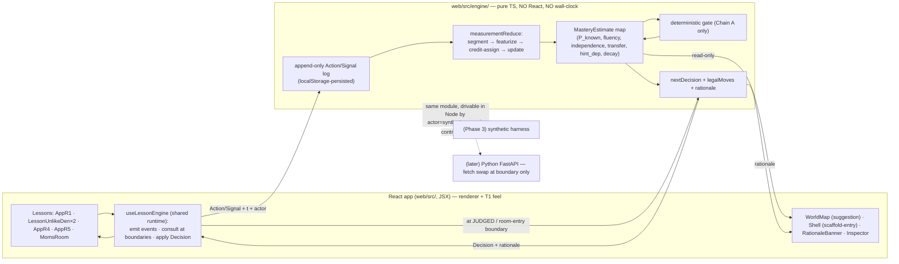
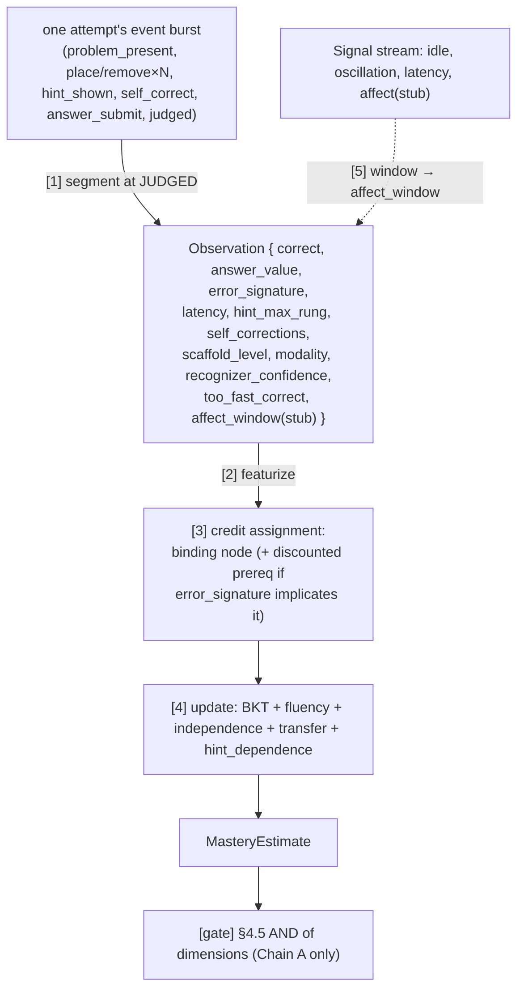
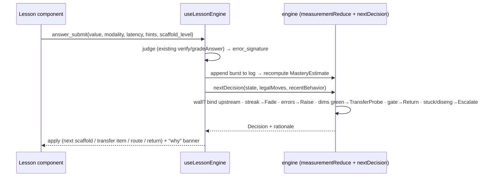

# feat: Knowledge-Prediction Engine + Adaptive Lesson Flow

## Summary

Add a **deeply integrated, multi-input knowledge-prediction engine** that measures, per
skill, what the child actually knows — and let it **drive the lesson flow**: which room is
suggested next, when scaffolds fade or re-raise inside a lesson, when a transfer probe
fires, when the child is routed upstream to a binding gap, and when they return to the
kitchen. It replaces today's single binary `{ mastered: [roomId] }` flag and the ad-hoc
MomsRoom look-ahead with a real per-skill `MasteryEstimate`.

The engine is a **pure, headless TypeScript module** (`web/src/engine/`, zero React imports)
that folds an append-only **Observation/Signal log** → a `MasteryEstimate` map → a
`Decision`. It is consumed by the existing client-side React app at problem/lesson
boundaries — no backend. The measurement model is built at **full fidelity** to the design
docs: BKT accuracy with cold-start prerequisite propagation, fluency, scaffold-independence,
transfer, a deterministic AND-gate, decay/retention probes, DAG credit assignment, wall
detection, a deterministic policy with legal-move enumeration, recorded rationale, and
deterministic human-escalation.

### Architecture reconciliation (why this plan was rewritten 2026-06-01)

The original 002 (and its parent 001) assumed a **Python engine + FastAPI/WebSocket server +
server-side append-only event log**, with Phase 2 as a "read-only Python fold over the log"
and a one-line `ScriptedPolicy → MasteryPolicy` swap. **None of that was built.** A 2026-06-01
audit found the live app is a pure client-side **Vite + React (JSX)** app under `web/` with
no backend, no server, no event log, and no `Policy` seam — an intentional *frontend-first*
build. The measurement *intent* is still exactly right; the *mechanism* is re-expressed for
the real architecture.

**The protective seam is the `Observation → MasteryEstimate/Decision` contract, not the
runtime.** Building it as the future wire-DTO set means relocating the engine behind a Python
FastAPI backend later (if the at-scale synthetic harness or cross-device profiles ever demand
it) is a `fetch` swap at a handful of boundary call sites — with zero churn to the measurement
math or the lesson components. In-process TypeScript is the easiest start (synchronous, matches
the frontend's existing flow) and forecloses none of the design's ambitions; several of them
(on-device affect camera, voice, handwriting) are browser-native and *more* natural client-side.

**This plan keeps every deferred ambition reachable** (the explicit ask: "make it so we can
complete all of the ambitions set out here"). Each Phase-3 ambition swaps behind a seam built
now — see [Seams Preserved](#seams-preserved-all-ambitions-stay-reachable).

**What "done" looks like:** a child's play produces a live per-node `MasteryEstimate` from
many inputs (not just right/wrong); a felt wall in the kitchen routes to the correct upstream
room; scaffolds fade on a clean streak and re-raise on errors *inside* a lesson while
preserving the child's work; a node flips to MASTERED only when accuracy + independence +
transfer (+ soft fluency) all hold; a delayed retention probe can demote it; the world map
suggests the right next lesson; every flow change carries a child-visible "why"; and a dev
inspector shows every number. All current rooms remain fully playable.

---

## Problem Frame

Today the app is "dumb" about the learner: progress is a binary per-room flag set by a single
kitchen check, lesson scaffold level is chosen manually or by blind auto-advance, and every
rich signal the lessons already compute — star tiers, `slip` codes, correctness — is thrown
away after rendering banter (`unlikeDenMath.verify()`, `momsProblems.gradeAnswer()`). So the
app cannot tell a child who *mastered* a skill from one who got lucky, cannot fade scaffolds
when (and only when) the child is ready, and cannot route a struggling child to the right
upstream gap.

The `hyper_responsive_ui` brief's core demand is exactly this: "explain what the learner can
now do that they could not before," fade scaffolds and test transfer when ready, and guard
against **false-positive mastery**. The measurement design answers it with a multi-dimensional
gate the system cannot fake. This plan delivers that on the real client-side app, with the
prediction wired in **deeply** (authoritative over flow) and fed by **as many inputs as the
frontend can produce**.

**Non-negotiable constraint:** maintain current functionality. The integration is a larger
refactor (sanctioned by the user), but every room must stay playable throughout. Since the
repo has **no test harness today**, the integration phase is characterization-first.

---

## Origin & Requirements Traceability

| Req | Source | Unit |
|-----|--------|------|
| R1 — Append-only Action/Signal event log; state = pure fold; replayable | state-model §"core thesis", §1.1 | U1 |
| R2 — Observation per attempt (segment burst at JUDGED) | measurement §1.1, §4.7.4 step 1 | U2 |
| R3 — Emission is a **rich vector** (answer_value, error_signature, latency, hint rung, self-corrections, scaffold level, modality, recognizer confidence, affect_window) — "as many inputs as we can" | measurement §4.7.4 step 2; user 2026-06-01 | U2 |
| R4 — BKT accuracy: cold-start prior w/ prereq propagation; corrected correct/incorrect update | measurement §4.1 | U3 |
| R5 — fluency (median latency, slope; soft pre-calibration) | measurement §4.2 | U4 |
| R6 — scaffold-independence (≥2 at L3+, hint-free) | measurement §4.3 | U4 |
| R7 — transfer (≥2 distinct surface_forms, hint-free, in band) | measurement §4.4 | U4 |
| R8 — `MasteryEstimate` is the stable interface | measurement §4.5 | U4 |
| R9 — deterministic mastery gate (nothing else can set MASTERED) | measurement §4.5; state-model §4/§5.2 | U5 |
| R10 — decay / spaced retention probes | measurement §4.6 | U5 |
| R11 — credit assignment across the DAG | measurement §4.7.4 step 3 | U6 |
| R12 — wall detection + binding-skill diagnosis | state-model §5.3 | U7 |
| R13 — deterministic policy: route/fade/raise/transfer/return; legal-move enumeration; rationale | state-model §5.1, §5.2, §5.4 | U8 |
| R14 — human escalation (deterministic triggers; handoff packet) | state-model §5.5 | U8 |
| R15 — affect never gates mastery; firewall preserved structurally | measurement §4.5, §4.7.3, §6.1 | U2, U4, U5 (by construction) |
| R16 — engine is consulted only at problem/lesson **boundaries**, never mid-attempt | state-model §2, §7 premise 5 | U9, U10 |
| R17 — prediction **drives** lesson flow (in-lesson scaffold, transfer probe, routing, suggestion) — deep, not advisory | user 2026-06-01; state-model §3.1, §5 | U10, U11 |
| R18 — Tier-2 nudges; player-facing rationale; counter-metrics inspector (churn, orientation, dependence) | state-model §6, §7, §Success | U12 |
| R19 — maintain current functionality across the refactor (playability net; no regressions) | user 2026-06-01 | U12 (net), all of Phase B |

---

## Key Technical Decisions

**KTD1 — Headless TypeScript engine in the browser; the `Observation → MasteryEstimate/Decision`
contract is the asset.** `web/src/engine/` is a pure module with **no React imports** and no
wall-clock/`Date.now()` inside the fold. Its public types and functions ARE the future wire
DTOs, so a Python FastAPI relocation is a `fetch` swap at the U11 boundary call sites only —
zero churn to the math or the lessons. (Replaces old 002's "Python fold over a server event
log"; that server never existed.)

**KTD2 — Ship the 2-state BKT floor; reserve the factorial-HMM upgrade behind `MasteryEstimate`.**
Build BKT + three separate dimension trackers AND-ed at the gate. The richer factorial-HMM
(misconception state, vector emission, strategy/engagement chains — measurement §4.7) swaps
inference behind the same interface later. We cannot calibrate the HMM without the synthetic
harness's data (measurement §4.7.5), and shipping a mis-calibrated sophisticated model is the
brief's exact "hide uncertainty behind confident UI" trap.

**KTD3 — Maximize the emission: every available input feeds the prediction.** The `Observation`
vector carries `{ correct, answer_value, error_signature, latency, hint_max_rung,
self_corrections, scaffold_level, modality, recognizer_confidence, too_fast_correct,
affect_window }`. This is both the false-positive guard surface (latency floor, hint-free
requirement, signature fingerprinting) AND the factorial-HMM-ready emission. `affect_window`
is a typed stub (always empty now) so the field exists for the on-device camera later.

**KTD4 — The gate is deterministic and reads only the knowledge signal (Chain A).** Nothing —
not a heuristic, not affect, not the policy — can set MASTERED except the §4.5 gate. Affect is
a `Signal`; it changes pacing/support but never the gate (R15, the "affect firewall"), and the
gate is built so it structurally cannot accept an affect term (asserted in tests).

**KTD5 — The prediction drives flow deeply (authoritative), via a shared lesson runtime.**
A `useLessonEngine` hook is the backbone every lesson adopts: it emits the full event burst per
attempt, persists the log, consults the engine at boundaries, and applies the returned
`Decision` — including **in-lesson** `FadeScaffold`/`RaiseScaffold`/`TransferProbe`, plus
cross-lesson routing/return/suggestion. This is the "deeply integrated … helps drive the lesson"
requirement (R17). Advisory-only was explicitly rejected.

**KTD6 — Engine consulted only at boundaries; T1 feel stays client-side and untouched.** The
policy is called at the `JUDGED → decision` boundary (and on room entry), never mid-attempt
(R16; state-model §7). The existing instant snap/glow/shake and intra-attempt manipulation
remain pure client-side UI. The frontend stays the renderer and source of feel — we are NOT
adopting plan 001's server-authoritative render loop.

**KTD7 — Legal-move enumeration is the policy's action space.** `legalMoves(state)` is a pure
function (state-model §5.2 guardrail 1) defining exactly which `Decision`s are valid in a given
state; the policy chooses from it deterministically; an empty/invalid choice falls back safely.

**KTD8 — Every routing/pacing decision carries a recorded rationale.** A one-line reason per
decision, surfaced to the child ("why did this change") and logged (state-model §5.2 guardrail
4) — the direct counter to "hiding uncertainty behind confident UI."

**KTD9 — Time and actor are data on events; the fold is pure and replayable.** Each event
carries an injected timestamp `t` and `actor ∈ {human, "synthetic:" + persona}`. No
wall-clock call lives inside the engine, so the same fold is replayable, resumable, and
(Phase 3) drivable headlessly by synthetic personas on the identical code path.

**KTD10 — Parameters are explicit, defaulted, and centralized.** BKT `{P_T=0.20, P_S=0.10,
P_G=0.20}`, prereq weight `w=0.3`, prior clamp `[0.05,0.85]`, `P_known` clamp `[0.01,0.99]`,
gate `P_known ≥ 0.95`, wall `θ=0.6`, fade streak `k=3`, error/raise `m=2`, fluency `N≥5`,
escalation `N_stuck=6`/`N_diseng`. One config module so the Phase-3 harness can tune them
without code changes (measurement §4.1, §4.7.5).

**KTD11 — Skill graph is data, mapped to the ACTUAL rooms.** The idealized DAG maps onto the
live `web/src/rooms.js`: `r1` `ADD_SAME_DEN` (AppR1) → `r3` `ADD_UNLIKE_NESTED` ("Scale One",
LessonUnlikeDen) → `r2` `ADD_UNLIKE_COPRIME` ("Cross-Multiply", LessonUnlikeDen) → {`r4`
`SIMPLIFY` (AppR4), `r5` `IMPROPER_TO_MIXED` (AppR5)}; MomsRoom is the kitchen/wall surface.
Each `SkillNode` carries `roomId` so routing and suggestion drive the existing WorldMap/Shell
with no string-list to widen.

**KTD12 — No off-the-shelf math library; the BKT update is a 3-line formula in TS.** pyBKT
(old 002 KTD8) is dropped — there is no Python runtime, and pyBKT's value was offline parameter
*fitting*, which is the synthetic harness's job (deferred). Exact rational arithmetic reuses the
app's existing helpers (`unlikeDenMath.js` `gcd/lcm/lcd/exactSum`); build only the asset
(observation pipeline, the dimensions, gate, credit assignment, wall, policy).

**KTD13 — Larger refactor, characterization-first; no playability regression.** Extracting the
shared lesson runtime restructures each lesson's flow-relevant state. Because the repo has no
tests today, Phase B lands a Vitest + Playwright/`/browse` playability net **first** (U12's net
is pulled forward as a guard), and each lesson is migrated behind it (R19).

---

## High-Level Technical Design

### The single fold (the additive seam, now client-side)



### The event → inference pipeline (measurement §4.7.4; rich emission per KTD3)



### The adaptive decision loop (per problem/lesson boundary, in-browser)



---

## Output Structure

```
web/src/engine/                  # pure TS — NO React imports, NO wall-clock
  index.ts                       # public API = the future wire contract (DTOs + entry fns)
  types.ts                       # Event(Action|Signal), Observation, MasteryEstimate, Decision, SkillNode
  params.ts                      # all tunables (KTD10), centralized for the harness
  log.ts                         # append-only log + localStorage persistence adapter + migration
  graph.ts                       # skill DAG mapped to real room ids (KTD11)
  observation.ts                 # [1] segment + [2] featurize (rich emission, error_signature)
  bkt.ts                         # [4a] accuracy: cold-start propagation + update
  dimensions.ts                  # [4b] fluency + independence + transfer + hint_dependence
  mastery.ts                     # MasteryEstimate assembly (affect firewall)
  gate.ts                        # deterministic AND-gate (Chain A only)
  decay.ts                       # spaced retention probes (injected clock)
  credit.ts                      # [3] DAG credit assignment + implication map
  wall.ts                        # wall detection + binding diagnosis
  policy.ts                      # nextDecision + legalMoves + rationale + escalation
  measurementReduce.ts           # the whole fold: log → MasteryEstimate map
web/src/runtime/
  useLessonEngine.js             # shared lesson runtime backbone (KTD5)
  scaffoldMap.js                 # per-lesson beat/stage → design L0–L4 mapping
web/src/ui/
  RationaleBanner.jsx            # "why did this change"
  MasteryInspector.jsx           # dev-only: per-node numbers + decision log + counter-metrics
tests/                           # NEW (no harness today): Vitest unit + Playwright/e2e smoke
  engine/*.test.ts
  runtime/*.test.js
  e2e/adaptive_flow.spec.js
```

Per-unit **Files** lists are authoritative; the tree is a scope declaration.

---

## Implementation Units

> **Phase A (U1–U8): the pure headless engine** — TDD-natural (pure functions). No frontend
> change; nothing user-visible yet.
> **Phase B (U9–U12): deep integration** — characterization-first; maintain functionality (R19).

### U1. Engine scaffold — toolchain, types, log, params, skill graph

**Goal:** Stand up `web/src/engine/` (TS) with the event log, the core type contract, the
centralized params, and the real-rooms skill graph; add the missing test toolchain.

**Requirements:** R1, R8 (interface shape), KTD1, KTD9, KTD10, KTD11.

**Dependencies:** none.

**Files:** `web/src/engine/index.ts`, `web/src/engine/types.ts`, `web/src/engine/params.ts`,
`web/src/engine/log.ts`, `web/src/engine/graph.ts`, `web/tsconfig.json` (new, engine-scoped),
`web/package.json` (add `typescript`, `vitest` devDeps + `test` script), `web/vite.config.js`
(vitest config), `tests/engine/test_log.test.ts`, `tests/engine/test_graph.test.ts`.

**Approach:** Define `Action{type, payload, modality, t, actor}` and `Signal{type, payload,
confidence, t, actor}`; `Event = Action | Signal`. `MasteryEstimate = { P_known, fluency_stats,
max_scaffold_passed, transfer_passed, hint_dependence, last_retention_probe }`. `Decision` union
(see U8). `SkillNode { id, roomId, prereqs[], scaffold_ladder, transfer_forms[], bkt_params }`.
`graph.ts` encodes the five real nodes (KTD11) with edges `ADD_SAME_DEN → ADD_UNLIKE_NESTED →
ADD_UNLIKE_COPRIME → {SIMPLIFY, IMPROPER_TO_MIXED}`. `log.ts`: in-memory append-only array + a
localStorage adapter (`moms-engine-log-v1`) and a one-time migration that reads the existing
`moms-kitchen-progress-v1` `{ mastered: [...] }` and seeds synthetic "mastered" priors so
existing players don't reset. Vite compiles `.ts` natively; tsconfig scopes strict typing to
the engine dir, leaving the JSX app untouched.

**Patterns to follow:** measurement §1.1 event taxonomy; state-model §1 `SkillNode` shape;
existing `web/src/rooms.js` ids and `web/src/kitchenProgress.js` storage key.

**Test scenarios:**
- Appending an Action then folding twice yields identical results (replay determinism, R1).
- A `Signal` is present in the log but is a no-op on any game-state projection (R1/R15).
- `graph.ts`: `ADD_UNLIKE_COPRIME.prereqs` includes `ADD_UNLIKE_NESTED`; every node's `roomId`
  resolves to an id present in `rooms.js`.
- Migration: a pre-existing `{ mastered:["r1"] }` seeds `r1`'s node with a high prior; absence
  seeds the cold-start default.
- `params.ts` values match KTD10 exactly; no wall-clock import exists anywhere under `engine/`.

**Verification:** `npm run test` runs (Vitest green); `npm run build` still succeeds; the app
still boots unchanged (`npm run dev`).

---

### U2. Observation pipeline — segment + rich featurize (incl. error signatures)

**Goal:** Collapse each attempt's event burst into one rich `Observation` at the JUDGED
boundary, capturing **every available input** and the fingerprinted wrong-answer signature.

**Requirements:** R2, R3, R15 (affect_window is a stub; no affect in the vector that the gate
reads).

**Dependencies:** U1.

**Files:** `web/src/engine/observation.ts`, `tests/engine/test_observation.test.ts`.

**Approach:** `segment(log) -> Observation[]` groups events between `problem_present` and
`judged` into one `Observation{ correct, answer_value, error_signature, latency, hint_max_rung,
self_corrections, scaffold_level, modality, recognizer_confidence, too_fast_correct,
affect_window }`. `latency` from present→submit timestamps (event `t`, KTD9). `hint_max_rung`
from `hint_shown` events (H0 when none). `self_corrections` from place/remove oscillation within
the attempt. `error_signature` standardizes the misconception taxonomy from the room docs
(`add_denominators` for 2/7+3/7→5/14; `add_across_unlike` for 1/2+1/3→2/5; `scaled_bottom_only`;
`forced_leftover`; `not_simplified`) — fed by the existing `slip` codes
(`momsProblems.gradeAnswer`) and `verify` results, mapped in one place. `too_fast_correct` flags
a correct answer below a plausible-compute latency floor (forces a transfer probe — false-positive
guard). `recognizer_confidence` comes from the handwriting recognizer when `modality==="handwriting"`.
`affect_window` is a typed-empty stub now.

**Patterns to follow:** measurement §4.7.4 (the five-step pipeline) and "False-positive guards";
existing `slip` codes in `web/src/momsProblems.js`; existing `verify()` in `web/src/unlikeDenMath.js`.

**Test scenarios:**
- A burst with N places + one correct submit → one Observation, `correct=true`, `scaffold_level`
  from the present event, `latency = submit − present`.
- `hint_max_rung` reflects the highest `hint_shown`; H0 when none.
- Oscillation (place, remove, place) → `self_corrections ≥ 1`.
- A wrong 2/7+3/7→5/14 → `error_signature="add_denominators"`; 1/2+1/3→2/5 → `add_across_unlike`.
- `too_fast_correct`: a correct answer below the latency floor is flagged.
- Segmentation is exact: two consecutive attempts → exactly two Observations (no bleed).
- A `handwriting` modality attempt carries a non-null `recognizer_confidence`; a `tap` attempt
  carries null.

**Verification:** Replaying a recorded play burst yields a clean Observation stream; counts match
attempt counts.

---

### U3. BKT accuracy model

**Goal:** Per-node `P_known` with cold-start prereq propagation (→ skip-ahead) and the corrected
correct/incorrect Bayesian update + learn step.

**Requirements:** R4.

**Dependencies:** U1.

**Files:** `web/src/engine/bkt.ts`, `tests/engine/test_bkt.test.ts`.

**Approach:** Cold start: `P_known = clamp(base_prior + Σ_prereqs w·(P_known(p) − 0.5),
[0.05,0.85])`. Update (measurement §4.1, verbatim — note the `(1−G)` incorrect denominator):
correct `P = P_known·(1−S) / [P_known·(1−S) + (1−P_known)·G]`; incorrect `P = P_known·S /
[P_known·S + (1−P_known)·(1−G)]`; learn `P_known' = P + (1−P)·T`, clamp `[0.01,0.99]`. Pure
`bktUpdate(prior, correct, params) -> posterior`. The DAG cold-start propagation stays custom
(single-skill BKT has no notion of it). No external lib (KTD12).

**Patterns to follow:** measurement §4.1 (verbatim equations).

**Test scenarios:**
- A strong prereq (`P_known(p)=0.85`) raises a child node's cold-start prior above its `P_L0`
  (skip-ahead); a weak prereq lowers it; result stays within `[0.05,0.85]`.
- One correct strictly increases `P_known`; one incorrect strictly decreases it.
- Numeric golden check vs. hand-computed values (prior 0.3, correct, correct → matches §4.1 to 1e-9).
- Clamps hold: repeated corrects approach but never reach 1.0; repeated incorrects never reach 0.0.
- `bktUpdate` is pure and order-sensitive.

**Verification:** A scripted correct streak drives `P_known` monotonically toward the cap;
golden-value tests pin the math.

---

### U4. Fluency, scaffold-independence, transfer, hint-dependence → `MasteryEstimate`

**Goal:** The other three dimensions plus hint-dependence, and their assembly into the
`MasteryEstimate` — with the affect firewall enforced structurally.

**Requirements:** R5, R6, R7, R8, R15.

**Dependencies:** U2, U3.

**Files:** `web/src/engine/dimensions.ts`, `web/src/engine/mastery.ts`,
`tests/engine/test_dimensions.test.ts`.

**Approach:**
- **Fluency:** over the last `N≥5` correct, `median_latency ≤ age_band(skill)` AND latency slope
  `≤ ε`. `age_band` uncalibrated → **soft/advisory** (informs policy, does not block the gate)
  per measurement §4.2; a config switch flips it to hard once calibrated.
- **Independence:** ≥2 correct at scaffold ≥L3 on ≥2 distinct problems, all `hint_rung==0`.
- **Transfer:** ≥2 correct on ≥2 structurally distinct `surface_form`s, low scaffold,
  `hint_rung==0`, latency in band.
- **hint_dependence:** fraction of recent corrects needing `hint_rung ≥ H2`.
- Assemble `MasteryEstimate`. **No affect term anywhere** (R15 firewall — assert in tests).

**Patterns to follow:** measurement §4.2–4.5; the design L0–L4 scaffold scale (U9/scaffoldMap maps
each lesson's beats onto it).

**Test scenarios:**
- Fluency needs ≥5 corrects before evaluating; with 4 it is `null`/not-OK.
- Two corrects at L3 on distinct problems hint-free → independent; one isn't enough; a hinted
  correct doesn't count.
- Two corrects on the *same* surface_form do **not** pass transfer; two distinct ones do.
- `hint_dependence` rises when recent corrects used H2+.
- `MasteryEstimate` is a pure fold result for a given Observation stream (replay-stable).
- Firewall: injecting affect `Signal`s into the stream changes no `MasteryEstimate` field.

**Verification:** A full Observation stream yields a stable `MasteryEstimate` map; all four
dimensions independently unit-tested.

---

### U5. Mastery gate + decay / retention probes

**Goal:** The deterministic gate AND-ing the dimensions (no setter bypass), plus spaced retention
probes that can demote a mastered node.

**Requirements:** R9, R10, R15.

**Dependencies:** U4.

**Files:** `web/src/engine/gate.ts`, `web/src/engine/decay.ts`, `tests/engine/test_gate.test.ts`,
`tests/engine/test_decay.test.ts`.

**Approach:** `isMastered(est) ⟺ P_known ≥ 0.95 AND independent AND transfer_passed AND
fluency_ok(soft)`. Pure predicate; the type shape makes a MASTERED status reachable *only*
through it (KTD4). `decay`: schedule a low-scaffold, hint-free retention probe after a delay on a
MASTERED node; failing it clears `transfer_passed` and drops `P_known` below threshold, re-opening
the node for the next wall. Time is injected (a `now` parameter, KTD9) — deterministic, testable,
resumable.

**Patterns to follow:** measurement §4.5 (gate), §4.6 (decay).

**Test scenarios:**
- Gate passes only when all four conditions hold; flipping any one to false closes it.
- Pre-calibration, a failing soft-fluency does **not** block the gate; the config hard-switch makes
  it block — assert both.
- A scheduled probe becomes due after the injected delay; a failed probe demotes the node
  (`transfer_passed=false`, `P_known < 0.95`).
- A demoted node is eligible for wall routing again (integrates with U7).
- No code path produces a MASTERED status without the gate (type/shape assertion).

**Verification:** Mastery flips exactly at the gate condition; a delayed failed probe demotes and
re-opens the node.

---

### U6. Credit assignment across the DAG

**Goal:** Decide which node(s) an Observation updates when a wrong answer could implicate the
binding skill or a prerequisite.

**Requirements:** R11.

**Dependencies:** U3, U4.

**Files:** `web/src/engine/credit.ts`, `tests/engine/test_credit.test.ts`.

**Approach:** First-pass rule (measurement §4.7.4 step 3): update the **binding node** fully;
propagate a **discounted** update to a prerequisite **only** when the `error_signature` implicates
it (e.g. an unlike-denominator miss whose signature is "added the tops without renaming"
implicates `ADD_SAME_DEN`/the nested step). Discount factor in `params.ts`. Correct answers credit
the binding node (optional small prereq bump — config-gated, default off to avoid inflation). An
implication map ties each `error_signature` to the prereq it discounts toward; unknown/ambiguous
signatures fall back to binding-node-only.

**Patterns to follow:** measurement §4.7.4 step 3; the room docs' error-signature names as the
implication map.

**Test scenarios:**
- A wrong coprime-unlike answer with a same-denominator-arithmetic signature applies a full update
  to `ADD_UNLIKE_COPRIME` and a discounted update to its prereq.
- The same wrong answer with a *re-cutting/scaling* signature updates only the binding node.
- A correct answer credits only the binding node by default.
- Discount factor applied exactly once, config-driven.
- Unknown/ambiguous signatures fall back to binding-node-only (no spurious propagation).

**Verification:** Signature-driven propagation matches the implication map; no double-credit.

---

### U7. Wall detection + binding-skill diagnosis

**Goal:** Detect when a kitchen recipe exceeds the child's current tools and pick the most-upstream
unmastered skill to route to.

**Requirements:** R12.

**Dependencies:** U3–U6; the skill graph + kitchen recipes (`web/src/momsProblems.js`).

**Files:** `web/src/engine/wall.ts`, `tests/engine/test_wall.test.ts`.

**Approach:** For a recipe requiring skill set S: `predicted_success = Π_{s∈S} P_known(s)`;
`WALL_HIT ⟺ predicted_success < θ (0.6) OR an actual attempt fails`. `binding = the most-upstream
unmastered node in S` (deepest foundation first: `ADD_SAME_DEN` before the unlike-den nodes).
Fluency is intentionally **not** in wall detection (it gates mastery, not wall-firing). Pure
functions over the `MasteryEstimate` map + graph. Recipe→skill mapping reads the existing kitchen
problems' `op`/`operands` to infer required skills.

**Patterns to follow:** state-model §5.3 (verbatim); `web/src/momsProblems.js` recipe shapes.

**Test scenarios:**
- A recipe needing two weak skills (`Π P_known < 0.6`) fires `WALL_HIT`; one needing only strong
  skills does not.
- An actual failed attempt fires `WALL_HIT` even when predicted_success ≥ θ.
- Binding selection returns the deepest unmastered prereq (both same-den and unlike weak → routes
  to `ADD_SAME_DEN` first).
- A mastered prereq is skipped in binding selection.
- Threshold `θ` is config-driven (KTD10).

**Verification:** Walls fire on the designed recipes for a weak profile and stay silent for a
strong one; binding picks the right upstream node.

---

### U8. Deterministic policy — legal moves, route/fade/raise/transfer/return, rationale, escalation

**Goal:** The deterministic `nextDecision` that drives flow from estimates, bounded by legal-move
enumeration, carrying a rationale, and including deterministic human-escalation.

**Requirements:** R13, R14, KTD5, KTD7, KTD8.

**Dependencies:** U5, U7.

**Files:** `web/src/engine/policy.ts`, `web/src/engine/measurementReduce.ts`,
`tests/engine/test_policy.test.ts`, `tests/engine/test_measurement_reduce.test.ts`.

**Approach:** `legalMoves(state, mastery)` enumerates allowed `Decision`s (KTD7). `nextDecision`
(state-model §5.4):
- route to the most-upstream unmastered prereq of the blocked skill (U7);
- `FadeScaffold` after a correct streak `k=3` at the current level with latency in band and
  `hint_rung==0`;
- `RaiseScaffold` after `m=2` errors or a stall — **preserving the child's work**;
- `TransferProbe` when the other dimensions are green but transfer isn't (or `too_fast_correct`);
- `ReturnToKitchen` on mastery, onto the exact stumping recipe;
- scaffold **entry**: L0 on first entry, else one below `max_scaffold_passed` (floored L0);
- `EscalateToHuman{reason, handoff_packet}` on the two deterministic triggers (state-model §5.5):
  **stuck** (at floor scaffold + most-upstream node, `P_known` not improving over `N_stuck=6`
  attempts with repeated H3/H4) or **disengaged** (sustained avoiding/idle corroborated by
  behavior over `N_diseng`). `handoff_packet` = the recent log made human-readable. Every decision
  returns a one-line **rationale** (KTD8). `Decision` has **no** `DeclareMastered` (R9).
`measurementReduce.ts` composes the whole fold (segment → featurize → credit → update → estimate)
into one `log → MasteryEstimate map` entry point — the public contract surface (KTD1).

**Patterns to follow:** state-model §5.1 (`Decision` enum), §5.2 (guardrails), §5.4 (policy
shape), §5.5 (escalation triggers + handoff packet).

**Test scenarios:**
- 3 clean corrects (in-band, hint-free) → `FadeScaffold`; a hinted correct breaks the streak.
- 2 errors → `RaiseScaffold` (work-preserving flag set).
- Dimensions green except transfer → `TransferProbe` with a distinct surface_form.
- Gate passes → `ReturnToKitchen{recipe}` for the stumping recipe.
- Re-entry starts one level below `max_scaffold_passed`, floored at L0.
- Every returned `Decision` includes a non-empty rationale string.
- `nextDecision` emits only moves present in `legalMoves` for that state (no illegal move).
- Escalation: a stuck profile (floor scaffold, no `P_known` gain over 6 attempts, H4 hints) →
  `EscalateToHuman{reason:"stuck"}` with a populated `handoff_packet`; a normal-but-slow profile
  does **not** escalate (false-escalation guard).
- There is no code path that emits a "mastered" decision (enum-shape assertion, R9).

**Verification:** A weak-profile fold routes upstream, fades on streaks, re-scaffolds on errors,
returns on mastery, and escalates only under the deterministic triggers — all from estimates, with
rationales.

---

### U9. Shared lesson runtime — `useLessonEngine` (the deep-integration backbone)

**Goal:** One hook every lesson adopts that emits the full event burst per attempt, persists the
log, consults the engine at boundaries, and applies `Decision`s — the mechanism that makes the
prediction *drive* the lesson (R17), consulted only at boundaries (R16).

**Requirements:** R1, R16, R17, KTD5, KTD6.

**Dependencies:** U8 (full engine contract); existing lessons + `web/src/kitchenProgress.js`.

**Files:** `web/src/runtime/useLessonEngine.js`, `web/src/runtime/scaffoldMap.js`,
`tests/runtime/test_useLessonEngine.test.js`.

**Approach:** `useLessonEngine({ nodeId, lessonConfig })` returns
`{ emit, judgeAndAdvance, scaffoldLevel, decision, rationale, masteryFor }`. `emit(event)` stamps
`t` + `actor:"human"` and appends to the log (persisted via U1's adapter). `judgeAndAdvance(answer,
meta)` runs the lesson's existing judge (`verify`/`gradeAnswer`), emits the `answer_submit`+`judged`
burst with the rich metadata (latency, hint rung, self-corrections, scaffold_level, modality,
recognizer_confidence), recomputes the estimate via `measurementReduce`, calls `nextDecision`, and
returns the `Decision` for the lesson to apply (next scaffold/transfer item/route/return).
`scaffoldMap.js` maps each lesson's native beats/stages to the design L0–L4 scale (LessonUnlikeDen
L0–L7 beats; AppR1/R4/R5 1–5 stages) so independence/transfer (U4) read a uniform scaffold level.
The hook centralizes all flow-relevant state that today lives ad-hoc in each component.

**Patterns to follow:** measurement §4.7.4 step 1 (segment at JUDGED); state-model §2 (boundary-only
policy call), §7 (stability); existing per-lesson judge calls.

**Test scenarios:**
- `emit` appends a well-formed, timestamped event; the log persists across a simulated reload.
- `judgeAndAdvance` on a correct answer produces exactly one `answer_submit`+`judged` pair and
  returns a `Decision` (mocked engine).
- The hook never calls `nextDecision` mid-attempt — only at submit/entry boundaries (spy).
- `scaffoldMap` maps LessonUnlikeDen L6 (bare slate) and AppR1 stage-4 (numbers) both to design ≥L3.
- A `RaiseScaffold` decision is returned with the work-preserving flag; the hook does not itself
  mutate lesson work (the lesson applies it).

**Verification:** A scripted sequence through the hook drives a lesson's scaffold from L0 to mastery
purely via engine `Decision`s, with a persisted, replayable log.

**Execution note:** Land a thin characterization smoke of one lesson's current happy path (U12 net)
*before* introducing the hook, so "maintain current functionality" is guarded (R19).

---

### U10. Adopt the runtime in every lesson (rich emission + in-lesson scaffold authority)

**Goal:** Migrate AppR1, LessonUnlikeDen (both configs), AppR4, AppR5, and MomsRoom onto
`useLessonEngine`, wiring **every available input** into emission and letting engine `Decision`s
drive in-lesson scaffold fade/raise + transfer probes — without regressing playability.

**Requirements:** R3, R16, R17, R19, KTD3, KTD5.

**Dependencies:** U9.

**Files:** `web/src/AppR1.jsx`, `web/src/LessonUnlikeDen.jsx`, `web/src/AppR4.jsx`,
`web/src/AppR5.jsx`, `web/src/MomsRoom.jsx`, `web/src/lessons/r2-unit.js`,
`web/src/lessons/r3-nonunit.js`, `web/src/ink/recognizer.js` (surface confidence),
`tests/runtime/test_lesson_emission.test.js`.

**Approach:** Each lesson keeps its rendering and T1 feel (KTD6) but routes flow-relevant
transitions through the hook: on every judged answer it emits the full burst (correct,
answer_value, error_signature via the lesson's `slip`/`verify`, latency from a present-timestamp it
already can capture, hint_max_rung where a hint ladder exists — H0 otherwise, self_corrections from
its place/remove handlers, scaffold_level via `scaffoldMap`, modality `"tap"|"type"|"handwriting"`,
recognizer_confidence from `ink/recognizer.js` when handwriting). The lesson then applies the
returned `Decision`: `FadeScaffold`/`RaiseScaffold` set the next beat (replacing blind
auto-advance/manual selection), `TransferProbe` selects a structurally distinct bank item. Where a
hint ladder is thin or absent, attempts are simply H0 (independence/transfer still valid). The
existing banter/voice UX is preserved; only the *flow decision* moves to the engine.

**Patterns to follow:** existing lesson state machines (beats/stages); `web/src/unlikeDenMath.js`
`verify`, `web/src/momsProblems.js` `gradeAnswer`/`slip`; `web/src/ink/recognizer.js` output shape.

**Test scenarios:**
- (per lesson) A judged correct emits an Observation-complete burst: every KTD3 field is present
  and well-typed; a handwriting attempt carries `recognizer_confidence`.
- A `FadeScaffold` decision advances the lesson's beat exactly one rung; a `RaiseScaffold` restores
  support **without clearing** the child's in-progress work (assert work retained).
- A `TransferProbe` decision swaps in a structurally distinct bank item (not just new numbers).
- Auto-advance no longer fires independently of the engine decision (no double-advance).
- Regression: each lesson still completes its current happy path end-to-end (characterization net,
  R19).

**Verification:** Every room is fully playable; each judged answer feeds a complete Observation; the
engine's fade/raise/transfer visibly drives in-lesson scaffold.

**Execution note:** Characterization-first — migrate one lesson, confirm the net is green, then fan
out (R19, KTD13).

---

### U11. Flow integration — suggestion, routing, return (replace the binary flag)

**Goal:** Drive the cross-lesson surfaces from the engine: WorldMap suggests the next lesson and
shows real mastery state; Shell applies scaffold-entry on room entry; MomsRoom's wall fires
routing and `ReturnToKitchen`, replacing the binary `mastered` flag and the ad-hoc look-ahead.

**Requirements:** R12, R17, KTD11.

**Dependencies:** U10.

**Files:** `web/src/WorldMap.jsx`, `web/src/Shell.jsx`, `web/src/MomsRoom.jsx`,
`web/src/rooms.js` (add `nodeId`/skill mapping if needed), `web/src/kitchenProgress.js` (delegate
to engine state + keep the migration), `tests/runtime/test_flow_integration.test.js`.

**Approach:** WorldMap reads `masteryFor(node)` to render per-room status (not-started / in-progress
/ mastered / needs-review-after-decay) and highlights the engine's **suggested next** lesson
(`nextDecision` at the world level). Shell, on entering a room, asks the engine for the
scaffold-entry level and passes it as the lesson's start beat. MomsRoom's recipes feed U7 wall
detection: a wall emits `RouteToRoom{node}` (the existing "go learn this" invite, now engine-chosen
and most-upstream), and on mastery `ReturnToKitchen{recipe}` drops the child back on the exact
stumping recipe. The binary `mastered` list and `momsProblems` look-ahead are replaced by the
gate-derived mastery; `kitchenProgress.js` becomes a thin facade over engine state (preserving the
migration from U1 so existing players keep progress).

**Patterns to follow:** state-model §2 (room-exit branch, return-on-stumping-recipe), §5.3 (wall);
existing `WorldMap.jsx` spoke layout (no connector chain — status is per-room), `Shell.jsx` hash
routing (already id-agnostic).

**Test scenarios:**
- A weak profile: WorldMap suggests the most-upstream unmastered room; a strong profile: suggests
  skip-ahead past an already-strong room.
- Entering a previously-passed room starts one scaffold level below `max_scaffold_passed` (not L0).
- A MomsRoom wall routes to the binding room; clearing it returns to the same stumping recipe and it
  now passes.
- Mastery shown on WorldMap is gate-derived, not the old binary flag; a decayed node shows
  needs-review.
- Existing `{ mastered:["r1"] }` localStorage still reflects as `r1` mastered after migration (no
  progress reset, R19).

**Verification:** Playing weak vs. strong inputs changes suggestion + routing; the binary flag is
fully replaced; existing progress survives.

---

### U12. Rationale banner, mastery inspector, Tier-2 nudges + playability net

**Goal:** Surface the "why," expose the model for inspection with the brief's counter-metrics, add
Tier-2 nudges, and stand up the playability safety net that guards the whole refactor.

**Requirements:** R18, R19, KTD8.

**Dependencies:** U11 (banner/inspector/nudges); the **net** is built first and used by U9–U11.

**Files:** `web/src/ui/RationaleBanner.jsx`, `web/src/ui/MasteryInspector.jsx`,
`web/src/runtime/tier2.js`, `tests/runtime/test_tier2.test.js`,
`tests/e2e/adaptive_flow.spec.js`, `web/playwright.config.js` (new),
`web/package.json` (add Playwright devDep + `e2e` script).

**Approach:** `RationaleBanner` shows the latest decision's reason (KTD8). `MasteryInspector`
(dev-only, toggled) lists per-node `P_known`, the four dimensions, mastered/not/needs-review, the
decision log, and the counter-metrics (UI churn = T-level changes/session; orientation = can the
child state goal/next/why; dependence = unassisted-correct rate at low scaffold; false-positive
rate = mastered nodes later failing a probe). `tier2.js` (deterministic, nudge-only, never
restructures the workspace — state-model §6/§7): long pause → offer next hint rung; oscillation →
gentle "take your time" prompt; too-fast-correct → queue a `TransferProbe` at the next boundary. It
reads the recent-behavior buffer and emits hints/prompts, not state changes. The **playability net**
is a Playwright/`/browse` smoke that walks every room's current happy path; it is written first so
U9–U11 migrate behind a green baseline (R19, KTD13).

**Patterns to follow:** state-model §6 (tier table — T2 nudges only, T3 at boundaries), §7
(stability), §Success counter-metrics; existing `MomsRoom` banter/nudge surfaces.

**Test scenarios:**
- Long pause triggers a hint-rung offer (Tier-2) without changing game state.
- Oscillation triggers the "take your time" prompt once, not per wiggle.
- Too-fast-correct queues a transfer probe at the next boundary (not mid-attempt).
- `RationaleBanner` always reflects the most recent decision's rationale string.
- Inspector per-node numbers match a direct `measurementReduce(log)` (no UI/model drift).
- (e2e) Adaptive flow: a scripted **weak** input run routes upstream and re-scaffolds; a **strong**
  run skips ahead and fades fast; both reach a defended MASTERED on ≥2 skills (the brief's primary
  success criterion).
- (e2e net) Every room still completes its current happy path (regression guard, R19).
- (counter-metric) T3 decisions per session are counted; no decision changes mid-attempt
  (boundary-only).

**Verification:** Weak vs. strong play visibly changes routing/fade; the inspector matches the
model; rationales appear on every change; the e2e net stays green through the refactor.

---

## Seams Preserved (all ambitions stay reachable)

Each deferred ambition swaps behind a seam this plan builds — no rewrite, mirroring the design's
"swap one implementation of one interface" discipline:

- **Factorial-HMM upgrade** (measurement §4.7): inference swaps behind `MasteryEstimate` (U3/U4
  produce it; every consumer reads only it). The rich Observation vector (U2, KTD3) is already the
  HMM emission; `misconception` is the first upgrade and its `error_signature` featurizer ships now.
- **Affect/attention camera** (measurement §6.1): the `Signal` class + `affect_window` stub (U1/U2)
  exist; on-device **MediaPipe Face Landmarker** runs in-browser and emits `Signal`s; T2/T3 read
  the affect slot (U12); the gate never does (firewall, U4/U5). Browser-native — *more* natural
  client-side.
- **Voice + handwriting recognition** (state-model §10): the `modality` field (U2/U10) is the seam;
  the handwriting recognizer already exists (`web/src/ink/recognizer.js`); voice via Web Speech
  adds a modality, not a code path. Symbol-binding vs. answer-entry (§10.1) is presentation.
- **Synthetic-challenger harness** (state-model §8): `actor:"synthetic:persona"` (U1, KTD9) + the
  pure headless fold (Phase A) let a Node driver run personas on the **same code path**; the
  deterministic policy (U8) is the baseline; `params.ts` (KTD10) is the calibration surface.
- **Human escalation** (state-model §5.5): `EscalateToHuman` + deterministic triggers + handoff
  packet ship in U8; the delivery channel (parent prompt / teacher flag) is product-dependent and
  deferred.
- **Python backend relocation**: the engine's public contract (U1/U8) is the future wire DTO set;
  relocation is a `fetch` swap at U9/U11 boundary call sites only (KTD1).

---

## Scope Boundaries

### In scope
The headless TS engine (log, observation pipeline with rich emission, BKT, the three other
dimensions, gate, decay, credit assignment, wall detection, deterministic policy + legal moves +
rationale + escalation), the shared lesson runtime, deep adoption across all five lessons +
MomsRoom (rich emission + engine-driven in-lesson scaffold/transfer), cross-lesson suggestion +
routing + return replacing the binary flag, Tier-2 nudges, the rationale banner, the dev inspector,
and a playability net — all maintaining current functionality.

### Deferred (designed-for via seams above)
- Factorial-HMM inference upgrade; affect/attention camera; voice + handwriting *recognition* model
  work; the synthetic-challenger harness, persona library, and parameter calibration; the human
  escalation **delivery channel**; the Python FastAPI relocation. All reachable without rewrite.

### Deferred to Follow-Up Work (plan-local)
Fluency `age_band` calibration (stays soft until a pilot — measurement Open Q1); persisted
cross-session/cross-device profiles beyond localStorage; a full hint ladder where lessons currently
have thin/no hints; tuning the centralized parameters against real or synthetic data.

---

## Risks & Mitigations

- **Playability regression during a large refactor (highest, given no tests today).** *Mitigation:*
  characterization-first — the U12 playability net is built before U9–U11; one lesson migrated and
  verified before fan-out (R19, KTD13).
- **False-positive mastery (the brief's core risk).** *Mitigation:* the multi-dimensional gate with
  ≥2-observation independence/transfer (U4/U5) + delayed retention probes (U5) make the
  false-positive rate measurable, surfaced in the inspector.
- **Uncalibrated parameters look confident but aren't.** *Mitigation:* KTD10 centralizes them;
  fluency stays soft pre-calibration (R5); the factorial HMM is deferred until the harness can
  calibrate it (KTD2).
- **Mixed-language friction (TS engine in a JS/JSX app).** *Mitigation:* Vite compiles `.ts`
  natively; tsconfig scopes strict typing to `engine/` only; the runtime/UI stay JS/JSX.
- **Credit-assignment mis-blame across the DAG.** *Mitigation:* conservative default
  (binding-node-only unless the `error_signature` implicates a prereq — U6); validated by the
  harness later.
- **UI churn / disorientation from adaptive changes.** *Mitigation:* T3 only at boundaries, T2
  nudges only, stable key visual (state-model §7); churn + orientation counters in the inspector (U12).
- **localStorage log growth.** *Mitigation:* the log is per-device and small (one Observation per
  attempt); cap/rotate raw events while retaining derived per-node estimates if it ever grows.

---

## Open Questions (resolve at execution; some need Phase 3 data)

1. Fluency `age_band` per skill — uncalibrated; soft gate until a pilot (measurement Open Q1). Not
   blocking.
2. Credit-assignment discount factor and the exact `error_signature → prereq` implication map —
   first-pass values now; validate with the synthetic harness (Phase 3).
3. Transfer-form library size per node before the gate is trustworthy (measurement Open Q4) — the
   synthetic memorizer persona is the eventual test; ensure each lesson's bank has ≥2 structurally
   distinct surface forms at low scaffold.
4. Retention-probe delay schedule — pick reasonable defaults now; tune later.
5. Which behavioral signals Tier-2 acts on before affect exists — start with idle, oscillation,
   too-fast-correct (all derivable from the current interaction stream).
6. Hint-ladder depth per lesson — several lessons have thin/no hints today; decide per lesson
   whether to author H1–H4 now or treat attempts as H0 (independence/transfer remain valid either
   way).
