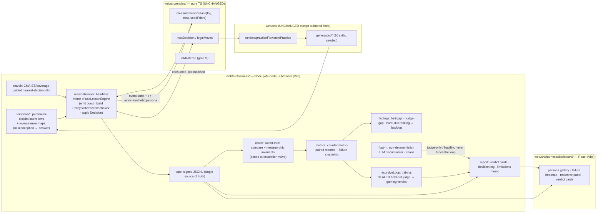
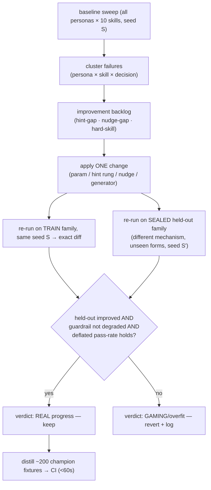

# feat: Synthetic Learner Red-Team Harness + In-App Demo Dashboard

## Summary

Build a **synthetic-learner red-team harness** that drives the app's *real* knowledge-prediction
engine (`measurementReduce → nextDecision` + the 10 generators + `practiceFlow`) end-to-end with
a population of simulated learners — fast, slow, guesser, memorizer, over-hinter, anxious/low-energy,
short-attention, misconception-stable, low-reading, plus deliberately **non-BKT** (oscillator/bimodal)
and **off-task/refusing** personas. It folds their behavior through the **same code path** a real child
drives (no mock engine), surfaces **failure clusters**, runs a **recursive improvement loop** with a
**sealed held-out judge** that mechanically distinguishes real educational progress from benchmark
gaming, and **produces concrete, prioritized fixes that actually improve the app** — missing hint
rungs, missing Tier-2 nudges, and pedagogically-hard skills. The whole thing is demoed through an
**in-app React dashboard** (persona gallery, persona×skill failure heatmap, baseline→tuned recursive
panel with the held-out guard, and clickable replayable verdict cards).

This satisfies every deliverable in `docs/inspiration/synthetic_challenger.pdf` — working prototype,
synthetic-learner design, flow-under-test, evaluation method/oracle, baseline-vs-improved comparison,
failure-mode report, recursive-improvement description, decision log, research notes, and a limitations
memo — and it does so for **this specific app**, exploiting the determinism the engine was built for
(KTD9: time and `actor` are data; the fold is pure, replayable, wall-clock-free).

**What "done" looks like:** a single `npm`-able command runs a seeded baseline sweep across all 10
skills and the full persona set; the dashboard shows where the tutor mis-guides which learner types
(false-positive mastery, answer-giving, missed escalation, failed transfer, scaffold-thrash); an
improvement backlog ranks the app's real weaknesses (e.g., "ADD_UNLIKE_COPRIME has no H1–H3 hint
ladder, so the over-hinter and anxious personas can only be RaiseScaffold'd or escalated"); at least
one real fix is applied and **proven to help on held-out personas/seeds** without regressing others;
and every flagged failure is a one-page **replayable verdict card** a human educator could audit.

Crucially, a parallel learning-science audit (`docs/ideation/2026-06-02-pedagogical-correctness-ideation.md`)
found that **much of the engine's pedagogy is wired but dead in the live runtime** — scripted stages
advance on a *single* correct (`useLessonScaffold.js:318`), `fluencyOk` returns `true` unconditionally,
"distinct problems" is proxied by `answer_value` string, transfer falls back to the *denominator*
proxy, `retention_probe` is never emitted, and `disengagedCount` is never incremented
(`policy.js:353`). The harness must **behaviorally rediscover these defects** (its strongest credibility
signal — synthetic learners independently surfacing what a human audit found = the brief's
human-agreement spot-check) and treat them as the **headline systemic finding**: the adaptive pedagogy
exists but does not govern what a child actually experiences.

**Coordination with plan 002 (parallel implementation).** Those exact defects are being **fixed by
another worker** under `docs/plans/2026-06-02-002-feat-activate-dormant-pedagogy-plan.md` (activate
dormant pedagogy behind reversible `PARAMS` flags). This repositions the harness from *fixer* to
**certifier/measurement backbone**: it owns no engine/lesson edits, runs a **flags-off (baseline) vs
flags-on (activated)** sweep, and produces the **before/after, held-out, anti-gaming evidence** that
proves 002's activations actually improve guidance for real learner types. The expected-findings suite
becomes a certification matrix — each dead-pedagogy defect should read "present" on the baseline engine
and **"resolved"** once the corresponding 002 flag is on. File ownership is disjoint: the harness lives
in `web/src/harness/` + its dashboard + its tests and **never edits 002's files** (`dimensions.ts`,
`gate.ts`, `params.ts`, `policy.js`, `decay.ts`, `grade.js`, `useLessonScaffold.js`, `Shell.jsx`,
`tier2.js`, `useLessonEngine.js`).

---

## Problem Frame

The engine plan (`2026-05-31-002`) was deliberately built so a synthetic harness could drive the exact
same code path a human drives — `actor: 'human' | synthetic:${persona}` is already in `types.ts`, the
fold is wall-clock-free, `params.ts` is the calibration surface, and the generators are pure/seedable.
But **nothing drives it yet**, and the engine's quality is therefore unmeasured: we cannot say which
learner types it mis-guides, whether its mastery signal tracks real understanding, or where it gives
away answers. The brief's central warning is that the *easy* version of this — "a swarm of obedient
fake students and a rising score" — proves nothing; the hard, valuable version makes the synthetic
learners **useful critics** whose findings a human educator would agree with, and uses those findings
to **make the tutor better**.

Two failure modes must be designed out from the start:

1. **Circularity / tautology.** If the persona's latent truth shares parameters with `params.ts`, the
   estimator validates itself and any score is meaningless (the STEP trap). The persona's ground-truth
   skill must be **parameter-disjoint** from the engine's.
2. **Self-deception in the loop.** If we tune `params.ts`/generators against the personas we can see,
   we overfit the benchmark. The "did it really improve?" verdict must be **mechanical** — measured on
   a sealed held-out family the optimizer never touches, with counter-metrics that move the opposite
   way under gaming.

On top of validation, the user requires the harness to **actively improve the app**: find weak spots
the team would otherwise miss — skills with no real hint scaffolding, behaviors where no Tier-2 nudge
fires, and pedagogically-difficult skills where many learners false-master or fail transfer — and feed
a prioritized, evidence-backed fix backlog.

**Non-negotiable constraints:** reuse the real engine (no parallel/mock); keep the deterministic core
seedable and wall-clock-free (personas supply event `t` as data); quarantine non-deterministic facets
(LLM judge, chaos injection) from the core so before/after diffs stay exact; do not bend the engine to
pass — fixes go in `params`/`policy`/`generators`/hint-ladders with justification.

---

## Origin & Requirements Traceability

| Req | Description | Source | Units |
|-----|-------------|--------|-------|
| R1 | Drive the **real** engine headlessly (no mock); emit the **same Observation burst** the UI emits so findings transfer | prompt §2,§7; ideation S-driver | U1, U4 |
| R2 | Personas are **parameter-disjoint latent laws**, wrong answers produced by **inverting the generators** onto real operands | prompt §3,§9; ideation S1 | U2, U3 |
| R3 | Defensible persona population: speed/energy/focus/attention + misconception + avoidance, **plus non-BKT (oscillator/bimodal) and off-task/refusing** | brief §4; prompt §4; ideation S1,S6 | U3 |
| R4 | **Closed-loop adversarial search** for the smallest perturbation from an honest learner that flips a high-stakes decision; coverage-guided variant | prompt §6; ideation S2 | U8 |
| R5 | Oracle = **latent-truth tracking + metamorphic invariants**, aimed hardest at the **escalation valve**; **counter-metrics schema-enforced**; positive control on a known bug | brief §5; prompt §5; ideation S3 | U5, U6 |
| R6 | **Two-tier recursive loop**: same-seed exact diff + **sealed held-out judge**; mechanical gaming verdict; **CI champion fixtures** (<60s) | brief §6; prompt §6; ideation S4 | U9 |
| R7 | **Signed replay-tape** as single source of truth; **verdict cards**; decision log; limitations memo; **blind discrimination Turing check** (LLM judge-only, never generator) | brief §8; prompt §8; ideation S5 | U10, U11 |
| R8 | **Actually improve the app**: detect hint-ladder gaps, missing Tier-2 nudges, pedagogically-hard skills → ranked **fix backlog**; **certify the improvement on held-out personas with a before/after**. Fixes owned by plan 002 are *measured/certified*, not re-implemented; a minimal harness-owned fix is applied **only** for a high-value weakness 002 does not cover | user 2026-06-02 | U7, U13 |
| R9 | **In-app React dashboard** demo: persona gallery, persona×skill failure heatmap, baseline→tuned recursive panel, clickable replayable verdict cards | user 2026-06-02 (demo choice) | U12 |
| R10 | **Full breadth**: all 10 generator skills + advanced facets (coverage-guided fuzzing, LLM discriminator, chaos injection) | user 2026-06-02 (breadth choice) | U3, U8, U10 |
| R11 | Preserve determinism (seedable, wall-clock-free fold; personas supply `t`); quarantine LLM/chaos from the deterministic core | KTD9; brief §7,§9 | U1, U4, U10 |
| R12 | **Behaviorally rediscover the dead-pedagogy audit defects** (gate-bypass, `fluencyOk` always-true, `answer_value` distinctness proxy, denominator transfer proxy, dead retention probe, never-incremented `disengagedCount`) and **cross-check harness findings against the human audit** (agreement spot-check); surface the engine-bypassed-in-runtime gap as the headline finding | pedagogical-correctness ideation; brief §5 (human agreement) | U5, U7, U13 |
| R13 | **Certify plan 002 in parallel**: bind to the engine's public API + pin `engine_sha`/`params_hash` in every tape; run a **flags-off (baseline) vs flags-on (activated)** sweep so each dead-pedagogy expected-finding flips present→resolved; never edit 002's files | 002 parallel implementation; brief §6 (before/after, regression) | U1, U5, U9, U13 |

---

## Key Technical Decisions

**KTD1 — The harness drives the real fold; no parallel engine.** The session runner loops
`nextDecision(state, mastery, recentBehavior, now) → practiceFlow.nextPractice(decision, state) →
generators.generateFor(skill, spec) → persona emits an event burst → measurementReduce(log, now,
seedPriors)` and repeats. Every credibility claim rests on this: the harness measures the same
`measurementReduce`/`policy.ts`/`gate.ts` a child hits. The runner is a **headless mirror of
`web/src/runtime/useLessonEngine.js`** — it assembles the same `PolicyState` + `recentBehavior` and
emits the same `problem_present … judged` burst with the rich metadata, so a finding in the harness is
a finding in the live app.

**KTD2 — Persona latent truth is parameter-disjoint from `params.ts`, enforced structurally and by
lint.** A persona is a generative process with its **own** named constants (`true_pknown` trajectory,
`p_slip`, `p_guess`, `misconception_strength`, `fatigue_decay`, `attention_span`) living under
`web/src/harness/personas/`. None of these may reference `PARAMS` or its field names. A unit test
(`test_param_disjointness`) fails the build if any persona module imports from `web/src/engine/params`.
Wrong answers are produced by **applying a misconception to the actual operands the generator chose**
(an "inverse-error map" per skill), so the persona emits only an `answer_value`; the engine's
`observation.ts` independently fingerprints the `error_signature`. Disjointness is then a property of
the code structure, not a promise.

**Caveat — import-disjointness is necessary but NOT sufficient (do not overclaim).** The
`test_param_disjointness` lint catches only *lexical* coupling (a persona importing `engine/params`). It
does not catch two subtler couplings the credibility argument must not rest on: (a) **generative-form
coupling** — a persona sampling correctness from a scalar latent skill + slip/guess is the same
functional shape BKT assumes, so "the `MasteryEstimate` tracks the persona's latent truth" partly
reflects model-form agreement, not engine correctness (the STEP trap can survive a green lint); and (b)
**closed-form round-trip coupling** — the U2 inverse-error map plants `(a+c)/(b+d)` and `observation.ts`
classifies `(a+c)/(b+d)` by the *same* arithmetic identity, so an `error_signature` round-trip on
structurally-matched cases is a **coverage check, not validity evidence**. Consequence: the harness's
credibility leans on the genuinely model-form-agnostic parts — the **metamorphic invariants** (U5, no
ground truth needed) and the **non-BKT personas** (U3) — and BKT-shaped latent-truth tracking and
structurally-matched round-trips are reported WITH an explicit "shares functional form / closed form with
the estimator" caveat. Latency findings get the same treatment: a persona latency hand-tuned to one side
of `latencyFloorMs` is a coverage fixture, so latency-driven findings sweep latency across a range that
straddles the floor rather than asserting a single in-band-fast value.

**KTD3 — Personas are stochastic policies over the Observation surface, including misbehavior.** Each
persona maps (latent skill, traits, current scaffold, fatigue state, the engine's last Decision) → an
event burst: `answer_value` (correct / misconception-derived / lucky-guess), `latency` (skill +
fatigue drift), `hint_max_rung` (over-hinter rides hints; independent learner stays H0),
`self_corrections` (oscillation), `modality`, `too_fast_correct`, plus a `Signal` stream (idle,
oscillation). The population includes **non-BKT** generative laws (oscillator: learns-then-forgets on a
period disjoint from `fadeStreakK`; bimodal: lucky-on-easy) and **off-task/refusing** personas that
emit non-answers, timeouts, and malformed `answer_value`s — to test whether the engine detects
non-answering rather than the runner silently coercing it to a no-op.

**KTD4 — The oracle never reads the app's own mastery flag as ground truth.** "Correct guidance" is
defined against the persona's **own** latent skill: the gate should open only when latent mastery is
real; scaffold level should match latent need; transfer should be credited only when latent transfer
is real. On top of latent-truth comparison, the harness asserts **metamorphic invariants** that need
no ground truth at all (permuting surface form A↔B must not flip the mastery verdict; one extra
correct must never lower `P_known`; a strictly-dominated learner must never master earlier). The oracle
aims hardest at the **escalation valve** (a missed `EscalateToHuman` on a quietly-drowning learner is
the closest thing to real harm). A **positive control** seeds a known defect and asserts the harness
detects it — a harness that can't catch a bug we know about isn't trusted for ones we don't. **Verify the
seed defect actually exists on the engine path first:** the `consecutiveErrors` double-count is
*unconfirmed* (`docs/HANDOFF-engine-surfaces.md` says "investigate whether it over-counts," and
`useLessonEngine` carries a "verified: increments once" comment). If it does not reproduce, substitute a
**confirmed** defect — `fluencyOk`-always-true (`dimensions.ts:91`) is verifiable in code. Note also that a
single author-known control proves detection of a *designed-for* bug, not unknown ones; add at least one
**blind control** (a defect injected by someone other than the harness author, unseen before the run) and
report whether it was caught, so "human-agreement" is not presented as independent rediscovery when the
spoofer personas were authored from the very audit they corroborate.

**KTD5 — Counter-metrics are schema-enforced, not optional.** The metrics record type makes a
one-sided win unserializable: `mastery_rate` cannot be emitted without `false_mastery_rate` (gate
fired while latent `P_known` < threshold) and `evidence_count_at_gate_open`; "more hints" pairs with
`independence_rate`; "faster mastery" pairs with `transfer_after_fade`. A rising headline with a
worsening counter is reported as a **failure**, per the brief.

**KTD6 — The harness is a search, not just a panel.** Beyond the named persona set, an adversarial
search (CMA-ES / simple evolutionary search over persona latents + seeds, bounded to a plausibility
box with `p_slip,p_guess < 0.5`) hunts the **smallest perturbation from an honest learner** that flips
a high-stakes decision. Output is a *distance-to-failure* plus a replayable seed — far more convincing
than "9/12 personas passed." A coverage-guided variant keeps any mutant that reaches a new engine
decision-branch.

**KTD7 — Two-tier recursive loop with a sealed held-out judge.** Tuning happens on a **training**
persona family; the verdict is computed on a **held-out** family built from a *different generative
mechanism* + unseen surface forms + a fresh seed lineage. An improvement counts only if held-out
moves; a guardrail metric the optimizer is never allowed to read (transfer on novel forms) gates the
gaming verdict; the pass-rate is deflated for the number of search trials. The expensive search runs in
a nightly/manual sweep and **distills ~200 champion-adversary fixtures**; per-commit CI replays only
those (<60s) to detect regressions deterministically.

**KTD8 — One signed replay tape is the single source of truth.** Every run emits a canonical
deterministic JSONL **tape**: `{ run_id, seed, persona_id, persona_latents, params_hash, engine_sha,
steps:[{decision, observation, gate, latent}] }`. The decision log, regression baseline,
verdict cards, and future-HMM calibration corpus are all **projections** of the tape — not
separately maintained artifacts that drift. (The limitations memo and `research-notes.md` are *authored*
companions, not pure projections; byte-stability is asserted only for the quantitative projections.) A skeptic re-runs the seed and either reproduces every
number byte-for-byte or finds a non-determinism (itself a finding). A `test_replay_determinism` asserts
byte-equality of two runs of the same seed.

**KTD9 — Improvement findings are derived, ranked, and actionable (the "make my app better" mandate).**
A dedicated analyzer mines the tapes for the app's real weaknesses:
- **Hint-ladder gaps** — skills/levels where stuck personas plateau (errors → `RaiseScaffold`/
  `EscalateToHuman`) while `hint_max_rung` never rises because no H1–H4 ladder exists (open question 6
  of the engine plan: several lessons have thin/no hints). Flagged with the personas + skills affected.
- **Nudge gaps** — behavior windows (idle, oscillation, `too_fast_correct`) where a Tier-2 nudge
  *should* fire but doesn't, or fires but the persona keeps failing (an ineffective nudge).
- **Pedagogically-hard skills** — skills ranked by composite risk (false-mastery rate, failed-transfer
  rate, mis-routing rate, reps-to-mastery) across the population.
Output is a **ranked backlog** with, per item, the evidence (verdict-card refs), affected personas, and
a proposed lever (author a hint rung / add a nudge trigger / tune a param / adjust generator
difficulty). U13 then applies one real fix from the backlog and proves it on held-out personas.

**KTD10 — Toolchain: browser for the demo, `vite-node` for batch, Vitest for tests.** The engine is
TypeScript and plain Node cannot import `.ts` directly. The harness core lives in `web/src/harness/`
where **both** Vite (browser dashboard) and Vitest (tests) compile it with zero config. Headless
batch/overnight/CLI runs use **`vite-node`** (a Vitest-family runner that reuses Vite's TS compilation;
added as a devDependency) via `npm run harness`. The demo dashboard runs the identical harness core
**in the browser** through Vite. No engine files move; the harness only imports the engine's existing
public functions and module paths.

**KTD11 — LLM and chaos are quarantined from the deterministic core.** The LLM **blind discriminator**
(judge-only: "is this error stream synthetic or real?") and **chaos fault-injection** (corrupt one
Observation field to test measurement-fragility) are opt-in, separately-seeded modules that never feed
the tuning loop. The LLM is never a persona generator (prior art: LLM students are too obedient and
drift). LLM calls reuse the app's existing `/api` dev-proxy pattern; absence degrades gracefully
(discrimination check is skipped with a logged note in the limitations memo).

**KTD12 — Don't bend the engine to pass.** When a persona exposes a real flaw, the fix is recorded in
the backlog (KTD9) and applied in `params`/`policy`/`generators`/hint-ladders with written
justification and a held-out proof — never patched away in the harness. The decision log captures every
such change with its params/engine hash so "moving the goalpost" is visible.

**KTD13 — Test the engine path; name the engine-vs-runtime gap as the headline finding.** The
pedagogical audit established that the live lessons mostly **bypass** the adaptive engine (scripted
stages in `useLessonScaffold.js` advance on a single correct; BKT is decorative outside the one
generated `practice` stage). The harness deliberately drives the **engine path** — that is the adaptive
future we want to validate and improve — but it must **not** claim its findings describe what a child
experiences today. Instead, the gap *is* the finding: U7 emits an explicit "pedagogy-dead-in-runtime"
finding category, and the limitations memo states plainly that harness results characterize the engine
path, while the live scripted-stage path underuses it. **Every certification claim is scoped to "the
engine path" — in the verdict cards, the dashboard, and the decision log, not only the limitations memo**
— so a "REAL progress, held-out verified" verdict is never silently read as "a child's experience
improved." A thin **characterization** of the scripted-stage path (the single-correct advance) is
**mandatory, not "where feasible"** (assigned to U4): the report must *quantify* the divergence — how
much of any certified engine-path improvement actually reaches a child today. Certifying 002's flags
certifies the engine path ONLY; child-experience improvement additionally requires 002's
scripted-stage→engine rewiring, whose certification is out of scope here and is stated as such. This
turns the audit's static code reading into behavioral, replayable evidence — and makes "wire the
pedagogy you already designed" the best-grounded improvement the harness can recommend.

**KTD14 — Expected-finding oracle + human-agreement against the audit.** The audit's six confirmed,
file-anchored defects become a set of **expected findings** the harness should reproduce from behavior
alone: (a) `fluencyOk` never gates → a fast persona masters with implausible latency; (b) `answer_value`
distinctness proxy → a same-answer memorizer gets "independence" credit from two non-distinct problems;
(c) denominator transfer proxy → a denominator-only "transfer-spoofer" passes transfer without
structural transfer; (d) dead `retention_probe` → a forgetter/oscillator is never demoted; (e)
never-incremented `disengagedCount` → an off-task persona is never escalated; (f) single-correct stage
advance (characterized path). The harness's agreement with this human audit (how many it independently
rediscovers, with what evidence) is reported as the brief-required **human-agreement metric** — a far
stronger credibility claim than an internal score.

**KTD15 — The harness certifies plan 002; it does not re-implement it.** Plan 002 (activate dormant
pedagogy) is being built in parallel and **owns** the engine/lesson fixes. This harness binds only to
the engine's **public API** (`measurementReduce`, `nextDecision`/`legalMoves`, `isMastered`,
`practiceFlow.nextPractice`, `generateFor`) and to 002's reversible flags (`fluencyHardMode`,
`frustrationScaffold`, the delayed-probe flag, the unified `ErrorSignature` taxonomy), passing them
explicitly rather than reaching into internals. **A flag is only config-activatable if 002 routes it
through `PARAMS`:** `nextDecision`/`legalMoves` call `isMastered(est)` *without* a fluency arg
(`policy.ts:159`, `:452`), so the engine's internal gating ignores a `fluencyHardMode` passed only as a
top-level `isMastered` argument. The flags-off→on sweep flips the gate via config alone **only** for
PARAMS-backed flags; arg-backed flags need a 002 engine edit to take effect at the decision boundary
(tracked in Open Questions), so the certification matrix doesn't silently read "not resolved" for an
inert flag. Every tape pins `engine_sha` + `params_hash` so a run is unambiguously attributable to a
given engine state as 002 evolves. The harness runs a **flags-off
(baseline) vs flags-on (activated)** sweep — the *same* personas, the *same* seeds — so 002's
reversibility becomes a measured before/after: each dead-pedagogy expected-finding (KTD14) should read
**present** with flags off and **resolved** with flags on. If a flag-on result does **not** resolve the
defect, or resolves it on TRAIN but not the sealed held-out family, that is a real finding handed back
to the 002 worker — the harness is the regression net and anti-gaming judge for their activation work,
not a second cook in the same kitchen.

**Caveat — the sealed held-out family controls for overfit, not for shared-author error.** "Resolved" is
defined by the harness, and 002 is tuned until findings resolve, so the certification risks being a closed
loop. The held-out family (different misconception mix + fresh seed lineage) catches overfitting to
specific seeds/surface-forms, but it is authored from the *same* designer's assumptions as the training
family and the audit 002 fixes — so it does **not** catch a systematic error shared by the author, the
held-out personas, and 002's fix. Two mitigations are required, not optional: (1) the held-out family's
generative mechanism must use a genuinely **non-BKT functional form** (Open Q2), not just a different BKT
parameterization, or the shared-shape circularity persists; and (2) each dead-pedagogy "resolved"
criterion must be anchored to an **externally-defined behavioral threshold** the author cannot tune to
(e.g., "a real escalation must fire within N idle events"), not merely to the harness's own
expected-finding signature. The limitations memo states plainly that "human-agreement with the audit" is
agreement between two artifacts of the *same* reasoning, not external corroboration.

---

## High-Level Technical Design

### Architecture — the harness wraps the real engine



### One synthetic session (deterministic; mirrors the live submit boundary)

```mermaid
sequenceDiagram
  participant P as Persona (latent law)
  participant R as sessionRunner
  participant E as engine (measurementReduce + nextDecision)
  participant G as generators + practiceFlow
  R->>E: measurementReduce(log, now) → mastery
  R->>E: nextDecision(state, mastery, recentBehavior, now) → Decision
  R->>G: nextPractice(Decision, state) → spec; generateFor(skill, spec) → problem
  R->>P: present(problem, Decision)  (persona sees the engine's actual move)
  P->>P: sample answer_value (misconception⨉operands), latency, hints, self-corr, Signals
  P-->>R: event burst (problem_present … judged) with injected t
  R->>R: append to in-memory log; record latent truth + gate to the tape
  Note over R,E: repeat until ReturnToKitchen / RouteToRoom / EscalateToHuman / step cap
```

### The recursive improvement loop (anti-gaming by construction)



---

## Output Structure

```
web/src/harness/                      # NEW — harness core (Vite + Vitest both compile this)
  index.js                            # public entry: runSweep, runSession, types (JSDoc)
  config.js                           # run-id, seeds, step caps; reads engine PARAMS read-only
  rng.js                              # seeded PRNG (reuse generators/core.js mulberry32 pattern)
  tape.js                             # signed JSONL tape: write/read, params_hash, engine_sha
  sessionRunner.js                    # headless mirror of useLessonEngine (KTD1)
  personas/
    model.js                          # latent-law shape + emission (Observation surface, KTD3)
    inverseErrors.js                  # misconception → answer_value per skill (generator inversion)
    library.js                        # the defensible population (incl. non-BKT + off-task)
    families.js                       # TRAIN vs SEALED HELD-OUT split (different mechanism)
  oracle/
    latentTruth.js                    # gate/scaffold/transfer vs persona latent skill
    invariants.js                     # metamorphic relations (no ground truth needed)
    positiveControl.js                # known-bug seed + assertion (positive control)
    expectedFindings.js               # audit-confirmed defects as behavioral signatures (KTD14), flag-parameterized
  metrics.js                          # counter-metric-paired records + failure clustering
  findings.js                         # hint-gap · nudge-gap · hard-skill ranking → backlog (KTD9)
  search.js                           # CMA-ES/coverage-guided nearest-decision-flip (KTD6)
  recursiveLoop.js                    # train vs sealed held-out judge + gaming verdict (KTD7)
  report.js                           # verdict cards · decision log · limitations memo (projections)
  quarantine/
    llmDiscriminator.js               # judge-only blind Turing check (opt-in, /api proxy)
    chaos.js                          # Observation-channel fault injection (opt-in)
  cli.js                              # vite-node entry: npm run harness -- <subcommand>
  dashboard/                          # NEW — in-app demo (React, Vite)
    HarnessDashboard.jsx              # route shell: gallery · heatmap · recursive panel · cards
    FailureHeatmap.jsx                # persona × skill × decision
    RecursivePanel.jsx                # baseline → tuned, held-out guard
    VerdictCard.jsx                   # one replayable failure, severity×plausibility×novelty
    dashboard.css
web/tests/harness/                    # NEW — Vitest
  test_session_runner.test.js
  test_personas_inverse_errors.test.js
  test_param_disjointness.test.js
  test_oracle_invariants.test.js
  test_positive_control.test.js
  test_expected_findings.test.js
  test_metrics_counter_pairing.test.js
  test_findings_backlog.test.js
  test_search.test.js
  test_recursive_loop.test.js
  test_tape_replay_determinism.test.js
  test_report_projections.test.js
docs/harness/                         # NEW — generated artifacts (committed examples)
  baseline-report.md
  improvement-backlog.md
  decision-log.md                     # certification/loop entries: engine_sha + params_hash + REAL/GAMING verdict
  limitations-memo.md
  research-notes.md
  champions/                          # frozen CI fixtures (distilled adversaries)
```

Per-unit **Files** lists are authoritative; the tree is a scope declaration.

---

## Implementation Units

> **Phase A (U1–U4): the headless spine** — drive the real engine with parameter-disjoint personas.
> **Phase B (U5–U7): oracle, metrics, and the improvement backlog** — the credibility + "make it
> better" layer.
> **Phase C (U8–U9): search and the recursive loop** — find the worst learners; prove real progress.
> **Phase D (U10): advanced facets** — LLM discriminator + chaos (quarantined).
> **Phase E (U11–U13): report, dashboard, and the applied fix** — the demo + the real improvement.

---

### U1. Harness scaffold — dir, config, seeded RNG, signed tape, toolchain

**Goal:** Stand up `web/src/harness/` with the run config, deterministic RNG, the canonical signed
tape format, and the `vite-node` batch entry — the substrate every other unit writes to.

**Requirements:** R1, R8 (tape feeds findings), R11.

**Dependencies:** none.

**Files:** `web/src/harness/index.js`, `web/src/harness/config.js`, `web/src/harness/rng.js`,
`web/src/harness/tape.js`, `web/src/harness/cli.js`, `web/package.json` (add `vite-node` devDep +
`"harness": "vite-node web/src/harness/cli.js"` script), `web/tests/harness/test_tape_replay_determinism.test.js`.

**Approach:** `config.js` defines a run as `{ run_id, seed, stepCap, personaIds, skillIds, flags }`,
where `flags` carries plan-002 flag overrides (`fluencyHardMode`, `frustrationScaffold`,
delayed-probe, taxonomy) so a sweep can run **flags-off (baseline)** vs **flags-on (activated)** without
editing the engine (KTD15); it reads `PARAMS` **read-only** to hash into the tape (never to seed
personas — KTD2). `rng.js` reuses the
generators' `mulberry32`/`hashStr` primitives (import from `generators/core.js`) but defines its OWN
`personaRng(persona_id, seed, step)` — it does NOT reuse `core.js`'s `rngFor(skill, index)`, whose 2-arg
signature differs and whose name must not be shadowed. `personaRng` seeds persona randomness
deterministically and replay-exact. `tape.js` writes a CANONICAL JSONL serializer — explicit sorted keys
and fixed float precision for `P_known`-class values (do not rely on object/Map insertion order or raw
`JSON.stringify` float formatting) — plus a `params_hash` (hash of `PARAMS`) + `engine_sha` (git short
sha, injected by the caller, not
read from wall-clock) — the single source of truth (KTD8). `cli.js` exposes subcommands
(`baseline`, `search`, `loop`, `report`) dispatched to later units. `vite-node` compiles the engine
`.ts` imports with zero config (KTD10). **Import-surface note:** `engine/index.ts` re-exports only types,
`PARAMS`, graph, and log helpers — `measurementReduce`, `nextDecision`/`legalMoves`, and `isMastered` are
NOT in the barrel. Import them from their module paths (`engine/measurementReduce.js`, `engine/policy.js`,
`engine/gate.js`), exactly as `useLessonEngine.js` does, OR add a one-line re-export of those four to
`engine/index.ts` (which is **not** a 002-owned file, so it stays in harness scope and gives the harness a
true barrel to bind to). Either way, the "bind to the public API" claim means *these specific functions*,
not "everything is behind index.ts."

**Patterns to follow:** `web/src/generators/core.js` (`makeRng`, `hashStr`, `rngFor`); the engine's
"no wall-clock; caller injects `t`" discipline (`measurementReduce` signature).

**Test scenarios:**
- Writing then reading a tape round-trips to an identical object (stable key order).
- Two tapes from the same `{seed, persona, skill}` are **byte-identical** (replay determinism, R11).
- `params_hash` changes iff a `PARAMS` field changes; `engine_sha` is carried as injected data, never
  read inside any fold.
- `personaRng(persona, seed, step)` is pure and order-sensitive; same inputs → same stream (distinct
  from `core.js`'s `rngFor(skill, index)`).
- Byte-equality is asserted within a single runtime (two `vite-node` runs); Node-vs-browser equality is a
  separate, weaker invariant (semantic equality of parsed tapes) unless cross-runtime float reproducibility
  is verified on the first run.
- `npm run harness -- baseline --seed 1 --dry` exits 0 and imports the engine `.ts` without a build step.

**Verification:** `npm run harness -- baseline --dry` runs under `vite-node`; the determinism test is green.

---

### U2. Inverse-error maps — misconception → answer_value on real operands

**Goal:** For each of the 10 skills, a pure function that, given the operands the generator chose,
returns the `answer_value` a learner with misconception M would submit — so personas emit *content-true*
wrong answers the engine independently fingerprints into the right `error_signature`.

**Requirements:** R2, R3, R10.

**Dependencies:** U1.

**Files:** `web/src/harness/personas/inverseErrors.js`,
`web/tests/harness/test_personas_inverse_errors.test.js`.

**Approach:** Map the fraction misconception taxonomy onto the engine's `ErrorSignature` enum and the
generators' operand shapes: `add_denominators` (a/b+c/d → (a+c)/(b+d)), `add_across_unlike`,
`scaled_bottom_only`, `forced_leftover` (improper→mixed), `not_simplified`, plus whole-number-bias /
gap-thinking / denominator-neglect / unit-fraction-inversion expressed through the same answer-value
channel. Each entry is `(operands, level) → [num, den] | null`. The map is keyed by skill id and
misconception id; unknown combinations fall back to a plausible slip. Because the generator exposes
`operands` + the correct `answer`, the inverse map sits beside it and is correct-by-construction wrong.
**Two coupling notes:** (1) `error_signature` labels are a *data contract* 002 unifies (`grade.js` →
engine `ErrorSignature` union) — so U2 imports the enum rather than hardcoding strings, and the flags-on
sweep targets 002's unified taxonomy; `test_personas_inverse_errors` may need a flags-aware expected-label
table (off-taxonomy vs unified). (2) the engine fingerprints only six named signatures + `other`, so
misconceptions without a dedicated fingerprinter (whole-number bias, gap thinking, denominator neglect,
unit-fraction inversion) collapse to `other` — these are distinguished by `answer_value`, not
`error_signature`, and the oracle must trace them via the planted answer, not the engine's label.

**Patterns to follow:** `web/src/generators/*.js` operand/answer envelopes; `ErrorSignature` names in
`web/src/engine/types.ts`; the misconception names in `docs/design/student-state-measurement.md`.

**Test scenarios:**
- For `ADD_SAME_DEN` operands 2/7 + 3/7, the `add_denominators` map returns 5/14, and feeding that
  answer through `observation.segment` yields `error_signature === 'add_denominators'` (round-trip).
- For `ADD_UNLIKE_NESTED` 1/2 + 1/3, `add_across_unlike` returns 2/5 → `error_signature` matches.
- `SIMPLIFY` non-lowest-terms answer → `not_simplified`; `IMPROPER_TO_MIXED` mis-carry → `forced_leftover`.
- Every skill id from `generatorSkills()` has at least two distinct misconception entries (breadth, R10).
- An "off-task" answer (`null` answer_value) is passed through, not coerced (sets up U3/U4).
- The map never imports from `web/src/engine/params` (disjointness, asserted in U3's lint test too).

**Verification:** Each map entry's output, run through the engine's featurizer, produces the intended
`error_signature` for ≥2 surface forms per skill.

---

### U3. Persona model + library — latent laws, emission, non-BKT + off-task, family split

**Goal:** The parameter-disjoint persona generative model and the defensible population, including the
non-BKT and off-task classes, split into TRAIN and SEALED HELD-OUT families.

**Requirements:** R2, R3, R10; sets up R6 (held-out).

**Dependencies:** U2.

**Files:** `web/src/harness/personas/model.js`, `web/src/harness/personas/library.js`,
`web/src/harness/personas/families.js`, `web/tests/harness/test_param_disjointness.test.js`.

**Approach:** `model.js` defines a persona as `{ id, latent: { true_pknown_by_skill, learn_rate,
p_slip, p_guess, misconception, misconception_strength, fatigue_decay, attention_span, hint_appetite },
emit(problem, lastDecision, fatigueState, rng) → eventBurst }`. `emit` samples: correctness from latent
skill + slip/guess (NOT from `PARAMS.bkt`), wrong answers via `inverseErrors`, `latency` from a base +
fatigue drift over session length, `hint_max_rung` from `hint_appetite` and whether a ladder exists,
`self_corrections` from an oscillation rate, `too_fast_correct` when a guess lands fast, and emits
`idle`/`oscillation` `Signal`s. `library.js` instantiates the named population: fast-mastery,
slow-but-steady, confident-guesser, memorizer (passes trained surface_form, fails the other),
over-hinter, anxious/low-energy, short-attention, misconception-stable, low-reading; **plus**
oscillator (non-BKT: learns-then-forgets on a period disjoint from `fadeStreakK`), bimodal
(lucky-on-easy), and off-task/refuser (non-answers/timeouts/malformed). **Plus three audit-targeted
spoofers (KTD14):** a *same-answer memorizer* (answers two structurally different problems with the
same value to exploit the `answer_value` distinctness proxy at `dimensions.ts:143`), a
*denominator-only transfer-spoofer* (varies the denominator but not the problem structure, to exploit
the denominator transfer proxy at `dimensions.ts:194`), and a *fast-but-shallow guesser* (in-band-fast
corrects to exploit `fluencyOk`-always-true at `dimensions.ts:91` plus `P_T=0.2` fast-to-0.95). Each
persona declares **what real behavior it approximates and what failure mode the harness might MISS with
it** (brief §4 honesty), stored as metadata for the report. `families.js` partitions into TRAIN and a SEALED HELD-OUT family
built from a *different* misconception mix + learn-rate range + fresh seed lineage (KTD7).

**Patterns to follow:** `measurement §4.7.2` persona↔hidden-state correspondence; Baker's
gaming/off-task/carelessness as three distinct classes; the `Observation`/`Signal` shapes in
`web/src/engine/types.ts`.

**Test scenarios:**
- A persona's `emit` never imports or references `PARAMS`/`bkt` fields — `test_param_disjointness`
  greps the persona modules' import graph and **fails the build** on any `engine/params` reference (KTD2).
- A memorizer masters its trained `surface_form` but a `TransferProbe` to the other form yields a wrong
  answer (sets up the transfer-failure finding).
- The oscillator's correctness flips on a period coprime with `fadeStreakK=3` (non-BKT shape present).
- The same-answer memorizer emits two structurally distinct problems with one repeated `answer_value`
  (sets up the `dimensions.ts:143` distinctness-proxy exposure); the transfer-spoofer varies only the
  denominator (sets up the `dimensions.ts:194` proxy exposure).
- The off-task persona emits a `null`/malformed `answer_value` and idle `Signal`s; the burst is
  well-formed at the event level (the runner, U4, must not drop it).
- Latency rises monotonically with simulated session length for the short-attention persona (fatigue).
- TRAIN and HELD-OUT families share **no** persona ids and draw latents from disjoint ranges.

**Verification:** Instantiating the full library yields ≥13 personas across all named classes; the
disjointness lint is green; held-out family is mechanically distinct.

---

### U4. Headless session runner — the mirror of `useLessonEngine`

**Goal:** The loop that, per persona × skill, drives the real engine to a terminal Decision, emitting
the same event burst the UI emits and recording latent truth + gate to the tape each step.

**Requirements:** R1, R11.

**Dependencies:** U1, U3; consumes the engine (`measurementReduce`, `nextDecision`/`legalMoves`,
`isMastered`) and `practiceFlow.nextPractice`.

**Files:** `web/src/harness/sessionRunner.js`, `web/tests/harness/test_session_runner.test.js`.

**Approach:** `runSession({ persona, skillId, seed, stepCap }) → tape`. Initialize a `PolicyState`
(`currentNodeId`, `currentScaffold`, `sessionMaxScaffoldPassed`, `consecutiveErrors`, `inKitchen=false`,
`stumpingRecipe`) exactly as `useLessonEngine` does. Loop: `measurementReduce(log, now)` → `nextDecision`
→ `nextPractice` → `generateFor` → `persona.emit` → append the `problem_present…answer_submit…judged`
burst (with injected `t` advancing by the persona's latency) → update `PolicyState` (the **same**
update rules as `useLessonEngine`, so the known `consecutiveErrors` behavior is faithfully reproduced —
do **not** "fix" it here; it's the positive control in U5) → record `{decision, observation(engine-derived),
gate: isMastered(est[skill]), latent: persona.true_pknown}` to the tape. Stop on `ReturnToKitchen` /
`RouteToRoom` / `EscalateToHuman` / `stepCap`. Note: `measurementReduce` returns **only** `{ mastery }`
— it does NOT return `recentBehavior`. The runner constructs `RecentBehavior = { observations, isDisengaged }`
itself, exactly as `useLessonEngine.js` does (it builds it inline at the submit boundary), and passes it as
the separate fourth arg to `nextDecision(state, mastery, recentBehavior, now)`.

**Execution note:** Characterization-first — before writing the loop, capture a thin characterization of
`useLessonEngine.judgeAndAdvance`'s `PolicyState` update + emit shape so the headless runner provably
mirrors the live path (findings only transfer if the bursts match). **Capture two live-path facts and
decide deliberately:** (1) in `useLessonEngine`, `recentObsRef` is allocated but never appended and
`disengagedCount` is never incremented, so the live `recentBehavior` is effectively
`{ observations: [], isDisengaged: false }` — the runner **mirrors this empty channel** (so the engine's
"disengaged" escalation trigger is correctly reproduced as *structurally unreachable*, a real finding, not
papered over); consequently U5's off-task/missed-escalation oracle asserts against the **stuck** trigger
(floor scaffold + flat `P_known` + heavy hints), which the runner CAN drive, not the disengaged trigger.
(2) **This unit also owns the mandatory scripted-stage characterization (KTD13):** a thin driver of the
`useLessonScaffold.js` single-correct-advance path so the report can quantify the engine-vs-runtime
divergence. Note `useLessonEngine.js`/`useLessonScaffold.js` are 002-owned files — characterize via a
read-only shim/observation, do not edit them.

**Patterns to follow:** `web/src/runtime/useLessonEngine.js` (emit burst, boundary-only policy call,
`PolicyState` updates); `web/src/runtime/practiceFlow.js` (`nextPractice` contract);
`measurementReduce(log, now, seedPriors)` signature.

**Test scenarios:**
- A scripted "always-correct, in-band, hint-free" persona drives a skill from L0 to a gate-open
  `ReturnToKitchen`, producing exactly one `answer_submit`+`judged` pair per attempt (no bleed).
- A `RaiseScaffold` decision lowers the next spec's level by one and the runner does **not** clear the
  persona's latent state (work-preserving parity with the UI).
- A `TransferProbe` decision swaps to the other `surface_form` via `nextPractice` (memorizer then fails).
- The runner calls `nextDecision` **only** at the judged boundary, never mid-attempt (spy/assert).
- An off-task `null` answer is emitted to the engine as-is (not coerced to a wrong-but-parseable value);
  the resulting tape step records a non-answer.
- Two runs of the same `{persona, skill, seed}` yield byte-identical tapes (R11).

**Verification:** A full persona × all-10-skills sweep completes headlessly under `vite-node` and writes
one tape per session; bursts match the `useLessonEngine` characterization.

---

### U5. Oracle — latent-truth comparison, metamorphic invariants, positive control

**Goal:** Decide, per tape, where the engine's guidance disagrees with the persona's latent truth,
assert ground-truth-free invariants — aimed hardest at the escalation valve — and run an
**expected-findings suite** that behaviorally reproduces the dead-pedagogy audit's confirmed defects
(the human-agreement signal).

**Requirements:** R5, R12.

**Dependencies:** U4.

**Files:** `web/src/harness/oracle/latentTruth.js`, `web/src/harness/oracle/invariants.js`,
`web/src/harness/oracle/positiveControl.js`, `web/src/harness/oracle/expectedFindings.js`,
`web/tests/harness/test_oracle_invariants.test.js`,
`web/tests/harness/test_positive_control.test.js`,
`web/tests/harness/test_expected_findings.test.js`.

**Approach:** `latentTruth.js` labels each gate-open as true/false-positive by comparing
`isMastered(est)` against `persona.true_pknown ≥ τ_latent` (τ_latent disjoint from `gateThreshold`);
labels scaffold-mismatch (engine level vs latent need) and false-transfer (credited while latent
transfer absent); and flags **missed escalation** (persona latently stuck/disengaged but no
`EscalateToHuman`) and **false escalation** (competent persona escalated). `invariants.js` asserts
metamorphic relations over re-run tapes: surface-form permutation must not flip the mastery verdict; an
injected extra correct must not lower `P_known`; a strictly-dominated persona must not master earlier.
`positiveControl.js` constructs a session that exercises the known `consecutiveErrors` double-count
(per `docs/HANDOFF-engine-surfaces.md`) and asserts the oracle/metrics flag it — proving the harness
can catch a defect we already know about (KTD4). `expectedFindings.js` (KTD14) encodes the six
audit-confirmed defects as **expected behavioral signatures** and scores how many the baseline sweep
independently reproduces, each tied to the diagnostic persona: `fluencyOk`-always-true (fast-shallow
guesser masters with implausible latency), `answer_value` distinctness proxy (same-answer memorizer
gains independence), denominator transfer proxy (transfer-spoofer passes transfer), dead
`retention_probe` (oscillator/forgetter never demoted), never-incremented `disengagedCount` (off-task
persona never escalated), and single-correct stage advance (characterized scripted path, KTD13). The
**human-agreement metric** = fraction of audit findings the harness reproduces with replayable evidence.
Each expected-finding is **parameterized by 002's flag state** (KTD15): it should read `present` with
the relevant flag off and `resolved` with it on. The suite therefore doubles as the certification
matrix for plan 002 — run once flags-off (baseline) and once flags-on (activated).

**Patterns to follow:** `docs/design/fraction-app-state-model.md` §5.5 escalation triggers;
`docs/HANDOFF-engine-surfaces.md` (the double-count); the gate conjunction in `web/src/engine/gate.ts`.

**Test scenarios:**
- A confident-guesser whose latent `P_known` stays low but who reaches gate-open is labeled
  **false-positive mastery**.
- A quietly-drowning persona (latent stuck, hints exhausted) with **no** `EscalateToHuman` is labeled
  **missed escalation** (the high-harm case).
- Permuting the two surface forms across a paired run does not change the mastery verdict; a violation
  is reported with the minimal differing step.
- The positive-control session **fails** (defect detected) on the current engine and the test documents
  the expected signature — guarding against a harness wired to the wrong (UX) surface.
- A competent persona is **not** labeled missed-escalation (false-alarm guard).
- **Expected-findings (KTD14):** the off-task persona reaches the step cap with no `EscalateToHuman`
  (reproduces the never-incremented `disengagedCount` defect); the fast-shallow guesser opens the gate
  with implausibly low latency (reproduces `fluencyOk`-always-true); the transfer-spoofer is credited
  `transfer_passed` while only the denominator varied (reproduces the denominator proxy). Each is
  emitted as an expected-finding match with a replay seed; the suite reports the human-agreement count.

**Verification:** On a baseline sweep, the oracle yields per-session labels; invariants run on paired
re-runs; the positive control detects the known bug.

---

### U6. Metrics, counter-metric pairing, and failure clustering

**Goal:** Aggregate oracle labels into counter-metric-paired records and cluster failures by
persona × skill × decision so the report and loop have a stable, un-gameable measurement surface.

**Requirements:** R5; feeds R6, R7, R8.

**Dependencies:** U5.

**Files:** `web/src/harness/metrics.js`, `web/tests/harness/test_metrics_counter_pairing.test.js`.

**Approach:** A `MetricsRecord` type whose constructor **requires** each headline metric's counter
(`mastery_rate` ⇒ `false_mastery_rate` + `evidence_count_at_gate_open`; `hints_given` ⇒
`independence_rate`; `reps_to_mastery` ⇒ `transfer_after_fade`) — serialization throws if a counter is
missing (KTD5). `clusterFailures(tapes)` groups by `(persona_class, skill, decision_kind)` and ranks
clusters by `severity × frequency`. Also computes the brief's aggregate views: per-persona and
population false-positive-mastery rate, transfer-after-fade, avoidance-recovery rate, answers-given-away
count (gate/hint events that leaked the answer), mis-routing rate at walls.

**Patterns to follow:** the brief's metrics + counter-metrics list (§5); state-model §Success
counter-metrics; `engineStore.js` `metrics`/`decisionLog` shapes.

**Test scenarios:**
- Constructing a `MetricsRecord` with `mastery_rate` but no `false_mastery_rate` **throws** (schema
  enforcement).
- `clusterFailures` groups two same-(persona,skill,decision) failures into one ranked cluster.
- A run where hints rise and `independence_rate` falls surfaces both, paired, in one record.
- Population false-mastery rate matches a hand-counted fixture of labeled sessions.
- Answers-given-away increments when a hint rung reveals the answer on a non-mastered attempt.

**Verification:** A baseline sweep yields a counter-paired metrics record + a ranked failure-cluster
list; no one-sided record can serialize.

---

### U7. Improvement findings — hint-gap, nudge-gap, hard-skill backlog

**Goal:** Mine the tapes for the app's **real, actionable weaknesses** and emit a ranked fix backlog —
the "actually improve my app" mandate — including the systemic engine-vs-runtime gap.

**Requirements:** R8, R12.

**Dependencies:** U6, U5 (expected findings).

**Files:** `web/src/harness/findings.js`, `web/tests/harness/test_findings_backlog.test.js`.

**Approach (KTD9):**
- **Hint-ladder gaps:** find `(skill, level)` where stuck personas plateau (repeated errors →
  `RaiseScaffold`/`EscalateToHuman`) while `hint_max_rung` never rises because the lesson has no
  H1–H4 ladder. Cross-reference which lessons actually have hint rungs (thin/none today — engine plan
  open question 6) to label "no nudging available here."
- **Nudge gaps:** find behavior windows (idle, oscillation, `too_fast_correct`) where a Tier-2 nudge
  *should* fire but none is recorded, or where a nudge fires but the persona keeps failing (ineffective).
- **Pedagogically-hard skills:** rank skills by composite risk (false-mastery, failed-transfer,
  mis-routing, reps-to-mastery) across the population.
- **Dead/bypassed pedagogy (KTD13/KTD14):** a dedicated finding category for the audit-confirmed
  systemic weaknesses the harness reproduced — gate-bypass (single-correct advance), `fluencyOk` never
  gating, the `answer_value` distinctness proxy, the denominator transfer proxy, the dead
  `retention_probe` (no decay/spacing), and the never-incremented `disengagedCount` (no
  disengagement escalation). These rank highest because they are root-cause weaknesses with exact
  file:line anchors and a corroborating human audit.
Each backlog item carries: evidence (verdict-card refs + affected personas), a severity score, the
**human-agreement flag** (does the dead-pedagogy audit corroborate it?), and a **proposed lever**
(author hint rung / add nudge trigger / wire the dead pedagogy / tune param / adjust generator
difficulty). The analyzer cross-references `docs/ideation/2026-06-02-pedagogical-correctness-ideation.md`
so harness-found and human-found weaknesses are reconciled in one ranked list. Output is
`docs/harness/improvement-backlog.md` (a tape projection).

**Patterns to follow:** `web/src/runtime/tier2.js` (nudge triggers) and the per-lesson hint surfaces;
the engine plan's open question 6 (thin hint ladders); `findings` consumes only tape + metrics, no new
instrumentation.

**Test scenarios:**
- A skill driven only by `RaiseScaffold`/`Escalate` with `hint_max_rung` flat across stuck personas is
  flagged as a **hint-ladder gap** with the affected personas listed.
- An oscillation window with no recorded Tier-2 nudge is flagged as a **nudge gap**; a window with a
  nudge that didn't change the failure is flagged **ineffective nudge**.
- Skills are ranked by composite risk; the ranking is stable for a fixed seed.
- Each backlog item names a concrete lever and ≥1 replayable verdict-card reference.
- Dead-pedagogy findings reproduced by the harness carry a **human-agreement flag** pointing at the
  matching audit item; the backlog reconciles harness-found and audit-found weaknesses without
  duplicating them.
- The backlog is a pure projection of the tape (re-deriving from the tape reproduces it exactly).

**Verification:** A baseline sweep emits a ranked `improvement-backlog.md` whose top items are real
app weaknesses (expected: at least one missing hint ladder and one hard skill).

---

### U8. Adversarial search — nearest decision-flip + coverage-guided

**Goal:** Beyond the named panel, search persona-latent space for the smallest plausible perturbation
from an honest learner that flips a high-stakes decision; keep coverage-expanding mutants.

**Requirements:** R4, R10.

**Dependencies:** U4, U5.

**Files:** `web/src/harness/search.js`, `web/tests/harness/test_search.test.js`.

**Approach:** Gradient-free search (CMA-ES or a simple (μ,λ) evolutionary loop) over a persona's latent
vector + seed, bounded to a plausibility box (`p_slip, p_guess < 0.5`, monotone-ish learn rate). The
objective: maximize a decision-flip signal (gate opens while latent low; or escalation missed while
latent stuck) while **minimizing distance** from a designated honest learner — output the nearest
failing latent vector + its replayable seed. A coverage-guided mode keeps any mutant that reaches a new
`(decision_kind, skill, scaffold)` tuple (engine decision-branch coverage). All randomness is seeded;
the search log is a tape projection so results replay.

**Patterns to follow:** adversarial-example mining / coverage-guided fuzzing (corpus + edge-coverage);
the deterministic, cheap session runner (U4) makes millions of evaluations feasible.

**Test scenarios:**
- Against a deliberately weakened `params` fixture, the search finds a latent vector that opens the gate
  while latent `P_known` < τ, and reports its distance-to-honest + seed.
- Re-running the reported seed reproduces the flip exactly (replayable).
- The plausibility box rejects out-of-bounds adversaries (`p_guess ≥ 0.5` never returned).
- Coverage mode increases the count of distinct engine decision-branches hit vs. the named panel alone.
- With a known-robust fixture, the search terminates reporting "no flip within box" (honest negative).

**Verification:** The search produces ranked nearest-decision-flip adversaries with replay seeds; the
coverage report shows branches the named panel missed.

---

### U9. Recursive loop — train vs sealed held-out judge, gaming verdict, CI champions

**Goal:** Run the baseline→change→re-test loop with a mechanical real-progress-vs-gaming verdict and
distill champion fixtures for fast CI regression.

**Requirements:** R6.

**Dependencies:** U6, U7, U8.

**Files:** `web/src/harness/recursiveLoop.js`, `web/tests/harness/test_recursive_loop.test.js`,
`docs/harness/champions/` (generated).

**Approach (KTD7):** `runLoop({ change })` re-runs the sweep on the TRAIN family at the same seed
(exact diff vs baseline) **and** on the SEALED HELD-OUT family (different mechanism, unseen surface
forms, seed S'). **The canonical first `change` is plan 002 itself** (KTD15): the "before" run is
flags-off, the "after" run is flags-on — so the loop certifies 002's activation as a real before/after
on held-out personas, with no harness-authored engine edit. Verdict = REAL iff held-out improved AND
the untouched guardrail metric
(transfer-on-novel-forms) did not degrade AND the deflated pass-rate (corrected for search trials)
holds; otherwise GAMING/overfit → revert + log. Regression check: any previously-passing persona that
now fails is flagged. Distill the worst search adversaries (U8) into ~200 frozen `champions/` fixtures;
a `vitest` regression test replays them in <60s asserting the false-mastery rate hasn't regressed past a
locked threshold. Every change is recorded in the decision log with `params_hash`/`engine_sha` so
goalpost-moving is visible (KTD12).

**Patterns to follow:** Goodhart held-out discipline; backtest walk-forward / deflated pass-rate; the
seedable fold (exact before/after diffs are free).

**Test scenarios:**
- A change that helps TRAIN but not HELD-OUT is auto-labeled **GAMING** and reverted.
- A change that helps both and leaves the guardrail intact is labeled **REAL**.
- A previously-passing persona that regresses is flagged in the regression list.
- The champion-fixture replay completes in <60s and goes **red** when a generator is deliberately
  weakened, **green** on revert (CI sentinel).
- The decision log entry for a change pins `params_hash` + `engine_sha`; comparing two runs with
  different metric-definition hashes refuses to declare improvement without an explicit logged note.

**Verification:** One full loop iteration produces a written REAL/GAMING verdict on held-out data plus a
committed champion-fixture set and a CI regression test.

---

### U10. Quarantined facets — LLM blind discriminator + chaos fault-injection

**Goal:** Add the two advanced facets that increase credibility and surface measurement-fragility,
strictly isolated from the deterministic tuning loop.

**Requirements:** R7 (discrimination), R10, R11 (quarantine).

**Dependencies:** U4, U6.

**Files:** `web/src/harness/quarantine/llmDiscriminator.js`, `web/src/harness/quarantine/chaos.js`,
`web/tests/harness/` (mocked-LLM + chaos cases added to `test_metrics_counter_pairing.test.js` or a new
`test_quarantine.test.js`).

**Approach:** `llmDiscriminator.js` runs a **blind Turing check**: mix synthetic error streams (from
tapes, `actor` stripped) with a small set of real/hand-authored streams and ask an LLM (judge-only) to
label which are fake and name the tells; report the hit-rate (chance = 50%) and the tells as
persona-fidelity backlog. Calls reuse the app's `/api` dev-proxy pattern. **"Degrade gracefully" made
concrete:** with ≥5 real/hand-authored streams + proxy → run the human-vs-synthetic discrimination and
report the hit-rate; with a corpus but no proxy → skip and log; with **no** real corpus → run the LLM on
purely synthetic streams labeled *intra-synthetic (lower credibility)* in the memo, recording the
tell-list regardless. The memo states which mode ran, so a weakened realism check downgrades the "useful
critics" claim explicitly. The LLM **never** generates personas and never feeds the loop. `chaos.js` injects controlled single-field faults into the
Observation channel (flip `too_fast_correct`, drop a `self_correction`, corrupt one `error_signature`,
mis-set `recognizer_confidence`) and asserts the verdict doesn't catastrophically flip on one mis-read —
real because the app has a handwriting recognizer. Both modules are opt-in CLI flags, separately seeded.

**Patterns to follow:** the app's existing `/api/tts` dev-proxy pattern (cached, graceful absence);
chaos-engineering steady-state-hypothesis + blast-radius framing.

**Test scenarios:**
- With a mocked LLM, the discriminator reports a hit-rate and surfaces the tell for the easiest-to-spot
  persona; with the proxy absent, the check is skipped and the limitations memo records it.
- Chaos flipping a single `too_fast_correct` does **not** flip a mastery verdict (graceful) — or, if it
  does, the run records a measurement-fragility finding.
- Neither module's output is readable by `recursiveLoop.js` (quarantine asserted: the loop's inputs
  exclude `quarantine/*`).
- LLM/chaos runs carry their own seed and never alter the deterministic tape's bytes.

**Verification:** Blind-discrimination hit-rate is reported (e.g., near-chance = credible); chaos
surfaces any single-field fragility; the deterministic core is provably unaffected.

---

### U11. Report — verdict cards, decision log, limitations memo (tape projections)

**Goal:** Render the brief's required documents from the tape as **projections**, so every claim is
reproducible and nothing drifts.

**Requirements:** R7, R8 (backlog surfaced), R5.

**Dependencies:** `limitations-memo.md` + `research-notes.md` depend on U5/U6/U7 (draftable early); the
verdict-card report + `decision-log.md` depend on U9. (Split so demo-prep docs aren't blocked on the loop.)

**Files:** `web/src/harness/report.js`, `web/tests/harness/test_report_projections.test.js`,
`docs/harness/baseline-report.md`, `docs/harness/limitations-memo.md`, `docs/harness/research-notes.md`.

**Approach:** `report.js` reads tapes + metrics + findings and emits: a **failure-mode report**
(clusters, per-persona + aggregate counter-paired metrics); **verdict cards** — one page per failure
cluster with the replay seed, the persona's latent truth, the engine's decision sequence, the metric
that fired, and a plain-language claim, ranked by severity × plausibility × novelty so a human reviews
the most damning first; the **decision log** (every loop change with hashes + REAL/GAMING verdict); and
the **limitations memo** (what the harness can't see: affect is a typed stub so focus/attention is
modeled only via latency/idle/oscillation/error-drift; LLM-discrimination availability; multi-session
retention beyond the decay probe; named per-persona "what this might miss"). `research-notes.md` records
the fraction-misconception, mastery-learning, BKT-calibration, and avoidance-behavior research that
shaped the design (brief research requirement).

**Patterns to follow:** golden-file/snapshot review (the tape is the spec; review on the diff); the
brief's deliverables list (§8); ideation S5.

**Test scenarios:**
- Re-deriving a verdict card from its tape reproduces every field (projection, not a stored artifact).
- Every limitations-memo line points at a tape field or an explicit "not observable" note (no
  ungrounded claims).
- Verdict cards are ranked by severity × plausibility × novelty; the top card is the highest-harm
  cluster (e.g., missed escalation).
- The decision log lists each change's `params_hash`/`engine_sha` + verdict.
- A report regenerated from the same tapes is byte-stable.

**Verification:** `npm run harness -- report` regenerates all `docs/harness/*.md` deterministically from
the tapes.

---

### U12. In-app demo dashboard — gallery, failure heatmap, recursive panel, verdict cards

**Goal:** The impressive visual demo: a React route in the existing app that renders the harness
results — persona gallery, persona×skill failure heatmap, baseline→tuned recursive panel with the
held-out guard, and clickable replayable verdict cards.

**Requirements:** R9.

**Dependencies:** U6, U9, U11 (data surfaces); reuses the harness core in the browser via Vite.

**Files:** `web/src/harness/dashboard/HarnessDashboard.jsx`,
`web/src/harness/dashboard/FailureHeatmap.jsx`, `web/src/harness/dashboard/RecursivePanel.jsx`,
`web/src/harness/dashboard/VerdictCard.jsx`, `web/src/harness/dashboard/dashboard.css`,
`web/src/Shell.jsx` (add a dev-only `#/harness` route), `web/tests/harness/` (light render smoke via
the existing jsdom setup).

**Approach:** A dev-only route (guarded like the existing `MasteryInspector`, not shown to the child)
that either runs a small live sweep in-browser (Vite compiles the harness core + engine) or loads
committed tapes/report JSON. `FailureHeatmap` renders persona (rows) × skill (cols) cells shaded by
false-mastery / failed-transfer / missed-escalation, click → the relevant verdict cards.
`RecursivePanel` shows baseline vs tuned headline + counter-metric with the held-out ✓/✗ guard and the
REAL/GAMING verdict. `VerdictCard` shows one failure with its replay seed and a "replay" button that
re-runs that exact session in-browser and animates the decision sequence. Honors the app's tablet
viewport-fit convention (fit/center to the visible viewport).

**Design decisions (specified before build — this dashboard IS the evaluator-facing demo, so these are
load-bearing, not polish):**
- **Navigation model.** Single-page master-detail: the heatmap is the visual hero (occupies most of the
  viewport); the persona gallery is a left rail (or top strip); a click on a cell opens a right-hand
  detail panel listing that cell's verdict cards; the recursive panel is a labeled section above/below the
  heatmap. Not tabs-only — the evaluator should see the heatmap and a selected card together.
- **Heatmap multi-failure encoding.** A cell can carry false-mastery + failed-transfer + missed-escalation
  at once. Encode each cell as **three vertical strips** (false-mastery | failed-transfer |
  missed-escalation) on one hue-ramp by intensity; a cell tooltip names exact rates. The same three-type
  taxonomy/colors are reused in the verdict cards and recursive panel.
- **Scale + labels.** Tablet (1280×800): minimum cell ~48×32px; horizontal scroll for skill columns,
  vertical scroll for persona rows beyond the fold. Skill columns use short display names
  (`Same-Den`, `Unlike-LCD`, `Simplify`…) with full id on hover. **Adversarial-search personas (U8) are
  NOT primary heatmap rows** (the row count would be unbounded) — they live in the verdict-card list,
  promoted to a row only on explicit pin.
- **States.** *Empty* (no tapes): instructional banner + a prominent **Run** button; one fixture tape
  ships committed so the dashboard is always demonstrable without a live run. *Loading* (live sweep is
  hundreds of folds): an async runner that yields per session (Web Worker or scheduler-yield) driving a
  per-cell fill-as-completed progress, never a frozen tab; the "small" in-browser sweep uses a reduced
  persona/skill subset + step cap (full sweep is CLI-only). *Replay-divergence*: compare live replay to
  the stored tape's terminal decision; on mismatch show a "Replay diverged — engine changed since this
  tape" banner and treat the stored tape as authoritative. *RecursivePanel baseline-only*: grey the
  "tuned" column with "Run improvement loop (or flip 002 flags) to populate."
- **Replay animation (the hero interaction).** A step-through timeline: per step show
  [problem → persona answer → engine decision → P_known update], with latent vs estimated `P_known` on a
  small line chart, the current step highlighted, and Next / Play-at-1fps / Pause controls; halts on the
  terminal decision.
- **Verdict-card claim copy.** Each finding type has a **template string** with injected persona/skill/
  metric values that reads in plain language ("The tutor declared mastery for a learner who had forgotten
  the skill — it never sent a retention probe"), not a metric dump. One template per type authored.
- **Held-out guard legibility.** The ✓/✗ carries inline labels ("Held-out (unseen personas): improved /
  did not improve") and REAL/GAMING a one-sentence tooltip ("REAL = improved on learners the optimizer
  never saw; GAMING = improved only on training personas").
- **Anti-AI-slop direction.** This is a research instrument, not the child game and not a generic SaaS
  admin panel: neutral/dark background so heatmap contrast pops, tabular/monospace numerics, no game
  theming, no uniform icon-in-colored-circle card grid; the heatmap is the hero, not one widget among
  equals.
- **Entry/gating.** `#/harness` is reachable by direct URL fragment only (no link in the child-facing UI),
  guarded like `MasteryInspector`; navigating to it and back must not destroy child game state.

**Patterns to follow:** `web/src/ui/MasteryInspector.jsx` (dev-only gating + reading engine state);
`web/src/Shell.jsx` hash routing; the tablet viewport-fit convention; existing CSS tokens in
`web/src/styles/`.

**Test scenarios:**
- Test expectation: light — render smoke that `HarnessDashboard` mounts with a fixture tape and shows a
  heatmap cell per persona×skill (no behavioral engine logic here; data comes from U6/U11).
- Clicking a heatmap cell opens the matching verdict card(s); a multi-failure cell lists ≥2 cards ranked
  by severity.
- Empty state (no tapes) shows the instructional banner + Run button; the committed fixture tape renders
  without a live run.
- A simulated replay-divergence (terminal decision ≠ stored tape) shows the divergence banner and keeps
  the stored tape authoritative.
- The recursive panel shows the held-out guard state and the REAL/GAMING verdict from a fixture; with no
  tuned run it shows the greyed "tuned" placeholder.
- The route is dev-only (not reachable from the child-facing flow), mirroring `MasteryInspector` gating.

**Verification:** `npm run dev`, open `#/harness`: the gallery, heatmap, recursive panel, and a
replayable verdict card all render from a baseline run; replay reproduces the session.

---

### U13. Certify plan 002's activation (and apply a harness-owned fix only for an uncovered gap)

**Goal:** Produce the brief's required before/after improvement evidence by **certifying plan 002's
dormant-pedagogy activation** on held-out personas — the harness is the measurement/anti-gaming judge,
not a second editor of the same files. Apply a minimal **harness-owned** fix only if U7 surfaces a
high-value weakness that 002 does **not** cover.

**Requirements:** R8, R6, R13.

**Dependencies:** U7, U9, U11; coordinates with `docs/plans/2026-06-02-002-feat-activate-dormant-pedagogy-plan.md`.

**Files (harness-owned only — never 002's files):** `docs/harness/improvement-backlog.md` (mark
certified/covered-by-002), `docs/harness/baseline-report.md` (flags-off vs flags-on before/after),
`docs/harness/decision-log.md` (the certification entry with `engine_sha`/`params_hash` + verdict).
If — and only if — a high-value weakness is **not** in 002's scope (e.g., a specific generator
difficulty curve or a missing transfer surface form under `web/src/generators/`, or a harness-only
nudge experiment), a minimal change in a **non-002** file may be made and similarly certified; default
is to certify, not edit.

**Approach (certification, KTD15):** Run U9's loop with plan 002 as the change — "before" = flags-off
(today's behavior), "after" = flags-on (activated) — on TRAIN and the SEALED HELD-OUT family. Confirm
each dead-pedagogy expected-finding flips **present → resolved** with its flag on; confirm held-out
personas improve (fewer missed escalations, lower false-mastery, no false transfer), the untouched
guardrail (novel-form transfer) holds, and no previously-passing persona regresses. Emit a REAL/GAMING
verdict per activation. If a flag-on result resolves on TRAIN but **not** held-out, or regresses a
persona, that is handed back to the 002 worker as a precise, replayable finding — the harness's most
valuable output. All edits stay in `docs/harness/` (and, for the rare uncovered-gap case, a non-002
file). The fix for a 002-owned defect is **never** authored here (KTD12).

**Execution note:** This unit writes evidence, not engine code. Coordinate merge order with the 002
worker: the harness can certify against 002's branch/flags before or after 002 merges, since every tape
pins `engine_sha`/`params_hash`. A GAMING or held-out-fails result is a valid, honest deliverable routed
back to 002.

**Test scenarios:**
- Flags-off baseline: each targeted dead-pedagogy expected-finding reads **present** (e.g., off-task
  persona never escalated; transfer-spoofer credited transfer).
- Flags-on (002 activated): those expected-findings read **resolved** on TRAIN **and** the sealed
  held-out family → REAL verdict.
- A flag that resolves on TRAIN but not held-out is reported as a precise finding (not silently passed).
- No previously-passing persona regresses across the flag flip (regression list empty).
- The certification is recorded in `docs/harness/decision-log.md` with `engine_sha`/`params_hash` and
  the REAL/GAMING verdict; re-running reproduces the before/after byte-stably.
- (uncovered-gap path) If a harness-owned minimal fix is applied, it edits **no** 002 file and is
  certified by the same held-out loop.

**Verification:** Plan 002's activations are certified with a held-out REAL verdict and a flags-off→on
before/after in `docs/harness/baseline-report.md`; the dashboard's recursive panel shows the win; any
non-resolving flag is returned to the 002 worker with a replay seed.

---

## Scope Boundaries

### In scope
The headless harness (signed tape, seeded RNG, session runner mirroring `useLessonEngine`), the
parameter-disjoint persona model + inverse-error maps + full population (named + non-BKT + off-task),
the latent-truth + metamorphic oracle with a known-bug positive control, counter-metric-paired metrics +
failure clustering, the improvement-findings backlog (hint-gap / nudge-gap / hard-skill), the adversarial
+ coverage-guided search, the two-tier recursive loop with a sealed held-out judge + champion CI
fixtures, the quarantined LLM discriminator + chaos injection, the report/verdict-cards/decision-log/
limitations-memo as tape projections, the in-app React demo dashboard, and **one applied, held-out-proven
app improvement** — across all 10 skills.

### Deferred to Follow-Up Work (plan-local)
- Wiring the harness into CI beyond the champion-fixture regression test (full nightly sweep automation).
- Authoring complete H1–H4 hint ladders for *every* skill the backlog flags (U13 applies one; the rest
  become backlog-driven follow-ups).
- A persisted cross-run results database / trend dashboard beyond committed tapes.
- Tuning the full `params.ts` surface against the synthetic data beyond the single loop iteration.

### Owned by plan 002 (this harness certifies, does not implement)
- All dead-pedagogy *fixes* — gate conjunct strengthening, certify-at-practice, `ReturnToKitchen`
  wiring, unified error taxonomy + reteach, retention-probe activation + demotion, interleaving,
  frustration scaffold, themed-load audit. The harness measures/certifies these via the flags-off→on
  sweep (KTD15) and edits **none** of their files.

### Outside this effort
- Changing the engine's measurement math or policy structure (only certification + the rare
  uncovered-gap harness-owned fix are in scope here; the gate, BKT, credit, wall, and decision logic
  stay as-is and, where being activated, are owned by plan 002).
- **Autonomous/automated fixing** (generate→apply→keep loops). Decision (2026-06-02): the harness is
  **suggest-and-certify only** — U7 produces the ranked, evidence-backed backlog with a proposed lever
  per item, and all fixes are **human-applied** (by the plan-002 worker or the user); the harness then
  certifies them via the held-out flags-off→on loop. An auto-fix loop (generate candidate on safe
  surfaces → apply behind a flag → held-out certify → keep/revert) is a reserved, explicitly-deferred
  extension, not in scope.
- The deferred engine ambitions (factorial-HMM inference, affect/attention camera, voice/handwriting
  recognition models, Python FastAPI relocation) — the harness is explicitly the future calibrator for
  the HMM, but fitting it is out of scope here.
- Using LLM agents as the primary persona population (prior art decisive: too obedient + drift; LLM is
  judge-only).

---

## Risks & Mitigations

- **Circularity / tautology (highest).** *Mitigation:* KTD2 — persona latent params are namespaced
  disjoint from `params.ts`, enforced by `test_param_disjointness` failing the build; wrong answers come
  from generator inversion, and `error_signature` is engine-derived, not persona-set.
- **Self-deception in the loop (overfitting the benchmark).** *Mitigation:* KTD7 — sealed held-out
  family + an untouched guardrail metric + deflated pass-rate; the verdict is mechanical, not a judgment.
- **Harness measures the wrong (UX) surface.** *Mitigation:* the runner mirrors `useLessonEngine` and
  targets the engine signal; the U5 positive control on the known `consecutiveErrors` double-count
  proves the harness catches a defect we already know about before we trust new findings.
- **Engine-vs-runtime transfer gap (the live app bypasses the engine the harness drives).**
  *Mitigation:* KTD13 — the harness tests the engine path by design and names the bypass as the headline
  finding rather than overclaiming; a thin characterization of the scripted-stage path quantifies the
  divergence; the limitations memo states the scope plainly. KTD14's expected-findings suite + the
  human-agreement metric turn the audit's static reading into behavioral, replayable evidence, so the
  harness's most important output is *real and corroborated*, not an artifact of which path it drove.
- **Personas too obedient to be useful critics (the brief's core failure).** *Mitigation:* built-in
  noise, non-BKT oscillator/bimodal laws, off-task/refusing personas, and the adversarial search that
  hunts the nearest decision-flip rather than asserting a panel passes.
- **Node-can't-import-TS friction.** *Mitigation:* KTD10 — harness lives where Vite + Vitest compile it;
  batch runs use `vite-node`; the dashboard runs the same core in the browser.
- **Non-determinism leaking from search/LLM/chaos.** *Mitigation:* KTD11 quarantine + seeded everything;
  `test_replay_determinism` asserts byte-equality; LLM/chaos never feed the loop or alter the core tape.
- **"Improvement" that games the synthetic learners rather than helping real kids.** *Mitigation:* U13
  proves on held-out personas + guardrail; a GAMING verdict triggers a documented revert; the limitations
  memo states what the harness can't see (affect stub, real motivation, long-horizon retention).
- **Persona realism is asserted, not earned.** *Mitigation:* U10 blind-discrimination Turing check
  reports a hit-rate + tells; low realism becomes a fidelity backlog item, not a hidden assumption.
- **Collision with plan 002 (another worker editing the engine/lessons in parallel).** *Mitigation:*
  KTD15 — disjoint file ownership (harness lives in `web/src/harness/` + dashboard + its tests; it
  edits **none** of 002's files); the harness *certifies* 002 rather than re-implementing it; U13's only
  edits are under `docs/harness/`.
- **The engine contract moves under the harness as 002 lands** (e.g., `isMastered` gains
  `fluencyHardMode`; `dimensions.ts` distinctness/transfer change; new `PARAMS` flags; `grade.js`
  taxonomy unifies). *Mitigation:* bind only to the engine's **public API** and pass 002's flags
  explicitly; pin `engine_sha` + `params_hash` in every tape so each run is attributable; the flags-off
  vs flags-on sweep is designed for exactly this moving target. If a public signature changes, the
  harness updates at the call site only — no measurement-math churn.

---

## Open Questions (resolve at execution; some need a first run's data)

1. **τ_latent** (the persona's latent-mastery threshold defining "true mastery") — pick a defensible
   default disjoint from `gateThreshold=0.95`; sensitivity-check it on the first baseline.
2. **Held-out family construction** — exactly which generative-mechanism difference makes it credibly
   "sealed" (different misconception mix vs. a different functional form for the learning curve). Decide
   on the first loop; document the choice in the decision log.
3. **Search method** — CMA-ES vs. a hand-rolled (μ,λ) evolutionary loop; pick the lighter one that finds
   flips reliably on a weakened-params fixture without a heavy dependency.
4. **Champion-fixture count and the locked false-mastery regression threshold** — start ~200 / a
   conservative threshold; tune once the baseline distribution is known.
5. **Which backlog item U13 applies first** — anticipated to be a missing hint ladder on a hard
   coprime/simplify skill, but the data decides; if the top item returns GAMING, document the revert and
   take the next.
6. **LLM judge availability + the real/hand-authored error corpus** for the discrimination check — how
   many real exemplars are enough for a meaningful hit-rate, and where they come from (teacher-authored
   vs. a public student-error dataset). Degrade gracefully if absent.
7. **Latency/fatigue model fidelity** — the affect channel is a stub, so attention/energy is modeled
   only through latency drift, idle, oscillation, and error climb; confirm these proxies are expressive
   enough or note the gap in the limitations memo.
8. **How far to characterize the scripted-stage (runtime) path** (KTD13) — a full behavioral driver of
   `useLessonScaffold.js` would let the report quantify the engine-vs-runtime divergence precisely, but
   it is extra surface; decide whether a thin characterization (single-correct advance) is enough for
   the headline finding or the demo warrants a side-by-side engine-path-vs-runtime-path comparison.
9. **Fix-target selection for U13** — the dead-pedagogy cluster (wire `disengagedCount`, fix the
   distinctness/denominator proxies, emit `retention_probe`) is higher-leverage and audit-corroborated
   than a hint ladder, but some of these touch engine dimensions rather than content; confirm which
   single fix best balances impact, minimality, and a clean held-out before/after for the demo.

### From 2026-06-02 plan review (strategy/sequencing — your call; the review flagged these but they touch decisions already made)

10. **Breadth (R10) vs the brief's "reasoning > scale."** The product/scope review argues a 13-unit,
    all-10-skills, all-facets build risks "shallow everywhere," which the brief explicitly discounts —
    yet you *chose* full breadth. Decide whether R10 stays a hard requirement or is demoted to a "reach"
    tier reached only after a credible vertical slice ships.
11. **Certify-only (suggest) vs a self-driven applied fix.** The brief wants a recursive loop that
    "produces evidence, not a number," and you chose suggest-and-certify with U13 defaulting to certifying
    002. The review warns the headline before/after then depends on a parallel worker and a flag-flip the
    harness didn't originate. Decide whether to *guarantee* at least one harness-originated, harness-applied,
    held-out-proven fix (independent of 002) as a hard U13 deliverable, vs. accepting 002-certification as
    the improvement story.
12. **Demo sequencing / critical path.** U12 (demo) and U13 (proof) sit at the tail and are gated on
    U9→U8 (the longest-pole search) and the 002 merge. Decide whether to re-sequence to a thin end-to-end
    slice first (U1→minimal U3→U4→minimal U5→one rendered verdict card, seeded from committed tapes) so a
    demonstrable "inconvenient critic + replayable card" exists early and the demo is decoupled from the
    002 merge.
13. **U9/U8 dependency + champion count.** U9's core before/after verdict needs only U6/U7, not U8 — split
    U9 into a core loop (U6,U7) and a champion-distillation step (U8) so the demo isn't blocked on the
    search. And replace the hardcoded "~200 champion fixtures" with "N determined by the first run, target
    <60s replay" (Open Q4).
14. **U10 (LLM discriminator + chaos) as a reach.** It is the most cuttable unit (credibility-enhancing
    but moves neither the demo nor the applied-fix needle, and is the most externally fragile). Decide
    whether to mark it an explicit stretch contingent on the corpus/proxy existing near the deadline.
