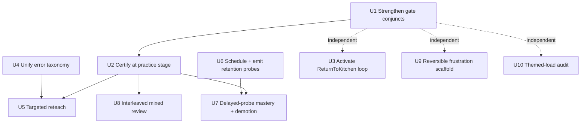
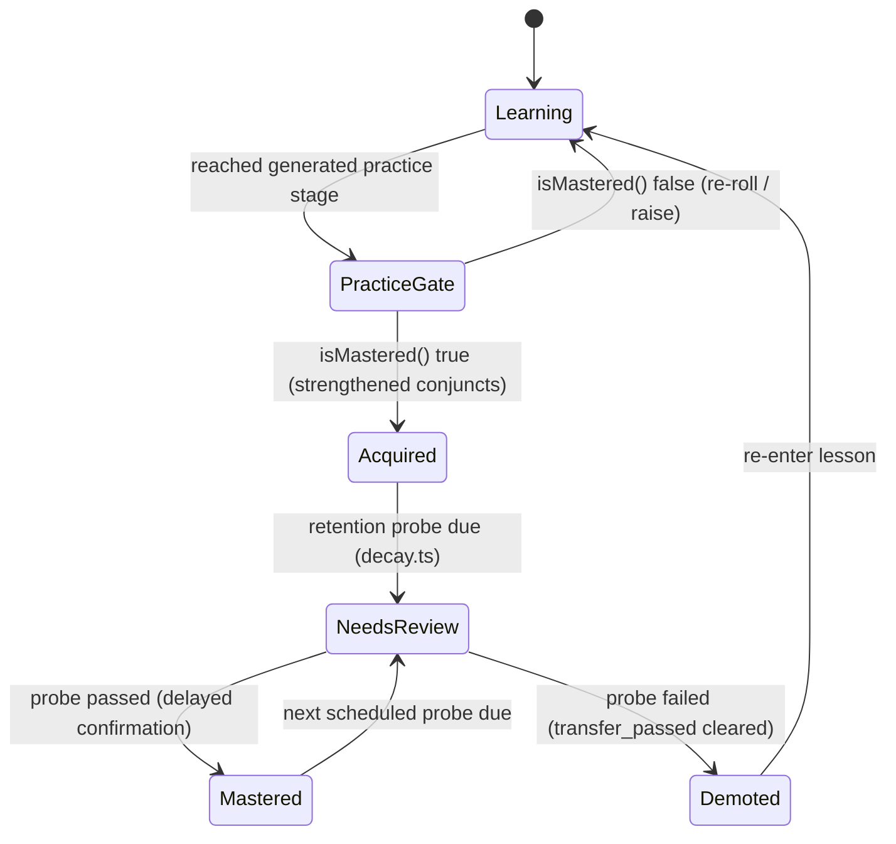

# feat: Activate dormant pedagogy across the fractions curriculum

## Summary

Make the seven pedagogical findings from the correctness ideation real in the running app. The
engine and design docs already encode research-grade pedagogy — a multi-dimension mastery gate,
spaced-retention probes (`decay.ts`), misconception fingerprinting (`error_signature`), and a
goal-orientation `ReturnToKitchen` loop — but most of it is **built and uncalled**. This plan wires
those dormant surfaces into the lesson runtime, strengthens the mastery signal everything else
trusts, and adds the two genuinely new mechanics (interleaved practice, reachable frustration
scaffolding) plus a themed-load audit. Every behavior change is reversible via `PARAMS` or a
defaulted argument so the current experience is the fallback.

---

## Problem Frame

The audit (see origin: `docs/ideation/2026-06-02-pedagogical-correctness-ideation.md`) found the
curriculum's pedagogy is sound by design but inert in code:

- Scripted stages advance on a single correct answer, so the BKT mastery gate is decorative outside
  the one generated `practice` stage; the gate's own conjuncts are spoofable (`fluencyOk` returns
  `true` unconditionally; "distinct problem" is proxied by answer-string; transfer by denominator).
- `decay.ts` (spaced-retention probes) is fully implemented with **no caller** — "mastered" never
  decays.
- The `ReturnToKitchen` decision, its policy legality, and the MomsRoom handler all exist, but no
  lesson threads `stumpingRecipe`, so the motivating wall→room→return loop never runs.
- Wrong answers get a binary re-ask; the `error_signature → prereq credit → reteach` path exists but
  generators emit a *different* taxonomy than the engine, so targeted remediation never fires.
- No spacing or interleaving anywhere; the felt-frustration "wall" the philosophy relies on has no
  reliable trigger (`disengagedCount` is never incremented), and decorative narration may add
  extraneous cognitive load during the math operation.

Most of this work is *activation*, but two units are genuinely *invention* despite the dormant
machinery: the generated `practice` stage is deliberately **endless** today (it only exits via
`ReturnToKitchen`/`RouteToRoom`, both illegal in a standalone lesson), so U2 must introduce a
completion concept before it can gate one; and the `error_signature → credit` path is dead because
`segment()` re-derives the signature from payload fields the generated runtime never emits, so U4
must fix the emission contract, not just relabel strings. These are called out in their units. CCSS/
standards alignment is out of scope — covered separately by
`docs/ideation/2026-06-02-ccss-alignment-ideation.md`.

---

## Requirements

### Trustworthy mastery signal
- R1. A lesson is certified as mastered only when `isMastered` returns true with strengthened
  conjuncts; reaching the last scripted stage is no longer sufficient on its own.
- R2. Fluency (speed) is a live gate conjunct driven by a configurable, reversible threshold — not an
  unconditional `true`.
- R3. Independence and transfer are judged by structural distinctness of problems, not by
  `answer_value` string equality or denominator identity.

### Goal-orientation loop
- R4. A lesson entered from a stumping kitchen recipe emits `ReturnToKitchen` on mastery and
  navigates the learner back to that recipe.
- R5. The recipe that stumped the learner is re-presented on return and is now solvable, making the
  payoff felt rather than asserted.

### Misconception remediation
- R6. Generators and the runtime share a single `ErrorSignature` taxonomy sourced from
  `web/src/engine/types.ts`.
- R7. A diagnosed misconception (at minimum `add_denominators`) triggers a targeted reteach response
  instead of a binary re-ask.

### Retention
- R8. Mastered nodes schedule spaced retention probes; due probes surface as `needs-review` and can
  be presented to the learner.
- R9. A failed probe demotes the node, and certification requires at least one passed delayed probe
  (acquisition is distinguished from durable mastery).

### Interleaving
- R10. Once each problem type has been introduced, a practice mode can interleave types so the
  learner must identify the type before solving; interleaving never precedes initial schema
  formation for a type.

### Frustration scaffolding
- R11. A frustration trigger fires reliably (disengagement / consecutive-error counters actually
  increment), and when it fires a reachable scaffold is always one step away.
- R12. The frustration-scaffold behavior is reversible via a single `PARAMS` flag and preserves the
  felt wall (it does not remove the difficulty, it guarantees a foothold).

### Themed cognitive load
- R13. An isomorphism rubric exists, and existing themed surfaces are audited against it with results
  recorded.
- R14. Where the audit flags it, decorative narration/animation does not play during the active math
  operation.

### Cross-cutting invariants
- R15. All engine changes preserve engine purity (no React imports, no wall-clock; time injected) and
  the affect firewall (no affect term reaches the mastery gate).
- R16. Every behavior change is reversible/off-or-lenient by default via `PARAMS` or a defaulted
  argument, and existing replay-stability and boundary tests still pass.

---

## Key Technical Decisions

- KTD1 — Certify at the practice stage, don't bloat every fade. Keep the scripted stage-walk as the
  L0–L4 scaffold-fade ladder (advancing one stage per correct is the intended *fade*), and add the
  real mastery gate only at the terminal generated `practice` stage as a certification checkpoint.
  The missing pedagogy is a checkpoint, not slower fades; gating every scripted stage would change
  pacing everywhere for no measured gain. (Requiring ≥2 clean corrects per scripted fade is recorded
  as deferred tuning.) Caveat: the generated stage has no completion event today — it re-rolls
  forever — so U2 must *add* a certified-completion terminator (including the direct-entry,
  no-stumping-recipe case) before it can gate on `isMastered`.
- KTD2 — Fluency as a flagged conjunct. Drive `fluencyOk(stats, hardMode)` from a new
  `PARAMS.fluencyHardMode` flag plus a configurable latency target; ship lenient by default and tune
  once age-band data exists. Mirrors the existing defaulted-arg reversibility pattern
  (`isMastered(est, fluencyHardMode=false)`).
- KTD3 — One error taxonomy AND a fixed emission contract. Unifying `web/src/generators/grade.js`
  onto the engine `ErrorSignature` union is necessary but **not sufficient**: the credit path reads
  `segment()`, which re-derives the signature from `judged` payload fields (`slip`, `operands`,
  `target_num/den`) that the generated runtime never emits, so `observation.error_signature` is
  null and `assignCredit` never fires regardless of taxonomy. U4 must therefore (a) relabel
  grade.js to the union, (b) add operand-aware misconception detection (distinguishing
  `add_denominators` / `add_across_unlike` / `scaled_bottom_only` is new grading logic, not a
  relabel — reuse `classifyErrorSignature` from `observation.ts`), and (c) make the emitted payload
  carry what `segment()` consumes (or make `segment()` trust the emitted field). The taxonomy also
  has *three* source vocabularies today (grade.js strings, MomsRoom slip codes, and hand-emitted
  lesson strings incl. `wrong_benchmark`/`flipped` that are in neither union) — all must map or be
  consciously coerced to `other`.
- KTD4 — Activate `decay.ts`, but the connective tissue is real. The math functions exist and are
  test-locked, but they are not wired into the reduce/persistence pipeline: nothing persists a probe
  schedule (`dueAt`) or a "mastered-at" timestamp, `measurementReduce` never calls
  `isProbeDue`/`applyProbeResult` (it only stamps `last_retention_probe`), and the `needs-review`
  status is a heuristic that fires on *any* probe event regardless of pass/fail
  (`kitchenProgress.js`). U6/U7 must persist the schedule, make the `retention_probe` payload carry
  the *result*, fold `applyProbeResult` through the reducer (keeping emission a pure function of
  logged timestamps so replay stays stable), make `needs-review` result-aware, and add a UI path
  that actually *presents* a due probe to the child (a badge alone is read-only).
- KTD5 — Reuse `ReturnToKitchen`, but the lesson/Shell side is real work. MomsRoom is ready, but:
  `useLessonScaffold` does not forward `stumpingRecipe`/`inKitchen` to `useLessonEngine` (they're
  dropped at the hook boundary), `onEnd(dec)` only fires on the generated-stage branch (not fixed
  stages) and lessons pass no `onEnd`, and hash routing (`#/r4`) carries no recipe context from the
  kitchen wall. U3 must add the config forwarding, fire `onEnd` on the certified terminator, choose a
  recipe-context transport across the hash boundary (Shell-held ref or sessionStorage), and verify
  the routed node was the *binding* gap so the re-presented recipe actually clears `wallTheta`.
- KTD6 — Interleaving is a new mixed-skill practice mode, surfaced in the kitchen as "mixed review,"
  not a rewrite of per-lesson generated stages. This keeps blocked acquisition intact (interleave
  only after each type's schema is formed) and matches the goal-hub framing.
- KTD7 — Frustration scaffold preserves the wall, and ships default-OFF until observed. The confirmed
  bug is that `disengagedCount` is never written (the `consecutiveErrors` counter already increments
  once per wrong submit — the handoff's "suspected over-count" contradicts an in-code "verified"
  comment, so reconcile before touching it). Add the missing `disengagedCount` writer, then respond
  with a reachable scaffold (`RaiseScaffold` with a guaranteed hint foothold). Note: arming
  `disengagedCount` also newly arms the `EscalateToHuman` trigger that shares it — decouple the
  frustration-scaffold threshold from the escalation threshold so it doesn't fire spuriously. Gate
  the response behind `PARAMS.frustrationScaffold`, **default off** for the first observed sessions
  (the trigger thresholds are brand-new and uncalibrated); flipping it on is an explicit,
  observed decision, not a silent default — because default-on would make the revised philosophy the
  product's actual identity before anyone has watched the wall and the scaffold interact. The
  capability lands either way; only the default is deferred.
- KTD8 — Themed-load audit is a rubric + timing gates, not an intro rebuild. Heavy assets stay; the
  audit suppresses decorative narration/animation during an active manipulation/answer window where
  it flags extraneous load.

---

## High-Level Technical Design

### Feature dependency map

The foundation (trustworthy mastery) gates the *value* of remediation, retention, and interleaving;
the goal loop and themed-load audit are independent.

### Mastery + retention lifecycle

How a node moves through acquisition, certification, and durable mastery once U1/U2/U6/U7 land.

---

## Implementation Units

### Phase 1 — Trustworthy mastery signal

#### U1. Strengthen mastery-gate conjuncts
**Goal:** Make fluency, independence, and transfer real conjuncts instead of spoofable proxies.
**Requirements:** R2, R3, R15, R16
**Dependencies:** none
**Files:**
- `web/src/engine/dimensions.ts` (modify `fluencyOk`, `isIndependent`, `hasTransferred`; reconcile
  the `AGE_BAND_MS`/`SLOPE_EPS` locals against `PARAMS`)
- `web/src/engine/params.ts` (add `fluencyHardMode` + fluency latency target to `EngineParams`/`PARAMS`
  — `EngineParams` lives here, **not** in `types.ts`)
- `web/src/engine/gate.ts` (`isMastered`/`gateConditions` must *read* `PARAMS.fluencyHardMode` so
  `policy.ts` callers pick it up without threading the arg through every call site)
- `web/src/runtime/useLessonEngine.js` (emit a stable `problem_id` into `problem_present`/`judged`
  payloads; reconcile the hardcoded `800` in `_isTooFastCorrect` to `PARAMS.latencyFloorMs`)
- `web/src/generators/index.js` / generator return shape (surface a `problem_id` for emission)
- `web/tests/engine/test_dimensions.test.ts`, `web/tests/engine/test_gate.test.ts` (modify/extend)
**Approach:** `isIndependent` already prefers a `problem_id` when present and only falls back to the
`answer_value` proxy — so the real fix is **emitting** a stable `problem_id` from the runtime; without
that emission the engine change is runtime-inert. Replace the denominator transfer fallback with a
surface-form-based check, keeping a documented fallback only when `surface_form` is genuinely absent.
Make `fluencyOk` honor `hardMode` from `PARAMS.fluencyHardMode` against a configurable latency
target; default lenient (KTD2). Note the 800ms (`_isTooFastCorrect`) vs 1200ms (`latencyFloorMs`)
dead zone — corrects in that band count toward neither a transfer probe nor transfer evidence; unify
on one constant. Keep the affect firewall — no affect term enters these functions (R15).
**Patterns to follow:** existing defaulted-arg reversibility (`fluencyOk(stats, hardMode=false)`,
`isMastered(est, fluencyHardMode=false)`); `PARAMS` as the single tunables home; pure-function
engine style (time injected, no wall-clock).
**Execution note:** Engine logic is pure and test-locked — implement test-first against
`test_dimensions.test.ts`/`test_gate.test.ts`.
**Test scenarios:**
- Two problems with identical `answer_value` but different operand structure count as 2 distinct for
  independence (not 1).
- Independence requires hint-free corrects at L3+ on structurally distinct problems; same-structure
  repeats do not satisfy it.
- Transfer requires corrects across distinct surface forms; denominator-only variation does not
  satisfy transfer when surface_form is present.
- `fluencyOk` returns `true` regardless of latency when `fluencyHardMode` is off (default
  preserved); returns `false` for over-target latency when on.
- `isMastered` is false when only the fluency conjunct fails under hard mode, true when all four
  pass.
- Affect firewall: an estimate carrying a populated affect field still yields identical gate output
  (affect never read).
- Two problems with the same `answer_value` but different `problem_id` satisfy independence (proves
  the emission seam, not just the engine logic).
- Reachability (positive direction): a plausible clean-correct learner trace actually opens the gate
  at L3 with the strengthened conjuncts — independence (scaffold ≥ L3) and transfer (scaffold ≤ L3)
  are both satisfiable before the fade overshoots to L4. (Guards against U1+U7 making mastery
  structurally unreachable; see Risks.)
**Verification:** Gate unit tests pass; existing `test_measurement_reduce.test.ts` replay-stability
and affect-firewall blocks still pass unchanged with the flag defaulted off.

#### U2. Certify lesson mastery at the generated practice stage
**Goal:** Make the practice stage the certification checkpoint rather than letting stage-walk
completion imply mastery.
**Requirements:** R1, R16
**Dependencies:** U1
**Files:**
- `web/src/runtime/useLessonScaffold.js` (gate practice-stage completion / `onEnd` on `isMastered`)
- `web/src/runtime/practiceFlow.js`, `web/src/runtime/useGeneratedPractice.js` (expose a
  certified/uncertified outcome from the loop)
- `web/src/runtime/useLessonEngine.js` (ensure the certification read uses the live mastery map)
- `web/tests/runtime/test_generatedPractice.test.jsx` (real-engine loop), `web/tests/runtime/test_useLessonEngine.test.jsx` (mocked-engine boundary)
**Approach:** The generated stage today is **deliberately endless** — its `applyEngineDecision`
branch only calls `onEnd` on `ReturnToKitchen`/`RouteToRoom` (both illegal in a standalone lesson,
where `stumpingRecipe=null` and `inKitchen=false`), otherwise it re-rolls forever; the child leaves
by navigating away. So U2 must first **introduce a certified-completion terminator** — a new
decision-applied branch (e.g. all-four-conjuncts-hold → fire `onEnd()` with a plain "lesson done"
outcome) that works for the common direct-entry case where there is no stumping recipe — and only
then gate it on `isMastered`. Do not change the scripted-stage fade behavior (KTD1). Keep
`nextDecision` called exactly once per submit boundary (R16 boundary rule). U3 layers
`ReturnToKitchen` on top of this terminator; U2 must land its own non-recipe completion first.
**Patterns to follow:** existing `applyEngineDecision` branches in `useLessonScaffold.js`; the
real-engine loop pattern in `test_generatedPractice.test.jsx` (clock via `vi.spyOn(Date,'now')`);
mocked-engine pattern in `test_useLessonEngine.test.jsx`.
**Test scenarios:**
- A lesson that reaches the practice stage but does not satisfy `isMastered` does not emit completion
  / `ReturnToKitchen`; it continues practicing.
- A direct-entry (no stumping recipe) lesson satisfying the strengthened gate fires the new
  certified-completion terminator exactly once (the case the original endless loop never handled).
- A lesson satisfying the strengthened gate emits completion exactly once.
- `nextDecision` is still called exactly once per submit boundary (no extra calls from the new gate
  read).
- Scripted (non-generated) stages still advance one-per-correct (no pacing regression).
**Verification:** Generated-practice loop test shows certification only on a true gate pass; boundary
test unchanged; playability smoke test still mounts lessons.

---

### Phase 2 — Goal-orientation loop

#### U3. Activate the ReturnToKitchen wall→room→return loop
**Goal:** Make a lesson entered from a stumping recipe return the learner to that recipe on mastery,
so the payoff is felt.
**Requirements:** R4, R5
**Dependencies:** U2 (return fires on certified mastery)
**Files:**
- `web/src/runtime/useLessonScaffold.js` (forward `stumpingRecipe`/`inKitchen` into the
  `useLessonEngine` call — currently dropped; fire `onEnd(dec)` on the fixed-stage Return/Route
  branch too, not only the generated branch)
- `web/src/Shell.jsx` (transport the stumping `recipe_id` across the stateless hash boundary —
  Shell-held ref or sessionStorage — into the opened lesson's config; handle the lesson's `onEnd(dec)`
  to route back to `'mom'`)
- `web/src/MomsRoom.jsx` (pass the stumping recipe id through navigation; already sets
  `stumpingRecipeId`/`wallNodeId` on `RouteToRoom`; author the second-failure "let's look together"
  line)
- lesson entry configs (each lesson must pass an `onEnd` that navigates back; e.g. `web/src/AppR4.jsx`
  and the other components using `useLessonScaffold`)
- `web/tests/runtime/test_momsroom_flow.test.jsx`, `web/tests/runtime/test_flow_integration.test.jsx`,
  `web/tests/engine/test_wall.test.ts` (binding-gap assertion)
**Approach:** When the kitchen routes to a room on a wall, transport the `recipe_id` across the hash
boundary (the route is stateless, so a Shell-held ref or sessionStorage is required) and thread it
through `useLessonScaffold` → `useLessonEngine` so policy state has `stumpingRecipe` set and
`inKitchen=false`. On the U2 certified terminator the policy permits `ReturnToKitchen`, which Shell
turns into navigation back to the kitchen with the recipe re-armed. Reuse the MomsRoom
`ReturnToKitchen` handler (banter + re-present). Verify the routed node was the *binding* gap (after
mastering it, the recipe's predicted success crosses `wallTheta`) so the re-presentation is genuinely
solvable; if a recipe depends on multiple unmastered nodes, the return must re-route rather than
promise a payoff. Specify the second-failure state: on a repeat fail of the re-presented recipe,
Babushka auto-offers the first hint-step (not a re-route — they just mastered the room) with a
distinct voiced line. No new decision types.
**Patterns to follow:** existing `RouteToRoom`/`ReturnToKitchen` legality in `web/src/engine/policy.ts`;
MomsRoom `_applyDecision`; Shell hash-route navigation and `onOpenRoom`.
**Test scenarios:**
- Kitchen wall on recipe X routes to the mapped room with `stumpingRecipe=X` in the lesson's policy
  state.
- Completing that room with certified mastery navigates back to the kitchen and re-presents recipe X.
- The re-presented recipe is now solvable end-to-end (Covers F: wall→room→return).
- Binding-gap: after mastering the routed node, the stumping recipe's predicted success crosses
  `wallTheta` (the routed node was the binding gap, not merely a gap).
- Second-failure: failing the re-presented recipe a second time triggers Babushka's hint-step line,
  not a silent re-route into the same wall loop.
- A room entered directly (not from a wall) has `stumpingRecipe=null`, fires the U2 plain-completion
  terminator instead, and does not emit `ReturnToKitchen` (no spurious navigation).
**Verification:** MomsRoom flow test drives a full wall→room→return cycle; direct-entry lessons show
no behavior change.

---

### Phase 3 — Misconception remediation

#### U4. Unify the error-signature taxonomy
**Goal:** One `ErrorSignature` taxonomy so diagnosed misconceptions flow into the credit/reteach path.
**Requirements:** R6, R15
**Dependencies:** none (but U5 depends on this)
**Files:**
- `web/src/generators/grade.js` (emit engine `ErrorSignature` values; add operand-aware misconception
  detection for the `wrong_value` catch-all)
- `web/src/engine/observation.ts` (`segment()` must consume the emitted signature — today it discards
  `error_signature` and re-derives from `slip`/`operands`/`target_num/den`, which the generated
  runtime never emits, so the credit path is dead; reuse `classifyErrorSignature` for detection)
- `web/src/runtime/useLessonEngine.js` (emit into the `judged` payload the fields `segment()` reads,
  OR change `segment()` to trust the emitted `error_signature`)
- `web/src/engine/types.ts` (source of the `ErrorSignature` union; extend only if a real misconception
  has no home)
- `web/src/MomsRoom.jsx` (`slipToErrorSignature`), `web/src/components/GenPracticeBoard.jsx`,
  `web/src/AppR4.jsx`, `web/src/AppCompare.jsx`, `web/src/AppNumberLine.jsx`, `web/src/AppR1.jsx`,
  `web/src/AppSubtract.jsx` (audit ALL `reportAttempt({ errorSignature })` call sites — three source
  vocabularies exist, and `wrong_benchmark`/`flipped` are in neither union; map or consciously coerce
  each to `other`)
- a build-time exhaustiveness check (TS union / lint) so an orphan signature string fails CI
- `web/tests/generators/` grade tests, `web/tests/engine/test_observation.test.ts`, `web/tests/engine/test_credit.test.ts`
**Approach:** Relabeling `grade.js` strings onto the union is the easy half. The misconception cases
require **new grading logic**: `wrong_value` is a catch-all, so distinguishing `add_denominators`
vs `add_across_unlike` vs `scaled_bottom_only` needs operand-aware inspection (reuse
`classifyErrorSignature`). And unifying the taxonomy is inert unless `segment()` actually consumes the
emitted signature — fix that emission→segmentation contract so `assignCredit` fires. Keep grading
correct-by-construction. Audit every hand-emitted signature across lessons so none silently coerces
to `other` and drops a real misconception signal.
**Patterns to follow:** the engine `ErrorSignature` union as the single contract (KTD3); existing
`classifyErrorSignature` mapping in `observation.ts`.
**Test scenarios:**
- Adding denominators on a like-denominator problem grades to `add_denominators`.
- Adding across unlike denominators grades to `add_across_unlike`.
- An equal-but-unreduced SIMPLIFY answer still grades to `not_simplified` (2 stars, not correct) —
  preserves the locked Simplify-lesson (R4 room) equivalence behavior.
- Every value any `reportAttempt` call site can emit is a member of the engine `ErrorSignature` union
  (no orphan strings — enforced at build time).
- End-to-end: a generated wrong answer that adds denominators produces a non-null
  `observation.error_signature` AND a prereq `CreditUpdate` (proves the segment→credit contract is
  live, not just that grade.js emits a union member).
**Verification:** Generator grade tests assert engine-taxonomy outputs; observation tests confirm
classification round-trips.

#### U5. Targeted reteach on a diagnosed misconception
**Goal:** Replace the binary re-ask with a misconception-specific reteach response.
**Requirements:** R7
**Dependencies:** U2, U4
**Files:**
- `web/src/engine/policy.ts` and/or `web/src/runtime/useLessonScaffold.js` (a reteach response keyed
  on the most recent `error_signature`)
- `web/src/components/lesson/` (a reteach surface — short corrective beat, reusing existing lesson
  library components such as `TutorRibbon`/`HintRail`)
- reteach copy per misconception (at minimum `add_denominators`)
- `web/tests/runtime/test_stage_lessons_emission.test.jsx`, `web/tests/runtime/test_reteach.test.jsx`
**Approach:** On a wrong attempt carrying a diagnosable signature, surface the matching reteach beat
(e.g. for `add_denominators`: re-show that the denominator names piece *size*, which does not change
when you join pieces) before the next attempt, rather than only a warn ribbon. Keep the existing
credit-to-prereq path intact; this adds the learner-facing corrective the path was designed to feed.
Reteach content is data-driven so coverage can grow without new control flow. Specify the interaction
states so the implementer isn't inventing UX: dismissal = auto-advance after the audio clip with a
"Got it" tap-to-skip (do not hard-gate the child); repeat = show once per problem, fall back to the
generic re-ask on a second same-signature error; the reteach block carries `data-vox` so a TapToRead
press replays the baked clip rather than synthesizing. Note: `add_denominators` already reaches the
engine from AppR1/MomsRoom today, so U5 can be validated independently of U4 finishing.
**Patterns to follow:** `engineStore` nudge/banner publication; `TutorRibbon` and `HintRail` in the
shared lesson library; data-driven copy tables like `voiceLines.js`/`momsProblems.js`.
**Test scenarios:**
- A wrong attempt with `add_denominators` shows the matching reteach beat, not the generic warn.
- A careless slip (`other`/`null`) shows the generic re-ask (no over-triggering reteach).
- Reteach appears before the next problem is presentable, and the next attempt proceeds normally.
- A signature with no authored reteach falls back to the generic path (no crash, no blank surface).
**Verification:** Reteach test asserts signature-specific content; generic path unchanged for
unclassified errors.

---

### Phase 4 — Retention

#### U6. Schedule and emit retention probes; surface needs-review
**Goal:** Bring `decay.ts` to life so mastered nodes are probed on a spacing schedule and surface as
`needs-review`.
**Requirements:** R8, R15, R16
**Dependencies:** none (consumes existing mastered state; pairs with U7)
**Files:**
- `web/src/runtime/useLessonEngine.js` / `web/src/Shell.jsx` (on return-to-world, compute due probes
  from logged timestamps and surface them — emission must be a pure function of logged event times,
  not live `Date.now()`, to keep replay stable)
- `web/src/engine/measurementReduce.ts` (decide where the schedule lives — derive "mastered-at" from
  the log or carry `dueAt`; fold a probe *result* through the reducer)
- `web/src/engine/decay.ts` (existing `scheduleRetentionProbe`/`isProbeDue`/`applyProbeResult` —
  invoked from the reduce path; minimal/no logic change)
- `web/src/kitchenProgress.js` + `web/src/ui/MasteryInspector.jsx` (make `needs-review` **result-aware**
  — today it fires whenever a probe event exists, even a *passed* one; it must reflect due-or-failed)
- a probe-presentation surface (a "needs review" affordance in MomsRoom or WorldMap that loads the due
  skill in a generated-practice session flagged `isProbe`, so the child actually answers a probe —
  R8's "can be presented" is unmet by a read-only badge)
- `web/src/WorldMap.jsx` (render the existing "Review" badge from `needs-review`)
- `web/tests/engine/test_decay.test.ts`, `web/tests/engine/test_measurement_reduce.test.ts`, a runtime emission test, `web/tests/runtime/test_flow_integration.test.jsx`
**Approach:** Reuse the built decay math (KTD4) but supply the missing connective tissue: persist (or
derive) the probe schedule, make the `retention_probe` payload carry the *result*, fold
`applyProbeResult` through `measurementReduce` (so the reducer rebuilds estimates including
demotion), and make `needs-review` reflect due-or-failed rather than "a probe happened." Provide a UI
path that presents a due probe to the child. Keep the engine pure — the runtime supplies the
timestamp and emission depends only on logged times; `decay.ts` stays wall-clock-free (R15).
**Patterns to follow:** Shell's existing on-return-to-world mastery refresh `useEffect`; injected-time
discipline (`measurementReduce(log, now, seedPriors)`); event append via `appendEvent`.
**Test scenarios:**
- A node mastered long enough to be due is reported `needs-review` after a world-return refresh.
- A freshly mastered node (no due probe) is reported `mastered`, not `needs-review`.
- A node whose due probe was *passed* is reported `mastered`, NOT `needs-review` (result-aware status,
  not "a probe happened").
- The needs-review affordance presents a probe problem the child can answer, and the result flows
  back through the reducer (R8 "presented", not just badged).
- A log containing `retention_probe` events reduces identically on replay (deterministic; emission is
  a pure function of logged timestamps).
- `decay.ts` functions remain pure (no wall-clock) — probe timing comes only from injected args.
**Verification:** WorldMap shows the Review badge for a due node; decay tests unchanged; emission
test shows events appended with injected time.

#### U7. Delayed-probe mastery confirmation and demotion
**Goal:** Distinguish acquisition from durable mastery — a failed probe demotes; certification
requires a passed delayed probe.
**Requirements:** R9, R15
**Dependencies:** U1, U6
**Files:**
- `web/src/engine/gate.ts` / `web/src/engine/mastery.ts` (certification considers a passed delayed
  probe; demotion on probe failure via existing `applyProbeResult`)
- `web/src/engine/params.ts` (flag/threshold for requiring a delayed probe, reversible)
- `web/src/WorldMap.jsx` + `web/src/voiceLines.js` (positive demotion framing — see Approach)
- `web/tests/engine/test_gate.test.ts`, `web/tests/engine/test_decay.test.ts`, `web/tests/engine/test_measurement_reduce.test.ts`
**Approach:** A passed retention probe after initial acquisition promotes to durable `mastered`; a
failed probe clears `transfer_passed` and applies the existing BKT-down update (already in
`applyProbeResult`), routing the node back to `needs-review`/learning. Gate the "delayed probe
required for full certification" behavior behind a reversible `PARAMS` flag, default lenient so the
current behavior is the fallback (R16). Two consequences to handle explicitly: (1) the earliest probe
is +1 day (`PROBE_DELAYS_MS` starts at 1 day), so durable `Mastered` is **unreachable in the session
a child learns the skill** — confirm nothing user-facing (kitchen unlock, the U3 payoff) gates on
`Mastered` rather than `Acquired`, and use `Acquired` for in-session progression; add a `PARAMS` debug
override of the schedule so this is testable. (2) Demotion must not read as punishment to an
8–11-year-old: change the badge from red "Review" to a warm-toned "Cook again" (theme-consistent),
and add a Babushka line on world-entry ("I have a new recipe for you!") so the change is an invitation,
not a regression warning.
**Patterns to follow:** existing `applyProbeResult` demotion; defaulted-flag reversibility; injected
time.
**Test scenarios:**
- A failed probe clears `transfer_passed` and lowers `P_known` (node demotes).
- A passed delayed probe confirms durable mastery when the flag is on.
- With the flag off, certification behavior matches today (no regression).
- Demotion → re-entry → re-mastery round-trips through `measurementReduce` deterministically (replay
  stable).
**Verification:** Gate/decay tests assert promote-on-pass and demote-on-fail; replay-stability holds.

---

### Phase 5 — Interleaving

#### U8. Interleaved mixed-skill practice ("mixed review")
**Goal:** Add a practice mode that mixes introduced problem types so the learner identifies the type
before solving.
**Requirements:** R10, R16
**Dependencies:** U2 (uses certified/introduced state to choose the eligible skill set)
**Files:**
- `web/src/runtime/practiceFlow.js`, `web/src/runtime/useGeneratedPractice.js` (a mixed-skill source
  that draws from eligible introduced skills)
- `web/src/generators/index.js` (reuse `generateFor`/`generatorSkills` across multiple skills)
- a kitchen "mixed review" surface (new component under `web/src/` or `web/src/components/`, reusing
  `GenPracticeBoard`)
- `web/src/WorldMap.jsx` or `web/src/MomsRoom.jsx` (entry point for mixed review)
- `web/tests/runtime/test_practiceFlow.test.js`, `web/tests/runtime/test_generatedPractice.test.jsx`,
  a mixed-review component test
**Approach:** Build interleaving as a new *mode*, not a peer component — keep it a thin wrapper that
passes `multiSkill=true` + an eligibility set to the existing `useGeneratedPractice`/`GenPracticeBoard`
rather than a new screen abstraction (the mode has one consumer). Entry point is **decided: a kitchen
"mixed review" affordance** (matches the goal-hub framing; not a WorldMap card). Given the set of
skills the learner has *introduced* (each with at least initial schema formation), present problems
whose type varies trial to trial. Type-identification mechanic (consistent with the drag-only,
no-text-input philosophy): before the workspace appears, the child picks the recipe/skill from 2–3
illustrated buttons; choosing the method *is* the identification. Eligibility gate ensures a type only
enters the mix after it has been introduced (R10). One-skill-eligible state shows a kitchen-voiced
"Cook more recipes first to mix them!" rather than silently degrading. Leave per-lesson generated
stages (blocked acquisition) unchanged. Give the surface a Babushka intro line + recipe-framed header
so it reads as a diegetic kitchen activity, not a bolt-on quiz (avoids AI-slop).
**Patterns to follow:** seeded deterministic generation in `generators/core.js`; the existing
generated-stage loop and `GenPracticeBoard`; registry access via `generateFor`.
**Test scenarios:**
- Mixed review only includes skills that have been introduced; a never-seen skill is excluded.
- Consecutive problems vary in type (interleaved, not blocked) given ≥2 eligible skills.
- With only one eligible skill, mixed review degrades to that single type (no crash).
- Generation is deterministic for a given seed/index across skills (replayable).
**Verification:** practiceFlow/generated-practice tests show interleaved selection honoring the
eligibility gate; component test renders a mixed set.

---

### Phase 6 — Reversible frustration scaffold

#### U9. Reliable frustration trigger with a reachable scaffold
**Goal:** Make the felt "wall" safe for under-12 — fire a real frustration trigger and guarantee a
reachable scaffold, reversibly.
**Requirements:** R11, R12, R16
**Dependencies:** none (independent of the mastery foundation)
**Files:**
- `web/src/runtime/useLessonEngine.js` (increment `consecutiveErrors`/`disengagedCount` correctly —
  note the suspected `consecutiveErrors` over-count in `docs/HANDOFF-engine-surfaces.md`)
- `web/src/runtime/tier2.js` (frustration/long-pause detection feeding policy, not just toasts)
- `web/src/engine/policy.ts` (frustration response: a `RaiseScaffold` with a guaranteed hint
  foothold, gated by the flag)
- `web/src/engine/params.ts` (`frustrationScaffold` flag, default on; thresholds)
- `web/tests/runtime/test_tier2.test.js`, `web/tests/engine/test_policy.test.ts`, `web/tests/runtime/test_useLessonEngine.test.jsx`
**Approach:** Scope precisely: the *confirmed* bug is `disengagedCount` is never written (no writer
exists). `consecutiveErrors` already increments once per wrong submit and is cumulative across stages
*by design* (per the in-code comment) — the handoff's "suspected over-count" contradicts that comment,
so reconcile (characterize against intended semantics, get a human ruling) **before** touching it; do
not "fix" a counter that may be working as designed. Add the missing `disengagedCount` writer with a
defined disengagement signal. Caution: `disengagedCount >= nDiseng` also arms `EscalateToHuman` (a
never-fired path with possibly-unbuilt handoff UX) — use a *separate* threshold/counter for the
frustration scaffold so arming one doesn't spuriously trigger the other. When the trigger fires and
`PARAMS.frustrationScaffold` is on, respond with a `RaiseScaffold` that guarantees a reachable hint
foothold, keeping the felt wall but removing the dead-end. The flag ships **default off** until
observed (KTD7). Specify the child-visible form: a warm in-character Babushka line (not "you seem
frustrated"), the hint foothold added to the current workspace (additive, not replacing), fired once;
afterward the child can tap-to-read the hint at will without re-triggering the sequence.
**Execution note:** Touches a counter with a known over-count bug — add characterization coverage of
the current counting behavior before changing it.
**Patterns to follow:** `tier2.js` pure detectors; `policy.ts` decision legality; defaulted-flag
reversibility; the once-per-boundary `nextDecision` rule.
**Test scenarios:**
- `consecutiveErrors`: characterization test pins the *current* behavior (cumulative across stages)
  before any change; do not assert a "corrected" count until the doc/comment contradiction is ruled.
- `disengagedCount` increments on the defined disengagement signal (currently never fires).
- Arming `disengagedCount` does NOT spuriously fire `EscalateToHuman` at the new increment rate
  (separate threshold/counter for the scaffold).
- With the flag on, the frustration trigger yields a `RaiseScaffold` with a reachable hint and a
  Babushka line; the felt wall (the hard problem) is still presented first.
- With the flag off (the default), behavior matches today (no scaffold injection) — reversibility
  proven.
- `nextDecision` still called once per submit boundary.
**Verification:** tier2 + policy tests assert the trigger and gated response; flag-off path is a
no-op vs current behavior.

---

### Phase 7 — Themed cognitive-load audit

#### U10. Isomorphism rubric + targeted decorative-load suppression
**Goal:** Reduce extraneous load: ensure themed content carries the math, and silence decorative
narration/animation during the active operation.
**Requirements:** R13, R14
**Dependencies:** none
**Files:**
- `docs/design/themed-load-isomorphism-rubric.md` (new — the rubric + the audit results table)
- `web/src/TapToRead.jsx`, `web/src/voice.js` (suppress decorative narration during an active
  manipulation/answer window where flagged)
- `web/src/RoomIntro.jsx` and/or lesson components (gate idle decorative animation during the solve)
- `web/tests/runtime/test_decorative_suppression.test.jsx`
**Approach:** Author the isomorphism rubric (does this asset carry the math, e.g. denominator = jar
slots, or sit beside it?) and record an audit pass over intros, TapToRead, voice, and per-lesson
themed surfaces (KTD8). Implement only the targeted fixes the audit flags — primarily suppressing
decorative narration/animation while the learner is mid-operation. Critical for assisted-reader
accessibility: `voice.js` is a single shared channel, so suppression must tag the **call site, not
the audio source** — a `suppressDecorativeNarration` context flag (set by the active-operation window)
is checked only for auto-play calls (`say(key,{decorative:true})` is suppressed), while
learner-initiated tap-to-read (`say(key,{source:'tap'})`) and structural math-carrying narration
always play. Respect user settings (a learner who opts into narration is never cut off from access).
Heavy intro assets remain; only their timing relative to the active solve changes.
**Patterns to follow:** `settings.js` subscribable prefs; existing voice gating in
`web/src/voice.js`/intro cue sheets; `import.meta.env.DEV` style conditional surfaces.
**Test scenarios:**
- During an active answer/manipulation window, decorative narration does not auto-play where the
  audit flagged it.
- Structural (math-carrying) narration and learner-initiated tap-to-read still work during the
  operation.
- Suppression respects user settings (a learner who opts into narration is not overridden in a way
  that breaks accessibility).
- Test expectation for the rubric doc itself: none — documentation artifact.
**Verification:** Suppression test asserts decorative audio is gated during the operation while
learner-initiated and structural audio remain; rubric doc lists each audited surface with a
keep/fix verdict.

---

## Delivery Sequencing & Observation

Although the user asked for all seven findings end-to-end, ship in two observed milestones rather than
one undifferentiated wave — otherwise a felt-experience regression (longer, harder, more
interruptions for an 8–11-year-old) cannot be attributed to any one of five simultaneous activations,
and the reversibility flags are useless because you won't know which to flip.

- M1 = U1 + U2 + U3 — the complete minimum product: a trustworthy mastery signal feeding the
  wall→room→return payoff loop (the philosophy's central mechanism). Gate M2 on a **felt-loop
  checkpoint**: one observed end-to-end run on the tablet, judged against "does the child still feel
  they're making progress?" — the one verification a test-only strategy cannot provide for a
  felt-experience product.
- M2 = U4–U10, layered incrementally, each measured against the M1 baseline. U10 (themed-load) is the
  lowest-confidence, most-in-tension-with-engagement unit — ship it as its own observed change so a
  contestable trim to the product's charm doesn't ride in on the keystone work.

This is sequencing guidance, not a scope cut — every unit still ships.

---

## Scope Boundaries

### Deferred to follow-up work
- Per-scripted-stage mastery gating (≥2 clean corrects before each fade) — KTD1 keeps fades as-is;
  revisit only if certification-at-practice proves insufficient.
- Age-band fluency calibration (the actual latency targets behind `PARAMS.fluencyHardMode`) — ship
  lenient, tune with real data. This deferral carries an explicit flip commitment: a scheduled
  calibration task with a trigger condition (first N observed tablet sessions), so the lenient default
  does not become a permanent dormant state (see the leniency-vs-value risk).
- Replacing BKT with the reserved factorial-HMM upgrade — out; this plan is wiring, not a new learner
  model.
- Expanding reteach coverage beyond the first misconception(s) — the path is data-driven, so coverage
  grows incrementally after U5.
- A full intro/TTS redesign — U10 is rubric + targeted timing gates only.

### Outside this product's identity
- CCSS/standards alignment changes (number line as fraction model, denominator scope, cross-multiply
  reframe, etc.) — tracked separately in `docs/ideation/2026-06-02-ccss-alignment-ideation.md`.
- Adding a points/score/coin extrinsic reward system — the app deliberately uses diegetic progress
  only.

---

## Risks & Dependencies

- Strengthening the gate (U1) plus certify-at-practice (U2) can make lessons feel longer. Mitigation:
  lenient fluency default, certification only at the practice stage, all reversible via `PARAMS`.
- The `consecutiveErrors` "over-count" in `docs/HANDOFF-engine-surfaces.md` contradicts an in-code
  "verified correct" comment in `useLessonEngine.js`; the counter is cumulative-across-stages by
  design. U9 must reconcile this before touching it — "characterize then change" only helps if you
  characterize against the *intended* semantics. The confirmed bug is `disengagedCount` (never
  written), not `consecutiveErrors`.
- Reachability hazard (U1 + U7): independence requires scaffold ≥ L3 and transfer requires scaffold
  ≤ L3, so both are collectable only at exactly L3 — and the fade streak that earns L3 can overshoot
  to L4 before transfer is probed. Strengthening the conjuncts (U1) plus requiring a delayed probe
  (U7) risks making mastery structurally unreachable for a real child. Mitigation: the positive-
  direction reachability test in U1, and consider capping the fade at L3 until transfer is confirmed.
- Runtime `.jsx` tests mock the engine (Vite cannot resolve `.ts`-via-`.js` aliases in import
  analysis there); engine behavior must be proven in pure `.ts` engine tests, with runtime tests
  asserting wiring against mocks. Real-browser drag and audio behavior need manual verification
  (jsdom gaps).
- Engine-purity (no React, no wall-clock; time injected) and the affect firewall are test-locked
  invariants — every engine unit must preserve them (R15).
- U7's "delayed probe required" changes when a node counts as mastered; default the flag lenient so
  rollout is opt-in and existing replay-stability tests stay green. The earliest probe is +1 day, so
  durable `Mastered` is unreachable in-session — confirm in-session progression uses `Acquired`.
- Leniency-vs-value trap: if every new conjunct ships lenient/off (fluency hard-mode, delayed-probe,
  frustration scaffold), the default experience barely changes and the work re-creates "built but
  uncalled" one indirection later ("built, called, but flagged off"). Each lenient default therefore
  needs an explicit, scheduled flip/calibration commitment (see Scope Boundaries) with a trigger
  condition — otherwise mark the unit honestly as instrumentation-only, not pedagogical activation.
- Replay-stability with retention probes: emission must be a pure function of logged timestamps, not
  live `Date.now()`, or replays will disagree on which probes were due. Add a replay test that
  includes `retention_probe` events.

---

## Open Questions

- `frustrationScaffold` default (U9/KTD7): plan recommends **default-off until observed** so the
  induced-frustration philosophy isn't silently retired before anyone watches a child hit a wall.
  Confirm, or accept default-on as a deliberate identity decision.
- Delayed-probe certification (U7): given the +1-day in-session ceiling, is requiring a passed delayed
  probe for full `Mastered` worth the deferred payoff, or should `Acquired` remain the practical
  ceiling and probes only *demote*? (Plan ships the requirement lenient/off by default either way.)
- `consecutiveErrors` semantics (U9): is cumulative-across-stages intended (per the in-code comment)
  or a bug (per the handoff doc)? Needs a human ruling before U9 touches the counter.
- Reteach surface form (U5): inline `TutorRibbon` beat vs a brief dedicated corrective screen —
  resolve against the existing lesson library's visual rhythm during implementation.

---

## Sources / Research

- Origin ideation: `docs/ideation/2026-06-02-pedagogical-correctness-ideation.md` (the seven
  findings, with learning-science citations: concreteness fading, interleaving 77% vs 38%, BKT
  mastery thresholds, productive-failure under-12 boundary, IWN error 6.58×, seductive-details
  meta-analysis).
- Design specs the engine cites: `docs/design/student-state-measurement.md` (4-D mastery gate,
  affect firewall, decay probes), `docs/design/fraction-app-state-model.md` (scaffold ladder, wall
  diagnostic), `docs/inspiration/app_philosophy.md` (goal-orientation, induced-frustration stance —
  the counterparty for KTD7).
- Dormant-surface locations: `web/src/engine/decay.ts` (built, uncalled), `web/src/engine/policy.ts`
  (`ReturnToKitchen` legality), `web/src/MomsRoom.jsx` (`ReturnToKitchen` handler), `web/src/engine/gate.ts`
  / `web/src/engine/dimensions.ts` (gate conjuncts), `web/src/generators/grade.js` vs
  `web/src/engine/types.ts` (taxonomy mismatch).
- Constraints: `docs/HANDOFF-engine-surfaces.md` (R4 equivalence locked, drag-only, suspected
  `consecutiveErrors` over-count, stay within `web/`).
